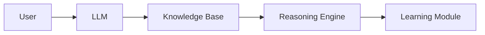
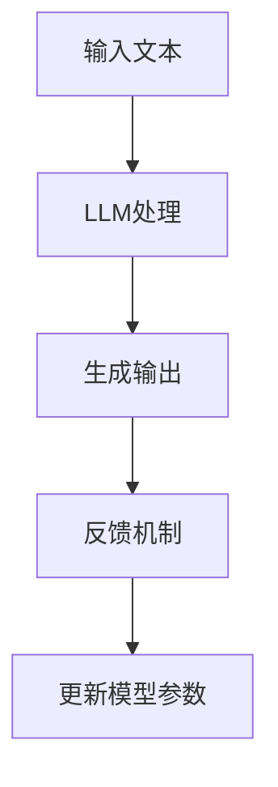

                 

# 自主学习AI Agent：LLM驱动的终身学习系统

> 关键词：自主学习AI Agent，LLM，终身学习，人工智能，大语言模型

> 摘要：本文探讨了自主学习AI Agent的构建与实现，重点分析了如何通过大语言模型（LLM）驱动其终身学习能力。文章从核心概念、算法原理、系统架构等多维度展开，深入解析了LLM在自主学习系统中的作用，并通过实际案例展示了其应用场景与实现方法。

---

# 第一部分: 自主学习AI Agent的背景与概念

## 第1章: 自主学习AI Agent概述

### 1.1 自主学习AI Agent的定义与核心概念

#### 1.1.1 自主学习AI Agent的定义
自主学习AI Agent（Autonomous Learning AI Agent）是指一种能够通过自我学习、自我优化和自我适应，无需外部干预即可完成特定任务的智能系统。其核心在于具备“学习”能力，能够从经验中不断进化，以应对复杂多变的环境。

#### 1.1.2 自主学习AI Agent的核心概念
- **自主性**：系统能够自主决策，无需外部指令。
- **学习性**：系统能够通过数据和经验不断优化自身能力。
- **适应性**：系统能够根据环境变化调整行为和策略。

#### 1.1.3 自主学习AI Agent的边界与外延
自主学习AI Agent的外延包括但不限于：
- **学习范围**：从简单规则到复杂决策。
- **应用场景**：教育、医疗、金融、工业等领域。
- **技术基础**：基于机器学习、深度学习、自然语言处理等技术。

### 1.2 LLM驱动的终身学习系统

#### 1.2.1 LLM的定义与特点
- **大语言模型（LLM）**：基于Transformer架构的大规模神经网络模型，具有强大的文本生成和理解能力。
- **特点**：
  - 大规模参数：通常包含 billions 量级的参数。
  - 预训练-微调模式：通过大量无标签数据预训练，再针对特定任务进行微调。
  - 上下文理解：能够处理长上下文，理解复杂语义。

#### 1.2.2 终身学习系统的概念
终身学习（Lifelong Learning）是指学习系统能够在不忘记之前学习内容的情况下，持续学习新任务，适应新环境的能力。

#### 1.2.3 LLM与终身学习系统的结合
通过LLM的持续学习能力，结合自主学习AI Agent的自主性，构建一个能够不断进化、适应的智能系统。

### 1.3 自主学习AI Agent的应用场景

#### 1.3.1 教育领域
- **智能辅导系统**：根据学生的学习情况动态调整教学策略。
- **知识管理**：帮助学生整理、复习知识点。

#### 1.3.2 企业智能化转型
- **智能客服**：通过LLM驱动的AI Agent实现24/7的智能客服支持。
- **流程优化**：自动化分析企业数据，提出优化建议。

#### 1.3.3 个人知识管理
- **个人助手**：帮助用户整理信息、管理任务。
- **知识图谱构建**：基于用户行为构建个性化知识网络。

### 1.4 本章小结
本章从定义、核心概念、技术基础、应用场景等方面介绍了自主学习AI Agent，为后续章节的深入分析奠定了基础。

---

# 第二部分: 自主学习AI Agent的核心概念与联系

## 第2章: 自主学习AI Agent的核心原理

### 2.1 自主学习AI Agent的原理

#### 2.1.1 知识表示与推理
- **知识表示**：将知识以图结构、符号逻辑等形式表示。
- **推理机制**：基于知识图谱进行逻辑推理，得出结论。

#### 2.1.2 目标设定与决策
- **目标设定**：系统根据环境动态设定子目标。
- **决策机制**：基于当前状态和目标，选择最优动作。

#### 2.1.3 自适应学习机制
- **自适应策略**：根据环境反馈动态调整学习策略。
- **增量学习**：在新数据到来时，逐步更新模型参数。

### 2.2 LLM在自主学习中的作用

#### 2.2.1 LLM的文本生成能力
- **文本生成**：通过生成式模型，输出自然语言文本。
- **上下文理解**：LLM能够理解上下文关系，生成连贯的对话。

#### 2.2.2 LLM的上下文理解能力
- **上下文窗口**：LLM能够处理长上下文，捕捉语义信息。
- **对话记忆**：通过记忆机制，保持对话的连贯性。

#### 2.2.3 LLM的持续学习能力
- **微调机制**：通过任务特定的微调，增强模型对新任务的学习能力。
- **知识蒸馏**：将大模型的知识迁移到小模型，实现轻量化部署。

### 2.3 自主学习AI Agent的系统架构

#### 2.3.1 知识库模块
- **知识存储**：存储系统已掌握的知识和经验。
- **知识更新**：根据新数据动态更新知识库。

#### 2.3.2 推理引擎模块
- **逻辑推理**：基于知识库进行逻辑推理，得出结论。
- **决策输出**：根据推理结果输出决策动作。

#### 2.3.3 用户交互模块
- **输入处理**：接收用户输入，解析需求。
- **输出生成**：根据推理结果生成自然语言输出。

### 2.4 核心概念对比表

| 对比维度 | 自主学习AI Agent | 被动学习系统 |
|----------|------------------|--------------|
| 学习方式 | 主动学习，自适应 | 被动接收，无法优化 |
| 知识更新 | 动态更新，持续进化 | 静态，依赖人工更新 |
| 适应性 | 高度适应环境变化 | 适应性有限，需人工干预 |

### 2.5 实体关系图（ER图）

### 2.6 本章小结
本章从知识表示、目标设定、自适应学习等角度，详细分析了自主学习AI Agent的核心原理，并通过对比和图表展示了其系统架构。

---

# 第三部分: 自主学习AI Agent的算法原理

## 第3章: 自主学习AI Agent的算法原理

### 3.1 基于LLM的文本生成算法

#### 3.1.1 Transformer模型的结构
- **编码器-解码器架构**：通过编码器将输入文本转化为语义向量，解码器根据向量生成输出文本。
- **自注意力机制**：计算输入中每个词与其他词的相关性，调整权重。

#### 3.1.2 自注意力机制
- **计算公式**：
  $$\text{Attention}(Q, K, V) = \text{softmax}\left(\frac{QK^T}{\sqrt{d_k}}\right)V$$
  其中，\(Q\) 是查询向量，\(K\) 是键向量，\(V\) 是值向量，\(d_k\) 是向量维度。

#### 3.1.3 梯度下降优化
- **损失函数**：交叉熵损失。
- **优化算法**：Adam优化器，学习率衰减。

### 3.2 自主学习的强化学习算法

#### 3.2.1 Q-learning算法
- **核心思想**：通过价值函数（Q值）评估动作的优劣，选择最优动作。
- **更新公式**：
  $$Q(s, a) = Q(s, a) + \alpha \left(r + \gamma \max Q(s', a') - Q(s, a)\right)$$
  其中，\(\alpha\) 是学习率，\(\gamma\) 是折扣因子。

#### 3.2.2 Deep Q-Networks（DQN）
- **网络结构**：输入层、隐藏层、输出层。
- **经验回放**：存储历史经验，随机采样更新模型。

#### 3.2.3 策略梯度方法
- **策略函数**：直接参数化策略，优化概率分布。
- **梯度计算**：使用梯度上升方法最大化目标函数。

### 3.3 终身学习的元学习算法

#### 3.3.1 Meta-Learning的定义
- **元学习**：学习如何学习，通过少量样本快速适应新任务。

#### 3.3.2 Meta-LSTM模型
- **结构**：由LSTM网络和任务嵌入组成。
- **更新规则**：基于任务嵌入，更新模型参数。

#### 3.3.3 Model-Agnostic Meta-Learning（MAML）
- **目标函数**：
  $$\theta = \theta - \epsilon \nabla_\theta \mathcal{L}_\text{task}$$
  其中，\(\epsilon\) 是步长。

### 3.4 算法流程图

### 3.5 数学模型与公式

#### 3.5.1 Transf

---

# 作者

**作者：AI天才研究院/AI Genius Institute & 禅与计算机程序设计艺术 /Zen And The Art of Computer Programming**

