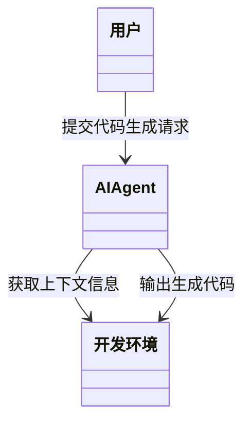

                 


# 自动化AI Agent开发：LLM辅助的代码生成

## 关键词：自动化AI Agent, 大语言模型, 代码生成, 人工智能, 软件开发

## 摘要：随着人工智能技术的迅速发展，自动化AI Agent在软件开发中的应用日益广泛。利用大语言模型（LLM）辅助代码生成，能够显著提升开发效率和代码质量。本文将深入探讨自动化AI Agent的核心概念、LLM的原理与应用，结合实际案例，详细讲解如何通过LLM实现高效的代码生成，并分析系统架构和最佳实践。

---

# 第一章：自动化AI Agent与LLM概述

## 1.1 自动化AI Agent的基本概念

### 1.1.1 什么是自动化AI Agent？
自动化AI Agent是一种能够感知环境、理解用户需求并执行任务的智能实体。它通过算法和模型，实现从简单任务到复杂业务流程的自动化处理。例如，在软件开发中，AI Agent可以自动生成代码、调试程序或优化代码结构。

### 1.1.2 AI Agent的核心特征
- **自主性**：能够在没有人工干预的情况下完成任务。
- **反应性**：能够根据环境变化调整行为。
- **目标导向**：具备明确的目标，并采取行动实现目标。
- **学习能力**：通过数据和经验不断优化自身的性能。

### 1.1.3 LLM在AI Agent中的作用
大语言模型（LLM）通过强大的自然语言处理能力，为AI Agent提供理解和生成文本的能力。在代码生成场景中，LLM能够理解用户意图，生成高质量的代码片段或完整的程序。

---

## 1.2 LLM辅助代码生成的背景

### 1.2.1 代码生成的痛点与挑战
- **开发效率低**：传统开发模式需要手动编写大量代码，耗时且容易出错。
- **代码质量参差不齐**：新手开发者可能编写低效或不安全的代码。
- **需求变更频繁**：每次需求变更都需要手动调整代码，增加了维护成本。

### 1.2.2 LLM在代码生成中的优势
- **快速响应**：LLM能够快速理解和生成代码，显著提升开发效率。
- **高准确性**：基于大量数据训练的模型能够生成高质量的代码，减少错误。
- **灵活性强**：支持多种编程语言和开发框架，适应不同项目需求。

### 1.2.3 自动化AI Agent的演进历程
从早期的简单脚本执行到现在的智能代码生成，自动化AI Agent经历了从规则驱动到数据驱动的转变。LLM的引入使得AI Agent具备更强的学习和推理能力。

---

## 1.3 自动化AI Agent的应用场景

### 1.3.1 软件开发中的自动化代码生成
AI Agent可以根据需求自动生成函数、类或整个模块，帮助开发者快速搭建程序结构。

### 1.3.2 业务流程自动化中的AI Agent
在企业应用中，AI Agent可以自动生成业务流程代码，简化配置，降低人工干预。

### 1.3.3 LLM辅助的代码生成案例
例如，一个AI Agent可以根据用户提供的需求描述，生成符合REST API规范的后端代码。

---

## 1.4 本章小结
本章介绍了自动化AI Agent的基本概念、核心特征以及LLM在代码生成中的作用。通过分析代码生成的痛点和LLM的优势，明确了自动化AI Agent在软件开发中的重要性。

---

# 第二章：LLM与代码生成的核心概念

## 2.1 LLM的基本原理

### 2.1.1 大语言模型的训练机制
LLM通过监督学习和无监督学习的结合，利用海量数据进行预训练。模型参数通过反向传播算法不断优化，以最小化预测值与真实值之间的差异。

### 2.1.2 Transformer架构的核心思想
Transformer模型由编码器和解码器组成，通过自注意力机制捕捉输入中的语义关系，生成连贯的输出。

### 2.1.3 注意力机制的作用
注意力机制帮助模型关注输入中的重要部分，提高生成代码的准确性和相关性。

---

## 2.2 LLM在代码生成中的应用

### 2.2.1 代码生成的流程
1. **输入处理**：接收用户的代码生成请求。
2. **意图理解**：通过LLM理解用户需求。
3. **代码生成**：基于理解生成代码。
4. **结果反馈**：提供代码并验证准确性。

### 2.2.2 基于LLM的代码生成模型
- **模型选择**：选择适合任务的LLM模型，如GPT-3、Codex等。
- **输入格式**：明确输入格式，确保模型正确解析需求。

### 2.2.3 模型的可解释性与鲁棒性
模型的可解释性决定了生成代码的可维护性，鲁棒性则确保在复杂场景下代码生成的稳定性。

---

## 2.3 自动化AI Agent的实现原理

### 2.3.1 Agent的行为决策机制
AI Agent通过分析用户需求，选择合适的代码生成策略。

### 2.3.2 基于LLM的意图理解
通过自然语言处理技术，准确理解用户的代码生成需求。

### 2.3.3 Agent与环境的交互模型
AI Agent通过API与开发环境交互，接收输入并输出生成的代码。

---

## 2.4 核心概念对比分析

### 2.4.1 LLM与传统代码生成工具的对比
| 特性             | LLM辅助代码生成 | 传统代码生成工具 |
|------------------|------------------|------------------|
| **灵活性**        | 高               | 低               |
| **生成质量**      | 高               | 中               |
| **学习能力**      | 强               | 无               |

### 2.4.2 自动化Agent与传统脚本的差异
- **智能化**：AI Agent具备学习和推理能力，而传统脚本仅执行预定义命令。
- **适应性**：AI Agent能够根据环境变化调整行为，传统脚本则无法做到。

---

## 2.5 本章小结
本章深入分析了LLM的基本原理及其在代码生成中的应用，对比了传统方法与自动化AI Agent的差异，为后续章节奠定了理论基础。

---

# 第三章：LLM辅助代码生成的算法原理

## 3.1 LLM的训练与优化

### 3.1.1 LLM的训练流程
1. **数据预处理**：清洗和格式化训练数据。
2. **模型初始化**：定义模型架构并初始化参数。
3. **前向传播**：输入数据，计算模型输出。
4. **损失计算**：使用交叉熵损失函数衡量预测值与真实值的差异。
5. **反向传播**：通过梯度下降优化模型参数。

### 3.1.2 模型优化算法
- **Adam优化器**：结合动量和自适应学习率优化参数。
- **学习率调度器**：动态调整学习率，加速收敛。

---

## 3.2 基于LLM的代码生成算法

### 3.2.1 前向生成过程
输入代码生成请求，通过LLM生成代码。

### 3.2.2 基于上下文的生成策略
- **上下文理解**：分析代码片段的上下文，生成连贯的代码。
- **语法检查**：生成代码后进行语法验证，确保代码正确性。

---

## 3.3 代码生成的数学模型

### 3.3.1 概率生成模型
代码生成可以看作是一个概率问题，模型通过计算每个可能的下一个字符的概率，选择最可能的序列生成代码。

### 3.3.2 交叉熵损失函数
$$ \text{损失} = -\frac{1}{n}\sum_{i=1}^{n}\sum_{j=1}^{m} y_{ij}\log p(y_{ij}) $$
其中，$y_{ij}$表示第i个位置生成第j个字符的概率。

### 3.3.3 梯度下降算法
使用Adam优化器进行参数更新：
$$ \theta_{t+1} = \theta_t - \eta \frac{\partial L}{\partial \theta_t} $$
其中，$\eta$是学习率，$\frac{\partial L}{\partial \theta_t}$是损失函数对参数的梯度。

---

## 3.4 本章小结
本章详细讲解了LLM的训练过程和代码生成的数学模型，通过公式推导和算法分析，揭示了代码生成的原理。

---

# 第四章：系统分析与架构设计

## 4.1 项目背景与目标

### 4.1.1 项目背景
开发一个基于LLM的自动化AI Agent，用于辅助代码生成。

### 4.1.2 项目目标
- 实现代码生成功能。
- 提供用户友好的交互界面。
- 确保生成代码的准确性和高效性。

---

## 4.2 系统功能设计

### 4.2.1 领域模型设计
使用Mermaid类图展示系统中各角色及其关系：


---

## 4.3 系统架构设计

### 4.3.1 总体架构
使用Mermaid架构图展示系统架构：


---

## 4.4 接口设计与交互流程

### 4.4.1 接口设计
- **API接口**：定义RESTful API，用于接收生成请求和返回结果。
- **数据格式**：统一使用JSON格式传递数据。

### 4.4.2 交互流程
1. 用户提交代码生成请求。
2. AI Agent获取上下文信息。
3. LLM生成代码。
4. 开发环境验证代码。
5. 返回生成结果。

---

## 4.5 本章小结
本章通过系统分析和架构设计，明确了自动化AI Agent的实现路径，为后续的项目开发奠定了基础。

---

# 第五章：项目实战

## 5.1 环境安装与配置

### 5.1.1 安装Python
安装最新版本的Python，确保环境支持大语言模型的调用。

### 5.1.2 安装依赖库
安装必要的库，如`openai`、`transformers`等。

## 5.2 核心代码实现

### 5.2.1 API接口实现
编写Python代码，定义API接口：
```python
import openai

def generate_code(prompt):
    client = openai.Client()
    response = client.chat.completions.create(
        model="gpt-3.5-turbo",
        messages=[{"role": "user", "content": prompt}]
    )
    return response.choices[0].message.content
```

### 5.2.2 代码验证与优化
在生成代码后，进行语法检查和优化：
```python
def validate_code(code):
    try:
        # 使用静态分析工具检查语法错误
        ast.parse(code)
        return True
    except:
        return False
```

## 5.3 代码解读与分析

### 5.3.1 代码生成示例
用户输入需求描述，AI Agent生成相应的代码片段：
```plaintext
输入：创建一个用户登录的API接口
输出：
def login():
    username = input("请输入用户名：")
    password = input("请输入密码：")
    # 验证用户名和密码
    if username == 'admin' and password == '12345':
        print("登录成功！")
    else:
        print("登录失败！")
```

### 5.3.2 代码验证
使用静态分析工具检查生成代码的语法和结构，确保代码的正确性。

## 5.4 案例分析与总结

### 5.4.1 案例分析
通过实际案例，展示AI Agent如何高效生成代码，减少开发时间。

### 5.4.2 总结
本章通过项目实战，详细讲解了如何使用LLM实现代码生成，验证了理论的可行性。

---

## 第六章：最佳实践与小结

### 6.1 最佳实践
- **选择合适的模型**：根据项目需求选择适合的LLM模型。
- **优化输入格式**：确保输入格式一致，提高生成准确率。
- **验证与调试**：生成代码后进行严格的测试和验证。

### 6.2 小结
本文详细探讨了自动化AI Agent开发中LLM辅助代码生成的各个方面，从理论到实践，为开发者提供了系统的指导。

### 6.3 注意事项
- **数据隐私**：确保生成代码过程中不泄露敏感信息。
- **模型选择**：根据实际需求选择适合的模型，避免过度配置。

### 6.4 拓展阅读
- 推荐阅读《生成式人工智能：原理与应用》。
- 参考GitHub上的相关项目，学习更多实现细节。

---

# 结语

通过本文的深入探讨，读者可以全面了解自动化AI Agent开发中LLM辅助代码生成的技术细节。从背景介绍到系统设计，再到项目实战，每一部分都为开发者提供了实用的指导。希望本文能够帮助读者在实际开发中提高效率，推动人工智能技术的广泛应用。

---

作者：AI天才研究院/AI Genius Institute & 禅与计算机程序设计艺术 /Zen And The Art of Computer Programming

