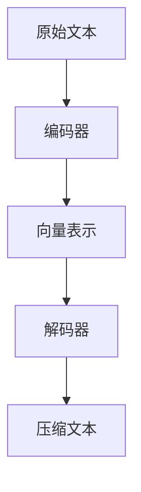
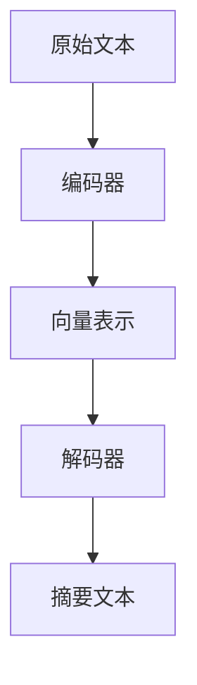
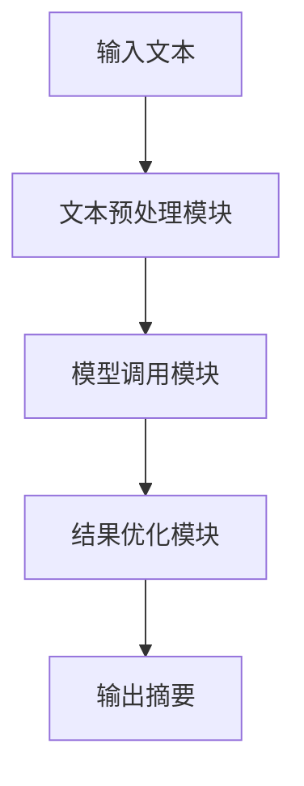
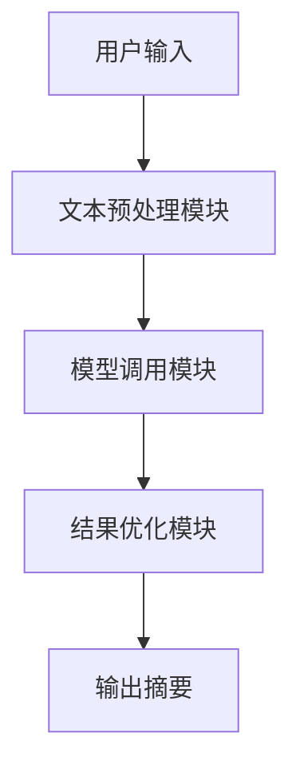
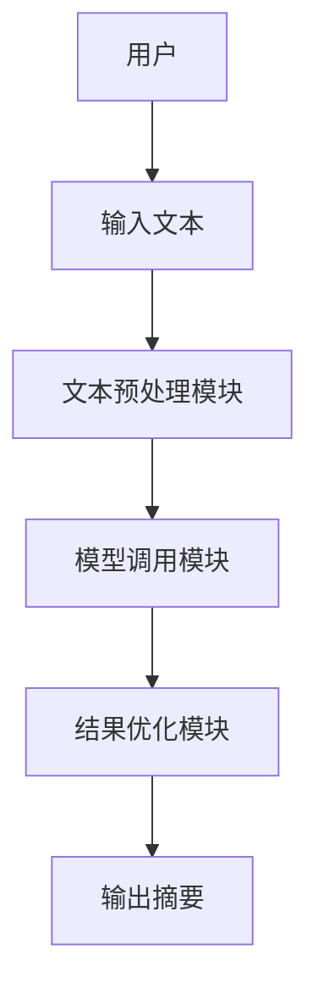

                 


# 自动摘要AI Agent：LLM驱动的文本压缩与提炼

## 关键词
- 自动摘要
- LLM
- 文本压缩
- 智能摘要
- 自然语言处理

## 摘要
本文详细探讨了基于LLM（大语言模型）的自动摘要技术，分析了其在文本压缩与提炼中的应用，从算法原理到系统架构，再到实际项目实现，全面解析了LLM驱动自动摘要的核心技术与实践。文章还提供了丰富的案例分析和代码示例，帮助读者深入理解并掌握这一前沿技术。

---

# 第一部分: 自动摘要AI Agent概述

## 第1章: 自动摘要与LLM驱动的文本压缩概述

### 1.1 自动摘要的基本概念

#### 1.1.1 自动摘要的定义与特点
自动摘要是指通过计算机算法对文本内容进行分析，提取关键信息并生成简洁的摘要。其特点包括：
- **简洁性**：输出的摘要长度远小于原文。
- **准确性**：摘要应准确反映原文的核心内容。
- **自动化**：无需人工干预，完全由算法生成。

#### 1.1.2 自动摘要的应用场景
- **新闻标题生成**：从长篇新闻中提取标题。
- **文档管理**：对大量文档进行自动归档和检索。
- **智能客服**：快速提取用户问题的关键信息。

#### 1.1.3 自动摘要的核心问题与挑战
- **信息丢失**：如何在压缩过程中保留关键信息。
- **语义理解**：如何准确理解上下文。
- **可解释性**：如何让生成的摘要易于理解。

### 1.2 LLM驱动的文本压缩与提炼

#### 1.2.1 LLM的基本原理
LLM（Large Language Model）通过深度学习技术训练而成，能够理解上下文并生成自然语言文本。其核心是基于Transformer架构的编码器-解码器模型。

#### 1.2.2 LLM在文本压缩中的应用
- **文本摘要**：通过LLM生成摘要。
- **文本压缩**：通过LLM压缩文本，减少冗余信息。

#### 1.2.3 LLM驱动的自动摘要的优势
- **高效性**：LLM能够在短时间内生成高质量的摘要。
- **准确性**：LLM能够准确理解上下文，生成准确的摘要。

### 1.3 自动摘要的背景与发展趋势

#### 1.3.1 自动摘要技术的历史发展
- **早期研究**：基于统计的方法，如TF-IDF。
- **现代发展**：基于深度学习的方法，如BERT、GPT。

#### 1.3.2 当前LLM驱动自动摘要的现状
- **技术成熟**：LLM在文本摘要领域的应用越来越广泛。
- **工具普及**：越来越多的工具开始支持LLM驱动的自动摘要。

#### 1.3.3 未来自动摘要技术的可能方向
- **多语言支持**：支持多种语言的自动摘要。
- **动态调整**：根据用户需求动态调整摘要长度和内容。

---

## 第2章: LLM驱动自动摘要的核心概念与原理

### 2.1 自动摘要的关键概念

#### 2.1.1 文本压缩与文本摘要的区别与联系
- **文本压缩**：减少文本的长度，保留核心信息。
- **文本摘要**：生成与原文内容一致的简短文本。
- **联系**：文本压缩是实现文本摘要的一种方法。

#### 2.1.2 自动摘要的指标与评估方法
- **ROUGE**：基于召回率的评估指标。
- **BLEU**：基于编辑距离的评估指标。

#### 2.1.3 自动摘要的实现流程
1. 文本预处理
2. 模型训练
3. 摘要生成
4. 结果优化

### 2.2 LLM在自动摘要中的角色

#### 2.2.1 LLM的输入输出机制
- **输入**：原始文本。
- **输出**：压缩后的文本或摘要。

#### 2.2.2 LLM的文本生成原理
- **编码器**：将输入文本编码为向量。
- **解码器**：根据编码向量生成输出文本。

#### 2.2.3 LLM的文本理解能力
- **上下文理解**：LLM能够理解文本的上下文关系。
- **语义理解**：LLM能够理解文本的语义信息。

### 2.3 自动摘要的算法原理

#### 2.3.1 基于LLM的文本压缩算法
- **模型输入**：原始文本。
- **模型输出**：压缩后的文本。
- **流程图**



#### 2.3.2 基于LLM的文本摘要算法
- **模型输入**：原始文本。
- **模型输出**：摘要文本。
- **流程图**



#### 2.3.3 LLM驱动自动摘要的数学模型
- **编码器**：将输入文本转换为向量表示。
  $$ \text{向量表示} = \text{编码器}(x) $$
- **解码器**：根据向量表示生成输出文本。
  $$ \text{输出文本} = \text{解码器}(c) $$

---

## 第3章: LLM驱动自动摘要的算法实现

### 3.1 LLM驱动自动摘要的输入输出机制

#### 3.1.1 输入文本的预处理
- **分词**：将文本分割成词语或短语。
- **向量化**：将词语映射到向量空间。

#### 3.1.2 模型的输入格式
- **词向量**：将输入文本转换为词向量。
- **序列长度**：确定输入序列的长度。

#### 3.1.3 输出结果的后处理
- **解码**：将模型输出的向量转换为文本。
- **格式化**：对输出文本进行格式化处理。

### 3.2 基于LLM的文本压缩算法

#### 3.2.1 文本压缩的目标函数
- **目标函数**：最大化摘要的准确性。
  $$ \text{目标函数} = \text{损失函数}(\text{输出}, \text{目标}) $$

#### 3.2.2 文本压缩的优化策略
- **贪心策略**：逐步选择最优压缩片段。
- **动态规划**：通过动态规划找到最优压缩路径。

#### 3.2.3 文本压缩的实现步骤
1. 对输入文本进行分词。
2. 对分词后的文本进行编码。
3. 使用LLM生成压缩文本。
4. 对压缩文本进行后处理。

### 3.3 基于LLM的文本摘要算法

#### 3.3.1 摘要生成的实现流程
1. 对输入文本进行预处理。
2. 使用LLM生成摘要。
3. 对生成的摘要进行优化。

#### 3.3.2 摘要生成的优化策略
- **长度控制**：控制摘要的长度。
- **语义优化**：优化摘要的语义表达。

#### 3.3.3 摘要生成的代码实现

```python
def generate_summary(text):
    # 输入文本预处理
    processed_text = preprocess(text)
    # 使用LLM生成摘要
    summary = model.generate(processed_text)
    return summary
```

---

## 第4章: 系统分析与架构设计方案

### 4.1 系统功能设计

#### 4.1.1 系统功能模块
- **文本预处理模块**：负责对输入文本进行预处理。
- **模型调用模块**：负责调用LLM进行摘要生成。
- **结果优化模块**：负责对生成的摘要进行优化。

#### 4.1.2 系统功能流程



### 4.2 系统架构设计

#### 4.2.1 系统架构图



#### 4.2.2 系统交互流程图



---

## 第5章: 项目实战

### 5.1 环境安装

#### 5.1.1 安装Python
```bash
python --version
```

#### 5.1.2 安装依赖库
```bash
pip install transformers
```

### 5.2 系统核心实现源代码

#### 5.2.1 预处理模块

```python
def preprocess(text):
    # 分词
    tokens = tokenize(text)
    # 向量化
    vectors = vectorize(tokens)
    return vectors
```

#### 5.2.2 模型调用模块

```python
def model_call(vectors):
    # 编码器
    encoded = encoder(vectors)
    # 解码器
    decoded = decoder(encoded)
    return decoded
```

#### 5.2.3 结果优化模块

```python
def optimize(summary):
    # 格式化
    formatted_summary = format(summary)
    # 长度控制
    optimized_summary = control_length(formatted_summary)
    return optimized_summary
```

### 5.3 实际案例分析

#### 5.3.1 案例输入

```text
"Natural language processing (NLP) is the branch of AI concerned with the interactions between humans and computers, particularly in the form of human-computer interaction. It involves the ability to understand, interpret, and generate human language."
```

#### 5.3.2 案例输出

```text
"Natural language processing focuses on human-computer interaction and involves understanding and generating human language."
```

### 5.4 项目小结

---

## 第6章: 最佳实践与小结

### 6.1 最佳实践 tips
- **选择合适的模型**：根据具体需求选择合适的LLM模型。
- **优化预处理步骤**：对输入文本进行有效的预处理。
- **监控生成结果**：定期监控生成的摘要，确保准确性。

### 6.2 项目总结
通过本文的详细讲解，读者可以全面了解基于LLM的自动摘要技术，从理论到实践，掌握其实现方法和优化策略。

### 6.3 注意事项
- **模型调优**：需要根据具体任务进行模型调优。
- **性能优化**：需要对系统进行性能优化，提升处理效率。

### 6.4 拓展阅读
- **深度学习与NLP**：深入学习深度学习在NLP中的应用。
- **LLM优化**：研究LLM的优化方法，提升生成质量。

---

# 参考文献

1. Brown, T., et al. "Language models are few-shot learners." arXiv preprint arXiv:2005.14167, 2020.
2. Vaswani, A., et al. "Attention is all you need." arXiv preprint arXiv:1706.03798, 2017.

---

# 作者

作者：AI天才研究院/AI Genius Institute & 禅与计算机程序设计艺术 /Zen And The Art of Computer Programming

