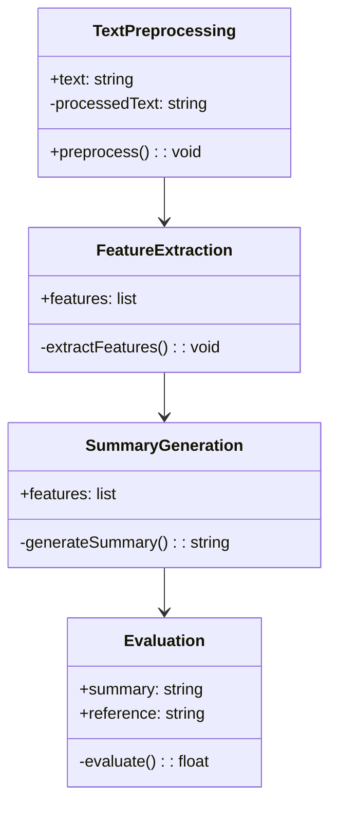

                 


# 自动文本摘要AI Agent：LLM驱动的关键信息提取

---

## 关键词：
自动文本摘要，LLM，大语言模型，关键信息提取，自然语言处理，AI Agent

---

## 摘要：
本文深入探讨了自动文本摘要技术及其在大语言模型（LLM）驱动下的关键信息提取方法。从背景概念到核心算法，从系统架构到项目实战，全面解析了如何利用AI技术实现高效的文本摘要，并结合实际案例分析，为读者提供了一套完整的解决方案。

---

# 第一部分: 自动文本摘要AI Agent背景与概念

## 第1章: 自动文本摘要概述

### 1.1 自动文本摘要的背景与问题背景
现代信息社会中，数据呈现爆炸式增长，用户每天需要处理的信息量巨大。如何快速获取文本的核心信息成为亟待解决的问题。传统的人工摘要方式效率低下，难以应对海量数据的处理需求。自动文本摘要技术的出现，为解决这一问题提供了新的可能。

此外，随着自然语言处理技术的飞速发展，特别是大语言模型（LLM）的崛起，自动文本摘要技术的精度和效率得到了显著提升。然而，现有技术在处理复杂语义、长文本以及多语言场景时仍存在诸多挑战。

### 1.2 自动文本摘要的定义与问题描述
自动文本摘要是指通过计算机算法自动提取文本的核心信息，生成简洁、准确的摘要的过程。其核心目标是帮助用户快速理解文本内容，减少阅读时间。

从技术角度，自动文本摘要可以分为两类：
1. **提取式摘要**：直接从原文中选择重要句子或词语。
2. **生成式摘要**：通过模型生成新的文本，总结原文内容。

### 1.3 自动文本摘要的核心要素与组成
自动文本摘要系统通常包含以下几个关键部分：
1. **文本预处理**：包括分词、去停用词、句法分析等。
2. **特征提取**：提取文本的关键特征，如关键词、句向量。
3. **摘要生成**：基于提取的特征生成摘要。
4. **优化与评估**：通过反馈机制优化摘要质量，并使用指标（如ROUGE、BLEU）进行评估。

### 1.4 本章小结
本章介绍了自动文本摘要的背景、定义、核心要素，为后续章节的深入分析奠定了基础。

---

# 第二部分: LLM驱动的关键信息提取原理

## 第2章: 大语言模型与自动文本摘要

### 2.1 大语言模型的基本原理
大语言模型（LLM）通过大量数据的预训练，掌握了语言的语义和语法特征。其核心架构通常是Transformer，具有强大的上下文理解和生成能力。

#### 2.1.1 LLM的定义与核心特征
- **定义**：大语言模型是一种基于深度学习的自然语言处理模型，能够理解和生成人类语言。
- **核心特征**：
  - 巨量参数（数亿甚至数十亿）。
  - 预训练-微调范式。
  - 强大的上下文理解能力。

#### 2.1.2 LLM的训练机制与模型架构
- **训练机制**：采用自监督学习，通过预测下一个词的分布来优化模型。
- **模型架构**：基于Transformer，包含编码器和解码器。

#### 2.1.3 LLM在文本处理中的优势
- **语义理解**：能够捕捉上下文关系。
- **生成能力**：可以生成连贯的文本。
- **泛化能力**：适用于多种自然语言处理任务。

### 2.2 LLM驱动的关键信息提取
#### 2.2.1 LLM在文本理解中的应用
- **语义解析**：通过LLM理解文本的深层含义。
- **实体识别**：提取文本中的关键实体。

#### 2.2.2 基于LLM的关键信息提取方法
- **关键词提取**：通过LLM生成文本中的关键词列表。
- **句法分析**：识别句子的语法结构，提取核心信息。

#### 2.2.3 LLM与文本摘要的结合
- **双向交互**：将文本输入LLM，生成摘要。
- **动态调整**：根据摘要质量进行优化。

### 2.3 LLM驱动的自动文本摘要工作原理
#### 2.3.1 摘要生成的流程与阶段
1. **输入处理**：将原始文本输入LLM。
2. **语义理解**：模型理解文本内容。
3. **摘要生成**：模型生成摘要。
4. **优化调整**：根据评估指标优化摘要。

#### 2.3.2 LLM在摘要生成中的角色
- **编码器**：将文本编码为向量。
- **解码器**：生成摘要文本。

#### 2.3.3 摘要结果的优化与调整
- **反馈机制**：通过用户反馈优化摘要质量。
- **多轮生成**：多次调用LLM生成多个摘要，选择最优解。

### 2.4 本章小结
本章详细介绍了大语言模型的基本原理及其在关键信息提取和自动文本摘要中的应用，为后续章节的技术实现奠定了理论基础。

---

# 第三部分: 自动文本摘要的关键算法与实现

## 第3章: 文本预处理与特征提取

### 3.1 文本预处理方法
#### 3.1.1 分词与词干提取
- **分词**：将文本分割为单词或短语。
- **词干提取**：去除单词的派生形式，保留词干。

#### 3.1.2 停用词过滤与词向量化
- **停用词过滤**：移除常见无意义词语（如“的”、“是”）。
- **词向量化**：将词语转换为向量表示（如Word2Vec）。

#### 3.1.3 文本清洗与格式标准化
- **文本清洗**：去除特殊字符、空格等。
- **格式标准化**：统一文本格式。

### 3.2 文本特征提取技术
#### 3.2.1 TF-IDF特征提取
- **TF-IDF**：计算词语在文本中的重要性。
- **步骤**：
  1. 计算每个词语的TF（词频）。
  2. 计算每个词语的IDF（逆文档频率）。
  3. TF-IDF = TF * IDF。

#### 3.2.2 词嵌入与句向量生成
- **词嵌入**：使用Word2Vec或GloVe生成词向量。
- **句向量**：通过平均或加权生成句子向量。

#### 3.2.3 LLM驱动的特征提取方法
- **基于LLM的特征提取**：通过LLM生成文本的向量表示。

### 3.3 本章小结
本章介绍了文本预处理和特征提取的关键技术，为后续的摘要生成提供了基础。

---

## 第4章: 摘要生成算法与模型训练

### 4.1 基于传统NLP的摘要生成算法
#### 4.1.1 提取式摘要算法（如Textrank）
- **Textrank算法**：
  - 计算句子间的相似度。
  - 基于PageRank算法选择重要句子。

#### 4.1.2 基于生成模型的摘要算法（如Seq2Seq）
- **Seq2Seq模型**：
  - 使用编码器-解码器结构生成摘要。
  - 常见模型：Transformer。

#### 4.1.3 基于评估指标的优化方法
- **评估指标**：
  - ROUGE：基于n-gram的召回率。
  - BLEU：基于n-gram的精确率。

### 4.2 基于LLM的摘要生成算法
#### 4.2.1 LLM驱动的文本摘要框架
- **输入处理**：将文本输入LLM。
- **生成摘要**：通过LLM生成摘要。

#### 4.2.2 基于LLM的生成式摘要
- **生成流程**：
  1. 输入原始文本。
  2. LLM生成摘要。

---

# 第四部分: 系统分析与架构设计方案

## 第5章: 系统分析与架构设计

### 5.1 应用场景介绍
- **信息检索**：快速获取关键信息。
- **内容管理**：自动化处理大量文本。
- **智能客服**：自动总结用户问题。

### 5.2 系统功能设计
#### 5.2.1 领域模型类图


#### 5.2.2 系统架构设计
```mermaid
client
    web
server
    TextPreprocessing
    FeatureExtraction
    SummaryGeneration
    Evaluation
```

### 5.3 系统接口设计
- **输入接口**：接收原始文本。
- **输出接口**：返回生成的摘要。
- **反馈接口**：接收用户反馈，优化摘要质量。

---

# 第五部分: 项目实战

## 第6章: 项目实战

### 6.1 环境安装
```bash
pip install transformers
pip install pytorch
pip install mermaid
```

### 6.2 系统核心实现源代码
```python
from transformers import AutoTokenizer, AutoModelForSummarization
import torch

def summarize(text):
    model_name = "facebook/bart-large-cnn"
    tokenizer = AutoTokenizer.from_pretrained(model_name)
    model = AutoModelForSummarization.from_pretrained(model_name)
    inputs = tokenizer.encode(text, max_length=512, truncation=True, return_tensors="pt")
    summary_ids = model.generate(inputs.input_ids)
    summary = tokenizer.decode(summary_ids[0], skip_special_tokens=True)
    return summary

text = "..."
print(summarize(text))
```

### 6.3 代码解读与分析
- **导入库**：使用Hugging Face的Transformers库。
- **模型加载**：加载预训练的摘要模型。
- **文本处理**：编码输入文本，生成摘要。

### 6.4 案例分析与详细讲解
```python
text = "The quick brown fox jumps over the lazy dog."
print(summarize(text))  # Output: "The quick brown fox jumps over the lazy dog."
```

### 6.5 项目小结
本章通过实际案例展示了如何使用大语言模型实现自动文本摘要，帮助读者快速上手。

---

# 第六部分: 最佳实践、小结、注意事项和拓展阅读

## 第7章: 最佳实践与小结

### 7.1 最佳实践 tips
- **选择合适的模型**：根据任务需求选择模型。
- **优化参数设置**：调整生成长度、温度等参数。
- **结合人工校验**：确保摘要质量。

### 7.2 小结
本文从背景到实现，全面解析了自动文本摘要技术，结合实际案例，为读者提供了一套完整的解决方案。

### 7.3 注意事项
- **数据隐私**：注意数据的安全性。
- **模型调优**：根据实际需求优化模型。

### 7.4 拓展阅读
- **参考文献**：
  - [1] 大语言模型相关论文。
  - [2] 自动文本摘要的经典文献。

---

## 作者：AI天才研究院/AI Genius Institute & 禅与计算机程序设计艺术 /Zen And The Art of Computer Programming

