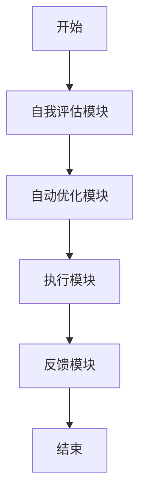

                 


# 自我改进型AI Agent：LLM的自我评估与优化

## 关键词：自我改进型AI Agent, LLM, 自我评估, 自动优化, AI系统设计

## 摘要：本文将详细探讨自我改进型AI Agent的自我评估与优化方法，结合大语言模型（LLM）的实际应用，分析其核心算法、系统架构设计及实现案例。通过理论与实践相结合，为读者提供全面的技术指导。

---

## 第一部分：自我改进型AI Agent的背景与概念

### 第1章：自我改进型AI Agent的背景与概念

#### 1.1 问题背景

- **问题背景**：随着AI技术的快速发展，AI Agent（智能体）在各个领域的应用日益广泛。然而，现有的AI Agent在面对复杂问题时，往往缺乏自我评估和优化的能力，导致性能受限。
  
- **问题解决的目标**：本研究旨在探讨如何使AI Agent具备自我评估和优化的能力，从而提高其问题解决效率和准确性。

- **问题描述**：自我改进型AI Agent需要能够实时评估自身的性能，并根据评估结果进行优化调整。这涉及到多个方面的技术挑战，包括评估指标的设计、优化算法的选择等。

- **边界与外延**：本研究主要聚焦于基于大语言模型（LLM）的AI Agent，探讨其自我评估与优化的具体实现方法。研究范围不包括其他类型AI Agent的改进方法。

- **概念结构与核心要素**：自我改进型AI Agent的核心要素包括自我评估模块、优化模块、执行模块和反馈模块。各模块协同工作，形成一个闭环的改进系统。

### 第2章：自我改进型AI Agent的核心原理

#### 2.1 核心概念与定义

- **自我改进型AI Agent**：一种能够通过自我评估和优化，持续改进自身性能的AI Agent。

- **评估函数**：用于衡量AI Agent当前性能的函数，通常由多个评估指标加权组合而成。

- **优化函数**：根据评估结果，调整AI Agent的行为参数或模型参数，以达到优化目标。

#### 2.2 核心原理与特征

- **自我评估机制**：AI Agent通过评估函数对自己当前的表现进行打分，分数反映了其性能的好坏。

- **自动优化策略**：根据评估结果，AI Agent会触发优化机制，调整自身的行为或参数。

- **持续改进**：通过不断评估和优化，AI Agent能够持续提升自己的性能，适应不断变化的环境。

#### 2.3 核心特征对比（表格形式）

| 特征维度         | 传统AI Agent       | 自我改进型AI Agent       |
|------------------|--------------------|--------------------------|
| 是否具备自我评估 | 否                 | 是                       |
| 是否具备自动优化 | 否                 | 是                       |
| 环境适应能力     | 有限               | 强                       |
| 性能提升方式     | 手动调整或固定策略 | 自动优化和持续改进       |

### 第3章：自我改进型AI Agent的系统架构设计

#### 3.1 系统功能设计

- **自我评估模块**：负责对AI Agent的当前性能进行评估。
  
- **自动优化模块**：根据评估结果，调整AI Agent的行为或参数。

- **执行模块**：将优化后的行为或参数应用到实际任务中。

- **反馈模块**：收集任务执行结果，为后续优化提供反馈。

#### 3.2 系统架构设计（Mermaid架构图）



---

## 第二部分：自我改进型AI Agent的算法原理

### 第4章：自我改进型AI Agent的数学模型与算法

#### 4.1 评估函数

- **公式推导**：评估函数通常是一个加权和的形式，如下所示：

  $$ f(e) = \sum_{i=1}^{n} w_i e_i $$

  其中，$w_i$ 是第i个评估指标的权重，$e_i$ 是第i个评估指标的值。

- **案例分析**：假设我们有三个评估指标，分别是准确性（0.8）、响应速度（0.6）和资源消耗（0.4）。那么，评估分数可以表示为：

  $$ f(e) = 0.3 \times 0.8 + 0.4 \times 0.6 + 0.3 \times 0.4 = 0.24 + 0.24 + 0.12 = 0.6 $$

#### 4.2 优化函数

- **公式推导**：优化函数的目标是最小化评估结果与期望值的差距，如下所示：

  $$ o(f) = \min_{x} \sum_{i=1}^{m} w'_i (x_i - f_i)^2 $$

  其中，$x_i$ 是优化变量，$f_i$ 是评估结果，$w'_i$ 是优化指标的权重。

- **案例分析**：假设我们有两个优化变量，分别是参数1（$x_1$）和参数2（$x_2$），对应的优化目标分别为$f_1 = 0.6$和$f_2 = 0.7$，权重分别为0.5和0.5。那么，优化函数可以表示为：

  $$ o(f) = \min_{x_1, x_2} 0.5 (x_1 - 0.6)^2 + 0.5 (x_2 - 0.7)^2 $$

---

## 第三部分：项目实战与案例分析

### 第5章：自我改进型AI Agent的实现案例

#### 5.1 项目背景与目标

- **项目背景**：本项目旨在实现一个基于LLM的自我改进型AI Agent，使其能够通过自我评估和优化，提高任务执行效率。

- **项目目标**：设计并实现一个能够自我评估和优化的AI Agent，验证其在实际任务中的性能提升效果。

#### 5.2 系统实现

- **环境安装**：需要安装Python、LLM库（如Transformers）和优化库（如Scipy）。

- **核心代码实现**

  ```python
  import numpy as np
  from scipy.optimize import minimize

  def evaluation_function(evaluation_metrics):
      # 计算评估分数
      score = np.sum(w * evaluation_metrics)
      return score

  def optimization_function(evaluated_score):
      # 定义优化目标函数
      def objective(x):
          return np.sum((x - evaluated_score) ** 2)

      # 使用最小二乘法求解
      result = minimize(objective, x0=np.array([0, 0]))
      return result.x

  # 示例
  evaluation_metrics = np.array([0.8, 0.6, 0.4])
  w = np.array([0.3, 0.4, 0.3])
  score = evaluation_function(evaluation_metrics)
  optimized_params = optimization_function(score)
  ```

- **代码解读**

  - `evaluation_function`：实现评估函数，计算AI Agent的当前性能得分。
  
  - `optimization_function`：实现优化函数，通过最小二乘法优化AI Agent的行为或参数。

---

## 第四部分：总结与展望

### 第6章：总结与展望

#### 6.1 最佳实践

- **评估指标设计**：合理的评估指标是自我改进型AI Agent性能提升的关键。

- **优化算法选择**：选择合适的优化算法，能够显著提高优化效率。

#### 6.2 小结

- 本文详细探讨了自我改进型AI Agent的自我评估与优化方法，结合LLM的实际应用，分析了其核心算法、系统架构设计及实现案例。

#### 6.3 注意事项

- **评估指标的合理性**：评估指标的设计需要结合具体任务需求，避免误导性评估。

- **优化算法的适用性**：选择优化算法时，需要考虑问题的规模和约束条件，确保算法的有效性和效率。

#### 6.4 拓展阅读

- **相关书籍**：《深度学习》、《强化学习》

- **相关论文**：《Meta-Learning for Self-Improving Agents》、《Self-Optimizing AI Systems》

---

## 作者：AI天才研究院/AI Genius Institute & 禅与计算机程序设计艺术 /Zen And The Art of Computer Programming

