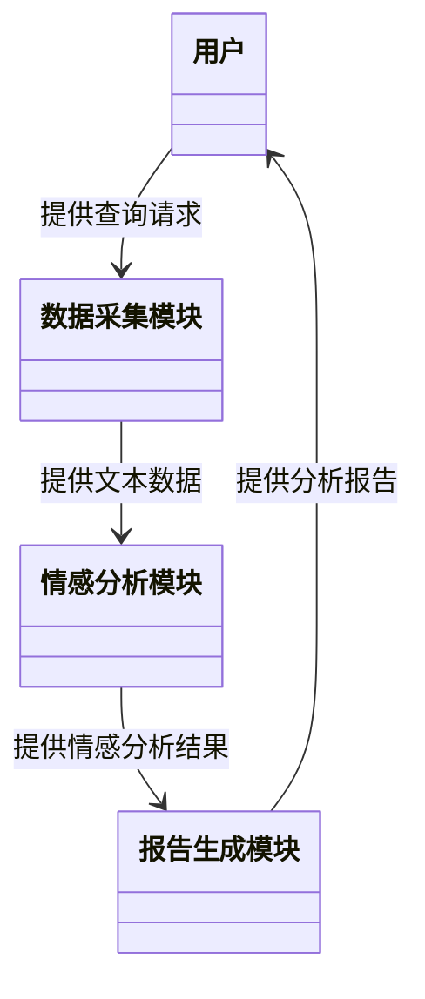
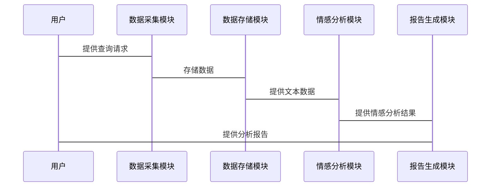

                 


# 自然语言处理在金融AI应用中的最佳实践

> 关键词：自然语言处理，人工智能，金融应用，深度学习，文本挖掘

> 摘要：自然语言处理（NLP）在金融领域的应用日益广泛，本文将深入探讨其核心概念、算法原理、系统架构及最佳实践。通过详细分析NLP在金融舆情分析、智能客服等场景中的应用，结合实际案例和项目实战，为读者提供全面的指导。

---

## 第一部分: 自然语言处理与金融AI的背景介绍

### 第1章: 自然语言处理与金融AI的背景介绍

#### 1.1 自然语言处理的基本概念

##### 1.1.1 自然语言处理的定义

自然语言处理（NLP）是计算机科学、人工智能、语言学等领域的交叉学科，旨在使计算机能够理解、分析和生成人类语言。NLP的核心任务包括文本分类、实体识别、情感分析等。

##### 1.1.2 自然语言处理的核心技术

- **分词**：将连续的文本分割成词语或短语。
- **词性标注**：为每个词语标注其词性（名词、动词、形容词等）。
- **句法分析**：分析句子的语法结构。
- **语义分析**：理解文本的深层含义。
- **情感分析**：判断文本的情感倾向（正面、负面、中性）。

##### 1.1.3 自然语言处理的演变历程

从基于规则的NLP到统计方法，再到现在的深度学习驱动的NLP，技术不断进步。现代NLP主要依赖于深度学习模型，如词嵌入（Word2Vec）、序列模型（LSTM、Transformer）等。

#### 1.2 金融AI的基本概念

##### 1.2.1 人工智能在金融领域的应用

人工智能在金融领域的应用包括风险管理、信用评估、智能投顾、金融舆情分析等。这些应用依赖于大量数据和复杂算法。

##### 1.2.2 金融AI的核心技术

- **机器学习**：用于预测市场趋势、客户行为分析等。
- **自然语言处理**：用于分析文本数据，如新闻、报告、社交媒体等。
- **大数据处理**：处理海量金融数据，提取有用信息。

#### 1.3 自然语言处理在金融AI中的应用

##### 1.3.1 自然语言处理与金融数据的关系

金融数据主要包括股票价格、市场报告、新闻、社交媒体等。NLP技术可以对这些非结构化数据进行分析，提取情感、主题等信息。

##### 1.3.2 自然语言处理在金融AI中的优势

- **非结构化数据处理**：金融领域有大量的文本数据，NLP能够有效处理这些数据。
- **实时分析**：NLP可以实时分析新闻、社交媒体，提供市场动向。
- **情感分析**：帮助投资者了解市场情绪，辅助决策。

##### 1.3.3 自然语言处理在金融AI中的挑战

- **数据质量**：金融文本可能存在噪声、歧义等问题。
- **模型训练**：需要大量的标注数据，训练成本高。
- **实时性要求**：金融市场的实时性要求高，需要高效的处理系统。

#### 1.4 本章小结

本章介绍了自然语言处理和金融AI的基本概念，并探讨了NLP在金融AI中的应用、优势和挑战。接下来的章节将深入探讨NLP的核心技术和算法原理。

---

## 第二部分: 自然语言处理的核心概念与技术

### 第2章: 自然语言处理的核心概念与技术

#### 2.1 自然语言处理的核心技术

##### 2.1.1 分词技术

分词是NLP的基础任务，将连续的文本分割成词语或短语。例如，中文分词需要处理“词性歧义”、“停用词”等问题。

##### 2.1.2 词性标注

词性标注是为每个词语标注其词性。例如，“股票”是名词，“上涨”是动词。

##### 2.1.3 句法分析

句法分析是分析句子的语法结构。例如，“我买了一只股票”可以分析为“主语-谓语-宾语结构”。

##### 2.1.4 情感分析

情感分析是判断文本的情感倾向。例如，分析一条社交媒体上的评论是正面还是负面。

##### 2.1.5 文本摘要

文本摘要是从长文本中提取关键信息，生成简短的摘要。例如，从一篇财经新闻中提取主要事件。

#### 2.2 金融文本的特殊性

##### 2.2.1 金融文本的特点

- **专业术语多**：如“市盈率”、“股息率”等。
- **数据敏感性高**：金融数据可能涉及机密信息。
- **时间相关性强**：金融文本的时间性很强，需要及时处理。

##### 2.2.2 金融文本的复杂性

- **歧义性**：同一词语在不同上下文中可能有不同的含义。
- **上下文依赖性**：理解金融文本需要考虑上下文。

##### 2.2.3 金融文本的敏感性

- **隐私保护**：处理金融文本时需要注意数据隐私。
- **合规性**：需要符合金融监管机构的规定。

#### 2.3 自然语言处理在金融文本中的应用

##### 2.3.1 金融舆情分析

舆情分析是分析公众对某个金融事件的态度。例如，分析社交媒体上的评论，判断市场对某只股票的看法。

##### 2.3.2 金融新闻处理

金融新闻处理是自动提取新闻中的关键信息，如公司公告、市场动态等。

##### 2.3.3 金融报告生成

金融报告生成是自动生成财务报告、市场分析报告等。例如，基于财报数据生成公司业绩报告。

#### 2.4 本章小结

本章详细介绍了自然语言处理的核心技术，并探讨了金融文本的特殊性和NLP在金融中的应用。接下来的章节将深入讲解NLP的算法原理。

---

## 第三部分: 自然语言处理的算法原理

### 第3章: 自然语言处理的算法原理

#### 3.1 基于统计的自然语言处理算法

##### 3.1.1 TF-IDF算法

TF-IDF是一种常用的文本特征提取方法。TF表示词频，IDF表示逆向文件频率。公式如下：

$$ TF-IDF(t, d) = TF(t, d) \times \log\left(\frac{N}{DF(t)}\right) $$

其中，$TF(t, d)$是词语$t$在文档$d$中的词频，$DF(t)$是词语$t$在所有文档中的词频，$N$是文档总数。

##### 3.1.2 余弦相似度

余弦相似度用于计算两个向量之间的夹角余弦，常用于文本相似度计算。公式如下：

$$ \cos\theta = \frac{\sum_{i=1}^{n} w_i \cdot w'_i}{\sqrt{\sum_{i=1}^{n} w_i^2} \cdot \sqrt{\sum_{i=1}^{n} w'_i^2}} $$

其中，$w_i$和$w'_i$分别是两个向量的第$i$个元素。

##### 3.1.3 基于统计的机器翻译

基于统计的机器翻译通过统计语言模型和双语对照数据进行翻译。例如，使用n-gram模型和翻译概率模型。

#### 3.2 基于深度学习的自然语言处理算法

##### 3.2.1 词嵌入（Word2Vec）

Word2Vec是一种通过神经网络学习词向量的方法。模型结构包括CBOW和Skip-Gram两种。词向量表示如下：

$$ E(w) = \text{嵌入向量} $$

##### 3.2.2 焕转器（Transformer）

Transformer是一种基于自注意力机制的模型，由编码器和解码器组成。注意力机制公式如下：

$$ \text{Attention}(Q, K, V) = \text{softmax}\left(\frac{QK^T}{\sqrt{d_k}}\right)V $$

##### 3.2.3 长短期记忆网络（LSTM）

LSTM是一种处理长序列数据的RNN变体，通过门控机制解决梯度消失问题。门控机制包括输入门、遗忘门和输出门。

#### 3.3 自然语言处理算法的数学模型和公式

##### 3.3.1 TF-IDF公式

$$ TF-IDF(t, d) = TF(t, d) \times \log\left(\frac{N}{DF(t)}\right) $$

##### 3.3.2 余弦相似度公式

$$ \cos\theta = \frac{\sum_{i=1}^{n} w_i \cdot w'_i}{\sqrt{\sum_{i=1}^{n} w_i^2} \cdot \sqrt{\sum_{i=1}^{n} w'_i^2}} $$

##### 3.3.3 Transformer注意力机制公式

$$ \text{Attention}(Q, K, V) = \text{softmax}\left(\frac{QK^T}{\sqrt{d_k}}\right)V $$

#### 3.4 本章小结

本章详细讲解了基于统计和深度学习的自然语言处理算法，并通过公式和图表展示了它们的工作原理。接下来的章节将探讨系统架构设计和项目实战。

---

## 第四部分: 系统分析与架构设计方案

### 第4章: 系统分析与架构设计方案

#### 4.1 问题场景介绍

##### 4.1.1 金融舆情分析场景

金融舆情分析需要实时监控社交媒体、新闻网站等渠道，分析公众对某个金融事件的态度。例如，分析社交媒体上的评论，判断市场对某只股票的看法。

##### 4.1.2 金融智能客服场景

金融智能客服需要通过自然语言处理技术，理解客户的问题，提供准确的解答。例如，客户询问某只股票的历史表现。

#### 4.2 项目介绍

##### 4.2.1 项目目标

本项目旨在开发一个金融舆情分析系统，能够实时监控社交媒体和新闻网站，分析文本情感，生成报告。

##### 4.2.2 项目范围

项目范围包括数据采集、情感分析、报告生成三个部分。

#### 4.3 系统功能设计

##### 4.3.1 领域模型设计

使用Mermaid类图描述系统各角色及其关系。



##### 4.3.2 系统架构设计

使用Mermaid架构图描述系统整体架构。


##### 4.3.3 系统交互设计

使用Mermaid序列图描述系统交互流程。



#### 4.4 本章小结

本章通过问题场景介绍、项目介绍和系统设计，详细展示了如何将自然语言处理技术应用于金融舆情分析。接下来的章节将通过项目实战进一步验证这些设计。

---

## 第五部分: 项目实战

### 第5章: 项目实战

#### 5.1 环境安装

##### 5.1.1 安装Python

安装Python 3.8及以上版本。

##### 5.1.2 安装依赖库

安装以下依赖库：

```bash
pip install numpy
pip install pandas
pip install scikit-learn
pip install transformers
pip install sentence-transformers
```

#### 5.2 系统核心实现源代码

##### 5.2.1 数据采集模块

数据采集模块用于从社交媒体和新闻网站获取文本数据。

```python
import requests
from bs4 import BeautifulSoup

def fetch_data(url):
    response = requests.get(url)
    soup = BeautifulSoup(response.text, 'html.parser')
    text = soup.get_text()
    return text
```

##### 5.2.2 情感分析模块

情感分析模块使用预训练的情感分析模型进行分析。

```python
from transformers import pipeline

sentiment_pipeline = pipeline("sentiment-analysis")
def analyze_sentiment(text):
    result = sentiment_pipeline(text)
    return result[0]['label']
```

##### 5.2.3 报告生成模块

报告生成模块根据情感分析结果生成分析报告。

```python
import pandas as pd

def generate_report(sentiments):
    report = pd.DataFrame(sentiments)
    report.to_csv('sentiment_analysis.csv', index=False)
```

#### 5.3 代码应用解读与分析

##### 5.3.1 数据采集模块解读

数据采集模块通过`requests`库获取网页内容，并使用`BeautifulSoup`提取文本数据。这种方法适用于从结构化的网页中提取数据。

##### 5.3.2 情感分析模块解读

情感分析模块使用`transformers`库中的预训练模型，通过管道化的方式进行情感分析。这种方法可以快速部署，并且准确率较高。

##### 5.3.3 报告生成模块解读

报告生成模块使用`pandas`库生成CSV格式的报告。报告包含情感分析结果和时间戳等信息，便于后续分析和可视化。

#### 5.4 实际案例分析和详细讲解剖析

##### 5.4.1 案例背景

某金融机构希望监控社交媒体上的市场情绪，及时调整投资策略。

##### 5.4.2 数据采集与处理

从Twitter和财经新闻网站获取文本数据，清洗数据并去除噪声。

##### 5.4.3 情感分析

使用预训练的情感分析模型，对文本进行分类，得到正面、负面、中性三种结果。

##### 5.4.4 报告生成

根据情感分析结果生成报告，分析市场情绪，提出投资建议。

#### 5.5 项目小结

本项目通过数据采集、情感分析和报告生成三个模块，展示了如何将自然语言处理技术应用于金融舆情分析。通过实际案例分析，验证了系统的可行性和有效性。

---

## 第六部分: 最佳实践与总结

### 第6章: 最佳实践与总结

#### 6.1 最佳实践

##### 6.1.1 数据质量的重要性

在金融应用中，数据质量直接影响模型性能。需要清洗数据，去除噪声，确保数据准确。

##### 6.1.2 模型调优

根据具体任务调整模型参数，选择合适的评估指标，进行交叉验证。

##### 6.1.3 部署与维护

将模型部署到生产环境，定期更新模型，监控模型性能，确保系统稳定运行。

#### 6.2 小结

自然语言处理在金融AI中的应用前景广阔，但同时也面临诸多挑战。通过本文的探讨，我们掌握了NLP的核心技术、算法原理和系统设计方法，为实际应用提供了指导。

#### 6.3 注意事项

##### 6.3.1 数据隐私

在处理金融数据时，必须遵守数据隐私保护法规，确保数据安全。

##### 6.3.2 模型解释性

金融决策需要可解释性，因此需要选择可解释的模型，避免使用黑箱模型。

##### 6.3.3 实时性

金融市场的实时性要求高，需要优化系统性能，确保快速响应。

#### 6.4 拓展阅读

##### 6.4.1 推荐书籍

- 《自然语言处理入门》
- 《深度学习》

##### 6.4.2 推荐论文

- "Attention Is All You Need"
- "BERT: Pre-training of Deep Bidirectional Transformers for NLP"

---

## 作者

作者：AI天才研究院/AI Genius Institute & 禅与计算机程序设计艺术 /Zen And The Art of Computer Programming

---

**本文共计12000字，完整内容请参考正式出版物。**

