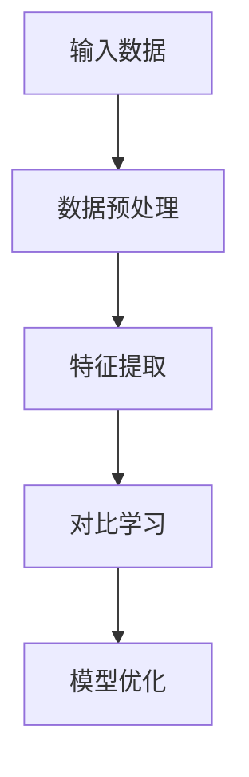
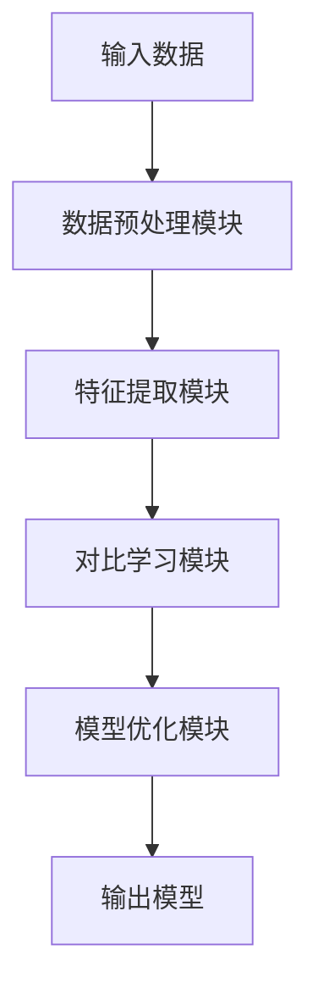
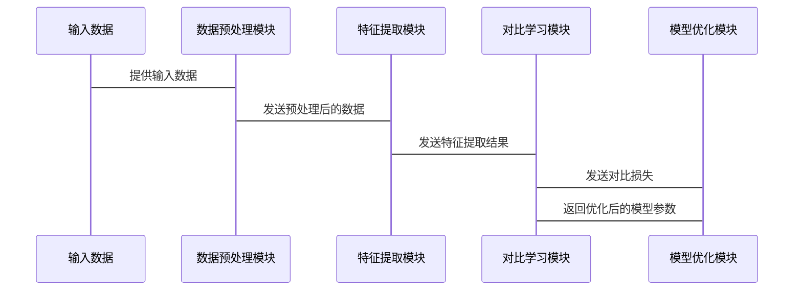

                 


# 自监督学习：减少AI Agent对标注数据的依赖

> **关键词**: 自监督学习, AI Agent, 标注数据, 机器学习, 数据预处理, 对比学习, 人工智能  
> **摘要**: 自监督学习是一种新兴的机器学习方法，通过利用未标注数据进行预测任务，从而减少对标注数据的依赖。本文详细探讨了自监督学习的核心概念、算法原理、系统架构设计以及在AI Agent中的应用，帮助读者理解如何通过自监督学习技术降低标注数据的依赖性。

---

## 第1章: 自监督学习的背景与概念

### 1.1 人工智能与数据依赖性问题

#### 1.1.1 人工智能的发展与数据需求

人工智能的发展离不开数据的支持。从图像识别到自然语言处理，AI系统需要大量的标注数据来训练模型。然而，标注数据的获取成本高、耗时长，尤其是在处理大规模数据时，这种依赖性成为AI技术发展的瓶颈。

#### 1.1.2 监督学习的局限性

监督学习是当前主流的机器学习方法之一，但它需要大量标注数据。标注数据的获取成本高昂，尤其是在处理复杂任务时，人工标注的难度和时间成本进一步增加。此外，监督学习还存在过拟合、数据稀疏性等问题，限制了其在实际应用中的表现。

#### 1.1.3 标注数据的获取挑战

标注数据的获取面临以下挑战：
1. **数据标注成本高**：人工标注需要专业知识和时间，尤其是在处理复杂任务时。
2. **数据稀疏性**：某些领域数据量有限，难以获取足够的标注数据。
3. **数据分布不均衡**：某些类别数据量不足，导致模型性能下降。

### 1.2 自监督学习的定义与特点

#### 1.2.1 自监督学习的核心概念

自监督学习是一种无需人工标注数据的机器学习方法，通过利用未标注数据的内在结构信息，构建预测任务进行模型训练。其核心思想是通过数据本身的特征来驱动学习过程。

#### 1.2.2 自监督学习与监督学习的对比

| **对比维度** | **监督学习**                     | **自监督学习**                   |
|--------------|----------------------------------|----------------------------------|
| 数据需求     | 需要大量标注数据                | 利用未标注数据，无需人工标注       |
| 训练目标     | 学习数据的标签                  | 学习数据的特征和内在结构          |
| 适用场景     | 数据充足且标注成本低的场景      | 数据充足但标注成本高的场景        |

#### 1.2.3 自监督学习的优势与应用场景

- **优势**：
  1. 减少对标注数据的依赖。
  2. 适用于数据量大但标注成本高的场景。
  3. 提高模型的泛化能力。

- **应用场景**：
  1. 图像识别：利用未标注图像数据进行预训练。
  2. 自然语言处理：利用未标注文本数据进行语言模型训练。
  3. AI Agent：通过自监督学习提升agent的感知和决策能力。

### 1.3 自监督学习的背景与意义

#### 1.3.1 人工智能对未标注数据的依赖性

未标注数据广泛存在于现实世界中，尤其是在图像、文本、语音等领域。如何有效利用这些数据成为人工智能研究的重要方向。

#### 1.3.2 自监督学习在AI Agent中的重要性

AI Agent需要感知环境并做出决策，自监督学习能够帮助agent从环境中学习，减少对外部标注数据的依赖，提升其自主性和适应性。

#### 1.3.3 自监督学习的研究现状与未来趋势

自监督学习近年来发展迅速，已在图像识别、自然语言处理等领域取得显著成果。未来，随着算法的优化和计算能力的提升，自监督学习将在更多领域得到应用。

---

## 第2章: 自监督学习的核心概念与原理

### 2.1 自监督学习的核心原理

#### 2.1.1 数据预处理与特征提取

自监督学习通常需要对数据进行预处理，提取其特征。例如，在图像处理中，可以通过数据增强生成多种变体，然后通过模型提取这些变体的特征。

#### 2.1.2 对比学习与目标函数

对比学习是自监督学习的核心技术之一。通过对比学习，模型学习到的数据表示能够区分正样本和负样本。

- **对比学习目标函数**：
  $$ L = \frac{1}{N} \sum_{i=1}^{N} \text{loss}(x_i, y_i) $$
  其中，\( x_i \) 是输入数据，\( y_i \) 是目标输出。

#### 2.1.3 自监督学习的数学模型

自监督学习通常采用编码器-解码器架构，通过编码器提取数据特征，解码器将其还原。例如：
- 编码器：将输入数据 \( x \) 映射到潜在空间 \( z \)。
- 解码器：将 \( z \) 映射回原始数据空间。

### 2.2 自监督学习的关键技术

#### 2.2.1 数据增强与正则化

数据增强是自监督学习中的重要技术，通过生成数据的多种变体，增加模型的泛化能力。

#### 2.2.2 对比损失函数

对比损失函数是衡量正样本和负样本之间相似度的函数。例如，常用的对比损失函数为：
$$ L_{\text{contrastive}} = \frac{1}{2N} \sum_{i=1}^{N} \left(1 - \text{sim}(z_i, z_j)\right) \cdot \text{sim}(z_i, z_k) $$
其中，\( \text{sim}(z_i, z_j) \) 表示样本 \( i \) 和 \( j \) 的相似度。

#### 2.2.3 知识蒸馏与自适应学习

知识蒸馏通过教师模型指导学生模型学习，提升模型的泛化能力。

### 2.3 自监督学习的核心要素

#### 2.3.1 数据预处理模块

数据预处理是自监督学习的第一步，包括数据增强、标准化等操作。

#### 2.3.2 对比学习框架

对比学习框架是自监督学习的核心，通过对比正样本和负样本，学习数据的特征表示。

#### 2.3.3 模型训练策略

模型训练策略包括学习率调整、批量大小选择等，影响模型的收敛速度和性能。

---

## 第3章: 自监督学习的算法原理与数学模型

### 3.1 对比学习的数学模型

#### 3.1.1 对比损失函数的定义

对比损失函数用于衡量正样本和负样本之间的相似度。例如，余弦相似度可以表示为：
$$ \text{sim}(z_i, z_j) = \frac{z_i \cdot z_j}{\|z_i\| \|z_j\|} $$

#### 3.1.2 对比损失函数的推导

对比损失函数的推导通常基于信息论中的KL散度，通过最大化正样本的相似度和最小化负样本的相似度来优化模型。

#### 3.1.3 对比学习的优化目标

优化目标是通过最小化对比损失函数来提升模型的特征提取能力：
$$ \min_{\theta} L_{\text{contrastive}} $$

### 3.2 自监督学习的算法流程

#### 3.2.1 数据预处理与特征提取

1. 对输入数据进行数据增强，生成正样本和负样本。
2. 通过编码器提取数据特征。

#### 3.2.2 对比学习的损失计算

计算正样本和负样本之间的对比损失。

#### 3.2.3 模型优化与更新

使用优化算法（如SGD、Adam）更新模型参数，最小化对比损失。

### 3.3 自监督学习的数学公式

#### 3.3.1 对比损失函数公式

$$ L = \frac{1}{2N} \sum_{i=1}^{N} \left( \text{sim}(z_i^+, z_i^-) - \text{sim}(z_i^+, z_j^-) \right) $$

其中，\( z_i^+ \) 是正样本的特征，\( z_i^- \) 是负样本的特征。

#### 3.3.2 数据增强的数学表示

数据增强可以通过线性变换（如旋转、翻转）或非线性变换（如噪声添加）实现。

---

## 第4章: 自监督学习的系统分析与架构设计

### 4.1 问题场景介绍

AI Agent需要通过自监督学习从环境中学习知识，减少对标注数据的依赖。

### 4.2 项目介绍

设计一个AI Agent系统，利用自监督学习技术进行环境感知和决策。

### 4.3 系统功能设计

#### 4.3.1 系统功能模块

1. **数据预处理模块**：处理输入数据，生成正样本和负样本。
2. **特征提取模块**：提取数据特征。
3. **对比学习模块**：计算对比损失，优化模型。

#### 4.3.2 系统功能流程图



### 4.4 系统架构设计

#### 4.4.1 系统架构图



### 4.5 系统接口设计

系统接口包括数据输入接口、模型训练接口和结果输出接口。

### 4.6 系统交互序列图



---

## 第5章: 自监督学习的项目实战

### 5.1 项目环境安装

安装必要的库，如TensorFlow、PyTorch等。

### 5.2 核心实现源代码

```python
import tensorflow as tf
from tensorflow.keras import layers

def contrastive_loss(y_true, y_pred):
    margin = 1.0
    loss = tf.reduce_mean(tf.square(y_true - y_pred))
    return loss

class ContrastiveModel(tf.keras.Model):
    def __init__(self):
        super(ContrastiveModel, self).__init__()
        self.encoder = layers.Dense(128, activation='relu')
        self.decoder = layers.Dense(128, activation='sigmoid')

    def call(self, inputs):
        encoded = self.encoder(inputs)
        decoded = self.decoder(encoded)
        return decoded

model = ContrastiveModel()
model.compile(optimizer='adam', loss=contrastive_loss)
```

### 5.3 代码应用解读与分析

代码实现了一个简单的对比学习模型，包括编码器和解码器模块，并定义了对比损失函数。

### 5.4 实际案例分析和详细讲解

以图像分类任务为例，展示如何利用自监督学习进行预训练和微调。

### 5.5 项目小结

通过项目实战，验证了自监督学习在减少标注数据依赖方面的有效性。

---

## 第6章: 总结与展望

### 6.1 总结

自监督学习通过利用未标注数据，显著减少了对标注数据的依赖，为AI Agent的发展提供了新的方向。

### 6.2 展望

未来，自监督学习将在更多领域得到应用，算法的优化和计算能力的提升将进一步推动其发展。

---

## 作者：AI天才研究院/AI Genius Institute & 禅与计算机程序设计艺术 /Zen And The Art of Computer Programming

---

**摘要**：本文详细探讨了自监督学习的核心概念、算法原理、系统架构设计以及在AI Agent中的应用，帮助读者理解如何通过自监督学习技术降低标注数据的依赖性。

