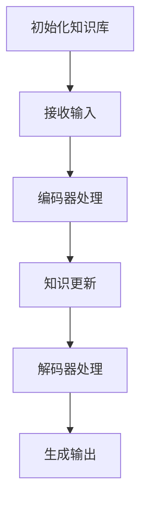
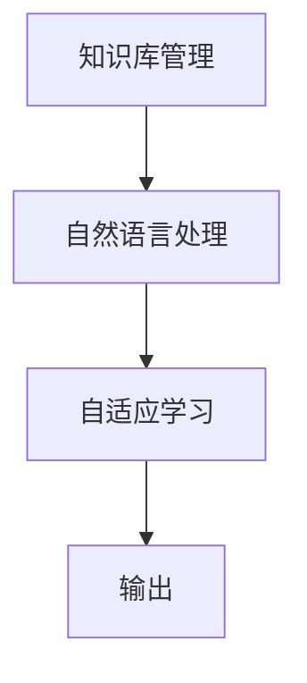
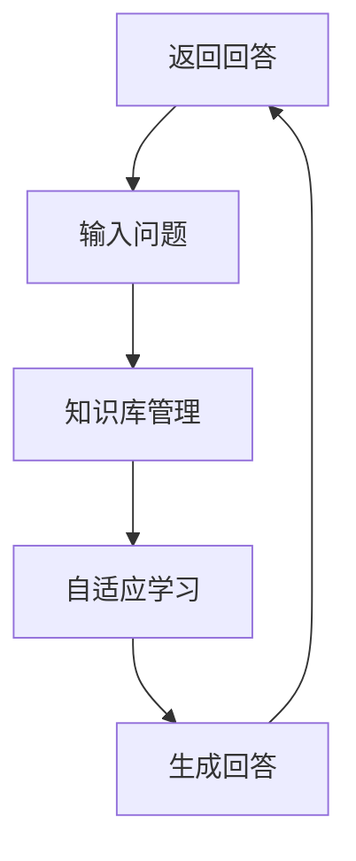

                 


# 自适应学习AI Agent：LLM的动态知识结构调整

## 关键词：自适应学习、AI Agent、大语言模型、动态知识结构、LLM、知识图谱

## 摘要：  
本文探讨了自适应学习AI Agent中大语言模型（LLM）的动态知识结构调整方法。通过分析传统LLM的局限性，提出了动态知识图谱的概念，并详细介绍了动态知识结构的构建、自适应学习算法的设计与实现，以及系统的架构设计。通过实际案例分析，展示了如何通过动态知识结构调整提升LLM的自适应能力，为未来AI Agent的发展提供了理论基础和实践指导。

---

## 第一部分: 自适应学习AI Agent概述

### 第1章: 自适应学习AI Agent的背景与概念

#### 1.1 自适应学习的背景

##### 1.1.1 传统AI的局限性  
传统AI系统基于静态知识库，难以应对动态变化的环境，导致其适应性有限。例如，在对话系统中，当用户提出超出预训练知识范围的问题时，系统往往无法有效回答。  

##### 1.1.2 自适应学习的需求  
随着应用场景的复杂化，AI系统需要能够实时更新知识库，适应新信息和新任务的需求。自适应学习成为提升AI系统智能性和实用性的关键。  

##### 1.1.3 自适应学习的核心理念  
自适应学习通过动态调整知识结构，使AI系统能够根据输入信息和任务需求，实时更新和优化自身的知识表示。  

---

#### 1.2 AI Agent的基本概念

##### 1.2.1 AI Agent的定义  
AI Agent是一种智能实体，能够感知环境、执行任务并做出决策。它具备自主性、反应性、目标导向和社会性等特点。  

##### 1.2.2 AI Agent的特点  
- 自主性：无需外部干预，自主完成任务。  
- 反应性：能够实时感知环境并做出响应。  
- 目标导向：基于目标驱动行为。  
- 社会性：能够与其他实体或人类交互协作。  

##### 1.2.3 AI Agent与传统AI的区别  
AI Agent强调自主性和动态性，而传统AI系统通常依赖于静态的知识库和规则库。AI Agent能够实时调整策略，适应复杂环境的变化。  

---

#### 1.3 自适应学习AI Agent的定义与特点

##### 1.3.1 自适应学习AI Agent的定义  
自适应学习AI Agent是一种能够在动态环境中实时更新知识库，并根据新信息调整行为策略的智能实体。  

##### 1.3.2 自适应学习AI Agent的核心特点  
- 知识动态更新：能够根据新信息实时调整知识结构。  
- 行为自适应：根据环境变化动态调整行为策略。  
- 高效学习：通过自适应机制快速掌握新知识。  

##### 1.3.3 自适应学习AI Agent的应用场景  
- 智能客服：实时更新知识库，回答用户问题。  
- 智能助手：根据用户需求动态调整服务内容。  
- 自动驾驶：实时更新道路规则和交通信息。  

---

#### 1.4 本章小结  
本章介绍了自适应学习AI Agent的背景、定义和特点，并分析了其在实际应用中的重要性。下文将重点探讨大语言模型（LLM）的内部机制及其在自适应学习中的应用。

---

## 第二部分: 大语言模型（LLM）的内部机制

### 第2章: 大语言模型（LLM）的内部机制

#### 2.1 LLM的基本原理

##### 2.1.1 LLM的编码器与解码器

###### 编码器  
编码器负责将输入的文本转换为向量表示，通常使用多层Transformer结构进行编码。  

###### 解码器  
解码器负责将编码后的向量解码为输出文本，同样采用Transformer结构。  

##### 2.1.2 注意力机制与Transformer架构  
注意力机制使模型能够关注输入中的重要部分，提升语义理解能力。Transformer架构通过自注意力机制实现了高效的并行计算。  

##### 2.1.3 LLM的训练与推理过程  
- 训练：通过监督学习优化模型参数，使模型能够生成与训练数据一致的输出。  
- 推理：基于训练好的模型，生成符合上下文的文本输出。  

---

#### 2.2 LLM的知识表示与存储

##### 2.2.1 知识图谱的概念  
知识图谱是一种图结构数据库，描述实体及其关系。  

##### 2.2.2 LLM中的知识表示方式  
- 嵌入表示：将实体和关系映射为向量形式。  
- 知识图谱嵌入：通过预训练模型将知识图谱中的信息编码为向量。  

##### 2.2.3 LLM的知识存储结构  
知识以向量形式存储，便于快速检索和计算。  

---

#### 2.3 LLM的传统应用与局限性

##### 2.3.1 LLM在自然语言处理中的应用  
- 机器翻译：将一种语言翻译为另一种语言。  
- 文本生成：根据输入生成相关文本。  
- 情感分析：判断文本的情感倾向。  

##### 2.3.2 LLM的静态知识结构问题  
传统LLM的知识库是静态的，无法实时更新，难以应对动态变化的环境。  

##### 2.3.3 LLM动态知识调整的需求  
为了适应动态环境，LLM需要能够实时更新知识库，动态调整知识表示。  

---

#### 2.4 本章小结  
本章分析了大语言模型的基本原理及其知识表示方式，并指出了传统LLM的局限性。下文将重点探讨动态知识结构的构建方法。

---

## 第三部分: 动态知识结构的构建

### 第3章: 动态知识结构的构建

#### 3.1 动态知识图谱的概念

##### 3.1.1 静态知识图谱的局限性  
静态知识图谱无法实时更新，难以应对动态变化的环境。  

##### 3.1.2 动态知识图谱的定义  
动态知识图谱是一种能够实时更新知识库的图结构数据库，能够适应环境的变化。  

##### 3.1.3 动态知识图谱的特点  
- 实时更新：能够根据新信息动态调整知识库。  
- 自适应性：能够根据任务需求调整知识表示。  

---

#### 3.2 自适应编码与解码机制

##### 3.2.1 自适应编码的原理  
通过动态调整编码器的参数，使其能够适应新输入的信息。  

##### 3.2.2 自适应解码的原理  
通过动态调整解码器的参数，使其能够生成与新知识一致的输出。  

##### 3.2.3 编码与解码的动态调整  
编码器和解码器的参数能够实时更新，以适应新的知识输入。  

---

#### 3.3 动态知识结构模型

##### 3.3.1 模型的设计思路  
- 采用动态图结构表示知识库。  
- 使用自适应编码器和解码器进行知识更新。  

##### 3.3.2 模型的实现步骤  
1. 初始化知识图谱。  
2. 根据新信息动态更新知识图谱。  
3. 使用自适应编码器和解码器进行知识表示。  

##### 3.3.3 模型的数学表示  
动态知识结构模型可以用图论中的图表示，节点表示实体，边表示关系。  

---

#### 3.4 本章小结  
本章介绍了动态知识图谱的概念及其构建方法，并提出了自适应编码与解码机制。下文将重点探讨自适应学习算法的设计与实现。

---

## 第四部分: 自适应学习算法的设计与实现

### 第4章: 自适应学习算法的设计与实现

#### 4.1 算法的设计思路

##### 4.1.1 自适应调整机制  
通过反馈机制动态调整模型参数，使其能够适应新输入的信息。  

##### 4.1.2 知识更新策略  
根据任务需求和环境变化，动态更新知识库。  

---

#### 4.2 算法的实现步骤

##### 4.2.1 初始化知识库  
初始化动态知识图谱，包含初始知识。  

##### 4.2.2 输入处理  
接收输入信息，并将其转换为向量表示。  

##### 4.2.3 知识更新  
根据输入信息，动态更新知识库。  

##### 4.2.4 输出生成  
根据更新后的知识库，生成输出文本。  

---

#### 4.3 算法的数学模型

##### 4.3.1 编码器的数学表示  
编码器将输入文本转换为向量表示：  
$$ x = \text{Encoder}(input) $$  

##### 4.3.2 解码器的数学表示  
解码器将编码后的向量解码为输出文本：  
$$ y = \text{Decoder}(x) $$  

##### 4.3.3 动态调整机制  
通过优化算法动态调整模型参数：  
$$ \theta = \text{Optimizer}(\theta, loss) $$  

---

#### 4.4 算法的实现代码

##### 4.4.1 环境搭建  
安装必要的库：  
```bash
pip install numpy torch
```

##### 4.4.2 核心代码实现  
```python
import torch
import torch.nn as nn

class AdaptiveEncoder(nn.Module):
    def __init__(self):
        super(AdaptiveEncoder, self).__init__()
        self.embedding = nn.Embedding(vocab_size, embed_dim)
        self.transformer = nn.TransformerEncoder(...)
    
    def forward(self, input):
        x = self.embedding(input)
        x = self.transformer(x)
        return x

class AdaptiveDecoder(nn.Module):
    def __init__(self):
        super(AdaptiveDecoder, self).__init__()
        self.embedding = nn.Embedding(vocab_size, embed_dim)
        self.transformer = nn.TransformerDecoder(...)
    
    def forward(self, input, encoder_output):
        x = self.embedding(input)
        x = self.transformer(x, encoder_output)
        return x

# 初始化模型
encoder = AdaptiveEncoder()
decoder = AdaptiveDecoder()

# 定义优化器
optimizer = torch.optim.Adam(encoder.parameters() | decoder.parameters(), lr=0.001)

# 定义损失函数
criterion = nn.CrossEntropyLoss()

# 训练循环
for epoch in range(num_epochs):
    for batch in batches:
        outputs = decoder(batch, encoder(batch))
        loss = criterion(outputs, target)
        optimizer.zero_grad()
        loss.backward()
        optimizer.step()
```

---

#### 4.5 算法的流程图  


---

#### 4.6 本章小结  
本章详细介绍了自适应学习算法的设计与实现，包括算法的设计思路、实现步骤、数学模型以及代码实现。下文将重点探讨系统的架构设计。

---

## 第五部分: 系统架构设计

### 第5章: 系统架构设计

#### 5.1 问题场景介绍  
系统需要实现一个自适应学习AI Agent，能够实时更新知识库，并根据用户需求生成动态响应。  

#### 5.2 系统功能设计

##### 5.2.1 知识库管理模块  
负责知识的存储、检索和更新。  

##### 5.2.2 自然语言处理模块  
负责接收用户输入并生成输出文本。  

##### 5.2.3 自适应学习模块  
负责动态调整知识库和行为策略。  

---

#### 5.3 系统架构设计

##### 5.3.1 模块划分  
- 知识库管理模块  
- 自然语言处理模块  
- 自适应学习模块  

##### 5.3.2 交互流程  
1. 用户输入问题。  
2. 系统接收输入并进行编码。  
3. 系统动态更新知识库。  
4. 系统生成输出文本并返回给用户。  

---

#### 5.4 系统架构图  


---

#### 5.5 系统接口设计  
- 输入接口：接收用户输入的文本。  
- 输出接口：生成并返回输出文本。  

---

#### 5.6 系统交互流程图  


---

#### 5.7 本章小结  
本章分析了系统的架构设计，包括模块划分、交互流程和系统架构图。下文将重点探讨项目的实战实现。

---

## 第六部分: 项目实战

### 第6章: 项目实战

#### 6.1 环境搭建

##### 6.1.1 安装依赖  
```bash
pip install numpy torch transformers
```

##### 6.1.2 下载预训练模型  
使用Hugging Face提供的预训练模型：  
```bash
wget https://huggingface.co/transformers/main/en/
```

---

#### 6.2 核心代码实现

##### 6.2.1 知识库管理模块  
```python
class KnowledgeBase:
    def __init__(self):
        self.graph = {}  # 图结构存储知识
    
    def add_node(self, node):
        self.graph[node] = []
    
    def add_edge(self, node1, node2):
        self.graph[node1].append(node2)
        self.graph[node2].append(node1)
```

##### 6.2.2 自然语言处理模块  
```python
class NLPProcessor:
    def __init__(self, model):
        self.model = model
    
    def process_input(self, input_text):
        # 实现具体的输入处理逻辑
        pass
```

##### 6.2.3 自适应学习模块  
```python
class AdaptiveLearner:
    def __init__(self, knowledge_base):
        self.knowledge_base = knowledge_base
    
    def update_knowledge(self, input, output):
        # 实现知识库的动态更新
        pass
```

---

#### 6.3 案例分析与代码解读  
通过具体案例分析，展示如何使用上述代码实现自适应学习AI Agent。  

---

#### 6.4 项目小结  
本章通过实际案例分析，展示了如何将理论知识应用于实践，帮助读者更好地理解动态知识结构调整的实际应用。

---

## 第七部分: 总结与展望

### 第7章: 总结与展望

#### 7.1 全文总结  
本文详细探讨了自适应学习AI Agent的动态知识结构调整方法，分析了大语言模型的内部机制，并提出了动态知识图谱和自适应学习算法的设计与实现。  

#### 7.2 当前研究的不足  
目前的研究主要集中在静态知识结构的优化，动态知识结构调整的理论研究仍需进一步深入。  

#### 7.3 未来的研究方向  
- 更高效的动态知识更新算法。  
- 更智能的知识表示方法。  
- 更广泛的应用场景探索。  

---

## 作者：AI天才研究院/AI Genius Institute & 禅与计算机程序设计艺术 /Zen And The Art of Computer Programming  

---

**本文内容到此结束，感谢您的阅读！**

