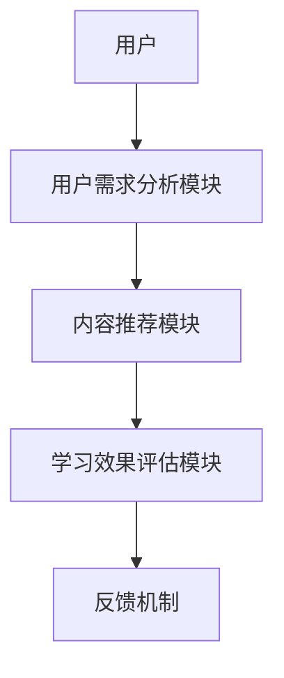
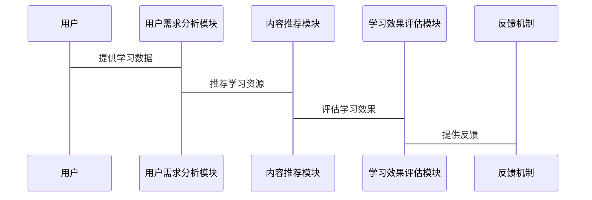

                 


# 自适应学习AI Agent：个性化的LLM教育系统

## 关键词：自适应学习，AI Agent，LLM，教育系统，个性化学习，教育科技

## 摘要：本文探讨了如何结合自适应学习AI Agent和大语言模型（LLM）构建个性化的教育系统。通过分析核心概念、算法原理、系统架构，以及实际项目案例，文章详细展示了如何利用AI技术解决教育中的个性化学习问题。

---

## 第1章：自适应学习AI Agent概述

### 1.1 自适应学习的背景与问题背景

#### 1.1.1 传统教育模式的局限性
传统教育模式通常采用统一的教学方法，难以满足每个学生的个性化需求。学生的学习能力、兴趣和理解程度各不相同，统一的教学方式可能导致部分学生跟不上进度，而另一些学生则可能感到 bored。

#### 1.1.2 现代教育中的个性化需求
随着教育技术的发展，个性化学习越来越受到重视。教育机构希望通过技术手段为每个学生提供定制化的学习计划和资源，以提高学习效果和学生满意度。

#### 1.1.3 自适应学习AI Agent的核心问题
自适应学习AI Agent的核心问题在于如何实时分析学生的学习数据，动态调整教学策略和内容，以优化学习效果。这需要结合人工智能和大数据分析技术，实现个性化教学。

---

### 1.2 自适应学习与LLM的结合

#### 1.2.1 LLM在教育中的应用潜力
大语言模型（LLM）具有强大的自然语言处理能力，能够生成高质量的文本内容、回答问题、提供学习建议等。将其应用于教育领域，可以为学生提供个性化的学习支持。

#### 1.2.2 自适应学习AI Agent的核心概念
自适应学习AI Agent是一种能够根据学生的学习情况自动调整教学策略的智能系统。它通过收集和分析学生的行为数据，了解学生的学习状态，进而提供针对性的学习建议和资源。

#### 1.2.3 核心概念与联系
自适应学习AI Agent的核心概念包括：
- **学生模型**：描述学生的学习能力、兴趣和知识水平。
- **教学策略**：根据学生模型生成个性化教学计划。
- **反馈机制**：实时收集学生的学习反馈，优化教学策略。

### 1.3 核心概念与联系

#### 1.3.1 核心概念原理
自适应学习AI Agent的核心原理是通过实时数据分析和机器学习算法，动态调整教学内容和策略。这需要结合学生模型、教学策略和反馈机制，形成一个闭环系统。

#### 1.3.2 核心概念属性对比表
以下是核心概念的属性对比：

| 属性         | 学生模型                | 教学策略                | 反馈机制                |
|--------------|------------------------|------------------------|------------------------|
| 输入数据     | 学生的学习数据          | 教学目标和资源          | 学生的反馈             |
| 输出结果     | 学生的知识水平预测      | 个性化教学计划          | 教学策略优化建议       |
| 更新频率     | 实时                   | 持续优化               | 实时                   |

#### 1.3.3 ER实体关系图（Mermaid流程图）

```mermaid
er
actor 学生
actor 教师
actor 系统
database 学生数据
database 教学资源
database 教学策略
```

---

## 第2章：自适应学习AI Agent的算法原理

### 2.1 基于强化学习的自适应策略

#### 2.1.1 强化学习的基本原理
强化学习是一种通过试错机制来优化决策的算法。在自适应学习系统中，AI Agent通过与学生交互，不断调整教学策略，以最大化学习效果。

#### 2.1.2 强化学习算法实现
以下是一个强化学习算法的Python代码示例：

```python
class AI-Agent:
    def __init__(self):
        self.state = 'initial'
        self.reward = 0

    def receive_feedback(self, feedback):
        self.reward += feedback
        self.update_state()

    def update_state(self):
        # 根据反馈更新状态
        pass

# 示例使用
agent = AI-Agent()
agent.receive_feedback(0.8)
```

#### 2.1.3 数学模型与公式
强化学习的核心公式是Q-learning算法：

$$ Q(s, a) = Q(s, a) + \alpha (r + \gamma \max Q(s', a') - Q(s, a)) $$

其中：
- \( s \) 是当前状态
- \( a \) 是当前动作
- \( r \) 是奖励
- \( \gamma \) 是折扣因子
- \( \alpha \) 是学习率

---

### 2.2 监督学习在自适应系统中的应用

#### 2.2.1 监督学习的原理与流程
监督学习是一种通过标注数据训练模型的算法。在自适应学习系统中，监督学习可以用于预测学生的学习效果。

#### 2.2.2 监督学习算法实现
以下是一个监督学习算法的Python代码示例：

```python
from sklearn.linear_model import LinearRegression

model = LinearRegression()
X = [[1], [2], [3]]  # 输入特征
y = [2, 4, 6]        # 输出标签

model.fit(X, y)
print(model.predict([[4]]))  # 输出预测结果
```

#### 2.2.3 数学模型与公式
监督学习的数学模型通常是一个线性回归方程：

$$ y = \theta_0 + \theta_1 x $$

其中：
- \( y \) 是输出
- \( x \) 是输入
- \( \theta_0 \) 和 \( \theta_1 \) 是模型参数

---

### 2.3 混合学习策略的设计

#### 2.3.1 混合学习策略的原理
混合学习策略结合了强化学习和监督学习的优势，能够更好地适应复杂的学习场景。

#### 2.3.2 混合学习策略的实现
以下是一个混合学习策略的Python代码示例：

```python
class Hybrid-Agent:
    def __init__(self):
        self.rl_model = AI-Agent()
        self.sl_model = LinearRegression()

    def make_decision(self, state):
        rl_prediction = self.rl_model.predict(state)
        sl_prediction = self.sl_model.predict(state)
        return (rl_prediction + sl_prediction) / 2

# 示例使用
agent = Hybrid-Agent()
state = [1]
print(agent.make_decision(state))  # 输出预测结果
```

#### 2.3.3 数学模型与公式
混合学习策略的数学模型可以表示为：

$$ y = \frac{y_{rl} + y_{sl}}{2} $$

其中：
- \( y_{rl} \) 是强化学习模型的输出
- \( y_{sl} \) 是监督学习模型的输出

---

## 第3章：自适应学习AI Agent的系统架构与设计

### 3.1 系统功能模块设计

#### 3.1.1 用户需求分析模块
用户需求分析模块负责收集学生的学习数据，包括学习进度、兴趣和知识水平。

#### 3.1.2 内容推荐模块
内容推荐模块根据学生的需求分析结果，推荐适合的学习资源和教学内容。

#### 3.1.3 学习效果评估模块
学习效果评估模块负责评估学生的学习效果，并提供反馈。

### 3.2 系统架构设计

#### 3.2.1 系统架构设计（Mermaid架构图）



#### 3.2.2 模块间交互流程（Mermaid序列图）



---

## 第4章：项目实战

### 4.1 环境安装与配置

#### 4.1.1 安装Python和必要的库
需要安装Python 3.8及以上版本，并安装以下库：

```bash
pip install numpy pandas scikit-learn
```

#### 4.1.2 安装大语言模型
可以选择使用Hugging Face的Transformers库来安装和使用大语言模型。

### 4.2 核心代码实现

#### 4.2.1 学生模型实现
```python
class StudentModel:
    def __init__(self):
        self.knowledge_level = 0.5
        self.learning_speed = 1.0
```

#### 4.2.2 教学策略实现
```python
class TeachingStrategy:
    def __init__(self):
        self.contents = []
    def add_content(self, content):
        self.contents.append(content)
```

### 4.3 案例分析与解读

#### 4.3.1 案例背景
假设我们有一个学生，学习数学成绩较差，希望通过自适应学习系统提高成绩。

#### 4.3.2 实施步骤
1. **学生模型初始化**：设定学生的知识水平和学习速度。
2. **内容推荐**：根据学生模型推荐适合的学习资源。
3. **学习效果评估**：评估学生的学习效果并提供反馈。
4. **优化策略**：根据反馈优化教学策略。

### 4.4 项目小结

通过实际项目的实施，我们可以看到自适应学习AI Agent在教育系统中的巨大潜力。通过实时数据分析和机器学习算法，可以显著提高学习效果和学生满意度。

---

## 第5章：最佳实践与注意事项

### 5.1 最佳实践

#### 5.1.1 小结
自适应学习AI Agent是一种能够显著提高教育效果的智能系统，通过结合AI技术和大数据分析，可以为每个学生提供个性化的学习支持。

#### 5.1.2 注意事项
在实际应用中，需要注意数据隐私和模型的可解释性问题，确保系统的安全性和透明性。

### 5.2 拓展阅读

建议读者进一步阅读以下内容：
- 《机器学习实战》
- 《大语言模型在教育中的应用》
- 《自适应学习系统的设计与实现》

---

## 作者信息

作者：AI天才研究院（AI Genius Institute） & 禅与计算机程序设计艺术（Zen And The Art of Computer Programming）

---

以上是《自适应学习AI Agent：个性化的LLM教育系统》的技术博客文章的完整目录大纲和详细内容。

