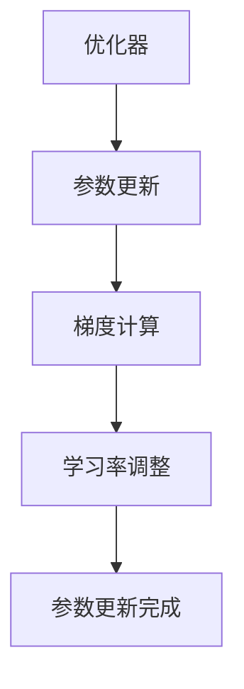
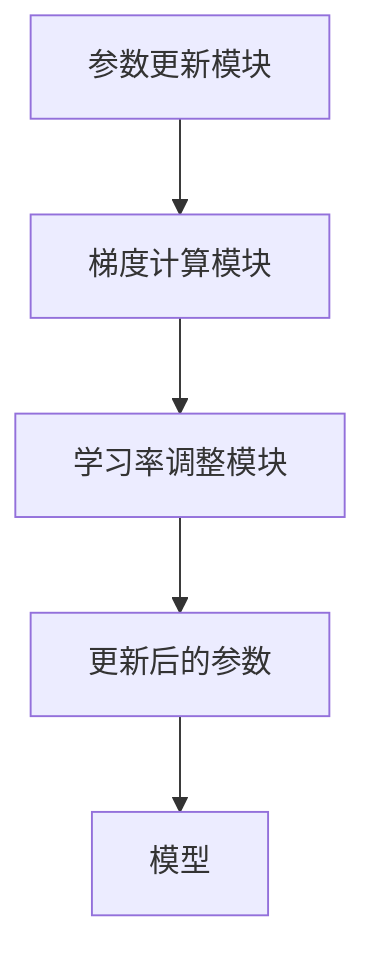
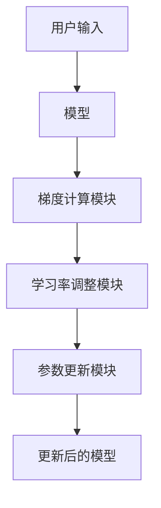

                 


# 自适应学习率在AI Agent训练中的应用

> 关键词：自适应学习率，AI Agent，优化算法，深度学习，梯度下降，机器学习

> 摘要：自适应学习率在AI Agent训练中起着至关重要的作用。本文将从自适应学习率的基本概念出发，详细分析其在AI Agent训练中的应用，涵盖其核心原理、算法实现、系统架构设计以及实际项目中的应用案例。通过本文的阐述，读者将能够深入了解自适应学习率的核心思想，并掌握如何在实际项目中应用这些技术来提升AI Agent的训练效率和效果。

---

# 第1章 自适应学习率的基本概念与背景

## 1.1 自适应学习率的定义与背景

### 1.1.1 学习率在AI Agent训练中的作用

在AI Agent的训练过程中，学习率是优化算法中的一个关键超参数，它决定了模型参数在每次迭代中的更新步长。如果学习率设置得过大，模型可能会在优化过程中振荡，无法收敛到最优解；如果学习率过小，训练过程会变得非常缓慢，甚至陷入局部最优解。因此，学习率的选择和调整直接影响着模型的训练效果和效率。

在传统的机器学习任务中，学习率通常需要手动设置，并且在整个训练过程中保持不变。然而，在复杂的AI Agent训练任务中（如强化学习、多智能体协作等），单一的固定学习率往往无法适应不同阶段的训练需求。例如，在训练初期，模型可能需要较大的学习率来快速探索解空间；而在训练后期，较小的学习率则有助于模型收敛到更精确的解。

### 1.1.2 传统固定学习率的局限性

传统固定学习率的优化算法（如随机梯度下降，SGD）在训练过程中存在以下主要问题：

1. **收敛速度慢**：固定学习率需要通过多次迭代才能找到合适的参数更新步长，尤其是在目标函数的梯度变化较大时，模型的收敛速度会显著下降。
2. **难以处理非均匀的数据分布**：在实际应用中，数据分布往往不均匀，某些区域的梯度变化较大，而另一些区域的梯度变化较小。固定学习率无法同时满足这两种情况的需求。
3. **手动调参的复杂性**：固定学习率需要人工试错来找到合适的值，这在复杂的AI Agent训练任务中显得尤为繁琐和耗时。

### 1.1.3 自适应学习率的核心思想与优势

自适应学习率的核心思想在于根据训练过程中梯度的信息动态调整学习率，以适应不同的训练阶段和数据特性。与固定学习率相比，自适应学习率具有以下显著优势：

1. **自动调整学习率**：算法能够根据梯度的大小和变化趋势动态调整学习率，无需人工干预。
2. **加速收敛**：通过自适应调整学习率，模型可以在不同阶段更有效地探索和优化解空间，从而加速收敛。
3. **鲁棒性更强**：自适应学习率能够更好地应对数据分布的非均匀性和目标函数的复杂性，提高模型的训练稳定性。

---

## 1.2 AI Agent训练中的学习率问题

### 1.2.1 学习率对训练效果的影响

在AI Agent的训练过程中，学习率的调整直接影响着模型的参数更新方向和步长大小。例如，在强化学习中，学习率决定了智能体从经验中学习的速度。如果学习率过高，智能体可能会在策略空间中过度调整，导致训练不稳定；如果学习率过低，智能体的更新速度会变慢，训练效率低下。

### 1.2.2 传统优化算法中的学习率处理

传统的优化算法（如SGD、Adam等）都涉及学习率的设置与调整。例如：

- **随机梯度下降（SGD）**：使用固定学习率，无法根据梯度信息动态调整。
- **Adam优化算法**：结合动量和自适应学习率的思想，动态调整参数更新的步长。
- **Adagrad优化算法**：根据梯度的累积平方和动态调整学习率，适用于稀疏数据的情况。

### 1.2.3 自适应学习率在AI Agent中的应用场景

在复杂的AI Agent训练任务中，自适应学习率的应用场景包括：

1. **强化学习**：动态调整策略更新的学习率，提高智能体的探索效率。
2. **多智能体协作**：在多智能体协作任务中，自适应学习率可以帮助各个智能体更好地协调和优化各自的参数更新。
3. **在线学习**：在在线学习场景中，自适应学习率能够快速响应数据流的变化，保持模型的更新效率。

---

## 1.3 自适应学习率的核心概念与边界

### 1.3.1 自适应学习率的核心要素

自适应学习率的核心要素包括：

1. **梯度信息**：根据梯度的大小和方向动态调整学习率。
2. **动量信息**：结合动量信息（如梯度的累积方向）来优化参数更新。
3. **自适应调整机制**：通过数学模型动态计算学习率的调整量。

### 1.3.2 自适应学习率的边界与外延

自适应学习率的边界包括：

1. **适用范围**：适用于需要动态调整学习率的优化任务。
2. **算法限制**：某些自适应学习率算法（如Adagrad）在处理密集数据时效果不佳。
3. **计算复杂度**：部分自适应学习率算法的计算复杂度较高，可能影响训练效率。

### 1.3.3 自适应学习率与其他优化技术的关系

自适应学习率与其他优化技术（如动量、Adam等）密切相关。例如，Adam优化算法结合了自适应学习率和动量的思想，既能够动态调整学习率，又能够利用动量加速收敛。

---

## 1.4 本章小结

本章主要介绍了自适应学习率的基本概念、在AI Agent训练中的重要性以及其核心思想。通过对比传统固定学习率的局限性，我们得出结论：自适应学习率在复杂AI Agent任务中具有显著的优势。接下来，我们将深入探讨自适应学习率的核心原理和具体实现。

---

# 第2章 自适应学习率的核心原理与算法

## 2.1 自适应学习率的核心思想

### 2.1.1 动态调整学习率的基本原理

自适应学习率的核心思想是根据梯度信息动态调整学习率。具体来说，算法通过分析梯度的大小、方向以及变化趋势，动态计算每个参数的更新步长，从而实现更高效的参数优化。

### 2.1.2 自适应学习率的数学模型

自适应学习率的数学模型通常基于以下假设：学习率的调整应与梯度的二阶矩或方差相关。例如，Adam算法的数学模型如下：

$$ \theta_{t+1} = \theta_t - \eta \frac{m_t}{\sqrt{v_t} + \epsilon} $$

其中：
- $\theta_t$ 表示当前参数。
- $\eta$ 表示全局学习率。
- $m_t$ 表示梯度的一阶矩估计。
- $v_t$ 表示梯度的二阶矩估计。
- $\epsilon$ 表示一个小的常数，用于防止除以零。

### 2.1.3 自适应学习率与梯度下降的关系

自适应学习率是对传统梯度下降算法的改进。通过引入动量和自适应调整机制，自适应学习率能够更有效地探索参数空间，加速收敛并提高训练稳定性。

---

## 2.2 自适应学习率的核心算法

### 2.2.1 Adam优化算法

**Adam算法的工作流程图**

```mermaid
graph TD
    A[初始化参数θ, 优化器状态m和v] --> B[计算梯度g]
    B --> C[更新m = β1 * m + (1 - β1) * g]
    B --> D[更新v = β2 * v + (1 - β2) * g^2]
    C --> E[计算自适应学习率η' = η / sqrt(v + ε)]
    D --> E
    E --> F[更新θ = θ - η' * m]
    F --> G[结束迭代或继续训练]
```

**Adam算法的核心代码实现**

```python
def adam_optimizer(params, lr=0.001, beta1=0.9, beta2=0.999, epsilon=1e-8):
    # 初始动量和二阶矩
    m = {}
    v = {}
    for p in params:
        m[p] = torch.zeros_like(p.grad)
        v[p] = torch.zeros_like(p.grad)
    
    while True:
        for p in params:
            # 更新一阶矩
            m[p] = beta1 * m[p] + (1 - beta1) * p.grad
            # 更新二阶矩
            v[p] = beta2 * v[p] + (1 - beta2) * (p.grad ** 2)
            # 计算自适应学习率
            p.grad = (m[p] / (torch.sqrt(v[p]) + epsilon)) * lr
            # 更新参数
            p.data -= p.grad
```

### 2.2.2 Adagrad优化算法

**Adagrad算法的工作流程图**

```mermaid
graph TD
    A[初始化参数θ和历史梯度h] --> B[计算梯度g]
    B --> C[更新h = h + g^2]
    C --> D[计算自适应学习率η' = η / sqrt(h + ε)]
    D --> E[更新θ = θ - η' * g]
    E --> F[结束迭代或继续训练]
```

**Adagrad算法的核心代码实现**

```python
def adagrad_optimizer(params, lr=0.01, epsilon=1e-8):
    # 初始历史梯度
    h = {}
    for p in params:
        h[p] = torch.zeros_like(p.grad)
    
    while True:
        for p in params:
            # 更新历史梯度
            h[p] += (p.grad ** 2)
            # 计算自适应学习率
            lr_t = lr / (torch.sqrt(h[p]) + epsilon)
            # 更新参数
            p.data -= lr_t * p.grad
```

### 2.2.3 RMSprop优化算法

**RMSprop算法的工作流程图**

```mermaid
graph TD
    A[初始化参数θ和历史梯度h] --> B[计算梯度g]
    B --> C[更新h = β * h + (1 - β) * g^2]
    C --> D[计算自适应学习率η' = η / sqrt(h + ε)]
    D --> E[更新θ = θ - η' * g]
    E --> F[结束迭代或继续训练]
```

**RMSprop算法的核心代码实现**

```python
def rmsprop_optimizer(params, lr=0.001, beta=0.99, epsilon=1e-8):
    # 初始历史梯度
    h = {}
    for p in params:
        h[p] = torch.zeros_like(p.grad)
    
    while True:
        for p in params:
            # 更新历史梯度
            h[p] = beta * h[p] + (1 - beta) * (p.grad ** 2)
            # 计算自适应学习率
            lr_t = lr / (torch.sqrt(h[p]) + epsilon)
            # 更新参数
            p.data -= lr_t * p.grad
```

---

## 2.3 自适应学习率算法的对比分析

### 2.3.1 不同算法的优缺点对比

| 算法名称   | 优点                              | 缺点                                |
|------------|-----------------------------------|------------------------------------|
| Adam       | 收敛速度快，适用于大多数任务      | 对初始学习率敏感，需要调整参数       |
| Adagrad     | 适用于稀疏数据，无需手动调整学习率  | 收敛速度较慢，不适合密集数据           |
| RMSprop     | 稳定性高，适合RNN等序列模型        | 对梯度的二阶矩估计不够准确             |

### 2.3.2 算法对比特征表格

| 特性         | Adam            | Adagrad       | RMSprop      |
|--------------|-----------------|--------------|--------------|
| 动量          | 是（一阶矩）     | 否            | 否            |
| 自适应学习率   | 是              | 是            | 是            |
| 收敛速度       | 快              | 较慢          | 稳定           |
| 数据稀疏性     | 一般            | 适合稀疏数据  | 适合密集数据   |

### 2.3.3 自适应学习率算法的ER实体关系图



---

## 2.4 本章小结

本章详细分析了自适应学习率的核心原理，并对比了三种典型的自适应学习率算法：Adam、Adagrad和RMSprop。通过数学公式和代码实现的对比，我们得出结论：不同算法适用于不同的场景，选择合适的算法需要根据具体的任务需求和数据特性进行判断。

---

# 第3章 自适应学习率的数学模型与公式

## 3.1 自适应学习率的数学模型

### 3.1.1 梯度下降的基本公式

梯度下降的基本更新公式为：

$$ \theta_{t+1} = \theta_t - \eta \cdot g_t $$

其中：
- $\theta_t$ 表示第$t$次迭代的参数。
- $\eta$ 表示学习率。
- $g_t$ 表示第$t$次迭代的梯度。

### 3.1.2 自适应学习率的数学推导

自适应学习率的数学推导通常基于对梯度的二阶矩或方差的估计。例如，Adam算法的数学推导如下：

1. 计算一阶矩估计：

$$ m_t = \beta_1 \cdot m_{t-1} + (1 - \beta_1) \cdot g_t $$

2. 计算二阶矩估计：

$$ v_t = \beta_2 \cdot v_{t-1} + (1 - \beta_2) \cdot g_t^2 $$

3. 计算自适应学习率：

$$ \eta_t = \frac{\eta}{\sqrt{v_t} + \epsilon} $$

4. 更新参数：

$$ \theta_{t} = \theta_{t-1} - \eta_t \cdot m_t $$

### 3.1.3 自适应学习率与优化目标函数的关系

自适应学习率的目标函数通常为：

$$ \min_{\theta} J(\theta) $$

其中，$J(\theta)$ 是需要最小化的目标函数。通过动态调整学习率，优化算法能够更有效地探索目标函数的极小值。

---

## 3.2 自适应学习率算法的数学公式

### 3.2.1 Adam算法的数学公式

$$ \theta_{t+1} = \theta_t - \eta \cdot \frac{m_t}{\sqrt{v_t} + \epsilon} $$

其中：
- $m_t$ 表示梯度的一阶矩估计。
- $v_t$ 表示梯度的二阶矩估计。
- $\epsilon$ 表示一个小的常数，用于防止除以零。

### 3.2.2 Adagrad算法的数学公式

$$ \theta_{t+1} = \theta_t - \eta \cdot \frac{g_t}{\sqrt{h_t} + \epsilon} $$

其中：
- $h_t$ 表示梯度的累积平方和。
- $\epsilon$ 表示一个小的常数，用于防止除以零。

### 3.2.3 RMSprop算法的数学公式

$$ \theta_{t+1} = \theta_t - \eta \cdot \frac{g_t}{\sqrt{h_t} + \epsilon} $$

其中：
- $h_t$ 表示梯度的累积平方和，通过指数加权平均计算得到。
- $\epsilon$ 表示一个小的常数，用于防止除以零。

---

## 3.3 本章小结

本章通过对自适应学习率的数学模型和具体算法的分析，深入探讨了不同算法的数学推导过程和公式。通过对比不同算法的数学表达式，我们能够更好地理解它们的优缺点和适用场景。

---

# 第4章 自适应学习率的系统分析与架构设计

## 4.1 问题场景介绍

在复杂的AI Agent训练任务中，自适应学习率的系统设计需要考虑以下几个方面：

1. **多智能体协作**：在多智能体协作任务中，每个智能体的参数更新需要动态调整学习率。
2. **在线学习**：在在线学习场景中，模型需要实时更新，学习率需要动态调整以适应数据流的变化。
3. **分布式训练**：在分布式训练环境中，每个节点的参数更新需要协调，学习率的调整需要考虑全局优化。

### 4.1.1 系统功能设计

- **参数更新模块**：负责根据梯度信息动态调整学习率，并更新模型参数。
- **梯度计算模块**：负责计算模型的梯度信息，并传递给参数更新模块。
- **学习率调整模块**：负责根据梯度信息动态计算自适应学习率。

### 4.1.2 系统架构设计



---

## 4.2 系统功能设计

### 4.2.1 领域模型（领域类）


### 4.2.2 系统架构设计



### 4.2.3 系统接口设计

- **输入接口**：接收模型的参数和梯度信息。
- **输出接口**：输出更新后的参数。

### 4.2.4 系统交互流程图


---

## 4.3 本章小结

本章从系统设计的角度分析了自适应学习率在AI Agent训练中的应用，提出了一个基于梯度计算和学习率调整的系统架构。通过模块化设计和接口设计，我们能够更好地理解自适应学习率在实际系统中的实现方式。

---

# 第5章 自适应学习率的项目实战

## 5.1 环境安装与配置

### 5.1.1 环境依赖

- Python 3.6+
- PyTorch 1.0+
- matplotlib
- numpy

### 5.1.2 安装步骤

```bash
pip install torch matplotlib numpy
```

---

## 5.2 系统核心实现

### 5.2.1 Adam优化器的实现

```python
import torch
import numpy as np

def adam_optimizer(params, lr=0.001, beta1=0.9, beta2=0.999, epsilon=1e-8):
    m = {}
    v = {}
    for p in params:
        m[p] = torch.zeros_like(p.grad)
        v[p] = torch.zeros_like(p.grad)
    
    while True:
        for p in params:
            m[p] = beta1 * m[p] + (1 - beta1) * p.grad
            v[p] = beta2 * v[p] + (1 - beta2) * (p.grad ** 2)
            p.grad = (m[p] / (torch.sqrt(v[p]) + epsilon)) * lr
            p.data -= p.grad
```

### 5.2.2 Adagrad优化器的实现

```python
def adagrad_optimizer(params, lr=0.01, epsilon=1e-8):
    h = {}
    for p in params:
        h[p] = torch.zeros_like(p.grad)
    
    while True:
        for p in params:
            h[p] += (p.grad ** 2)
            lr_t = lr / (torch.sqrt(h[p]) + epsilon)
            p.data -= lr_t * p.grad
```

### 5.2.3 RMSprop优化器的实现

```python
def rmsprop_optimizer(params, lr=0.001, beta=0.99, epsilon=1e-8):
    h = {}
    for p in params:
        h[p] = torch.zeros_like(p.grad)
    
    while True:
        for p in params:
            h[p] = beta * h[p] + (1 - beta) * (p.grad ** 2)
            lr_t = lr / (torch.sqrt(h[p]) + epsilon)
            p.data -= lr_t * p.grad
```

---

## 5.3 代码实现与解读

### 5.3.1 代码实现

```python
import torch
import torch.nn as nn
import torch.optim as optim
import matplotlib.pyplot as plt

# 定义模型
model = nn.Sequential(
    nn.Linear(2, 4),
    nn.ReLU(),
    nn.Linear(4, 1)
)

# 定义损失函数
criterion = nn.MSELoss()

# 选择优化器
optimizer = optim.Adam(model.parameters(), lr=0.001)

# 训练过程
for epoch in range(100):
    for inputs, labels in dataloader:
        optimizer.zero_grad()
        outputs = model(inputs)
        loss = criterion(outputs, labels)
        loss.backward()
        optimizer.step()

# 绘制收敛曲线
plt.plot(losses)
plt.xlabel('Epoch')
plt.ylabel('Loss')
plt.show()
```

### 5.3.2 代码解读

1. **定义模型**：使用PyTorch定义一个简单的神经网络模型。
2. **选择优化器**：选择Adam优化器，并设置初始学习率为0.001。
3. **训练过程**：通过迭代训练数据，计算损失函数并反向传播，更新模型参数。
4. **绘制收敛曲线**：通过绘制损失函数的变化曲线，观察模型的收敛情况。

---

## 5.4 实际案例分析

### 5.4.1 案例背景

在本案例中，我们使用一个简单的回归任务来演示自适应学习率在训练中的应用。数据集由二维输入和一维输出组成，目标是训练模型以最小化均方误差。

### 5.4.2 案例实现与分析

1. **训练过程**：通过选择不同的优化器（Adam、Adagrad、RMSprop）进行训练，观察模型的收敛速度和最终性能。
2. **收敛曲线对比**：绘制不同优化器的损失函数变化曲线，对比它们的收敛速度和稳定性。

---

## 5.5 本章小结

本章通过具体的代码实现和实际案例分析，展示了自适应学习率在AI Agent训练中的实际应用。通过对比不同优化器的性能，我们能够更好地理解自适应学习率的优势和适用场景。

---

# 第6章 自适应学习率的最佳实践与小结

## 6.1 最佳实践

### 6.1.1 参数设置与调优

- **初始学习率**：通常设置在$10^{-3}$到$10^{-2}$之间。
- **动量系数**：Adam和RMSprop的动量系数通常设置为0.9或0.99。
- **epsilon值**：通常设置为$10^{-8}$或$10^{-9}$，用于防止除以零。

### 6.1.2 算法选择与应用场景

- **Adam**：适用于大多数任务，尤其是在数据分布不均匀的情况下。
- **Adagrad**：适用于稀疏数据，如自然语言处理任务。
- **RMSprop**：适用于RNN等序列模型。

### 6.1.3 训练过程中的注意事项

- **学习率衰减**：在训练后期，适当降低学习率有助于模型的收敛。
- **早停机制**：通过设置早停机制，防止模型过拟合。
- **批量归一化**：结合批量归一化技术，可以进一步加速训练过程。

---

## 6.2 小结

通过本文的阐述，我们深入探讨了自适应学习率在AI Agent训练中的应用，从基本概念到具体实现，再到实际案例分析，全面解析了自适应学习率的核心思想和应用技巧。自适应学习率的引入不仅能够提高模型的训练效率，还能够显著提升模型的性能和泛化能力。

---

# 作者

作者：AI天才研究院/AI Genius Institute & 禅与计算机程序设计艺术 /Zen And The Art of Computer Programming

---

**感谢您的阅读！如果对您有帮助，请点赞、收藏并关注我们的频道，获取更多关于AI和计算机科学的深度文章！**

