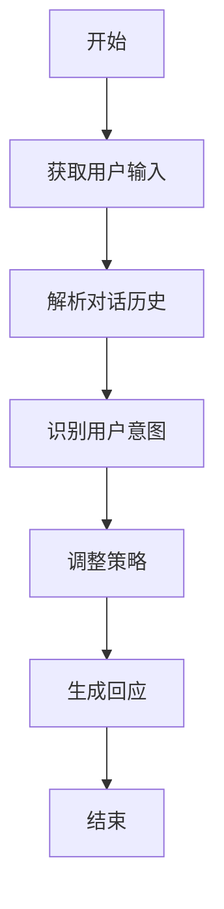
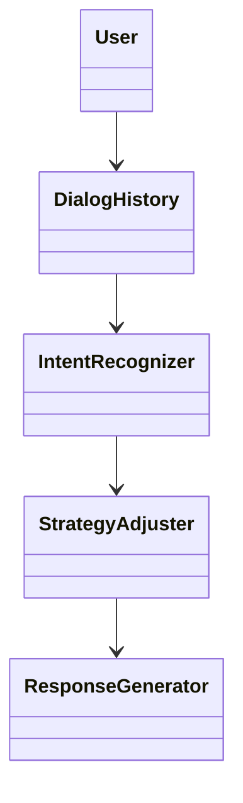
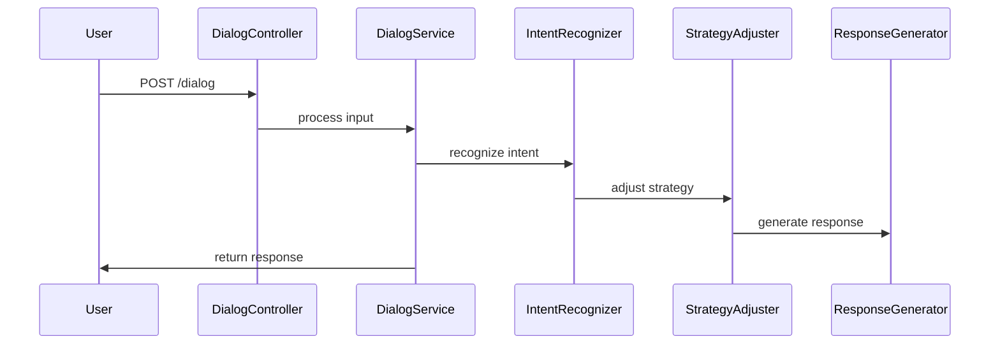

                 


# 自适应对话策略：提升AI Agent的交互质量

关键词：AI Agent，自适应对话策略，交互质量，自然语言处理，机器学习

摘要：本文详细探讨了自适应对话策略在提升AI Agent交互质量中的应用。通过分析对话系统的发展历程、当前挑战及解决方案，阐述了自适应对话策略的核心原理、算法实现及系统架构设计。结合实际案例，展示了如何通过环境安装、核心代码实现及案例分析来提升AI Agent的交互能力，并总结了最佳实践和未来发展方向。

---

# 第一部分: 自适应对话策略概述

## 第1章: 自适应对话策略的背景与概念

### 1.1 问题背景

#### 1.1.1 对话系统的发展历程
对话系统从简单的关键词匹配发展到基于深度学习的模型，经历了规则驱动、统计学习到端到端模型的演变。

#### 1.1.2 当前对话系统的主要挑战
- 用户意图理解不准确
- 对话上下文依赖性强
- 策略固定，缺乏灵活性

#### 1.1.3 自适应对话策略的提出动机
为了应对上述挑战，提升对话系统的交互质量，提出了自适应对话策略。

### 1.2 问题描述

#### 1.2.1 对话策略的核心问题
如何根据对话上下文动态调整回应策略。

#### 1.2.2 自适应对话策略的目标
实现对话过程中的实时调整，提升用户体验。

#### 1.2.3 与传统对话策略的区别
传统策略基于预设规则，而自适应策略动态调整。

### 1.3 解决方案概述

#### 1.3.1 自适应对话策略的基本思路
通过实时分析对话历史和用户反馈，动态调整回应策略。

#### 1.3.2 实现自适应对话的核心要素
- 上下文解析
- 用户意图识别
- 策略调整机制

### 1.4 边界与外延

#### 1.4.1 自适应对话策略的适用范围
适用于需要灵活应对用户需求的场景，如智能客服、语音助手。

#### 1.4.2 相关概念的边界划分
明确自适应策略与传统策略的区别。

#### 1.4.3 与其他对话策略的对比
通过对比分析，突出自适应策略的优势。

### 1.5 概念结构与核心要素

#### 1.5.1 对话策略的基本框架
包括输入、处理、输出三个环节。

#### 1.5.2 自适应对话策略的核心要素
- 对话上下文
- 用户意图
- 策略调整

#### 1.5.3 概念结构图
使用mermaid绘制的概念结构图。

---

# 第二部分: 自适应对话策略的核心概念与联系

## 第2章: 自适应对话策略的原理与机制

### 2.1 核心概念原理

#### 2.1.1 对话上下文的动态分析
通过分析对话历史和当前输入，提取关键信息。

#### 2.1.2 用户意图的实时识别
利用NLP技术，识别用户的显式和隐式意图。

#### 2.1.3 策略调整的触发条件
根据对话进展和用户反馈，动态调整策略。

### 2.2 概念属性特征对比

#### 2.2.1 对比表格: 自适应对话策略与固定对话策略的特征对比
| 特征维度 | 自适应策略 | 固定策略 |
|----------|------------|----------|
| 灵活性    | 高          | 低        |
| 对话上下文依赖 | 高          | 低        |

#### 2.2.2 关键属性的定义与作用
- 上下文解析：确保策略调整的准确性。
- 用户意图识别：提升回应的相关性。

### 2.3 ER实体关系图

#### 2.3.1 使用 mermaid 绘制 ER 实体关系图
```mermaid
erd
  节点 User
  节点 DialogHistory
  节点 Intent
  节点 StrategyAdjustment
  User --> DialogHistory
  DialogHistory --> Intent
  Intent --> StrategyAdjustment
```

---

# 第三部分: 自适应对话策略的算法原理

## 第3章: 算法原理与实现

### 3.1 算法原理概述

#### 3.1.1 自适应对话策略的核心算法
基于上下文的意图识别和策略调整。

#### 3.1.2 算法的输入与输出
输入：对话历史、当前输入；输出：调整后的回应策略。

#### 3.1.3 算法的数学模型
使用条件概率模型，公式如下：
$$P(strategy | context)$$

### 3.2 算法流程图

#### 3.2.1 使用 mermaid 绘制算法流程图


### 3.3 核心代码实现

#### 3.3.1 Python源代码
```python
def adaptive_dialog_strategy(context, input):
    # 解析对话历史
    parsed_context = parse_context(context)
    # 识别用户意图
    intent = recognize_intent(input, parsed_context)
    # 调整策略
    adjusted_strategy = adjust_strategy(parsed_context, intent)
    # 生成回应
    response = generate_response(adjusted_strategy)
    return response
```

#### 3.3.2 代码解读
- `parse_context`：解析对话历史，提取关键信息。
- `recognize_intent`：基于上下文识别用户意图。
- `adjust_strategy`：根据意图调整对话策略。
- `generate_response`：生成回应内容。

---

# 第四部分: 系统分析与架构设计

## 第4章: 系统分析与架构设计

### 4.1 问题场景介绍

#### 4.1.1 系统介绍
设计一个基于自适应对话策略的智能客服系统。

### 4.2 系统功能设计

#### 4.2.1 领域模型类图


### 4.3 系统架构设计

#### 4.3.1 系统架构图
```mermaid
containerDiagram
    container WebService
        class DialogController
        class DialogService
    container Database
        class DialogHistoryDB
    container NLPService
        class IntentRecognizer
```

### 4.4 系统接口设计

#### 4.4.1 接口描述
- `POST /dialog`：接收用户输入，返回回应。
- `GET /history`：获取对话历史。

### 4.5 系统交互序列图

#### 4.5.1 使用 mermaid 绘制交互序列图


---

# 第五部分: 项目实战

## 第5章: 项目实战

### 5.1 环境安装

#### 5.1.1 安装依赖
```bash
pip install python-magic==0.4.10
pip install spacy
```

### 5.2 核心代码实现

#### 5.2.1 对话控制器实现
```python
from flask import Flask, request, jsonify

app = Flask(__name__)

@app.route('/dialog', methods=['POST'])
def handle_dialog():
    data = request.json
    context = data.get('context', [])
    input = data.get('input', '')
    response = adaptive_dialog_strategy(context, input)
    return jsonify({'response': response})
```

#### 5.2.2 对话服务实现
```python
def parse_context(context):
    # 实现对话历史解析逻辑
    pass

def recognize_intent(input, context):
    # 使用spaCy进行意图识别
    pass
```

### 5.3 代码解读与分析

#### 5.3.1 关键代码解读
- `parse_context`：解析对话历史，提取关键词。
- `recognize_intent`：使用spaCy模型识别意图。

### 5.4 案例分析

#### 5.4.1 实际案例分析
用户输入：“我需要帮助。”
系统解析对话历史为空，识别意图后调整策略，生成回应。

### 5.5 项目小结

#### 5.5.1 实践总结
通过实战，验证了自适应对话策略的有效性。

---

# 第六部分: 最佳实践与总结

## 第6章: 最佳实践

### 6.1 小结

#### 6.1.1 核心内容回顾
自适应对话策略通过动态调整提升交互质量。

### 6.2 注意事项

#### 6.2.1 实际应用中的注意事项
- 数据隐私保护
- 系统性能优化
- 用户反馈收集

### 6.3 拓展阅读

#### 6.3.1 推荐阅读
- 《深度学习》
- 《自然语言处理实战》

---

# 作者：AI天才研究院 & 禅与计算机程序设计艺术

