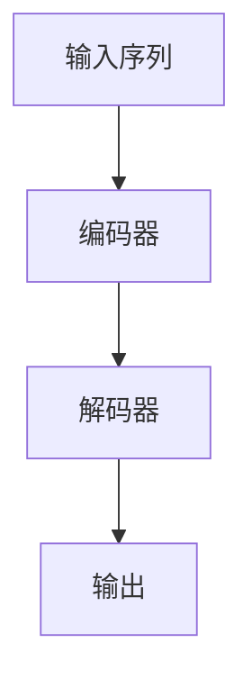
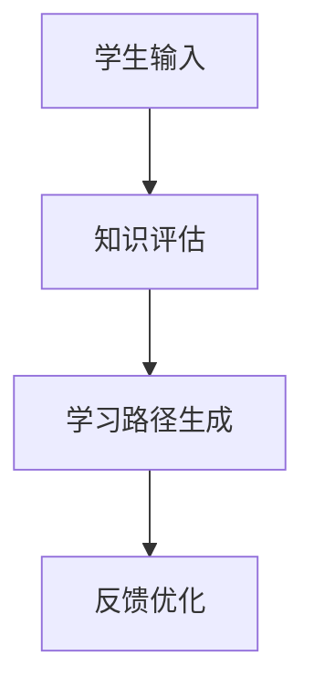
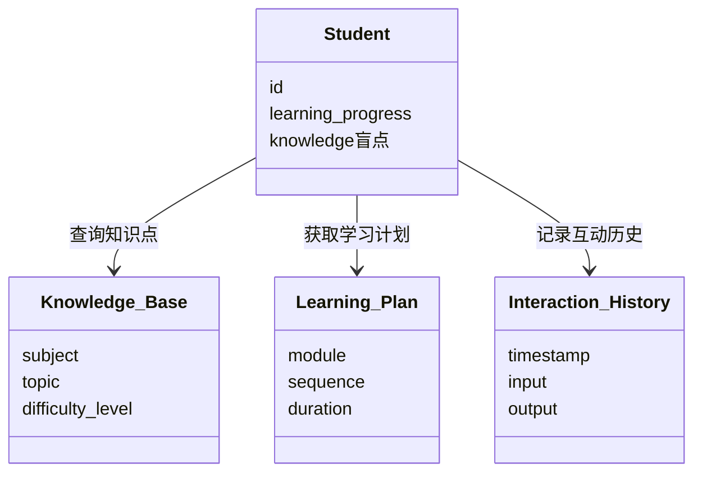

                 


# 自适应教育AI Agent：个性化LLM辅助学习系统

## 关键词：自适应教育、AI Agent、LLM、个性化学习、自然语言处理、机器学习、系统架构

## 摘要：自适应教育AI Agent是一种基于大规模语言模型（LLM）的个性化学习辅助系统，通过自然语言处理和机器学习技术，为学生提供智能化、个性化的学习支持。本文将从背景、概念、算法原理、系统架构、项目实现等多维度深入剖析自适应教育AI Agent的核心技术与实现方法，探讨其在教育领域的应用潜力与挑战。

---

# 第一部分: 自适应教育AI Agent背景与概念

## 第1章: 自适应教育AI Agent概述

### 1.1 问题背景与目标

#### 1.1.1 传统教育技术的局限性
传统教育技术（如固定课程表、标准化测试）难以满足学生的个性化学习需求，存在以下问题：
- **一刀切的教育模式**：无法针对不同学生的知识水平和学习风格提供差异化教学。
- **缺乏实时反馈**：学生在学习过程中遇到的问题无法及时得到解答和指导。
- **资源利用效率低**：教师难以兼顾所有学生的个体需求。

#### 1.1.2 个性化学习的需求
随着教育目标的多样化和学生个体差异的显著性，个性化学习的需求日益增长：
- **因材施教**：根据学生的能力、兴趣和学习风格提供定制化教学方案。
- **实时互动**：通过实时反馈和动态调整学习计划，提高学习效率。
- **数据驱动**：利用大数据分析学生的学习行为和知识掌握情况，优化教学策略。

#### 1.1.3 自适应教育AI Agent的解决方法
自适应教育AI Agent通过结合自然语言处理（NLP）、机器学习（ML）和知识图谱技术，为学生提供智能化、个性化的学习支持，实现以下目标：
- **智能化知识推荐**：根据学生的学习进度和知识盲点，推荐相关学习内容。
- **实时互动反馈**：通过对话式交互，为学生提供即时解答和学习建议。
- **动态调整学习路径**：基于学习数据优化学习计划，帮助学生高效达成学习目标。

#### 1.1.4 系统边界与外延
- **系统功能边界**：自适应教育AI Agent专注于提供个性化学习支持，不涉及教学内容的创作和课程设计。
- **系统外延**：未来可能扩展至跨学科学习、虚拟现实教学、情感计算等领域。
- **核心要素**：包括学生数据模型、知识图谱、对话系统和学习策略优化模块。

## 第2章: 自适应教育AI Agent的核心概念与联系

### 2.1 核心概念原理

#### 2.1.1 自适应学习的基本原理
自适应学习的核心在于通过动态调整学习内容和策略，满足学生的个性化需求。其基本原理包括：
- **知识评估**：通过测试和分析学生的学习数据，识别知识盲点。
- **学习路径生成**：基于知识盲点生成个性化学习计划。
- **反馈优化**：根据学习效果实时调整学习策略。

#### 2.1.2 AI Agent的核心机制
AI Agent通过感知环境、决策和行动来实现目标。其核心机制包括：
- **感知**：通过自然语言处理技术理解学生的需求和反馈。
- **决策**：基于学习数据和知识图谱生成最优学习建议。
- **行动**：通过对话系统与学生互动，提供实时支持。

#### 2.1.3 LLM在自适应教育中的应用
大规模语言模型（LLM）在自适应教育中的应用主要体现在：
- **自然语言理解**：通过LLM理解学生的提问和反馈。
- **内容生成**：生成个性化学习材料和建议。
- **上下文记忆**：通过LLM的记忆能力保持对话的连贯性。

### 2.2 核心概念属性对比表

| 概念         | 属性           | 描述                                                                 |
|--------------|----------------|----------------------------------------------------------------------|
| 自适应教育AI Agent | 个性化学习    | 根据学生特点调整教学策略                                           |
| LLM           | 自然语言处理   | 理解与生成自然语言                                                 |
| AI Agent      | 自主决策       | 根据反馈优化行为                                                     |

### 2.3 ER实体关系图

```mermaid
er
actor: 学生
agent: 自适应教育AI Agent
knowledge_base: 知识库
interaction: 交互记录
goal: 学习目标
```

---

## 第3章: 自适应教育AI Agent的算法原理

### 3.1 LLM的基本原理

#### 3.1.1 模型结构
大规模语言模型通常采用Transformer架构，包括编码器和解码器两部分：
- **编码器**：将输入序列转换为上下文向量。
- **解码器**：根据编码器输出生成目标序列。

#### 3.1.2 训练方法
基于自注意力机制的训练方法，通过以下步骤优化模型：
1. **输入序列**：将输入文本转换为嵌入向量。
2. **自注意力计算**：计算每个词与其他词的相关性权重。
3. **前向传播**：通过多层感知机生成最终输出。

#### 3.1.3 推理机制
通过解码器生成目标序列，具体步骤如下：
1. **初始化**：输入起始符或前一个词。
2. **自注意力计算**：计算当前词的自注意力权重。
3. **生成下一个词**：基于自注意力结果生成下一个词。

### 3.2 注意力机制



### 3.3 自适应学习算法



### 3.4 算法实现代码

```python
def adaptive_learning_algorithm(student_input):
    # 知识评估
    knowledge Assessment = assess_knowledge(student_input)
    # 学习路径生成
    learning_path = generate_learning_path(knowledge_assessment)
    # 反馈优化
    optimized_feedback = optimize_feedback(learning_path)
    return optimized_feedback
```

---

## 第4章: 系统分析与架构设计

### 4.1 项目背景与目标

#### 4.1.1 项目背景
随着在线教育的普及，个性化学习需求日益增长。传统教育技术难以满足学生多样化的学习需求，亟需引入AI技术优化学习体验。

#### 4.1.2 项目目标
- **实现个性化学习支持**：通过AI Agent为学生提供定制化学习建议。
- **提升学习效率**：基于学习数据动态优化学习路径。
- **降低教育成本**：通过自动化学习支持减少人力资源投入。

### 4.2 系统功能设计

#### 4.2.1 领域模型


#### 4.2.2 系统架构


#### 4.2.3 接口设计
- **API接口**：
  - `/api/students`：管理学生信息。
  - `/api/knowledge`：查询知识点。
  - `/api/plans`：生成学习计划。
- **交互流程**：
  1. 学生提交学习需求。
  2. 系统评估知识盲点。
  3. 生成个性化学习计划。
  4. 提供实时反馈与建议。

### 4.3 本章小结

---

## 第5章: 项目实战

### 5.1 环境安装与配置

#### 5.1.1 环境要求
- **Python**：3.8+
- **框架**：TensorFlow/PyTorch
- **依赖库**：numpy, pandas, scikit-learn

#### 5.1.2 安装命令
```bash
pip install numpy pandas scikit-learn transformers
```

### 5.2 核心代码实现

#### 5.2.1 知识评估模块
```python
def assess_knowledge(student_input):
    # 使用预训练模型评估知识掌握情况
    model = load_model('knowledge_assessment_model')
    return model.predict(student_input)
```

#### 5.2.2 学习路径生成模块
```python
def generate_learning_path(knowledge_assessment):
    # 基于知识盲点生成学习路径
    return [module1, module2, module3]
```

#### 5.2.3 反馈优化模块
```python
def optimize_feedback(feedback):
    # 根据学习效果优化反馈
    return optimized_feedback
```

### 5.3 代码解读与分析

#### 5.3.1 知识评估模块
- 使用预训练模型对学生输入进行评估，生成知识掌握情况的向量表示。

#### 5.3.2 学习路径生成模块
- 根据知识评估结果生成个性化学习路径，包括学习模块和学习顺序。

#### 5.3.3 反馈优化模块
- 根据学习效果动态调整反馈内容，优化学习体验。

### 5.4 案例分析与实际应用

#### 5.4.1 案例分析
- **案例背景**：一名高中学生在数学方面存在知识盲点。
- **系统应用**：
  1. 系统评估学生的知识盲点。
  2. 生成针对性的学习计划。
  3. 提供实时反馈与建议。

#### 5.4.2 实际应用
- 系统在K-12教育、职业教育和终身学习等领域具有广泛的应用潜力。

### 5.5 本章小结

---

## 第6章: 最佳实践与总结

### 6.1 小结
自适应教育AI Agent通过结合LLM和机器学习技术，为学生提供智能化、个性化的学习支持。本文从背景、概念、算法、架构和实现等多维度深入剖析了系统的实现方法。

### 6.2 注意事项
- **数据隐私**：确保学生数据的安全与隐私。
- **模型可解释性**：提高AI决策的透明度和可解释性。
- **用户体验**：优化人机交互设计，提升用户体验。

### 6.3 拓展阅读
- 推荐阅读《Deep Learning》（Ian Goodfellow）、《自然语言处理实战》（哈士奇）等书籍，深入了解相关技术细节。

---

## 作者：AI天才研究院/AI Genius Institute & 禅与计算机程序设计艺术/Zen And The Art of Computer Programming

---

以上是文章的完整目录和部分内容框架，希望对您有所帮助！如果需要进一步扩展或调整，请随时告知。

