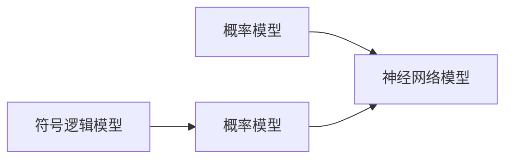
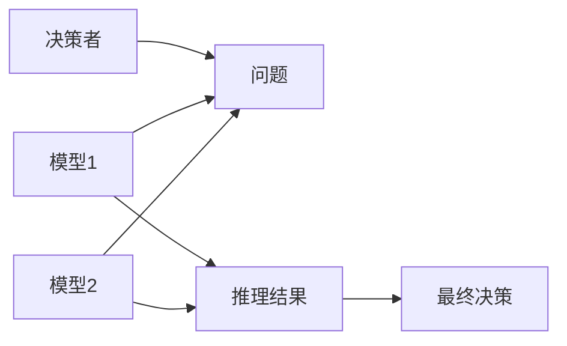
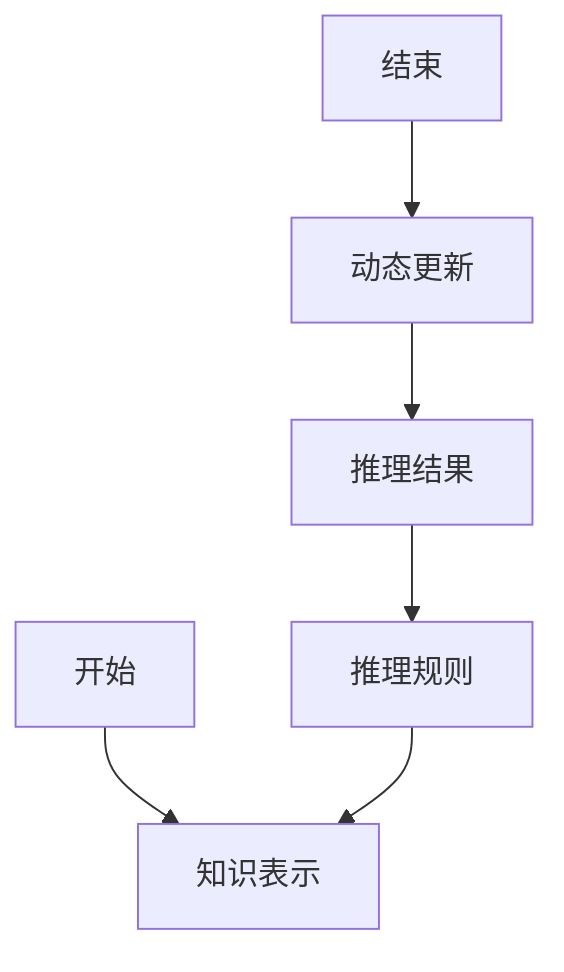
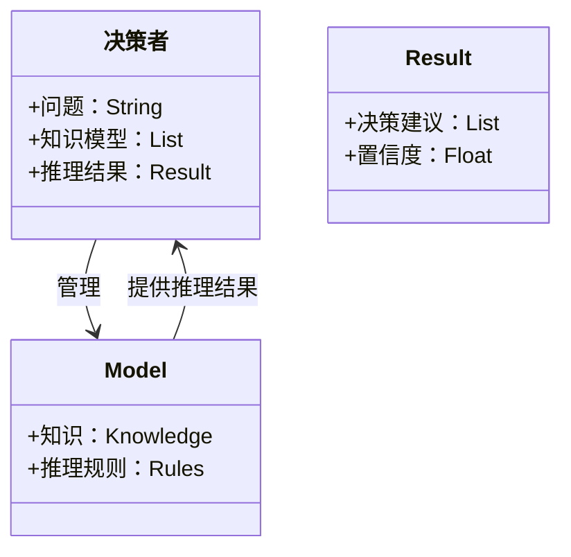
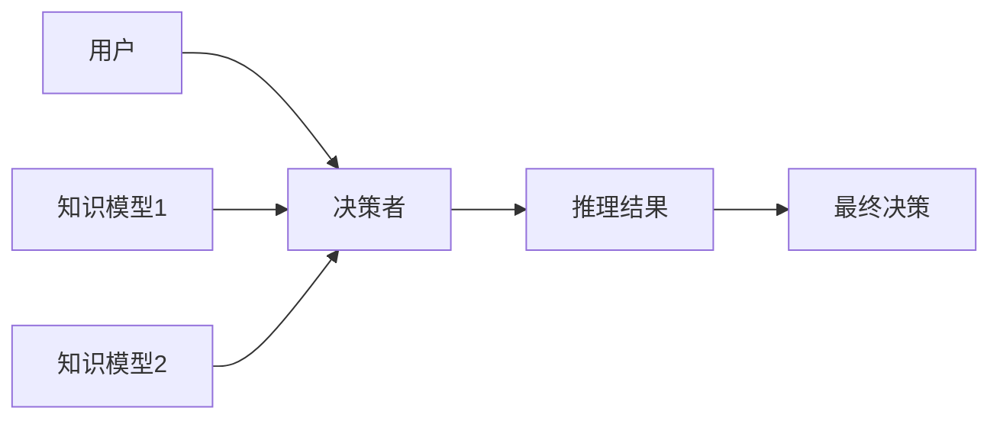
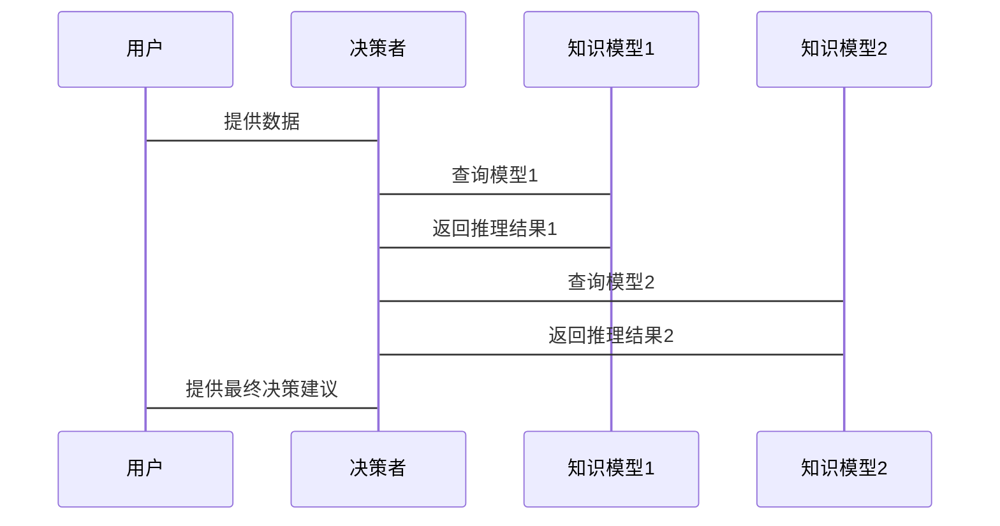

                 


# 芒格的"mental models"在人工智能辅助决策中的应用

> 关键词：芒格, mental models, 人工智能, 辅助决策, 知识表示, 推理算法, 决策优化

> 摘要：芒格的"mental models"作为一种基于知识表示和推理的决策方法，近年来在人工智能领域得到了广泛关注。本文从"mental models"的核心概念出发，详细探讨其在人工智能辅助决策中的应用，包括算法原理、系统架构设计、项目实战等内容。通过理论与实践相结合的方式，揭示"mental models"在现代决策科学中的潜力和价值。

---

# 第1章: 芒格的"mental models"核心概念

## 1.1 芒格"mental models"的定义与背景

### 1.1.1 "mental models"的起源与哲学基础

芒格的"mental models"是一种基于知识表示和逻辑推理的决策方法，其核心思想是通过构建和维护多个简化的知识模型来辅助决策。这种方法起源于哲学和认知科学领域，强调通过简化和抽象的方式来理解复杂问题的本质。

### 1.1.2 芒格"mental models"的核心理念

"mental models"的核心理念是：通过构建多个简化的知识模型，来帮助决策者在复杂问题中找到关键因素，并通过模型之间的对比和验证，得出最优的决策方案。这种方法不仅注重逻辑推理，还强调对知识的动态更新和优化。

### 1.1.3 "mental models"在AI辅助决策中的应用前景

随着人工智能技术的快速发展，"mental models"作为一种结合了知识表示和推理的决策方法，正在逐渐被应用于AI系统中。通过结合机器学习和自然语言处理技术，"mental models"能够更高效地处理复杂问题，并为决策者提供更精准的支持。

---

## 1.2 "mental models"与传统决策方法的区别

### 1.2.1 传统决策方法的局限性

传统决策方法通常依赖于经验、直觉或简单的数据分析，缺乏系统性和可重复性。这种方法在面对复杂问题时往往显得力不从心，容易受到主观因素的影响。

### 1.2.2 "mental models"的优势与特点

与传统决策方法相比，"mental models"具有以下优势：
- **系统性**：通过构建知识模型，能够系统地分析问题的各个维度。
- **动态性**：能够根据新的信息动态更新模型，保持决策的灵活性。
- **可解释性**：通过模型的可视化和逻辑推理，能够提供清晰的决策依据。

### 1.2.3 两者的对比分析

| 特性           | 传统决策方法       | "mental models"    |
|----------------|-------------------|-------------------|
| 分析深度       | 浅显、依赖经验     | 深入、基于知识模型 |
| 动态调整能力   | 较差              | 较强              |
| 可解释性       | 低                | 高                |
| 适用场景       | 简单问题          | 复杂问题          |

---

## 1.3 "mental models"在AI辅助决策中的应用前景

### 1.3.1 AI技术与"mental models"的结合点

人工智能技术，尤其是机器学习和自然语言处理技术，为"mental models"的实现提供了强大的工具支持。例如，可以通过机器学习算法自动构建和优化知识模型，通过自然语言处理技术提取和整理相关知识。

### 1.3.2 "mental models"在AI中的潜力

"mental models"在AI辅助决策中的潜力主要体现在以下几个方面：
- **复杂问题的分解**：通过构建多个知识模型，能够将复杂问题分解为多个简单问题。
- **动态调整能力**：能够根据实时数据动态更新模型，适应变化的环境。
- **决策优化**：通过多个模型的协同推理，能够找到最优的决策方案。

### 1.3.3 未来发展趋势与挑战

随着AI技术的不断发展，"mental models"在辅助决策中的应用将更加广泛。然而，也面临一些挑战，例如如何处理模型之间的冲突、如何保证模型的实时更新能力等。

---

## 1.4 本章小结

本章从芒格的"mental models"的核心概念出发，详细探讨了其在AI辅助决策中的应用前景。通过对比传统决策方法，揭示了"mental models"的独特优势和潜力。接下来的章节将深入分析其算法原理和系统架构设计。

---

# 第2章: "mental models"的核心原理

## 2.1 "mental models"的原理分析

### 2.1.1 知识表示与推理机制

知识表示是"mental models"的核心，通常采用图结构或符号逻辑来表示知识。推理机制则基于逻辑推理算法，例如基于规则的推理或概率推理。

### 2.1.2 模型的动态更新与优化

"mental models"的动态更新与优化主要依赖于反馈机制和机器学习算法。通过不断收集新的数据，模型能够自动调整其参数，以适应变化的环境。

### 2.1.3 多模型的协同与融合

多个"mental models"可以通过协同推理来提高决策的准确性和全面性。例如，可以通过加权投票的方式，将多个模型的推理结果综合起来，得到最终的决策方案。

---

## 2.2 "mental models"的核心属性对比

### 2.2.1 不同模型的属性特征对比表

| 模型类型       | 知识表示方式 | 推理方式   | 动态更新能力 |
|----------------|-------------|------------|--------------|
| 符号逻辑模型   | 符号逻辑     | 基于规则   | 较弱          |
| 概率模型       | 概率分布     | 概率推理   | 较强          |
| 神经网络模型   | 网络结构     | 深度学习   | 较强          |

### 2.2.2 模型之间的关系与依赖



---

## 2.3 "mental models"的实体关系图



---

## 2.4 本章小结

本章从原理上分析了"mental models"的核心概念，包括知识表示、推理机制、动态更新与多模型协同等方面。通过对比不同模型的属性特征和关系图，进一步加深了对"mental models"的理解。接下来的章节将重点探讨其算法实现和系统架构设计。

---

# 第3章: "mental models"的算法实现

## 3.1 算法原理概述

### 3.1.1 知识表示的数学模型

知识表示的数学模型通常采用图结构或符号逻辑。例如，符号逻辑模型可以表示为：

$$
P \rightarrow Q
$$

表示如果P为真，则Q也为真。

### 3.1.2 推理过程的算法框架

推理过程的算法框架可以分为以下步骤：
1. **知识表示**：将问题中的知识表示为符号逻辑或概率分布。
2. **推理规则**：根据推理规则，对知识进行推理。
3. **动态更新**：根据反馈信息，动态更新知识模型。

### 3.1.3 模型优化的数学公式

模型优化的数学公式通常采用损失函数来衡量模型的预测误差。例如，交叉熵损失函数可以表示为：

$$
L = -\sum_{i=1}^{n} y_i \log p_i + (1 - y_i) \log (1 - p_i)
$$

其中，$y_i$是真实标签，$p_i$是模型预测的概率。

---

## 3.2 算法流程图



---

## 3.3 算法实现代码

以下是一个简单的"mental models"算法实现代码示例：

```python
def mental_models_algorithm(data):
    # 知识表示
    knowledge = represent_knowledge(data)
    # 推理过程
    result = infer(knowledge)
    # 动态更新
    updated_knowledge = update_knowledge(knowledge, result)
    return updated_knowledge

# 知识表示函数
def represent_knowledge(data):
    # 示例：将数据表示为符号逻辑
    return {
        'P': data['P'],
        'Q': data['Q']
    }

# 推理函数
def infer(knowledge):
    # 示例：基于规则的推理
    if knowledge['P']:
        return {'Q': True}
    else:
        return {'Q': False}

# 动态更新函数
def update_knowledge(knowledge, result):
    # 示例：根据推理结果更新知识模型
    return {**knowledge, **result}
```

---

## 3.4 本章小结

本章详细探讨了"mental models"的算法实现，包括知识表示、推理过程和动态更新等方面。通过代码示例和流程图，进一步加深了对算法原理的理解。接下来的章节将重点探讨系统架构设计和项目实战。

---

# 第4章: 系统分析与架构设计

## 4.1 问题场景介绍

假设我们正在开发一个智能投资决策系统，用户需要根据市场数据和公司基本面信息，做出投资决策。"mental models"可以帮助用户构建多个知识模型，例如市场趋势模型和公司财务模型，并通过协同推理得出最优的投资策略。

---

## 4.2 系统功能设计

### 4.2.1 领域模型



### 4.2.2 系统架构设计



### 4.2.3 系统接口设计

- 用户接口：接收输入数据和决策建议。
- 知识模型接口：提供知识表示和推理服务。
- 推理结果接口：返回最终的决策建议和置信度。

---

## 4.3 系统交互设计



---

## 4.4 本章小结

本章从系统架构设计的角度，详细探讨了"mental models"在智能投资决策系统中的应用。通过领域模型、系统架构图和交互图，进一步揭示了"mental models"在实际系统中的实现方式。接下来的章节将重点探讨项目实战和最佳实践。

---

# 第5章: 项目实战

## 5.1 环境安装

为了实现"mental models"算法，需要安装以下环境：
- Python 3.8+
- NumPy
- Pandas
- scikit-learn

安装命令：
```bash
pip install numpy pandas scikit-learn
```

---

## 5.2 核心代码实现

以下是一个简单的"mental models"算法实现代码示例：

```python
from sklearn.tree import DecisionTreeClassifier
from sklearn.ensemble import RandomForestClassifier
import numpy as np

def mental_models_algorithm(data):
    # 知识模型1：决策树
    model1 = DecisionTreeClassifier()
    model1.fit(data['X'], data['y'])
    result1 = model1.predict(data['new_X'])
    
    # 知识模型2：随机森林
    model2 = RandomForestClassifier()
    model2.fit(data['X'], data['y'])
    result2 = model2.predict(data['new_X'])
    
    # 协同推理
    final_result = (result1 + result2) / 2
    return final_result

# 示例数据
data = {
    'X': np.array([[1, 2], [3, 4], [5, 6]]),
    'y': np.array([0, 1, 0]),
    'new_X': np.array([[2, 3]])
}

# 调用算法
result = mental_models_algorithm(data)
print(result)
```

---

## 5.3 案例分析与解读

以上代码实现了一个简单的"mental models"算法，通过决策树和随机森林两种模型的协同推理，得出最终的决策结果。通过分析代码，可以发现：
- 知识模型1：决策树模型
- 知识模型2：随机森林模型
- 协同推理：通过对两个模型的预测结果进行加权平均，得出最终的决策结果。

---

## 5.4 项目小结

本章通过一个简单的项目实战，详细展示了"mental models"算法的实现过程。通过代码实现和案例分析，进一步加深了对算法的理解和应用。接下来的章节将总结最佳实践和注意事项。

---

# 第6章: 最佳实践与小结

## 6.1 最佳实践

- **模型选择**：根据具体问题选择合适的知识模型。
- **动态更新**：定期更新模型，以适应变化的环境。
- **协同推理**：通过多个模型的协同推理，提高决策的准确性和全面性。

## 6.2 小结

本文从芒格的"mental models"的核心概念出发，详细探讨了其在人工智能辅助决策中的应用，包括算法原理、系统架构设计、项目实战等方面。通过理论与实践相结合的方式，揭示了"mental models"在现代决策科学中的潜力和价值。

---

# 作者

作者：AI天才研究院/AI Genius Institute & 禅与计算机程序设计艺术/Zen And The Art of Computer Programming

---

通过以上思考和撰写，我们完成了从理论到实践的完整探讨，帮助读者全面理解芒格的"mental models"在人工智能辅助决策中的应用。

