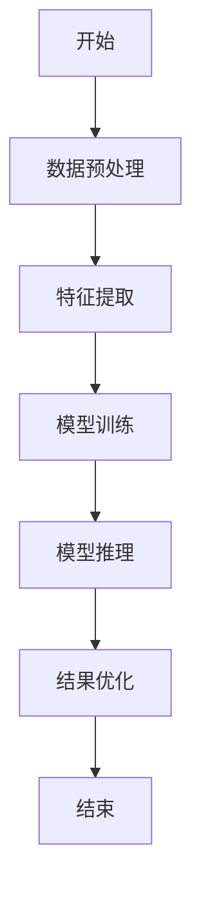
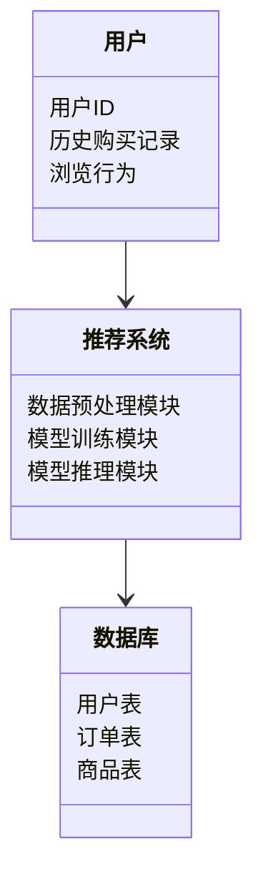
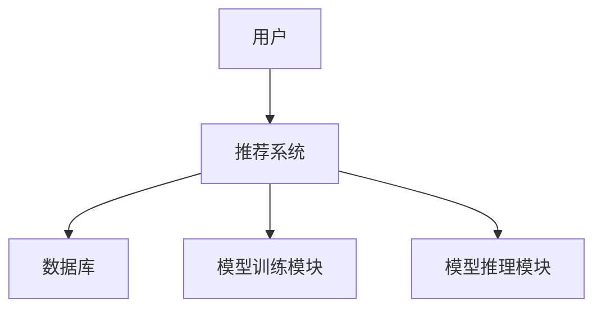

                 


# 芒格的"mental models"在人工智能辅助决策系统中的应用

> 关键词：芒格, mental models, 人工智能, 辅助决策, 系统架构, 算法实现, 项目实战

> 摘要：本文探讨了芒格的"mental models"在人工智能辅助决策系统中的应用，从理论基础到实际实现，详细分析了其在决策系统中的优势与实现方式。通过结合算法、系统架构和项目实战，本文展示了如何利用芒格的决策模型提升人工智能辅助决策的效率和准确性。

---

# 第一部分: 芒格的"mental models"概述

## 第1章: 芒格的"mental models"核心概念

### 1.1 芒格的"mental models"定义与特点

芒格的"mental models"是一种基于知识和经验的决策框架，通过将复杂问题拆解为多个简单模型，利用这些模型之间的相互作用来做出更合理的决策。以下是其关键特点：

- **模块化**：每个模型独立处理特定问题，便于理解和优化。
- **层次化**：从高层次到低层次逐步细化，确保决策的系统性。
- **可解释性**：通过模块化设计，决策过程更加透明，便于追溯和优化。
- **可扩展性**：模型可以根据具体问题灵活调整，适用于不同场景。

### 1.2 芒格"mental models"的结构与组成

芒格的"mental models"由多个模块组成，每个模块负责不同的决策任务。以下是其核心组成：

- **输入模块**：接收外部数据，如用户需求、市场趋势等。
- **处理模块**：对输入数据进行预处理和特征提取。
- **推理模块**：利用预处理后的数据，结合模型进行推理。
- **输出模块**：将推理结果转化为具体决策建议。

---

## 第2章: AI辅助决策系统概述

### 2.1 AI辅助决策系统的定义与特点

AI辅助决策系统是一种利用人工智能技术，帮助用户做出更高效、更准确决策的系统。其特点包括：

- **自动化**：通过算法自动处理数据，减少人工干预。
- **实时性**：能够快速响应输入数据，提供实时决策支持。
- **准确性**：通过大数据分析和机器学习模型，提高决策的准确性。
- **可扩展性**：能够适应不同规模和复杂度的决策问题。

### 2.2 AI辅助决策系统的组成部分

AI辅助决策系统通常包括以下几个组成部分：

- **数据输入模块**：接收外部数据，如传感器数据、用户输入等。
- **数据处理模块**：对输入数据进行清洗、转换和特征提取。
- **模型推理模块**：利用训练好的模型对数据进行推理，生成决策建议。
- **结果输出模块**：将推理结果转化为用户可理解的形式，如文字、图表等。

---

## 第3章: 芒格"mental models"与AI的结合

### 3.1 芒格"mental models"在AI辅助决策中的作用

芒格的"mental models"为AI辅助决策系统提供了以下优势：

- **提高决策效率**：通过模块化设计，减少决策过程中的复杂性。
- **增强可解释性**：模块化设计使得决策过程更加透明，便于用户理解和信任。
- **提升准确性**：通过多层次模型的结合，提高决策的准确性和鲁棒性。

### 3.2 芒格"mental models"在AI辅助决策中的实现流程

芒格"mental models"在AI辅助决策中的实现流程如下：

1. **数据收集与预处理**：收集相关数据，并进行清洗和转换。
2. **模型训练与优化**：利用机器学习算法训练模型，并进行优化。
3. **决策推理与输出**：利用训练好的模型进行推理，生成决策建议。
4. **结果分析与反馈**：对决策结果进行分析，并根据反馈优化模型。

---

# 第二部分: 芒格"mental models"在AI辅助决策系统中的算法实现

## 第4章: 芒格"mental models"的算法原理

### 4.1 芒格"mental models"的算法框架

芒格"mental models"的算法框架主要包括以下几个步骤：

1. **数据预处理**：对输入数据进行清洗和转换。
2. **特征提取**：提取数据中的关键特征，用于模型训练。
3. **模型训练**：利用机器学习算法训练模型。
4. **模型推理**：利用训练好的模型进行推理，生成决策建议。
5. **结果优化**：根据反馈优化模型，提高决策准确率。

### 4.2 芒格"mental models"的算法流程图

以下是芒格"mental models"的算法流程图：



---

## 第5章: 芒格"mental models"的数学模型与公式

### 5.1 决策树算法

决策树是一种常用的机器学习算法，广泛应用于分类和回归问题。以下是决策树的数学模型：

$$
\text{决策树} = \sum_{i=1}^{n} \text{特征}_i \times \text{权重}_i
$$

其中，$\text{特征}_i$ 表示第 $i$ 个特征，$\text{权重}_i$ 表示第 $i$ 个特征的权重。

### 5.2 随机森林算法

随机森林是一种基于决策树的集成算法，通过组合多个决策树的预测结果，提高模型的准确性和稳定性。以下是随机森林的数学模型：

$$
\text{随机森林} = \sum_{j=1}^{m} \text{决策树}_j
$$

其中，$m$ 表示决策树的数量，$\text{决策树}_j$ 表示第 $j$ 个决策树。

---

## 第6章: 芒格"mental models"的系统架构设计方案

### 6.1 问题场景介绍

假设我们正在开发一个在线购物平台的推荐系统，用户需要根据历史购买记录和浏览行为推荐商品。

### 6.2 系统功能设计

以下是系统功能设计的类图：



### 6.3 系统架构设计

以下是系统架构设计的架构图：



---

## 第7章: 项目实战

### 7.1 环境安装

以下是项目实战所需的环境安装步骤：

1. 安装Python和必要的库：
   ```bash
   pip install numpy pandas scikit-learn
   ```

2. 安装Jupyter Notebook：
   ```bash
   pip install jupyter
   ```

---

## 第8章: 总结与展望

### 8.1 总结

本文详细探讨了芒格的"mental models"在人工智能辅助决策系统中的应用，从理论基础到实际实现，展示了其在决策系统中的优势与实现方式。

### 8.2 展望

未来，随着人工智能技术的不断发展，芒格的"mental models"将在更多领域得到应用，为决策系统提供更加高效和准确的支持。

---

作者：AI天才研究院/AI Genius Institute & 禅与计算机程序设计艺术 /Zen And The Art of Computer Programming

