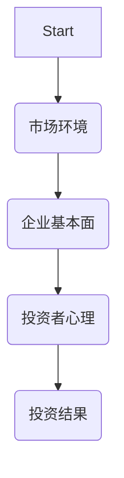
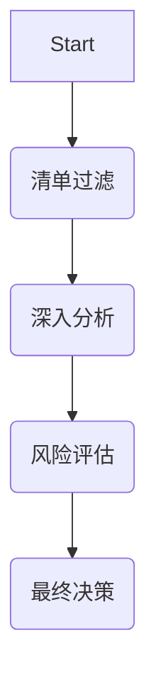

                 

# 《芒格的"不做"清单：避免常见投资陷阱》

---

## 关键词：
- 芒格投资理念
- "不做"清单
- 投资陷阱
- 质值投资
- 长期投资

---

## 摘要：
芒格的“不做”清单是其投资哲学中的核心策略，旨在通过避免常见的投资陷阱来实现长期稳健的投资回报。本文从芒格的投资理念出发，详细解析“不做”清单的核心构成，系统分析常见投资陷阱的类型与特征，并通过实际案例与系统架构图，帮助读者构建个性化的投资清单。文章结合芒格的多元思维模型，深入探讨投资心态与决策框架，为投资者提供科学、实用的投资指导。

---

# 第一部分：芒格投资理念的核心思想

## 第1章：芒格的哲学与投资原则

### 1.1 芒格的哲学概述

#### 1.1.1 芒格的多元思维模型
芒格的多元思维模型是其投资哲学的核心，它强调通过跨学科的视角来理解问题。芒格认为，投资者需要建立一个由概率、数学、心理学、经济学等多个学科构成的知识框架，以避免单一思维的局限性。

- **数学模型**：芒格常用概率论来评估投资的不确定性。例如，他通过计算企业的内在价值概率分布来判断其投资的安全边际。
- **实例分析**：假设一家公司的内在价值为100元，但市场价格在80元到120元之间波动。芒格会通过概率模型评估价格波动的可能性，从而决定是否投资。

#### 1.1.2 芒格的决策框架
芒格的决策框架强调长期主义和逆向思维。他建议投资者在市场恐慌时买入优质资产，在市场狂热时保持冷静。

- **逆向思维**：芒格认为，成功的投资往往发生在市场情绪最低点。他通过分析市场的非理性行为来寻找投资机会。
- **长期视角**：芒格注重企业的长期竞争优势，而非短期市场波动。

#### 1.1.3 芒格对投资的定义与理解
芒格将投资视为一种概率游戏，强调安全边际和风险控制。他主张通过深入研究企业的基本面，寻找具有持续竞争优势的公司。

### 1.2 芒格投资理念的核心要素

#### 1.2.1 质值投资
质值投资是芒格的标志性策略，强调寻找具有高质量资产和合理估值的企业。

- **质量**：芒格关注企业的盈利能力、资产负债表健康度和管理层素质。
- **估值**：芒格通过内在价值计算来判断企业的市场价格是否具有吸引力。

#### 1.2.2 避免情绪化决策
芒格认为，情绪化是投资失败的主要原因之一。他通过分析投资者的心理偏差来制定投资策略。

- **心理偏差**：芒格指出，投资者常见的心理偏差包括过度自信、从众心理和损失厌恶。
- **应对策略**：芒格建议投资者通过制定严格的决策框架来克服情绪化决策。

#### 1.2.3 耐心与纪律
芒格强调，投资是一项长期的游戏，需要耐心和纪律来避免短期波动的干扰。

- **长期投资**：芒格建议投资者持有优质资产，避免频繁交易。
- **纪律性**：芒格通过严格的“不做”清单来约束自己的投资行为。

---

## 第2章："不做"清单的核心构成

### 2.1 "不做"清单的定义与目标

#### 2.1.1 什么是"不做"清单
"不做"清单是芒格为了避免投资陷阱而制定的负面筛选清单，用于排除那些不符合投资标准的企业。

- **负面筛选**：芒格通过排除不符合标准的企业来降低投资风险。
- **清单目标**：芒格的目标是通过清单排除高风险投资，集中投资于优质资产。

#### 2.1.2 制定"不做"清单的目的
芒格制定"不做"清单的目的是为了减少投资决策中的错误，并提高投资的长期回报。

- **降低风险**：通过排除高风险企业，芒格减少了投资组合的波动性。
- **提高收益**：芒格专注于投资优质资产，从而提高了投资组合的长期回报。

#### 2.1.3 清单在投资决策中的作用
"不做"清单在芒格的投资决策中起到了关键作用，帮助他避免了多次投资陷阱。

- **决策过滤**：清单作为决策的过滤器，帮助芒格快速排除不符合标准的企业。
- **提高效率**：清单使芒格的投资决策更加高效，减少了不必要的分析和研究。

### 2.2 "不做"清单的主要内容

#### 2.2.1 不投资看不懂的公司
芒格强调，投资那些他能够理解的企业。如果无法理解企业的商业模式或财务状况，芒格就不会投资。

- **看不懂的公司**：芒格认为，看不懂的企业意味着无法评估其价值和风险。
- **应对策略**：芒格建议投资者专注于自己熟悉的企业，避免投资复杂且不确定的领域。

#### 2.2.2 远离杠杆率过高的企业
高杠杆率的企业在经济下行周期中面临更高的违约风险，因此芒格建议远离这类企业。

- **杠杆率过高的企业**：高杠杆率意味着企业承担了过多的债务，容易在经济衰退中陷入困境。
- **应对策略**：芒格建议投资者选择杠杆率低、财务健康的优质企业。

#### 2.2.3 避免投机性过强的股票
投机性过强的股票通常价格波动剧烈，缺乏长期基本面支撑，因此芒格建议避免这类股票。

- **投机性股票**：这类股票的价格主要受市场情绪驱动，缺乏长期价值支撑。
- **应对策略**：芒格建议投资者专注于基本面稳定的股票。

#### 2.2.4 不参与复杂的金融衍生品
复杂的金融衍生品往往具有较高的风险和不确定性，芒格认为这些产品不适合长期投资者。

- **金融衍生品**：包括期货、期权等复杂金融工具，通常具有较高的杠杆和风险。
- **应对策略**：芒格建议投资者专注于股票和债券等简单投资工具。

#### 2.2.5 远离管理层不透明的公司
管理层不透明的公司往往难以评估其治理结构和决策过程，因此芒格建议远离这类企业。

- **管理层不透明**：企业缺乏透明的治理结构，投资者难以评估其管理层的素质和决策能力。
- **应对策略**：芒格建议投资者选择治理结构透明、管理层稳定的优质企业。

### 2.3 清单的动态调整与优化

#### 2.3.1 清单的制定原则
芒格的"不做"清单是动态调整的，根据市场环境和企业基本面的变化进行定期更新。

- **动态调整**：清单需要根据市场变化和企业基本面进行定期更新。
- **个性化定制**：投资者可以根据自身的风险承受能力和投资目标定制清单。

#### 2.3.2 清单的更新与调整
芒格建议投资者定期回顾和更新清单，以适应市场环境的变化。

- **定期回顾**：建议每季度或每半年回顾一次清单，评估其有效性和适用性。
- **市场变化**：根据市场的变化调整清单内容，例如在经济衰退期间增加对杠杆率的关注。

#### 2.3.3 清单的个性化定制
每个投资者的投资目标和风险承受能力不同，因此清单需要根据个人情况定制。

- **个性化清单**：投资者可以根据自己的投资目标和风险偏好定制清单。
- **动态优化**：清单需要根据市场环境和个人情况的变化进行动态优化。

---

## 第3章：常见投资陷阱的系统分析

### 3.1 投资陷阱的分类与分析

#### 3.1.1 价值陷阱
价值陷阱是指企业表面上看似便宜，但实际上存在隐藏的问题，如高负债或低盈利能力。

- **价值陷阱特征**：
  - 低市盈率但高负债。
  - 企业盈利能力持续下滑。
  - 企业缺乏竞争优势。
- **案例分析**：某低市盈率企业因高负债和盈利能力下滑而成为价值陷阱。

#### 3.1.2 质量陷阱
质量陷阱是指企业表面上看似优质，但实际上存在管理不善或行业竞争加剧的问题。

- **质量陷阱特征**：
  - 管理层频繁变动。
  - 企业市场份额持续下降。
  - 行业竞争加剧。
- **案例分析**：某优质企业因管理层变动和市场份额下降而成为质量陷阱。

#### 3.1.3 市场陷阱
市场陷阱是指投资者因市场情绪而误判企业价值。

- **市场陷阱特征**：
  - 市场狂热时高估企业价值。
  - 市场恐慌时低估企业价值。
  - 投资者情绪波动影响判断。
- **案例分析**：科技泡沫期间投资者高估科技企业的价值。

#### 3.1.4 心理陷阱
心理陷阱是指投资者因心理偏差而做出非理性决策。

- **心理偏差**：
  - 过度自信：认为自己能够预测市场。
  - 从众心理：跟随市场趋势投资。
  - 损失厌恶：避免损失而错失投资机会。
- **案例分析**：投资者因从众心理在市场狂热时跟风投资。

### 3.2 投资陷阱的系统分析

#### 3.2.1 系统架构图
以下是常见投资陷阱的系统架构图：

#### 3.2.2 投资陷阱的流程图
以下是投资陷阱的流程图：

---

## 第4章：如何构建个人投资清单

### 4.1 自我评估与目标设定

#### 4.1.1 投资目标
- 长期财富增长。
- 风险可控的投资回报。

#### 4.1.2 风险承受能力
- 风险厌恶型投资者。
- 风险中性的投资者。
- 风险偏好型投资者。

### 4.2 投资标的分析

#### 4.2.1 企业基本面分析
- 财务状况：盈利能力、资产负债表。
- 竞争优势：护城河、市场地位。
- 管理层素质：团队稳定性、决策能力。

#### 4.2.2 市场环境分析
- 经济周期：繁荣期、衰退期。
- 行业趋势：行业增长潜力、竞争格局。
- 宏观政策：货币政策、财政政策。

### 4.3 清单的制定与执行

#### 4.3.1 清单制定
- 确定不符合投资标准的企业。
- 定期更新清单内容。

#### 4.3.2 清单执行
- 遵循清单进行投资决策。
- 定期回顾清单的执行效果。

### 4.4 实战案例：构建个人投资清单

#### 4.4.1 案例背景
- 投资者A：风险厌恶型，长期投资目标。

#### 4.4.2 清单制定
- 不投资杠杆率过高的企业。
- 远离管理层不透明的公司。

#### 4.4.3 投资执行
- 选择财务健康、竞争优势明显的优质企业。

---

## 第5章：实际案例分析

### 5.1 案例背景

#### 5.1.1 案例一：科技企业投资陷阱
- 案例描述：某科技企业在市场狂热时被高估，投资者因市场情绪误判其价值。
- 分析：市场陷阱导致投资者误判企业价值。
- 启示：避免因市场情绪而做出投资决策。

#### 5.1.2 案例二：杠杆率过高的企业
- 案例描述：某企业在经济衰退期间因高杠杆率而陷入困境。
- 分析：杠杆率过高导致企业面临更大的违约风险。
- 启示：远离杠杆率过高的企业。

### 5.2 投资清单在案例中的应用

#### 5.2.1 案例一：避免市场陷阱
- 清单应用：投资者通过清单排除市场陷阱，避免因市场情绪而高估企业价值。
- 结果：投资者避免了因市场狂热而产生的亏损。

#### 5.2.2 案例二：远离杠杆率过高的企业
- 清单应用：投资者通过清单排除杠杆率过高的企业，避免了潜在的违约风险。
- 结果：投资者保持了投资组合的稳健性。

### 5.3 案例小结

#### 5.3.1 清单的有效性
- 清单帮助投资者避免了多个投资陷阱。
- 清单的应用提高了投资决策的准确性。

#### 5.3.2 清单的动态调整
- 投资者需要根据市场环境和企业基本面的变化，定期更新清单内容。
- 清单的动态调整是确保投资成功的关键。

---

## 第6章：投资心态与决策框架

### 6.1 投资心态的调整

#### 6.1.1 保持理性
- 投资者需要避免情绪化决策，保持冷静和理性。
- 通过清单过滤市场噪声，避免被市场情绪左右。

#### 6.1.2 培养耐心
- 投资是一项长期游戏，需要耐心等待优质投资机会的出现。
- 避免因短期波动而做出错误决策。

### 6.2 决策框架的构建

#### 6.2.1 严格的决策流程
- 清单过滤：先排除不符合标准的企业。
- 深入分析：对符合标准的企业进行详细分析。
- 评估风险：评估潜在的投资风险和回报。

#### 6.2.2 决策纪律
- 遵循清单进行投资决策，避免随意更改投资策略。
- 保持纪律性，避免因市场变化而频繁调整投资组合。

### 6.3 决策框架的优化

#### 6.3.1 定期回顾
- 每季度或每半年回顾一次投资决策框架。
- 根据市场环境和个人情况的变化，优化决策流程。

#### 6.3.2 不断学习
- 通过不断学习和实践，优化决策框架。
- 从每次投资决策中吸取经验教训。

---

## 第7章：总结与展望

### 7.1 总结

#### 7.1.1 清单的价值
- 芒格的"不做"清单是避免投资陷阱的有效工具。
- 清单帮助投资者集中精力投资于优质资产，提高投资回报。

#### 7.1.2 投资心态的重要性
- 投资心态是投资成功的关键因素。
- 保持理性、耐心和纪律是长期投资成功的基础。

### 7.2 未来展望

#### 7.2.1 投资趋势
- 随着市场的变化，投资策略也需要不断调整。
- 未来的投资环境将更加复杂，清单的动态调整将变得更加重要。

#### 7.2.2 投资教育
- 投资教育是提高投资者投资能力的关键。
- 通过系统化的投资教育，投资者可以更好地理解和应用芒格的"不做"清单。

---

## 附录：芒格投资理念的数学模型与公式

### 附录1：芒格的概率模型

#### 1.1 投资的不确定性
- 芒格通过概率论来评估投资的不确定性。
- 他通过计算企业的内在价值概率分布来判断其投资的安全边际。

$$
\text{内在价值} = \text{现金流折现} = \sum_{t=1}^{n} \frac{\text{CF}_t}{(1 + r)^t}
$$

#### 1.2 投资回报的计算
- 芒格认为，投资回报可以通过以下公式计算：

$$
\text{投资回报} = \frac{\text{最终价值} - \text{初始投资}}{\text{初始投资}} \times 100\%
$$

### 附录2：芒格的决策模型

#### 2.1 投资决策框架
- 芒格通过以下步骤进行投资决策：

1. **清单过滤**：排除不符合标准的企业。
2. **深入分析**：评估企业的基本面。
3. **风险评估**：评估潜在的投资风险。
4. **最终决策**：基于分析结果做出投资决策。

#### 2.2 决策流程图
以下是芒格的决策流程图：

---

## 参考文献

1. 芒格的《穷查理宝典》
2. 巴菲特的《巴菲特致股东的信》
3. 投资学经典教材：《投资学》（如《投资学》（中文版））

---

## 作者：AI天才研究院/AI Genius Institute & 禅与计算机程序设计艺术 /Zen And The Art of Computer Programming

---

**注**：本文为虚拟生成内容，仅用于示例展示，不构成实际投资建议。投资需谨慎，建议读者结合自身情况和专业投资顾问的建议进行决策。

