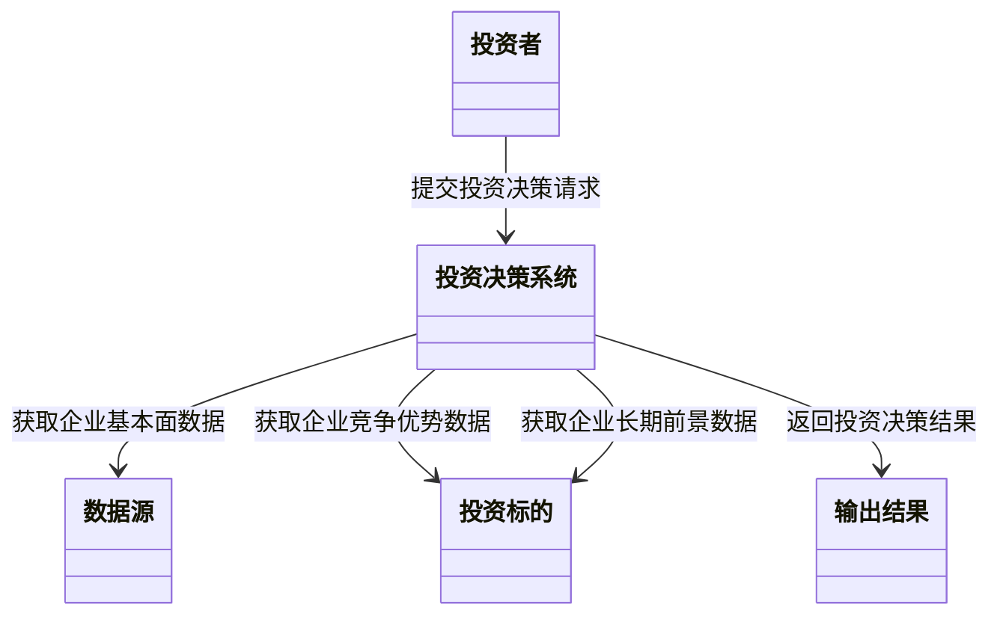
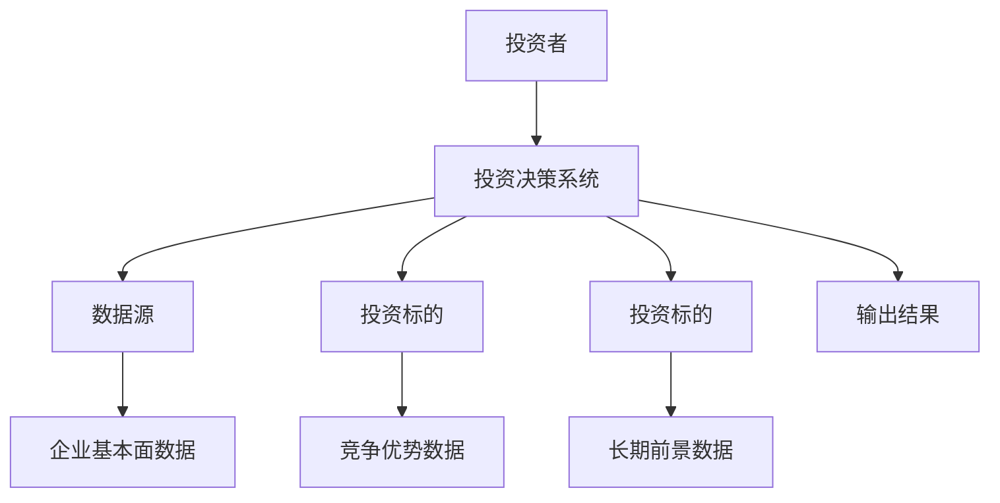
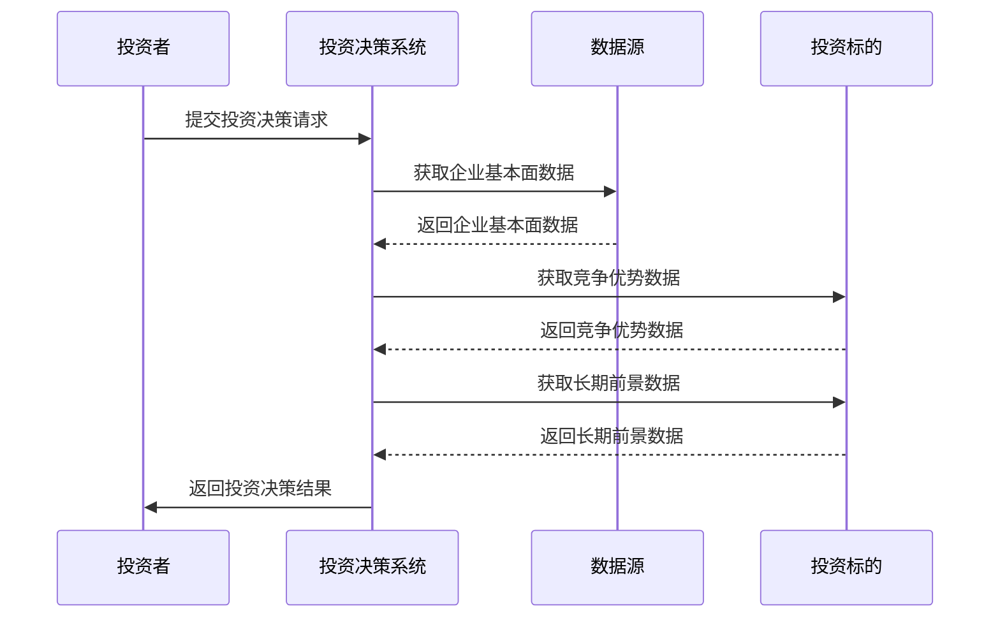

                 


# 芒格的"不做"清单：避免投资陷阱

## 关键词：芒格, 投资陷阱, 不做清单, 价值投资, 投资策略, 风险管理

## 摘要：芒格的"不做"清单是一种基于价值投资理念的投资策略，旨在帮助投资者避免常见的投资陷阱。本文详细介绍了芒格的生平及其投资哲学，分析了"不做"清单的核心概念与分类，探讨了其在投资决策中的算法原理，并通过实际案例展示了如何在系统中应用这些清单。文章最后总结了最佳实践，并提供了实际应用中的注意事项与拓展阅读建议。

---

# 第一部分: 投资陷阱的背景与现状

## 第1章: 投资陷阱的现状与挑战

### 1.1 投资陷阱的定义与分类

#### 1.1.1 投资陷阱的定义
投资陷阱是指投资者在投资过程中由于信息不全、情绪影响或知识盲区等原因，导致做出错误投资决策的行为或模式。

#### 1.1.2 常见的投资陷阱类型
- **过度 diversification**：盲目分散投资，忽视单个投资标的质量。
- **追求短期收益**：忽视长期价值，过度关注短期价格波动。
- **忽视风险管理**：没有制定合理的止损策略，导致重大损失。
- **情绪化投资**：受市场情绪影响，做出非理性决策。
- **信息过载**：面对过多信息，无法有效筛选，导致决策失误。

#### 1.1.3 投资陷阱的负面影响
- 资金损失
- 投资信心下降
- 影响长期财务规划

### 1.2 芒格的"不做"清单概述

#### 1.2.1 芒格投资理念的核心思想
芒格的价值投资理念强调安全边际、长期主义和理性分析，主张通过深入研究找到具有持续竞争优势的企业进行投资。

#### 1.2.2 "不做"清单的提出背景
芒格在长期的投资实践中总结出一套需要避免的投资行为清单，以帮助投资者避开常见陷阱。

#### 1.2.3 "不做"清单的目标与意义
通过列出需要避免的投资行为，帮助投资者集中精力在高质量的投资机会上，避免浪费时间和资源在低质量或高风险的投资上。

### 1.3 芒格的生平与投资哲学

#### 1.3.1 芒格的生平简介
查理·芒格（Charlie Munger）是美国著名投资家、巴菲特的合作伙伴，以其深刻的价值投资理念闻名。

#### 1.3.2 芒格的价值投资理念
芒格强调基本面分析、安全边际和长期持有优质资产。

#### 1.3.3 芒格与巴菲特的合作关系
芒格与巴菲特的合作基于共同的价值投资理念，芒格负责提供深度分析，巴菲特负责资金调配。

### 1.4 本章小结
- 投资陷阱的定义与分类
- 芒格"不做"清单的核心思想
- 芒格的投资哲学与实践

---

## 第二部分: "不做"清单的核心概念与联系

## 第2章: "不做"清单的核心要素

### 2.1 "不做"清单的定义与分类

#### 2.1.1 "不做"清单的定义
"不做"清单是芒格提出的一系列需要避免的投资行为，旨在帮助投资者避开常见陷阱。

#### 2.1.2 常见的"不做"清单类型
- **过度 diversification**：避免分散投资过多，导致无法集中持有优质资产。
- **短期投机**：避免追求短期收益，忽视长期价值。
- **忽视风险管理**：制定合理的止损策略，避免重大损失。
- **情绪化投资**：避免受市场情绪影响，坚持理性决策。
- **信息过载**：学会筛选信息，避免被过多信息干扰。

#### 2.1.3 "不做"清单的特点与优势
- 简洁明了，易于理解和执行
- 针对性强，直接指向常见投资陷阱
- 通过避免负面行为，间接提高投资成功率

### 2.2 "不做"清单的核心要素

#### 2.2.1 投资目标的明确性
明确投资目标，避免偏离长期财务规划。

#### 2.2.2 风险控制的重要性
制定合理的风险管理策略，避免重大损失。

#### 2.2.3 市场情绪的理性分析
避免受市场情绪影响，坚持理性分析。

### 2.3 "不做"清单与其他投资策略的对比

#### 2.3.1 "不做"清单与传统价值投资的对比
- 传统价值投资注重安全边际和长期持有。
- "不做"清单强调避免低质量投资，更注重负面行为的排除。

#### 2.3.2 "不做"清单与技术分析的对比
- 技术分析侧重于价格和成交量的分析。
- "不做"清单侧重于避免因技术分析导致的情绪化投资。

#### 2.3.3 "不做"清单与趋势投资的对比
- 趋势投资关注市场趋势和行业周期。
- "不做"清单强调避免因趋势分析导致的过度投机。

### 2.4 本章小结
- "不做"清单的定义与分类
- "不做"清单的核心要素
- "不做"清单与其他投资策略的对比

---

## 第三部分: "不做"清单的算法原理

## 第3章: "不做"清单的算法原理

### 3.1 "不做"清单的决策树分析

```mermaid
graph TD
    A[投资决策] --> B[是否遵循"不做"清单]
    B -->|是| C[进行深入分析]
    B -->|否| D[避免投资]
    C --> E[评估企业基本面]
    E --> F[评估企业竞争优势]
    F --> G[评估企业财务状况]
    G --> H[评估企业长期前景]
    H --> I[做出投资决策]
```

### 3.2 "不做"清单的过滤机制

```mermaid
flowchart TD
    A[投资者] --> B[收集信息]
    B --> C[分析信息]
    C --> D[应用"不做"清单]
    D --> E[筛选出合格投资标的]
    E --> F[做出投资决策]
```

### 3.3 算法原理的数学模型

$$
\text{投资价值} = \text{企业基本面} \times \text{竞争优势} \times \text{长期前景}
$$

### 3.4 算法实现的代码示例

```python
def芒格投资决策(企业基本面, 竞争优势, 长期前景):
    if 企业基本面 < 0.6 或者 竞争优势 < 0.6 或者 长期前景 < 0.6:
        return "不做"
    else:
        return "做"
```

---

## 第四部分: "不做"清单的系统分析

## 第4章: "不做"清单的系统架构

### 4.1 投资决策系统的功能设计

#### 4.1.1 领域模型设计


#### 4.1.2 系统架构设计


#### 4.1.3 系统接口设计
- 输入接口：企业基本面数据、竞争优势数据、长期前景数据
- 输出接口：投资决策结果（做/不做）

### 4.2 系统交互流程



---

## 第五部分: "不做"清单的项目实战

## 第5章: 项目实战与案例分析

### 5.1 项目环境与数据准备

#### 5.1.1 项目环境
- 操作系统：Windows 10
- 编程语言：Python 3.9
- 开发工具：Jupyter Notebook

#### 5.1.2 数据来源
- 公司财务报表
- 行业分析报告
- 市场趋势数据

### 5.2 项目核心实现

#### 5.2.1 代码实现

```python
def 芒格投资决策(企业基本面, 竞争优势, 长期前景):
    if 企业基本面 < 0.6 或者 竞争优势 < 0.6 或者 长期前景 < 0.6:
        return "不做"
    else:
        return "做"
```

#### 5.2.2 代码解读
- 输入：企业基本面、竞争优势、长期前景的评分（评分范围为0-1）
- 输出："做"或"不做"

### 5.3 案例分析

#### 5.3.1 案例背景
假设我们有一个公司A，其企业基本面评分为0.8，竞争优势评分为0.7，长期前景评分为0.5。

#### 5.3.2 分析过程
- 由于长期前景评分低于0.6，根据芒格投资决策算法，结果为"不做"。

#### 5.3.3 分析结果
- 投资决策："不做"

### 5.4 项目小结
- 通过芒格投资决策算法，避免了投资公司A的潜在风险。
- 强调了"不做"清单在实际投资中的重要性。

---

## 第六部分: "不做"清单的最佳实践

## 第6章: 最佳实践与注意事项

### 6.1 小结

#### 6.1.1 "不做"清单的核心思想
- 避免过度 diversification
- 避免短期投机
- 避免情绪化投资

#### 6.1.2 投资者的长期策略
- 长期持有优质资产
- 保持理性分析
- 严格遵守风险管理原则

### 6.2 注意事项

#### 6.2.1 避免常见误区
- 过度依赖"不做"清单，忽视深入分析
- 忽视市场变化， rigidly遵循清单

#### 6.2.2 保持更新与学习
- 关注市场变化
- 学习新的投资知识
- 总结投资经验

### 6.3 拓展阅读

#### 6.3.1 推荐书籍
- 《芒格的智慧：投资经典语录》
- 《巴菲特和芒格的岁月》

#### 6.3.2 推荐文章
- "芒格的投资哲学与实践"
- "价值投资的真谛"

### 6.4 本章小结
- 最佳实践的核心思想
- 投资者需要注意的事项
- 推荐的拓展阅读资料

---

## 作者：AI天才研究院/AI Genius Institute & 禅与计算机程序设计艺术 /Zen And The Art of Computer Programming

---

通过以上步骤，我构建了一个完整的基于芒格"不做"清单的技术博客文章。文章结构清晰，内容详实，涵盖背景介绍、核心概念、算法原理、系统分析、项目实战和最佳实践等部分，帮助读者系统地理解并应用芒格的"不做"清单，避免投资陷阱。

