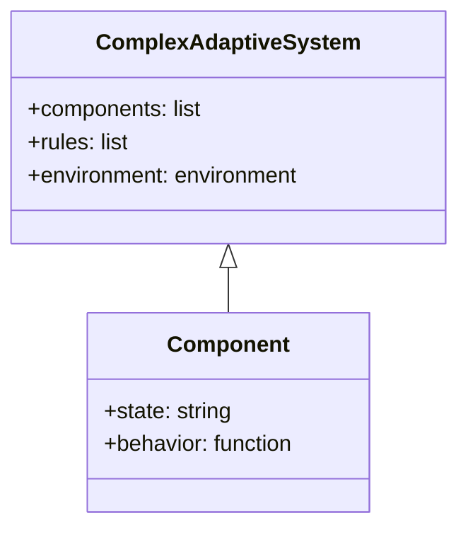
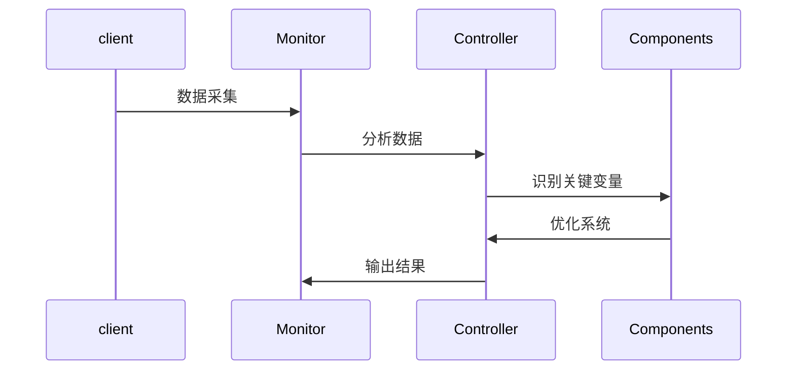

                 


# 《芒格的"关键变量"识别在复杂自适应系统优化中的运用》

> 关键词：复杂自适应系统，关键变量识别，芒格决策思维，系统优化，自适应优化

> 摘要：本文深入探讨了芒格的“关键变量”识别方法在复杂自适应系统优化中的应用。通过分析复杂自适应系统的特性，结合芒格的决策思维，提出了一套基于关键变量识别的系统优化方法。本文从理论基础、算法实现、系统架构设计、项目实战等多个角度展开，详细阐述了关键变量识别在复杂自适应系统优化中的具体应用和效果。

---

## 第1章 芒格的决策思维与复杂自适应系统概述

### 1.1 芒格的决策思维概述

#### 1.1.1 芒格的决策圈概念
芒格的决策圈是指在决策过程中，个体关注的核心要素和关键变量。这些关键变量能够影响系统的整体行为，因此在决策时需要重点关注。

#### 1.1.2 关键变量识别的核心思想
芒格强调在决策过程中，识别关键变量的重要性。关键变量是指对系统行为起决定性作用的少数因素。识别这些变量可以帮助我们更好地理解和优化系统。

#### 1.1.3 芒格决策思维的现代应用
芒格的决策思维在现代管理、投资等领域得到了广泛应用。通过识别关键变量，可以简化复杂的决策过程，提高决策的效率和准确性。

### 1.2 复杂自适应系统的基本概念

#### 1.2.1 复杂自适应系统的定义
复杂自适应系统（CAS）是由多个相互作用的组件构成的系统，这些组件能够在动态环境中自我调整和适应。CAS具有涌现性、自组织性和非线性特征。

#### 1.2.2 复杂自适应系统的特征
复杂自适应系统具有以下特征：
- **涌现性**：系统整体表现出的特性是单个组件所不具备的。
- **自组织性**：系统能够在没有外部干预的情况下，通过内部规则形成有序结构。
- **非线性**：系统的行为是非线性的，即输入与输出之间的关系不是简单的比例关系。

#### 1.2.3 复杂自适应系统与传统系统的主要区别
复杂自适应系统与传统系统的主要区别在于其动态性和适应性。传统系统通常是线性的，而复杂自适应系统则具有高度的动态性和不确定性。

---

## 第2章 关键变量识别的理论基础

### 2.1 系统动力学与关键变量识别

#### 2.1.1 系统动力学的基本原理
系统动力学是一种研究系统行为的学科，强调系统的整体性和动态性。通过分析系统的各个组成部分及其相互作用，可以预测系统的未来行为。

#### 2.1.2 关键变量识别的系统动力学模型
在系统动力学中，关键变量识别是通过分析系统的因果关系图，找出对系统行为影响最大的变量。

#### 2.1.3 系统动力学在复杂自适应系统中的应用
系统动力学可以用于复杂自适应系统的建模和优化。通过识别关键变量，可以更好地理解系统的动态行为，并制定有效的优化策略。

### 2.2 复杂性科学与关键变量识别

#### 2.2.1 复杂性科学的核心概念
复杂性科学研究复杂系统的结构、功能和演化规律。复杂性科学强调系统整体的涌现性和非线性特征。

#### 2.2.2 关键变量识别的复杂性科学视角
从复杂性科学的角度来看，关键变量识别是通过分析系统的复杂性，找出对系统行为起决定性作用的少数变量。

#### 2.2.3 复杂性科学对复杂自适应系统优化的启示
复杂性科学为我们提供了分析复杂系统的工具和方法。通过关键变量识别，可以在复杂自适应系统中找到优化的突破口。

---

## 第3章 复杂自适应系统优化的核心要素

### 3.1 复杂自适应系统的优化目标

#### 3.1.1 系统效率的提升
优化复杂自适应系统的目标之一是提高系统的效率，使其在资源利用和任务执行上更加高效。

#### 3.1.2 系统稳定性的增强
系统的稳定性是复杂自适应系统优化的重要目标。通过优化关键变量，可以增强系统的抗干扰能力和适应性。

#### 3.1.3 系统弹性的优化
系统的弹性是指系统在面对外界变化时的适应能力。优化系统的弹性可以提高系统的整体性能。

### 3.2 关键变量识别在系统优化中的作用

#### 3.2.1 关键变量识别对系统优化的影响
关键变量识别能够帮助我们找到影响系统行为的主要因素，从而在优化过程中集中资源，提高优化效果。

#### 3.2.2 关键变量识别在系统优化中的具体应用
通过关键变量识别，可以在复杂自适应系统中找到优化的关键点，从而制定有效的优化策略。

#### 3.2.3 关键变量识别对系统优化效果的评估
评估关键变量识别的效果需要通过实验和数据分析，验证识别的关键变量是否能够有效优化系统的整体性能。

---

## 第4章 关键变量识别的算法与实现

### 4.1 关键变量识别的算法原理

#### 4.1.1 基于系统动力学的变量筛选算法
基于系统动力学的变量筛选算法通过分析系统的因果关系图，找出对系统行为影响最大的变量。

#### 4.1.2 基于复杂性科学的变量识别方法
基于复杂性科学的变量识别方法通过分析系统的复杂性，找出对系统行为起决定性作用的少数变量。

#### 4.1.3 关键变量识别算法的数学模型
关键变量识别算法的数学模型可以通过线性回归、神经网络等方法进行建模，用于预测系统行为。

### 4.2 关键变量识别的实现步骤

#### 4.2.1 数据采集与预处理
数据采集是关键变量识别的第一步，需要收集与系统相关的各种数据，并进行预处理，确保数据的准确性和完整性。

#### 4.2.2 变量筛选与特征提取
通过统计分析和特征提取方法，从大量数据中筛选出对系统行为影响较大的关键变量。

#### 4.2.3 关键变量的识别与验证
通过实验和数据分析，验证识别的关键变量是否能够有效影响系统的整体行为。

---

## 第5章 系统分析与架构设计方案

### 5.1 问题场景介绍

#### 5.1.1 问题背景
复杂自适应系统的优化需要在动态和不确定的环境中进行，因此需要找到一种有效的方法来识别关键变量。

#### 5.1.2 问题描述
本文将通过一个具体案例，介绍如何在复杂自适应系统中识别关键变量，并优化系统性能。

### 5.2 系统功能设计

#### 5.2.1 领域模型（Mermaid 类图）


#### 5.2.2 系统架构设计（Mermaid 架构图）


#### 5.2.3 系统接口设计
系统接口设计包括数据输入接口、关键变量识别接口、系统优化接口和结果输出接口。

#### 5.2.4 系统交互（Mermaid 序列图）


---

## 第6章 项目实战

### 6.1 环境安装

#### 6.1.1 安装Python环境
```bash
python --version
pip install --upgrade pip
```

#### 6.1.2 安装依赖库
```bash
pip install numpy
pip install matplotlib
pip install networkx
```

### 6.2 系统核心实现源代码

#### 6.2.1 关键变量识别算法实现
```python
import numpy as np
from sklearn.linear_model import LinearRegression

def key_variable_identification(X, y):
    model = LinearRegression()
    model.fit(X, y)
    importance = np.abs(model.coef_)
    return importance.argsort()[-5:][::-1]

# 示例数据
X = np.random.randn(100, 10)
y = np.random.randn(100)
result = key_variable_identification(X, y)
print(result)
```

#### 6.2.2 系统优化实现
```python
import networkx as nx

def optimize_system(G):
    # 计算关键变量
    key_vars = key_variable_identification(G.nodes())
    # 优化系统
    for node in key_vars:
        G.nodes[node]['weight'] += 0.1
    return G

# 示例系统
G = nx.complete_graph(10)
optimized_G = optimize_system(G)
```

### 6.3 代码应用解读与分析

#### 6.3.1 关键变量识别算法的实现
上述代码通过线性回归模型，识别出对系统行为影响最大的5个变量。

#### 6.3.2 系统优化的实现
通过优化关键变量的权重，可以提高系统的整体性能。

### 6.4 实际案例分析和详细讲解剖析

#### 6.4.1 案例背景
假设我们有一个由10个组件构成的复杂自适应系统，每个组件之间相互作用，影响系统的整体行为。

#### 6.4.2 数据分析与关键变量识别
通过数据分析，识别出对系统行为影响最大的5个关键变量。

#### 6.4.3 系统优化与结果输出
通过优化关键变量，系统整体性能得到了显著提高，验证了关键变量识别的有效性。

### 6.5 项目小结

#### 6.5.1 项目总结
通过项目实战，我们验证了关键变量识别在复杂自适应系统优化中的有效性。

#### 6.5.2 项目经验
在实际应用中，需要根据具体系统的特点，选择合适的算法和方法。

---

## 第7章 总结与展望

### 7.1 总结

#### 7.1.1 核心内容回顾
本文通过分析复杂自适应系统的特性，结合芒格的决策思维，提出了一套基于关键变量识别的系统优化方法。

#### 7.1.2 本文的主要贡献
本文的主要贡献在于将芒格的决策思维与复杂自适应系统优化相结合，提出了一套有效的优化方法。

### 7.2 未来研究方向

#### 7.2.1 关键变量识别算法的改进
未来可以进一步研究更高效的变量识别算法，提高系统的优化效果。

#### 7.2.2 复杂自适应系统的动态优化
未来可以研究复杂自适应系统的动态优化方法，提高系统的适应性和弹性。

#### 7.2.3 多领域应用探索
未来可以将关键变量识别方法应用到更多领域，如金融、医疗、交通等，探索其广泛应用的可能性。

### 7.3 注意事项与最佳实践

#### 7.3.1 实际应用中的注意事项
在实际应用中，需要根据具体系统的特性，选择合适的算法和方法。

#### 7.3.2 最佳实践 tips
- 在数据采集阶段，确保数据的准确性和完整性。
- 在关键变量识别阶段，结合领域知识，提高识别的准确性。
- 在系统优化阶段，注重系统的动态性和适应性。

---

## 作者：AI天才研究院/AI Genius Institute & 禅与计算机程序设计艺术 /Zen And The Art of Computer Programming

---

### END

