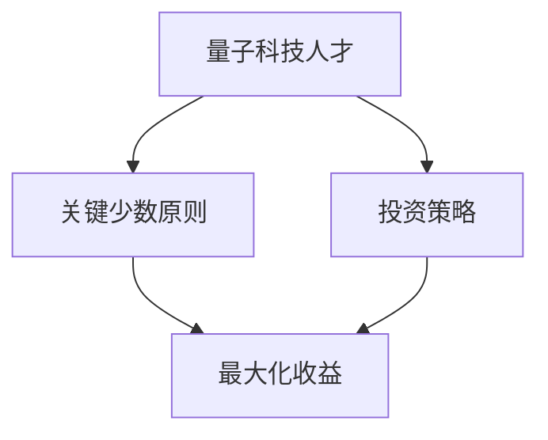

                 


# 芒格的"关键少数"原则在量子科技人才投资中的应用

> 关键词：芒格，关键少数，量子科技，人才投资，算法

> 摘要：本文探讨了如何将芒格的“关键少数”原则应用于量子科技人才投资中，通过分析量子科技的现状、人才筛选的算法、系统架构设计以及项目实战，展示了如何利用这一原则来优化人才投资策略，推动技术发展。

---

## 第一部分：背景介绍

### 第1章：量子科技与人才投资的背景

#### 1.1 量子科技的现状与发展
量子科技是近年来迅速发展的领域，涉及量子计算、量子通信和量子传感等多个方面。这些技术有望在加密、计算和传感器领域带来革命性的变化。然而，量子科技的发展高度依赖于顶尖人才，尤其是物理学家、计算机科学家和工程师。

#### 1.2 芒格的“关键少数”原则
芒格的投资哲学强调关注少数关键因素和人物，认为成功的关键在于找到这些关键因素并进行精准投资。这一原则的核心在于识别那些能够带来最大回报的少数因素，而不是分散投资于众多低潜力的领域。

#### 1.3 结合量子科技与人才投资
在量子科技领域，资源有限，如何高效地投资人才成为关键。芒格的原则提醒我们，应聚焦于那些具有高潜力和影响力的顶尖人才，而不是分散投资于大量普通人才。这不仅能够提高投资效率，还能最大化技术突破的可能性。

---

## 第二部分：核心概念与联系

### 第2章：关键少数原则在量子科技人才中的应用

#### 2.1 核心概念原理
“关键少数”原则在量子科技人才投资中的应用，主要关注那些能够推动技术突破的顶尖人才。这些人才通常具有卓越的学术背景、丰富的项目经验和创新思维。通过识别这些人才，投资者可以集中资源，加速技术发展。

#### 2.2 核心概念属性对比表格
| 属性       | 关键少数原则 | 量子科技人才 |
|------------|--------------|--------------|
| 核心目标   | 最大化收益   | 推动技术发展 |
| 关注点     | 关键人才     | 高潜力人才  |
| 投资策略   | 精准投资     | 重点培养     |

#### 2.3 ER实体关系图


---

## 第三部分：算法原理讲解

### 第3章：基于关键少数原则的人才筛选算法

#### 3.1 算法概述
基于“关键少数”原则，我们设计了一个算法来识别高潜力量子科技人才。该算法通过分析人才的学术成就、项目经历和影响力，筛选出最有可能推动技术进步的人才。

#### 3.2 算法步骤
1. **数据收集**：收集量子科技领域内人才的学术论文、专利、项目经历等数据。
2. **特征提取**：提取关键特征，如论文引用次数、项目影响力、团队合作能力等。
3. **评分模型**：使用机器学习模型对人才进行评分，评分基于特征的加权。
4. **关键人才筛选**：根据评分，筛选出排名靠前的少数人才。

#### 3.3 数学模型
评分公式为：
$$
\text{评分} = \alpha \times \text{论文引用} + \beta \times \text{项目影响力} + \gamma \times \text{团队合作能力}
$$
其中，$\alpha$, $\beta$, $\gamma$是各特征的权重，通常通过训练数据确定。

---

## 第四部分：系统分析与架构设计

### 第4章：系统功能设计

#### 4.1 系统功能模块
- **数据采集模块**：负责收集量子科技人才数据。
- **评分模块**：对人才进行评分。
- **展示模块**：显示评分结果。
- **投资建议模块**：基于评分结果提供投资建议。

#### 4.2 系统架构图


---

## 第五部分：项目实战

### 第5章：项目实战

#### 5.1 环境安装
需要安装Python、Pandas、Scikit-learn等库。

#### 5.2 核心代码实现
```python
import pandas as pd
from sklearn.preprocessing import MinMaxScaler

# 数据预处理
data = pd.read_csv('quantum_talent.csv')
scaler = MinMaxScaler()
scaled_data = scaler.fit_transform(data)

# 评分计算
scores = pd.DataFrame(scaled_data, columns=data.columns)
scores['总评分'] = scores.sum(axis=1)
```

---

## 第六部分：最佳实践

### 第6章：最佳实践

#### 6.1 小结
通过应用芒格的“关键少数”原则，我们可以更有效地投资量子科技人才，集中资源推动技术发展。

#### 6.2 注意事项
- 数据质量对结果影响重大，需确保数据的准确性和完整性。
- 模型需定期更新，以适应技术发展的新趋势。

#### 6.3 拓展阅读
建议阅读芒格的著作，深入了解“关键少数”原则的更多应用。

---

## 结语

通过系统地应用芒格的“关键少数”原则，量子科技人才投资可以更加精准和高效，为技术发展注入强大动力。

---

作者：AI天才研究院 & 禅与计算机程序设计艺术

