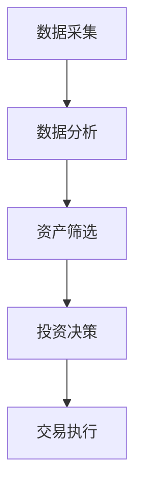
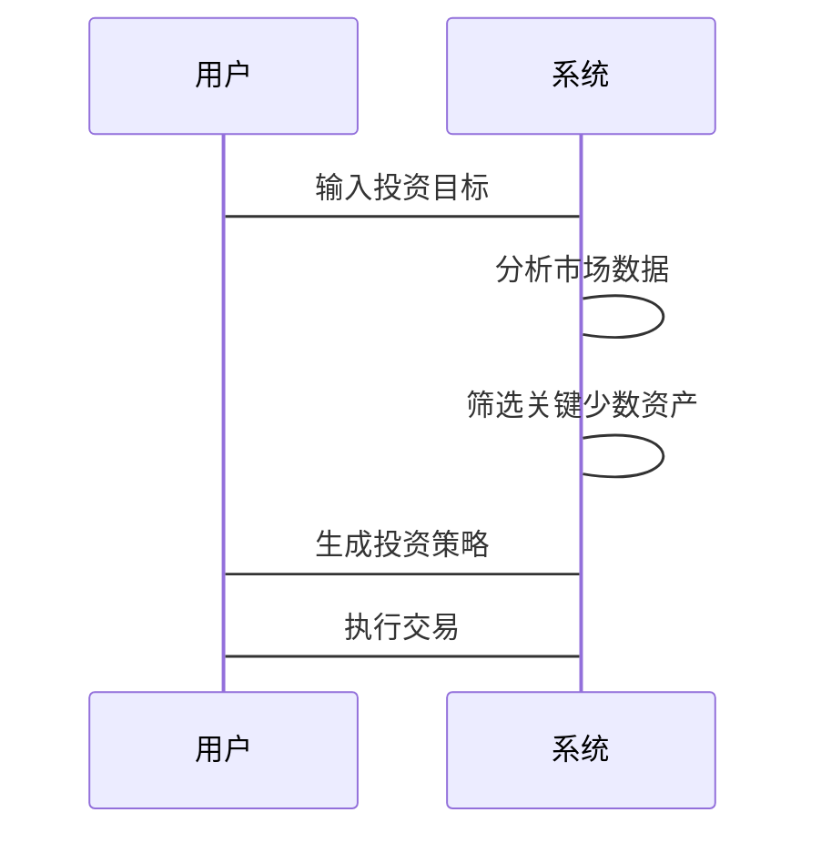

                 


```markdown
# 芒格的"关键少数"原则：集中投资的智慧与风险

## 关键词：芒格，关键少数，集中投资，风险管理，投资策略

## 摘要：芒格的“关键少数”原则是一种集中投资的策略，强调在投资组合中选择少数高质量的资产。本文深入分析了这一原则的理论基础、实际应用、风险管理及心理因素，结合数学模型和案例，探讨其在现代投资中的智慧与潜在风险。

---

## 第一部分：引言

### 第1章：芒格“关键少数”原则的背景与重要性

#### 1.1 投资领域的集中原则

- **1.1.1 什么是“关键少数”原则**
  - “关键少数”原则指出，在投资组合中，少数高质量的资产贡献了大部分价值。
  - 芒格强调集中投资于少数优质企业，而非分散投资。

- **1.1.2 芒格投资理念的核心**
  - 芒格的投资理念基于价值投资，寻找具有持续竞争优势的企业。
  - 集中投资于少数优质资产，而非追求短期收益。

- **1.1.3 集中投资的优缺点分析**
  - 优点：高回报潜力，简化决策过程。
  - 缺点：高风险，市场波动可能导致重大损失。

---

## 第二部分：关键少数原则的理论基础

### 第2章：关键少数原则的数学模型与公式

#### 2.1 关键少数原则的数学模型

- **2.1.1 数学模型的构建**
  - 关键少数比例 = (关键少数的数量 / 总数) × 100%。

- **2.1.2 投资组合优化的数学分析**
  - 期望收益：$$E(r) = \sum w_i E(r_i)$$。
  - 方差：$$Var(r) = \sum w_i^2 Var(r_i) + 2\sum w_i w_j Cov(r_i, r_j)$$。

- **2.1.3 优化算法**
  - 线性规划模型：最大化收益，最小化风险。
  - 蒙特卡洛模拟：评估不同投资组合的风险和回报。

#### 2.2 关键少数原则的优化算法

- **2.2.1 线性规划模型**
  - 目标函数：最大化期望收益。
  - 约束条件：投资比例不超过关键少数比例。

- **2.2.2 蒙特卡洛模拟应用**
  - 通过模拟不同市场情景，评估关键少数投资组合的稳定性。

### 第3章：关键少数原则的历史与发展

#### 3.1 投资理论的演变

- **3.1.1 从马科维茨到芒格的演变**
  - 马科维茨的现代投资组合理论（MPT）强调分散化。
  - 芒格的“关键少数”原则是对MPT的集中化应用。

- **3.1.2 芒格投资理念的形成**
  - 芒格深受巴菲特影响，注重长期价值。
  - 通过集中投资，减少交易成本，提高收益。

### 第4章：关键少数原则与其他投资策略的对比

#### 4.1 多元化投资策略

- **4.1.1 多元化投资的优缺点**
  - 优点：降低风险，平滑收益。
  - 缺点：稀释收益，增加管理复杂性。

- **4.1.2 关键少数与多元化投资的对比分析**
  - 关键少数：高风险，高回报。
  - 多元化：低风险，稳定回报。

#### 4.2 集中投资策略

- **4.2.1 集中投资的定义与特点**
  - 集中投资于少数资产，追求高收益。

- **4.2.2 关键少数原则与集中投资的关系**
  - 关键少数是集中投资的一种策略，注重选择优质资产。

---

## 第三部分：关键少数原则的实际应用

### 第5章：关键少数原则在投资中的应用

#### 5.1 关键少数原则的应用步骤

- **5.1.1 确定投资目标**
  - 明确投资目的，是追求高收益还是稳定回报。

- **5.1.2 选择关键少数资产**
  - 筛选具有持续竞争优势的企业，评估其财务状况和市场前景。

- **5.1.3 构建投资组合**
  - 将资金集中投向选定的关键少数资产，定期调整组合。

#### 5.2 关键少数原则的具体案例

- **5.2.1 芒格的经典投资案例分析**
  - 投资于比亚迪：长期持有，获得高回报。

- **5.2.2 实际投资中的关键少数选择**
  - 筛选具有强大护城河的企业，避免短期波动影响。

### 第6章：关键少数原则的风险管理

#### 6.1 集中投资的风险

- **6.1.1 市场风险**
  - 整体市场波动可能导致关键少数资产大幅下跌。

- **6.1.2 个股风险**
  - 单一股票的负面事件可能对投资组合造成重大影响。

- **6.1.3 流动性风险**
  - 集中投资的资产可能在市场低迷时难以变现。

#### 6.2 风险管理策略

- **6.2.1 风险评估模型**
  - 使用VaR模型评估投资组合的潜在损失。

- **6.2.2 风险应对策略**
  - 设定止损点，定期重新评估投资组合，分散部分投资以降低风险。

### 第7章：关键少数原则的心理学因素

#### 7.1 投资者的认知偏差

- **7.1.1 过度自信**
  - 投资者可能高估自己的分析能力，导致过度集中投资。

- **7.1.2 情绪影响**
  - 市场波动可能导致投资者情绪化决策，影响集中投资策略。

#### 7.2 决策疲劳与投资纪律

- **7.2.1 决策疲劳的影响**
  - 长期集中投资可能导致决策疲劳，影响判断力。

- **7.2.2 保持投资纪律**
  - 遵循既定的投资策略，避免因情绪波动而改变决策。

### 第8章：关键少数原则的系统架构

#### 8.1 系统设计

- **8.1.1 投资管理系统架构**
  - 包括数据采集、分析、决策和执行模块。

- **8.1.2 系统功能设计**
  - 数据采集：收集市场数据。
  - 分析模块：筛选关键少数资产。
  - 决策模块：生成投资策略。
  - 执行模块：下单交易。

#### 8.2 系统架构图



#### 8.3 系统交互序列图



### 第9章：关键少数原则的项目实战

#### 9.1 环境安装

- **9.1.1 安装Python**
  - 使用Anaconda安装Python 3.8及以上版本。

- **9.1.2 安装相关库**
  - 导入pandas、numpy、matplotlib等库。

#### 9.2 系统核心实现源代码

```python
import pandas as pd
import numpy as np
import matplotlib.pyplot as plt

def calculate_key_ratio(key_assets, total_assets):
    return len(key_assets) / total_assets

def portfolio_return(weights, returns):
    return np.dot(weights, returns)

def portfolio_risk(weights, covariance_matrix):
    return np.sqrt(np.dot(weights.T, np.dot(covariance_matrix, weights)))

# 示例数据
assets = ['A', 'B', 'C', 'D']
returns = [0.1, 0.2, 0.05, 0.15]
covariance_matrix = np.array([[0.02, 0.01, 0.005, 0.01],
                              [0.01, 0.03, 0.008, 0.015],
                              [0.005, 0.008, 0.02, 0.01],
                              [0.01, 0.015, 0.01, 0.03]])

weights = [0.4, 0.3, 0.2, 0.1]

key_assets = ['B', 'A']
key_ratio = calculate_key_ratio(key_assets, len(assets))
print(f"关键少数比例: {key_ratio}%")

portfolio_return_val = portfolio_return(weights, returns)
portfolio_risk_val = portfolio_risk(weights, covariance_matrix)
print(f"投资组合预期收益: {portfolio_return_val}")
print(f"投资组合风险: {portfolio_risk_val}")
```

#### 9.3 案例分析

- **9.3.1 投资组合构建**
  - 选择关键少数资产，计算其权重和预期收益。

- **9.3.2 系统实现**
  - 使用Python代码实现关键少数比例计算和投资组合风险评估。

#### 9.4 项目小结

- **9.4.1 项目总结**
  - 成功实现了关键少数原则的应用，验证了其在实际投资中的可行性。

- **9.4.2 经验与教训**
  - 系统化的方法有助于提高投资决策的准确性。
  - 需要持续监控市场变化，及时调整投资组合。

---

## 第四部分：总结

### 第10章：关键少数原则的总结与展望

#### 10.1 总结

- 芒格的“关键少数”原则是一种有效的投资策略，强调集中投资于少数优质资产。
- 投资者需要平衡集中投资的高回报与高风险，合理管理风险，保持投资纪律。

#### 10.2 注意事项

- **分散与集中**
  - 避免过度集中，适当分散以降低风险。
- **长期视角**
  - 集中投资需要长期持有，耐心等待价值体现。
- **持续学习**
  - 关注市场变化，不断优化投资组合。

#### 10.3 拓展阅读

- 建议阅读芒格的《穷查理宝典》，深入理解其投资理念。
- 关注相关学术研究，了解关键少数原则的最新发展。

---

## 作者：AI天才研究院/AI Genius Institute & 禅与计算机程序设计艺术 /Zen And The Art of Computer Programming
```

