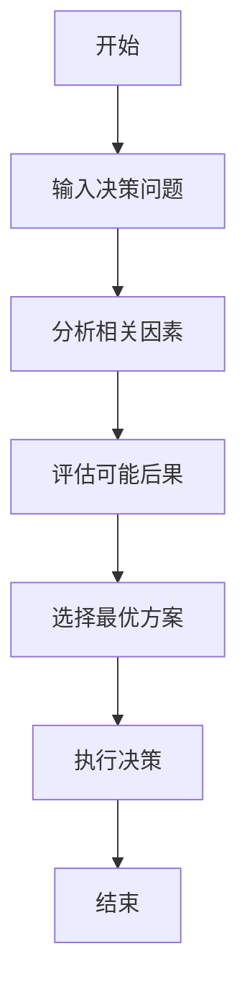
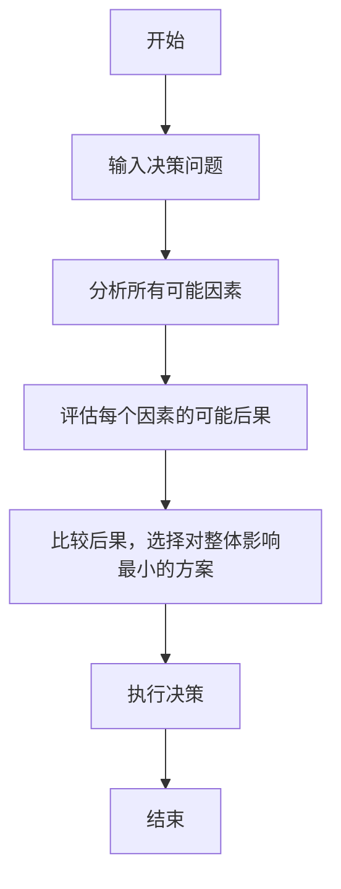
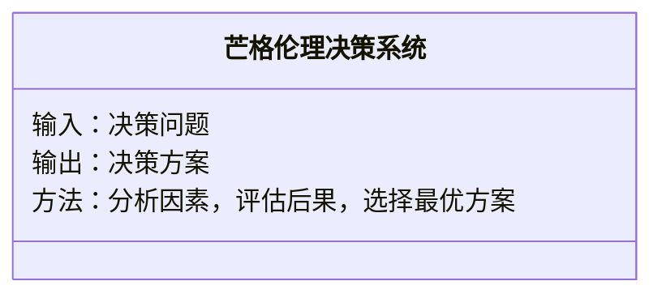
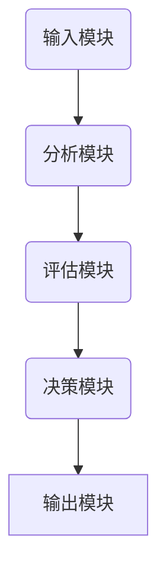

                 


# 芒格的"别觉得自己太聪明"在人工智能伦理决策中的应用

## 关键词：
芒格、人工智能、伦理决策、决策算法、系统架构

## 摘要：
本文探讨了芒格的“别觉得自己太聪明”理念在人工智能伦理决策中的应用。通过分析芒格的决策哲学，结合人工智能的现状，提出了一种基于芒格理念的伦理决策算法，并设计了一个完整的AI伦理决策系统架构。文章详细解释了算法原理、系统设计，并通过实际案例展示了如何在项目中应用这些理念，最后总结了最佳实践。

---

## 第一部分：背景介绍

### 第1章：芒格的“别觉得自己太聪明”理念概述

#### 1.1 芒格的生平与主要思想
- 1.1.1 芒格的生平简介
  查理·芒格是著名投资家，其决策理念强调理性、耐心和谦逊，主张避免过度自信。

- 1.1.2 “别觉得自己太聪明”理念的核心内容
  强调全面考虑问题，避免忽视潜在风险，注重团队合作和多元思维。

- 1.1.3 该理念在决策中的应用领域
  投资、企业管理、个人决策等领域，尤其在复杂决策中提供指导。

#### 1.2 人工智能的现状与发展
- 1.2.1 人工智能的发展历程
  从早期的专家系统到现在的深度学习，AI技术不断进步。

- 1.2.2 当前AI技术的主要应用领域
  医疗、金融、交通、教育等，AI在决策支持系统中广泛应用。

- 1.2.3 人工智能在伦理决策中的挑战
  包括偏见、透明度、责任归属等问题，AI决策的伦理问题日益突出。

#### 1.3 芒格理念与AI伦理决策的结合
- 1.3.1 芒格理念对AI决策的启示
  倡导全面分析、避免过度自信，提升AI决策的稳健性。

- 1.3.2 当前AI决策中的伦理问题
  如自动驾驶汽车的伦理困境，AI在医疗诊断中的责任归属等。

- 1.3.3 该理念如何解决这些伦理问题
  通过全面考虑可能的后果，选择对整体影响最小的方案，减少伦理争议。

---

## 第二部分：核心概念与联系

### 第2章：芒格决策理念的核心要素

#### 2.1 芒格决策理念的属性特征对比
| 芒格理念         | 传统决策方法       |
|------------------|---------------------|
| 强调全面性       | 可能注重效率         |
| 倡导谦逊与合作   | 可能存在个体决策偏差 |
| 注重长期影响     | 短期目标可能优先考虑 |

#### 2.2 芒格决策理念的ER实体关系图
```mermaid
erDiagram
    actor 芒格决策理念 <<--- decision_maker(决策者) 
    decision_maker --> considers(factor(因素)) 
    factor --> includes(risk(风险), opportunity(机会))
    decision_maker --> leads_to(outcome(结果))
```

### 第3章：AI伦理决策的核心原理

#### 3.1 AI决策机制的原理


---

## 第三部分：算法原理讲解

### 第4章：基于芒格理念的伦理决策算法

#### 4.1 算法原理概述
该算法结合芒格的决策理念，通过全面分析决策因素和可能后果，选择对整体影响最小的方案。

#### 4.2 算法流程图


#### 4.3 算法实现代码
```python
def芒格伦理决策(问题):
    因素 = 分析问题相关因素()
    后果 = {}
    for factor in 因素:
        后果[factor] = 评估后果(factor)
    最小化影响因素 = 选择后果影响最小的因素(后果)
    return 最小化影响因素
```

#### 4.4 数学模型与公式
- 贝叶斯定理用于评估每个因素导致特定后果的概率：
  $$ P(A|B) = \frac{P(B|A)P(A)}{P(B)} $$
  其中，A是决策因素，B是后果。

---

## 第四部分：系统分析与架构设计方案

### 第5章：AI伦理决策系统设计

#### 5.1 问题场景介绍
设计一个自动驾驶汽车的伦理决策系统，解决紧急情况下的决策问题。

#### 5.2 系统功能设计


#### 5.3 系统架构设计


#### 5.4 系统接口设计
- 输入接口：接收决策问题的描述。
- 输出接口：返回决策方案及其后果分析。

#### 5.5 系统交互流程
```mermaid
sequenceDiagram
    用户 -> 输入模块：提交决策问题
    输入模块 -> 分析模块：分析问题相关因素
    分析模块 -> 评估模块：评估每个因素的后果
    评估模块 -> 决策模块：选择最优方案
    决策模块 -> 用户：返回决策方案
```

---

## 第五部分：项目实战

### 第6章：基于芒格理念的AI伦理决策系统实现

#### 6.1 环境安装
安装Python和相关库，如numpy和scipy。

#### 6.2 核心实现
```python
def安装环境():
    import numpy as np
    import scipy.stats as stats
    print("环境安装完成")

安装环境()
```

#### 6.3 算法实现
```python
def伦理决策算法(问题):
    因素 = 分析因素(问题)
    后果 = {}
    for factor in 因素:
        后果[factor] = 评估后果(factor)
    最小化影响因素 = 选择最优方案(后果)
    return 最小化影响因素

问题 = "自动驾驶紧急刹车"
决策方案 = 伦理决策算法(问题)
print("决策方案:", 决策方案)
```

#### 6.4 案例分析
案例：自动驾驶汽车在紧急情况下决定刹车还是转向，以减少伤亡。

分析：系统分析所有可能因素，评估每个决策的后果，选择对整体影响最小的方案。

---

## 第六部分：最佳实践

### 第7章：芒格理念与AI伦理决策的结合

#### 7.1 小结
芒格的决策理念为AI伦理决策提供了新的思路，通过全面分析和避免过度自信，提升决策的稳健性。

#### 7.2 注意事项
- 确保算法的透明性和可解释性。
- 定期更新系统以应对新情况。
- 重视团队协作和多元思维。

#### 7.3 拓展阅读
推荐阅读《芒格的决策艺术》和《人工智能伦理决策框架》。

---

## 结语
通过芒格的“别觉得自己太聪明”理念，我们可以提升人工智能决策的伦理性和稳健性。AI系统应具备全面分析和谨慎决策的能力，以应对复杂的现实挑战。

## 作者
作者：AI天才研究院 & 禅与计算机程序设计艺术

