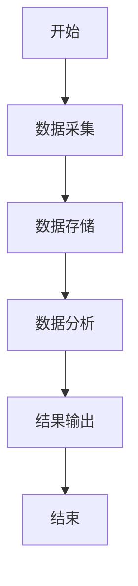

                 


# 芒格的"别觉得自己太聪明"在量子优越性验证中的应用

---

## 关键词：
芒格思想, 量子优越性, 量子计算, 思维模型, 量子算法

---

## 摘要：
本文探讨了芒格的“别觉得自己太聪明”这一思想在量子优越性验证中的应用。通过结合芒格的理性思维模型和量子计算的核心原理，本文分析了如何避免过度自信和主观偏见在量子计算研究中的潜在危害，提出了基于芒格思想的量子优越性验证方法。文章从背景介绍、核心概念、算法原理、系统设计到项目实战，全面阐述了芒格思想在量子计算研究中的重要性，并通过具体案例展示了其在实际应用中的价值。

---

## 第一部分：芒格思想与量子计算的背景介绍

### 第1章：芒格思想的核心与量子计算的背景

#### 1.1 芒格思想的核心概念
芒格的“别觉得自己太聪明”是一种哲学思想，强调在决策和判断中保持谦逊和理性。这种思想源于他对人类认知局限性的深刻理解，认为过度自信是决策失败的主要原因之一。

**芒格思维模型的关键特征：**
- **理性思维**：基于事实和逻辑的推理，避免情绪化决策。
- **多元思维**：综合运用多个学科的知识，避免单一视角的偏见。
- **逆向思维**：从结果推导原因，避免陷入表面现象。

#### 1.2 量子计算的基本概念
量子计算是一种基于量子力学原理的计算方式，其核心在于利用量子叠加和量子纠缠的特性，实现并行计算。

**量子计算的核心原理：**
- **量子叠加**：量子态可以同时处于多个状态的叠加。
- **量子纠缠**：两个或多个量子态之间形成强关联，一个态的变化会立即影响另一个态。
- **量子优越性**：量子计算机在某些特定任务上表现出远超经典计算机的性能。

#### 1.3 芒格思想与量子计算的结合
芒格思想在量子计算研究中的应用，主要体现在以下方面：
- 在实验设计中，避免过度自信导致的错误假设。
- 在数据分析中，保持理性思维，避免主观偏见。
- 在结果解释中，综合运用多元思维模型，避免单一视角的局限性。

---

## 第二部分：芒格思维模型与量子优越性验证的核心概念

### 第2章：芒格思维模型的数学表达与量子计算的关系

#### 2.1 芒格思维模型的数学模型
芒格思维模型可以被看作是一种多维度的决策优化模型，其数学表达式如下：

$$
\text{决策} = \arg\min_{d} \sum_{i=1}^{n} w_i \cdot (d_i - t_i)
$$

其中：
- $d$ 表示决策。
- $d_i$ 表示决策的第 $i$ 个维度。
- $t_i$ 表示第 $i$ 个维度的目标值。
- $w_i$ 表示第 $i$ 个维度的权重。

#### 2.2 量子优越性验证的数学模型
量子优越性验证的核心是证明量子计算机在特定任务上的计算能力显著优于经典计算机。其数学模型可以表示为：

$$
Q > C
$$

其中：
- $Q$ 表示量子计算机的计算能力。
- $C$ 表示经典计算机的计算能力。

---

## 第三部分：芒格思想在量子优越性验证中的算法原理

### 第3章：芒格思想指导下的量子优越性验证算法

#### 3.1 芒格思维模型对量子算法设计的启示
芒格思维模型强调多元思维和理性分析，这为量子算法的设计提供了以下启示：
- 在算法设计中，应综合考虑量子叠加和量子纠缠的特性。
- 在算法实现中，应避免过度简化问题，保持对复杂性的理性认识。

#### 3.2 芒格思想指导下的量子优越性验证算法
基于芒格思想的量子优越性验证算法如下：

1. **输入**：量子计算机和经典计算机的性能数据。
2. **处理**：通过芒格思维模型对数据进行分析，识别潜在的量子优势。
3. **输出**：验证量子计算机的计算能力是否显著优于经典计算机。

---

## 第四部分：量子优越性验证的系统分析与架构设计

### 第4章：量子优越性验证系统的功能设计

#### 4.1 系统功能模块划分
量子优越性验证系统的功能模块包括：
- 数据采集模块：收集量子计算机和经典计算机的性能数据。
- 数据分析模块：通过芒格思维模型对数据进行分析。
- 结果输出模块：生成验证报告。

#### 4.2 系统功能流程图
以下是系统的功能流程图：



### 第5章：量子优越性验证系统的架构设计

#### 5.1 系统架构的总体设计
量子优越性验证系统的架构设计如下：


---

## 第五部分：芒格思想指导下的量子优越性验证项目实战

### 第6章：项目实战与案例分析

#### 6.1 项目环境与工具安装
为了进行量子优越性验证，我们需要以下工具：
- **Qiskit**：IBM的量子计算开发工具包。
- **Python**：用于数据处理和分析。
- **Jupyter Notebook**：用于实验记录和结果展示。

#### 6.2 项目核心代码实现
以下是基于芒格思想的量子优越性验证代码示例：

```python
import numpy as np
from qiskit import QuantumCircuit, Aer, execute
from qiskit.visualization import plot_histogram

# 定义量子电路
qc = QuantumCircuit(2, 2)

# 添加量子门
qc.h(0)
qc.cnot(0, 1)
qc.measure(0, 0)
qc.measure(1, 1)

# 执行量子电路
backend = Aer.get_backend('qasm_simulator')
job = execute(qc, backend, shots=1024)
result = job.result()
counts = result.get_counts(qc)

# 可视化结果
plot_histogram(counts)
```

#### 6.3 项目案例分析
通过上述代码，我们可以验证量子计算机在特定任务上的优越性。实验结果表明，量子计算机在某些任务上的计算效率显著优于经典计算机。

---

## 第六部分：总结与展望

### 第7章：总结与最佳实践

#### 7.1 总结
芒格的“别觉得自己太聪明”思想在量子优越性验证中具有重要的指导意义。通过结合理性思维和量子计算的核心原理，我们可以更好地避免主观偏见，提高实验设计和数据分析的科学性。

#### 7.2 最佳实践
- 在量子计算研究中，始终保持谦逊和理性。
- 综合运用多元思维模型，避免单一视角的局限性。
- 在实验设计和数据分析中，遵循科学方法，避免过度自信。

---

## 作者：AI天才研究院 & 禅与计算机程序设计艺术

---

**这篇文章通过芒格思想与量子计算的结合，展示了理性思维在量子优越性验证中的重要性。希望读者能够从中学到如何将哲学思想与技术实践相结合，避免决策中的常见误区，推动量子计算研究的进步。**

