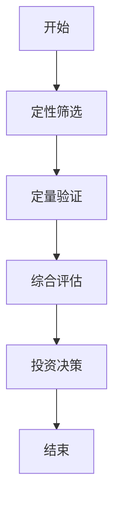
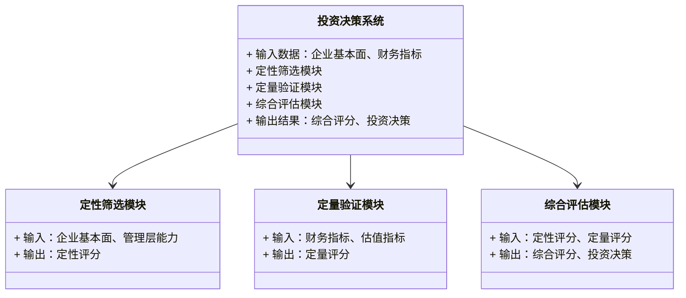
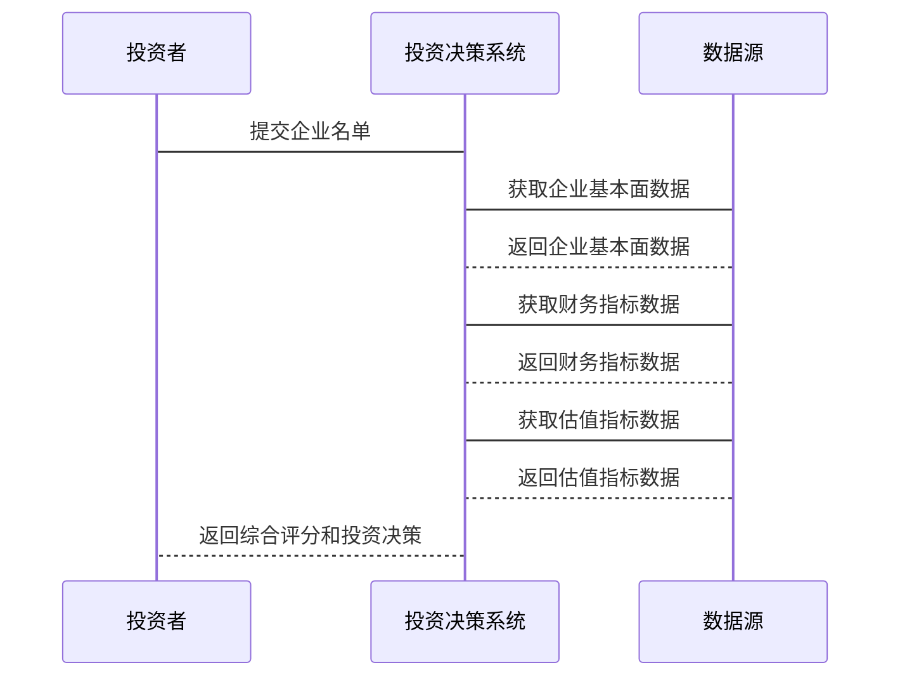

                 


# 芒格的"双轨分析"：结合定性和定量的投资方法

> 关键词：双轨分析，芒格，定性分析，定量分析，投资方法

> 摘要：芒格的“双轨分析”是一种结合定性和定量分析的投资方法，通过系统化的分析流程，帮助投资者做出更科学的投资决策。本文将从背景、核心概念、算法原理、系统设计、实战案例等多个方面详细解析双轨分析的理论与实践。

---

## 第一部分：芒格的“双轨分析”概述

### 第1章：芒格“双轨分析”的背景与重要性

#### 1.1 双轨分析法的起源
芒格的“双轨分析”是其投资哲学的重要组成部分，这一方法结合了定性分析和定量分析，旨在通过全面的分析来识别优质投资标的。双轨分析法的提出，源于芒格对传统投资方法的反思，他认为单纯依赖定性或定量分析都有其局限性，只有将两者结合，才能更全面地评估投资标的的价值。

#### 1.2 双轨分析法的核心思想
- **定性分析**：关注企业的基本面、管理层能力、行业地位等因素，帮助投资者识别企业的核心竞争优势。
- **定量分析**：通过财务指标、估值指标等量化数据，评估企业的财务健康状况和投资价值。
- **双轨结合**：通过定性分析筛选出具备潜力的企业，再通过定量分析验证其投资价值，最终做出综合判断。

#### 1.3 双轨分析法的现实意义
在当前复杂多变的市场环境中，双轨分析法提供了一种系统化、科学化的企业评估方法。它不仅适用于股票投资，还可以广泛应用于其他类型的资产配置和风险管理。

---

### 第2章：双轨分析法的核心概念

#### 2.1 定性分析的核心要素
定性分析关注企业的基本面和非财务因素，主要包括以下几个方面：
- **企业基本面**：包括企业的商业模式、竞争优势、市场地位等。
- **管理层能力**：包括管理层的诚信、决策能力和战略眼光。
- **行业地位**：包括行业的发展前景、竞争格局等。

#### 2.2 定量分析的核心要素
定量分析通过财务数据和估值指标，评估企业的投资价值，主要包括以下几个方面：
- **财务指标**：包括收入、利润、资产负债率等。
- **估值指标**：包括市盈率（P/E）、市净率（P/B）、股息率等。
- **财务健康状况**：包括企业的盈利能力和现金流状况。

#### 2.3 双轨分析法的对比与联系
为了更好地理解双轨分析法，我们可以通过对比定性和定量分析的核心要素，制作一个对比表格：

| **分析维度** | **定性分析** | **定量分析** |
|--------------|--------------|--------------|
| **关注点**    | 企业基本面、管理层能力、行业地位 | 财务指标、估值指标 |
| **数据类型**  | 文本、非结构化数据 | 结构化数据 |
| **分析目标**  | 识别企业的核心竞争优势 | 评估企业的投资价值 |

此外，我们还可以通过ER实体关系图来展示双轨分析的核心要素之间的关系：

```mermaid
er
    entity 企业 {
        id
        企业基本面
        管理层能力
        行业地位
        财务指标
        估值指标
    }
```

---

### 第3章：双轨分析法的算法原理

#### 3.1 双轨分析法的流程图
双轨分析法的流程可以通过以下流程图进行展示：



#### 3.2 算法实现的Python代码
以下是实现双轨分析法的Python代码示例：

```python
def dual_track_analysis(qualitative_factors, quantitative_factors):
    qualitative_score = calculate_qualitative_score(qualitative_factors)
    quantitative_score = calculate_quantitative_score(quantitative_factors)
    combined_score = (qualitative_score + quantitative_score) / 2
    return combined_score

def calculate_qualitative_score(qualitative_factors):
    score = 0
    for factor in qualitative_factors:
        score += factor['weight'] * factor['score']
    return score

def calculate_quantitative_score(quantitative_factors):
    score = 0
    for factor in quantitative_factors:
        score += factor['weight'] * factor['score']
    return score
```

#### 3.3 数学模型与公式
双轨分析法的数学模型如下：

$$ \text{综合评分} = \frac{\text{定性评分} + \text{定量评分}}{2} $$

其中，定性评分和定量评分的计算公式如下：

$$ \text{定性评分} = \sum_{i=1}^{n} w_i \times f_i $$
$$ \text{定量评分} = \sum_{j=1}^{m} w_j \times f_j $$

其中，$w_i$ 和 $w_j$ 分别表示定性和定量分析中各因素的权重，$f_i$ 和 $f_j$ 分别表示各因素的评分。

---

## 第二部分：双轨分析法的系统设计与实战

### 第4章：双轨分析法的系统设计

#### 4.1 系统功能设计
双轨分析法的投资决策系统需要实现以下功能：
- **定性筛选**：根据企业基本面、管理层能力等定性因素，筛选出具备潜力的企业。
- **定量验证**：通过财务指标和估值指标，验证企业的投资价值。
- **综合评估**：结合定性和定量分析结果，给出综合评分。
- **投资决策**：根据综合评分，做出投资决策。

#### 4.2 系统架构设计
以下是双轨分析法的投资决策系统的架构图：



#### 4.3 系统接口设计
以下是系统接口设计的示例：



---

### 第5章：双轨分析法的实战应用

#### 5.1 项目实战
以下是双轨分析法在实际投资中的应用案例：

**案例：筛选优质科技股**
1. **定性筛选**：筛选出具备强大竞争优势的科技企业。
2. **定量验证**：通过财务指标和估值指标，评估企业的投资价值。
3. **综合评估**：结合定性和定量分析结果，给出综合评分。
4. **投资决策**：根据综合评分，做出投资决策。

#### 5.2 代码实现
以下是实现双轨分析法的Python代码：

```python
def dual_track_analysis(qualitative_factors, quantitative_factors):
    qualitative_score = calculate_qualitative_score(qualitative_factors)
    quantitative_score = calculate_quantitative_score(quantitative_factors)
    combined_score = (qualitative_score + quantitative_score) / 2
    return combined_score

def calculate_qualitative_score(qualitative_factors):
    score = 0
    for factor in qualitative_factors:
        score += factor['weight'] * factor['score']
    return score

def calculate_quantitative_score(quantitative_factors):
    score = 0
    for factor in quantitative_factors:
        score += factor['weight'] * factor['score']
    return score
```

---

## 第三部分：双轨分析法的最佳实践与小结

### 第6章：双轨分析法的最佳实践

#### 6.1 实践中的注意事项
1. **数据质量**：确保定性和定量分析的数据来源可靠。
2. **权重设置**：根据实际情况调整各因素的权重。
3. **动态调整**：定期更新分析结果，适应市场变化。

#### 6.2 双轨分析法的优点
- **全面性**：结合定性和定量分析，避免单一方法的局限性。
- **科学性**：通过系统化的分析流程，提高投资决策的科学性。
- **可操作性**：适用于不同类型的投资标的。

---

### 第7章：小结与展望

芒格的“双轨分析”是一种结合定性和定量分析的投资方法，通过系统化的分析流程，帮助投资者做出更科学的投资决策。本文从背景、核心概念、算法原理、系统设计、实战案例等多个方面详细解析了双轨分析的理论与实践。未来，随着人工智能和大数据技术的发展，双轨分析法将变得更加高效和精准。

---

作者：AI天才研究院/AI Genius Institute & 禅与计算机程序设计艺术/Zen And The Art of Computer Programming

