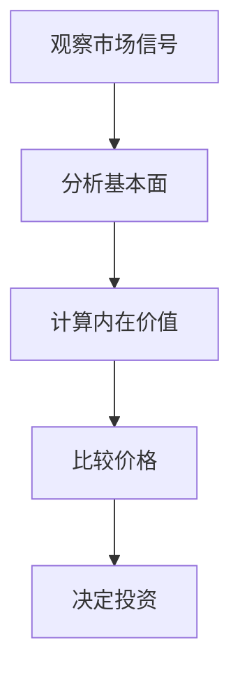
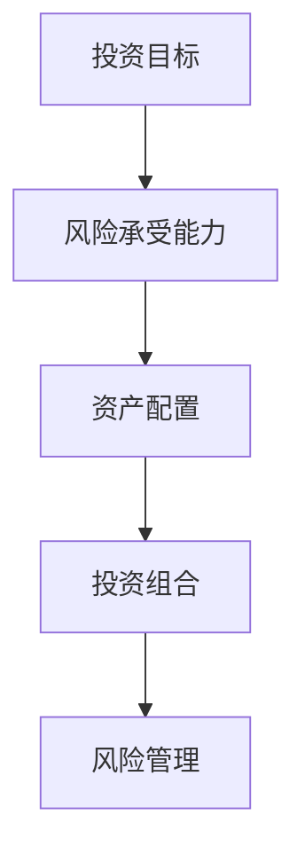

                 

# 《芒格的"反向工程"思维在投资中的应用》

> 关键词：芒格，反向工程，投资，逆向思维，价值投资，风险管理，系统性思维

> 摘要：本文深入探讨了芒格的“反向工程”思维在投资中的应用，从理论到实践，结合数学模型和算法，详细分析了如何通过逆向思维寻找低估投资机会，构建系统性投资框架，克服认知偏差，实现长期稳健投资。

---

## 第一章: 引言

### 1.1 芮格的背景与投资理念

查理·芒格（Charlie Munger）是巴菲特的长期合作伙伴，被誉为“投资界的智者”。他的“反向工程”思维是一种逆向思考方法，强调从结果出发，寻找背后的原因，从而在投资中避免从众心理，寻找被市场低估的机会。

### 1.2 “反向工程”思维的核心理念

“反向工程”思维的核心在于从结果反推原因，通过分析市场表现和企业基本面，识别出那些被市场低估的企业。这种思维方式与传统投资的从原因到结果的正向思维不同，强调逆向思考，寻找市场的非共识机会。

---

## 第二章: “反向工程”思维的数学模型与算法

### 2.1 逆向分析模型

我们可以通过以下公式来表示逆向分析模型：

$$
\text{内在价值} = \frac{\text{未来现金流}}{\text{贴现率}}
$$

通过分析企业的未来现金流和合理的贴现率，我们可以估算出企业的内在价值，进而判断其是否被市场低估。

### 2.2 逆向思维算法流程

1. **识别市场低估的信号**：观察市场的非理性波动。
2. **分析企业的基本面**：评估企业的盈利能力、财务状况和竞争优势。
3. **计算内在价值**：使用逆向分析模型估算内在价值。
4. **比较市场价格与内在价值**：确定投资机会。

以下是一个简单的逆向思维算法流程图：

---

## 第三章: 系统性投资框架

### 3.1 投资战略制定

1. **目标设定**：明确投资目标和风险承受能力。
2. **资产配置**：根据目标分配资产比例。

### 3.2 资产配置优化

通过以下步骤优化资产配置：

1. **评估各类资产的风险和收益**。
2. **调整配置比例以匹配目标风险。

### 3.3 投资组合管理

1. **定期审查**：监控投资组合的表现。
2. **再平衡**：根据市场变化调整配置。

### 3.4 风险管理

1. **风险识别**：识别潜在风险。
2. **风险控制**：设定止损点。

以下是一个资产配置优化的架构图：

---

## 第四章: 案例分析

### 4.1 苹果公司投资机会

通过逆向思维分析苹果公司：

1. **观察市场信号**：苹果股价下跌。
2. **分析基本面**：高盈利能力、强大的竞争优势。
3. **计算内在价值**：远高于当前股价。
4. **结论**：投资机会。

---

## 第五章: 投资者心理与认知偏差

### 5.1 认知偏差的影响

1. **从众心理**：跟随市场情绪做出决策。
2. **过度自信**：高估自己的判断能力。

### 5.2 克服认知偏差

1. **独立思考**：避免从众心理。
2. **持续学习**：提高分析能力。

---

## 第六章: 未来投资趋势

### 6.1 科技与创新

1. **科技行业的长期趋势**：人工智能、大数据。
2. **投资机会**：关注技术创新型企业。

### 6.2 绿色能源

1. **环保政策支持**：全球向可再生能源转型。
2. **投资机会**：新能源企业。

---

## 第七章: 总结

芒格的“反向工程”思维是一种强大的投资工具，通过逆向思考和系统性分析，可以帮助投资者在复杂市场中找到低估机会。结合数学模型、算法和系统性框架，投资者可以做出更理性的决策。

---

## 附录

### 附录A: 进一步阅读的资源

1. 《芒格投资思想精要》
2. 《价值投资入门指南》

---

## 作者

**作者：AI天才研究院/AI Genius Institute & 禅与计算机程序设计艺术 /Zen And The Art of Computer Programming**

---

**注**：本文部分内容基于《芒格投资思想精要》和《价值投资入门指南》编写，旨在通过技术语言和逻辑分析，深入探讨芒格的“反向工程”思维在投资中的应用。

