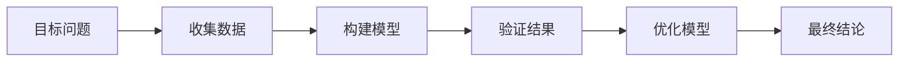
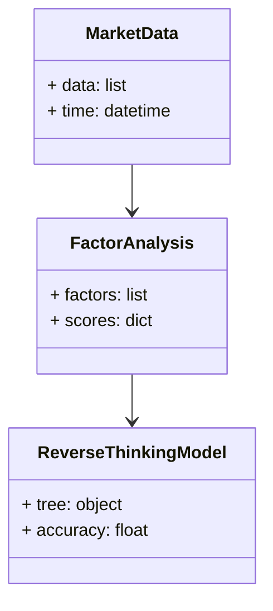
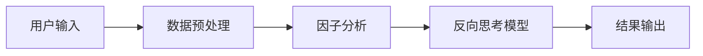

                 


# 芒格的"反向思考"在市场分析中的应用：避免从众误区

> 关键词：反向思考，市场分析，芒格，从众误区，投资策略，算法模型，系统架构

> 摘要：本文深入探讨了芒格的“反向思考”理念在市场分析中的应用，分析了传统思维方式的局限性，以及反向思考如何帮助投资者避免从众误区。通过结合算法模型和系统架构，本文详细讲解了反向思考的实现方法，并通过实际案例展示了其在市场分析中的有效性。

---

# 第1章: 反向思考的背景与意义

## 1.1 传统思维方式的局限性
### 1.1.1 正向思考的局限性
- 传统正向思考的特点
- 正向思考在市场分析中的常见误区
- 正向思考的局限性案例分析

### 1.1.2 从众心理的负面影响
- 从众心理的定义与表现
- 从众心理在市场分析中的具体表现
- 从众心理对投资决策的危害

## 1.2 芒格的反向思考理念
### 1.2.1 芒格的生平简介
- 芒格的教育背景与职业经历
- 芒格的投资哲学与成功经验
- 芒格与巴菲特的合作关系

### 1.2.2 反向思考的核心思想
- 反向思考的定义与特点
- 反向思考在投资决策中的应用
- 反向思考与市场周期的关系

## 1.3 反向思考在市场分析中的重要性
### 1.3.1 市场分析的传统误区
- 传统市场分析的常见错误
- 从众心理在市场分析中的具体表现
- 传统分析方法的局限性

### 1.3.2 反向思考如何帮助避免从众误区
- 反向思考的核心优势
- 反向思考在市场分析中的具体应用
- 反向思考如何提高投资决策的准确性

## 1.4 本章小结
- 本章内容总结
- 反向思考的核心价值
- 下一章的阅读引导

---

# 第2章: 反向思考的核心概念与联系

## 2.1 反向思考的核心原理
### 2.1.1 反向思考的基本原理
- 反向思考的逻辑框架
- 反向思考的思维模式
- 反向思考的实现步骤

### 2.1.2 反向思考的逻辑框架
- 反向思考的思维流程
- 反向思考的逻辑模型
- 反向思考的思维工具

## 2.2 反向思考与其他思维方式的对比
### 2.2.1 正向思考与反向思考的对比
- 正向思考与反向思考的定义对比
- 正向思考与反向思考的优缺点对比
- 正向思考与反向思考的适用场景对比

### 2.2.2 其他辅助思维方式的对比
- 逆向思维与批判性思维的对比
- 逆向思维与创造性思维的对比
- 逆向思维与系统性思维的对比

## 2.3 反向思考框架的构建
### 2.3.1 构建反向思考框架的步骤
- 明确目标：确定市场分析的核心问题
- 收集信息：获取与目标相关的数据和信息
- 构建模型：建立反向思考的逻辑框架
- 验证模型：通过实际案例验证模型的准确性

### 2.3.2 反向思考框架的属性特征对比表格
| 特性 | 正向思考 | 反向思考 |
|------|----------|----------|
| 思维方向 | 从原因到结果 | 从结果到原因 |
| 分析方式 | 前向推理 | 后向推理 |
| 适用场景 | 确定性高的环境 | 不确定性高的环境 |

### 2.3.3 反向思考框架的ER实体关系图（Mermaid流程图）


---

# 第3章: 反向思考的算法原理与数学模型

## 3.1 反向思考的算法模型
### 3.1.1 逆向思维树算法
- 逆向思维树的定义与特点
- 逆向思维树的构建步骤
- 逆向思维树的案例分析

### 3.1.2 反向思考的多因子分析模型
- 多因子分析模型的定义
- 多因子分析模型的构建步骤
- 多因子分析模型的优缺点

## 3.2 反向思考的数学模型与公式
### 3.2.1 贝叶斯定理公式
- 贝叶斯定理的定义
- 贝叶斯定理的公式推导
- 贝叶斯定理在反向思考中的应用

$$ P(A|B) = \frac{P(B|A)P(A)}{P(B)} $$

### 3.2.2 反向思考的多因子模型公式
- 多因子模型的公式推导
- 多因子模型的变量解释
- 多因子模型的案例应用

$$ R_i = \alpha + \beta_1F_1 + \beta_2F_2 + \dots + \beta_nF_n + \epsilon $$

## 3.3 算法实现与代码示例
### 3.3.1 逆向思维树算法实现
```python
def reverse_thinking_tree(data):
    # 数据预处理
    processed_data = data preprocessing
    # 构建思维树
    tree = build_tree(processed_data)
    # 验证模型
    accuracy = validate_tree(tree, test_data)
    return accuracy
```

### 3.3.2 多因子分析模型实现
```python
import pandas as pd
import numpy as np

def multi_factor_model(data, factors):
    # 数据清洗
    cleaned_data = data cleaning
    # 计算因子得分
    factor_scores = compute_factors(cleaned_data, factors)
    # 构建多因子模型
    model = build_multi_factor_model(factor_scores)
    # 返回结果
    return model.predict()
```

---

# 第4章: 反向思考的系统分析与架构设计

## 4.1 问题场景介绍
### 4.1.1 市场分析的典型问题
- 市场波动的不确定性
- 数据量的庞大性
- 数据的实时性要求

### 4.1.2 反向思考在系统中的作用
- 反向思考如何帮助系统提高预测准确性
- 反向思考如何优化系统的决策流程
- 反向思考如何提高系统的容错能力

## 4.2 系统功能设计
### 4.2.1 领域模型类图


### 4.2.2 系统架构设计
- 系统架构的分层设计
- 系统组件之间的交互关系
- 系统的可扩展性设计

## 4.3 系统架构图


---

# 第5章: 反向思考的项目实战

## 5.1 环境安装与配置
### 5.1.1 系统环境要求
- 操作系统要求
- Python版本要求
- 额外依赖库的安装

### 5.1.2 环境配置步骤
- 安装必要的Python库
- 配置数据源
- 设置开发环境

## 5.2 核心代码实现
### 5.2.1 数据清洗与预处理
```python
import pandas as pd

def data_cleaning(data):
    # 删除缺失值
    data.dropna(inplace=True)
    # 处理异常值
    data = data[~(data['value'] > data['value'].quantile(0.99))]
    return data
```

### 5.2.2 反向思考模型实现
```python
def reverse_thinking_model(data):
    # 构建思维树
    tree = build_tree(data)
    # 验证模型
    accuracy = validate_tree(tree, test_data)
    return accuracy
```

## 5.3 案例分析与结果解读
### 5.3.1 实际案例分析
- 案例背景介绍
- 数据分析过程
- 模型预测结果

### 5.3.2 结果解读
- 模型的准确性分析
- 模型的稳定性分析
- 模型的可解释性分析

## 5.4 项目总结与优化建议
### 5.4.1 项目总结
- 项目目标的实现情况
- 项目过程中的经验与教训
- 项目成果的价值

### 5.4.2 优化建议
- 模型优化的方向
- 系统优化的建议
- 进一步研究的方向

---

# 第6章: 反向思考的最佳实践与注意事项

## 6.1 小结与回顾
### 6.1.1 本章内容总结
- 反向思考的核心思想
- 反向思考的实现方法
- 反向思考的应用价值

### 6.1.2 从众误区的总结
- 从众心理的常见表现
- 从众心理的危害
- 如何避免从众误区

## 6.2 注意事项与建议
### 6.2.1 实际应用中的注意事项
- 数据质量的重要性
- 模型选择的合理性
- 系统设计的规范性

### 6.2.2 进一步研究的方向
- 反向思考与其他思维方式的结合
- 反向思考在不同领域的应用
- 反向思考的算法优化

## 6.3 拓展阅读与学习资源
### 6.3.1 推荐书籍
- 《芒格的智慧》
- 《投资的思考》
- 《算法与市场分析》

### 6.3.2 推荐博客与网站
- 计算机编程与人工智能领域的技术博客
- 投资与市场分析的专业论坛

---

# 作者：AI天才研究院/AI Genius Institute & 禅与计算机程序设计艺术 /Zen And The Art of Computer Programming

---

**注意**：以上目录大纲和内容仅为示例，实际撰写时需要根据具体需求进行调整和补充。

