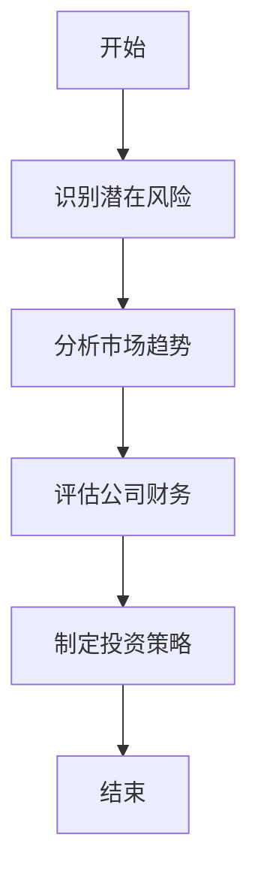
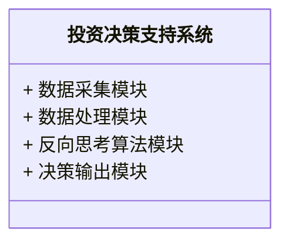

                 

# 芒格的"反向思考"：如何避免投资陷阱

> 关键词：芒格，反向思考，投资陷阱，风险管理，决策模型，投资策略

> 摘要：本文深入探讨了芒格的"反向思考"方法，分析其在投资决策中的应用，通过数学模型和系统架构设计，展示了如何利用反向思考避免投资陷阱，实现稳健的投资收益。文章结合实际案例，详细讲解了反向思考的算法原理、系统实现和最佳实践，为投资者提供了实用的指导。

---

## 第1章: 芒格的"反向思考"核心概念

### 1.1 反向思考的定义与背景

反向思考是一种从对立面入手的思维方式，旨在通过识别潜在风险和陷阱来优化决策。芒格将其应用于投资领域，强调通过分析问题的反面来发现机会和风险。

#### 1.1.1 投资中的常见陷阱

- **市场情绪驱动**：投资者常因市场热潮或恐慌做出非理性决策。
- **过度自信**：忽视潜在风险，低估市场的复杂性。
- **信息过载**：被大量数据干扰，难以抓住本质。
- **从众心理**：盲目跟随市场趋势，忽视个体分析。

#### 1.1.2 反向思考的起源与芒格的贡献

芒格提出的"反向思考"源自对传统投资方法的反思，强调从对立面寻找投资机会，避免随大流。

#### 1.1.3 反向思考在投资中的重要性

- **识别风险**：通过反向思考发现潜在风险，降低投资损失。
- **优化决策**：从对立面寻找机会，提升投资收益。
- **避免从众**：独立思考，避免随大流的非理性决策。

---

### 1.2 反向思考的核心原理

反向思考通过分析问题的反面，识别潜在风险和机会，优化决策过程。

#### 1.2.1 从对立面思考的逻辑

- **对立面分析**：通过分析市场的对立面（如竞争对手、市场趋势），发现潜在风险。
- **逆向思维**：从结果反推原因，寻找投资机会。

#### 1.2.2 反向思考与传统思维方式的对比

| 对比维度         | 传统思维方式                | 反向思考                  |
|------------------|-----------------------------|---------------------------|
| 分析角度         | 正面分析                    | 对立面分析                |
| 决策依据         | 市场趋势、公司财报            | 风险、潜在问题              |
| 适用场景         | 发现机会                    | 识别风险、优化决策          |

---

## 第2章: 反向思考的数学模型与公式

### 2.1 反向思考的决策模型

#### 2.1.1 投资决策的数学公式

投资收益与风险的平衡可以通过以下公式表示：

$$
\text{期望收益} = \sum (\text{概率} \times \text{收益})
$$

$$
\text{风险} = \sqrt{\sum (\text{概率} \times (\text{收益} - \text{期望收益})^2)}
$$

#### 2.1.2 风险评估的数学模型

通过反向思考，我们可以建立以下风险评估模型：

$$
\text{风险指数} = \frac{\text{潜在风险因素数量}}{\text{总因素数量}} \times 100
$$

---

### 2.2 反向思考的算法原理

#### 2.2.1 基于反向思考的决策树分析

---

## 第3章: 反向思考的系统架构设计

### 3.1 投资决策支持系统的功能设计

#### 3.1.1 系统功能模块划分

- 数据采集模块
- 数据处理模块
- 反向思考算法模块
- 决策输出模块

#### 3.1.2 系统数据流的分析

- 数据输入：市场数据、公司财报
- 数据处理：清洗、分析
- 算法处理：反向思考模型
- 数据输出：投资建议

---

### 3.2 系统架构的Mermaid图

---

## 第4章: 反向思考的项目实战

### 4.1 项目背景与目标

#### 4.1.1 项目需求分析

- 开发一个基于反向思考的投资决策支持系统。
- 目标：帮助投资者识别投资陷阱，优化投资决策。

---

### 4.2 项目核心实现

#### 4.2.1 数据采集与预处理

- 数据来源：市场数据、公司财报。
- 数据清洗：去除无效数据，处理异常值。

#### 4.2.2 反向思考算法的实现

- 算法流程：识别潜在风险，分析市场趋势，评估公司财务，制定投资策略。

#### 4.2.3 投资决策系统的测试与优化

- 测试：验证算法准确性。
- 优化：根据测试结果调整模型参数。

---

## 第5章: 反向思考的最佳实践与注意事项

### 5.1 反向思考的实战技巧

#### 5.1.1 如何识别投资陷阱

- 分析市场趋势，识别潜在风险。
- 评估公司财务，避免投资亏损。

#### 5.1.2 反向思考中的常见误区

- 过度依赖反向思考，忽视市场趋势。
- 忽略其他投资策略，导致决策失误。

---

## 第6章: 反向思考的拓展阅读与深入研究

### 6.1 相关领域的最新研究

- 反向思考在风险管理中的应用。
- 反向思考与行为金融学的结合。

---

## 第7章: 小结与展望

芒格的"反向思考"是一种有效的投资策略，通过识别潜在风险和优化决策，帮助投资者避免投资陷阱，实现稳健收益。未来，随着技术的发展，反向思考将与更多领域结合，为投资决策提供更强大的支持。

---

## 作者：AI天才研究院/AI Genius Institute & 禅与计算机程序设计艺术 /Zen And The Art of Computer Programming

---

# 文章正文

---

## 第1章: 芒格的"反向思考"核心概念

### 1.1 反向思考的定义与背景

反向思考是一种从对立面入手的思维方式，旨在通过识别潜在风险和陷阱来优化决策。芒格将其应用于投资领域，强调通过分析问题的反面来发现机会和风险。

#### 1.1.1 投资中的常见陷阱

- **市场情绪驱动**：投资者常因市场热潮或恐慌做出非理性决策。
- **过度自信**：忽视潜在风险，低估市场的复杂性。
- **信息过载**：被大量数据干扰，难以抓住本质。
- **从众心理**：盲目跟随市场趋势，忽视个体分析。

#### 1.1.2 反向思考的起源与芒格的贡献

芒格提出的"反向思考"源自对传统投资方法的反思，强调从对立面寻找投资机会，避免随大流。

#### 1.1.3 反向思考在投资中的重要性

- **识别风险**：通过反向思考发现潜在风险，降低投资损失。
- **优化决策**：从对立面寻找机会，提升投资收益。
- **避免从众**：独立思考，避免随大流的非理性决策。

---

### 1.2 反向思考的核心原理

反向思考通过分析问题的反面，识别潜在风险和机会，优化决策过程。

#### 1.2.1 从对立面思考的逻辑

- **对立面分析**：通过分析市场的对立面（如竞争对手、市场趋势），发现潜在风险。
- **逆向思维**：从结果反推原因，寻找投资机会。

#### 1.2.2 反向思考与传统思维方式的对比

| 对比维度         | 传统思维方式                | 反向思考                  |
|------------------|-----------------------------|---------------------------|
| 分析角度         | 正面分析                    | 对立面分析                |
| 决策依据         | 市场趋势、公司财报            | 风险、潜在问题              |
| 适用场景         | 发现机会                    | 识别风险、优化决策          |

---

## 第2章: 反向思考的数学模型与公式

### 2.1 反向思考的决策模型

#### 2.1.1 投资决策的数学公式

投资收益与风险的平衡可以通过以下公式表示：

$$
\text{期望收益} = \sum (\text{概率} \times \text{收益})
$$

$$
\text{风险} = \sqrt{\sum (\text{概率} \times (\text{收益} - \text{期望收益})^2)}
$$

#### 2.1.2 风险评估的数学模型

通过反向思考，我们可以建立以下风险评估模型：

$$
\text{风险指数} = \frac{\text{潜在风险因素数量}}{\text{总因素数量}} \times 100
$$

---

### 2.2 反向思考的算法原理

#### 2.2.1 基于反向思考的决策树分析

---

## 第3章: 反向思考的系统架构设计

### 3.1 投资决策支持系统的功能设计

#### 3.1.1 系统功能模块划分

- 数据采集模块
- 数据处理模块
- 反向思考算法模块
- 决策输出模块

#### 3.1.2 系统数据流的分析

- 数据输入：市场数据、公司财报
- 数据处理：清洗、分析
- 算法处理：反向思考模型
- 数据输出：投资建议

---

### 3.2 系统架构的Mermaid图

---

## 第4章: 反向思考的项目实战

### 4.1 项目背景与目标

#### 4.1.1 项目需求分析

- 开发一个基于反向思考的投资决策支持系统。
- 目标：帮助投资者识别投资陷阱，优化投资决策。

---

### 4.2 项目核心实现

#### 4.2.1 数据采集与预处理

- 数据来源：市场数据、公司财报。
- 数据清洗：去除无效数据，处理异常值。

#### 4.2.2 反向思考算法的实现

- 算法流程：识别潜在风险，分析市场趋势，评估公司财务，制定投资策略。

#### 4.2.3 投资决策系统的测试与优化

- 测试：验证算法准确性。
- 优化：根据测试结果调整模型参数。

---

## 第5章: 反向思考的最佳实践与注意事项

### 5.1 反向思考的实战技巧

#### 5.1.1 如何识别投资陷阱

- 分析市场趋势，识别潜在风险。
- 评估公司财务，避免投资亏损。

#### 5.1.2 反向思考中的常见误区

- 过度依赖反向思考，忽视市场趋势。
- 忽略其他投资策略，导致决策失误。

---

## 第6章: 反向思考的拓展阅读与深入研究

### 6.1 相关领域的最新研究

- 反向思考在风险管理中的应用。
- 反向思考与行为金融学的结合。

---

## 第7章: 小结与展望

芒格的"反向思考"是一种有效的投资策略，通过识别潜在风险和优化决策，帮助投资者避免投资陷阱，实现稳健收益。未来，随着技术的发展，反向思考将与更多领域结合，为投资决策提供更强大的支持。

---

## 作者：AI天才研究院/AI Genius Institute & 禅与计算机程序设计艺术 /Zen And The Art of Computer Programming

