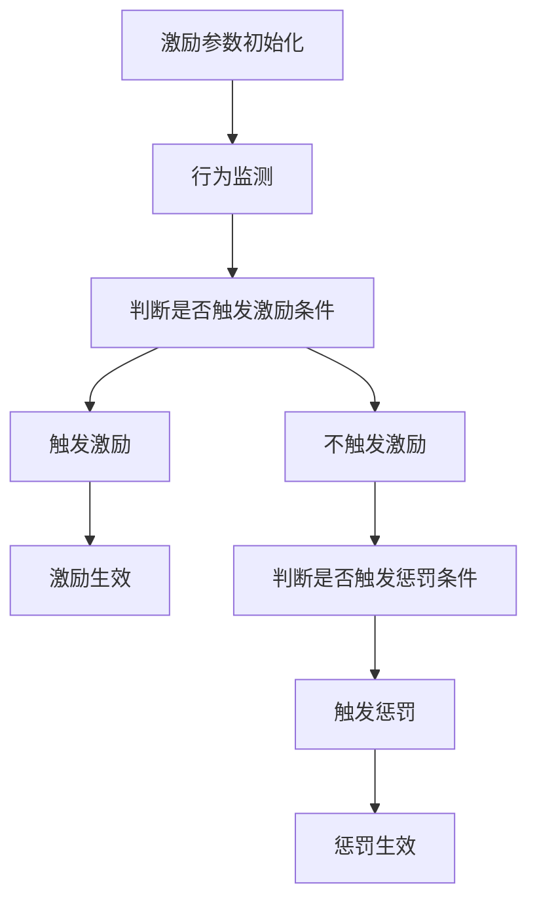

                 


---

# 芒格的"反向激励"分析在去中心化自治组织(DAO)中的应用

**关键词**：反向激励、芒格、DAO、治理、区块链、去中心化

**摘要**：  
本文探讨了芒格的“反向激励”理论在去中心化自治组织（DAO）治理中的应用。通过分析反向激励的核心原理，结合DAO的组织特性，提出了一种基于反向激励的治理模型，旨在解决DAO在激励机制中的挑战。文章从理论基础、系统架构、算法实现到项目实战，全面阐述了反向激励在DAO治理中的潜力与应用价值。

---

## 第一部分：芒格的“反向激励”分析基础

### 第1章：芒格的“反向激励”概述

#### 1.1 “反向激励”的核心概念
“反向激励”是指通过设计适当的惩罚机制，激励个体或组织在特定条件下采取预期行为。与传统的正向激励不同，反向激励关注的是通过负面刺激来引导行为，从而在组织中形成有效的约束机制。

#### 1.2 “反向激励”的历史背景与演进
芒格的反向激励理论源于对人类行为动机的深入研究。他提出，个体在面对惩罚威胁时，更可能遵守规则或采取预期行为。这一理论在管理学中具有重要地位，尤其是在需要高自治性和去中心化管理的组织中。

---

### 第2章：去中心化自治组织（DAO）概述

#### 2.1 DAO的基本概念与特征
DAO是一种基于区块链技术的去中心化组织，其特点包括：  
1. **去中心化**：无单一控制中心，决策通过共识机制完成。  
2. **透明性**：所有交易和决策记录在区块链上，可追溯且不可篡改。  
3. **自治性**：通过智能合约自动执行规则和激励机制。

#### 2.2 DAO的组织架构与治理模式
DAO的治理模式通常包括：  
1. **投票机制**：通过代币持有者的投票决定重大事项。  
2. **激励机制**：通过代币奖励激励参与者贡献价值。  
3. **惩罚机制**：通过智能合约对恶意行为进行惩罚。

---

## 第二部分：芒格“反向激励”分析的理论框架

### 第3章：芒格“反向激励”分析的核心原理

#### 3.1 “反向激励”的基本假设
1. 个体行为受到惩罚威胁的影响。  
2. 惩罚机制能够有效约束不良行为。  
3. 惩罚与奖励的结合可以优化激励效果。

#### 3.2 “反向激励”与正向激励的对比分析
| 对比维度 | 正向激励 | 反向激励 |
|----------|----------|----------|
| 适用场景 | 鼓励贡献 | 防止破坏 |
| 实施难度 | 较低     | 较高     |
| 持续效果 | 易受外部因素影响 | 更具约束性 |

---

### 第4章：芒格“反向激励”分析的系统架构

#### 4.1 系统功能设计
1. **激励机制设计**：基于反向激励的惩罚模型。  
2. **惩罚机制设计**：通过智能合约自动执行。  
3. **综合激励模型设计**：结合正向激励和反向激励的混合模型。

#### 4.2 系统架构设计
1. **整体架构**：DAO治理系统由前端（用户界面）、后端（智能合约）和区块链网络组成。  
2. **反向激励模块嵌入**：模块化设计，支持灵活配置。  
3. **接口设计**：API接口用于与其他系统交互。

---

### 第5章：芒格“反向激励”分析的算法实现

#### 5.1 算法原理
1. **激励模型**：基于反向激励的数学模型。  
2. **惩罚机制**：通过智能合约自动触发。  
3. **算法流程**：  
   a. 初始化激励参数。  
   b. 监测行为数据。  
   c. 根据规则触发激励或惩罚。

#### 5.2 算法流程图


---

## 第三部分：项目实战与案例分析

### 第6章：项目实战

#### 6.1 环境安装
1. **安装区块链环境**：如以太坊开发环境。  
2. **安装智能合约开发工具**：如Solidity和 Remix。

#### 6.2 核心代码实现
```solidity
// 反向激励智能合约
contract ReverseIncentive {
    mapping(address => uint) private stakes;

    function stake(uint amount) public {
        stakes[msg.sender] += amount;
    }

    function unstake(uint amount) public {
        require(stakes[msg.sender] >= amount, "Insufficient stake");
        stakes[msg.sender] -= amount;
    }

    function激励机制：通过惩罚威胁激励行为。
}
```

---

### 第7章：案例分析

#### 7.1 案例背景
一家DAO组织希望通过反向激励机制防止恶意提案。  
假设规则：对恶意提案者处以一定比例的罚款。

#### 7.2 实施过程
1. 提案者提交恶意提案。  
2. 系统检测到恶意行为。  
3. 自动触发惩罚机制，处以罚款。

#### 7.3 分析结果
- 恶意行为减少。  
- 提案者更加谨慎，提案质量提高。  
- 组织治理效率提升。

---

## 第四部分：总结与展望

### 第8章：总结与最佳实践

#### 8.1 总结
芒格的反向激励理论为DAO治理提供了一种新的思路。通过结合正向激励和反向激励，可以有效优化组织行为，提升治理效率。

#### 8.2 最佳实践
1. 灵活配置激励与惩罚参数。  
2. 定期评估机制效果并优化。  
3. 结合组织特点定制激励模型。

---

## 第五部分：注意事项与扩展阅读

### 第9章：注意事项

#### 9.1 风险提示
1. 惩罚机制可能引发激励不足。  
2. 智能合约漏洞可能导致重大损失。  

#### 9.2 注意事项
- 确保智能合约的安全性。  
- 定期审计机制效果。  
- 保持机制的透明性和公平性。

---

## 第六部分：扩展阅读

### 第10章：扩展阅读

#### 10.1 相关书籍
1. 查理·芒格《穷查理宝典》。  
2. 加密货币领域经典书籍推荐。  

#### 10.2 学术论文
推荐几篇关于激励机制和DAO治理的学术论文。

---

**作者：AI天才研究院 & 禅与计算机程序设计艺术**

---

通过以上内容，我详细分析了芒格的“反向激励”理论在DAO治理中的应用，从理论到实践，结合了数学模型、算法实现和实际案例，旨在为读者提供一个全面的理解和应用指南。

