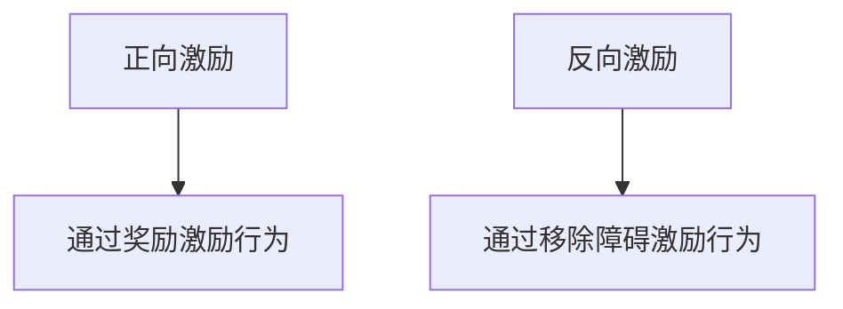
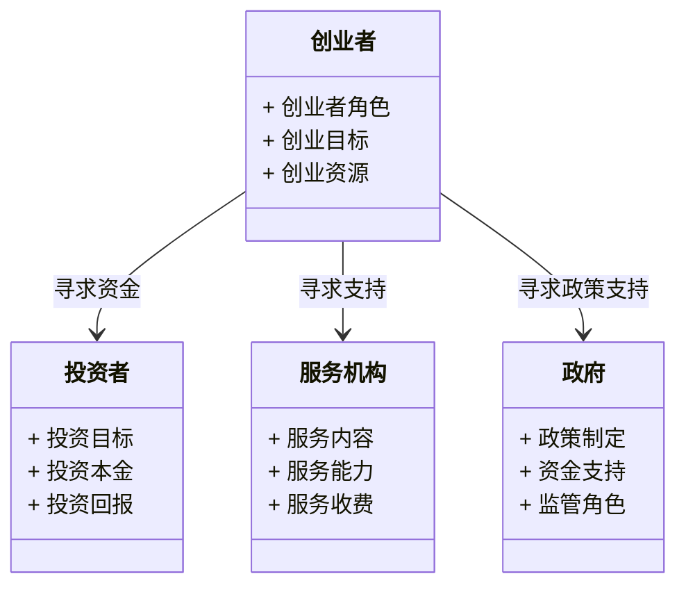
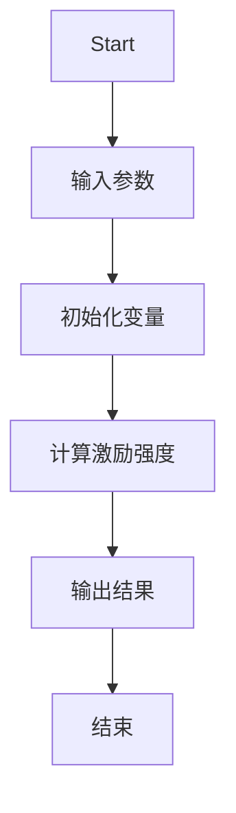
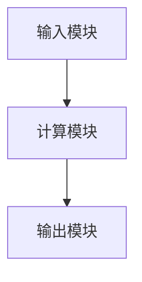

                 


# 芒格的"反向激励"分析在科技创业生态系统中的应用

## 关键词：反向激励, 芒格, 科技创业, 生态系统, 激励机制

## 摘要：本文将从芒格的反向激励理论出发，分析其在科技创业生态系统中的应用。通过详细讲解反向激励的核心概念、数学模型、算法原理以及系统架构设计，结合实际案例分析，探讨反向激励在科技创业中的重要性及其对生态系统稳定性的影响。

---

# 第一部分: 芒格的"反向激励"分析背景与概念

## 第1章: 反向激励的定义与特点

### 1.1 反向激励的核心概念

#### 1.1.1 什么是反向激励
反向激励是一种与传统正向激励相反的策略，其核心在于通过减少或消除某种负面因素来激发个体或组织的行为。这种激励方式强调通过降低障碍、减少阻力或移除负面刺激来促进目标行为的发生。

例如，在科技创业中，反向激励可以通过减少审批流程、简化管理流程或降低员工的压力水平来激发团队的创造力和积极性。

#### 1.1.2 反向激励的特点
| 特性 | 描述 |
|------|------|
| 目标性 | 针对特定问题或目标设计 |
| 间接性 | 通过减少障碍而非直接奖励来激励 |
| 高效性 | 在某些情况下，比正向激励更有效 |
| 持续性 | 可能带来更持久的行为改变 |

#### 1.1.3 反向激励与正向激励的区别


---

### 1.2 芒格的反向激励理论

#### 1.2.1 芒格的背景与思想
芒格（Charlie Munger）是伯克希尔哈撒韦公司的副主席，也是巴菲特的重要合作伙伴。他以其独特的思维方式和决策能力闻名。芒格的反向激励思想源于他对人类心理和行为的深刻理解。

#### 1.2.2 芒格反向激励的核心观点
芒格认为，人类的行为往往受到外部激励的影响，而反向激励是一种通过移除障碍或减少负面影响来激发行为的方法。这种方法尤其适用于那些在高压环境下容易产生抵触情绪的情况。

#### 1.2.3 芒格反向激励在科技创业中的应用
在科技创业中，反向激励可以应用于团队管理、产品开发和市场策略等多个方面。例如，通过减少繁琐的审批流程来提高开发效率，或通过降低员工的压力水平来增强团队的创造力。

---

## 第2章: 科技创业生态系统的概述

### 2.1 科技创业生态系统的定义

#### 2.1.1 生态系统的概念
生态系统是一个由生物群落及其非生物环境相互作用组成的复杂系统。在科技创业领域，生态系统可以理解为由创业者、投资者、服务机构、政府等多方参与者共同构成的复杂网络。

#### 2.1.2 科技创业生态系统的构成
- **创业者**：创新者和企业家。
- **投资者**：提供资金支持的个人或机构。
- **服务机构**：律师事务所、孵化器、加速器等。
- **政府**：政策制定者和监管机构。

#### 2.1.3 科技创业生态系统的特点
- **动态性**：系统不断变化和适应。
- **复杂性**：参与者众多，关系复杂。
- **互惠性**：参与者之间相互依赖，共同受益。

---

### 2.2 科技创业生态系统的参与者

#### 2.2.1 创业者


---

### 2.3 科技创业生态系统的运行机制

#### 2.3.1 资源流动
```mermaid
graph TD
    创业者 --> 投资者: 资金流入
    投资者 --> 创业者: 资金流出
    创业者 --> 服务机构: 服务采购
    服务机构 --> 创业者: 服务提供
```

#### 2.3.2 信息共享
```mermaid
graph TD
    创业者 --> 投资者: 信息共享
    投资者 --> 服务机构: 信息共享
    服务机构 --> 政府: 信息共享
```

#### 2.3.3 利益分配
```mermaid
graph TD
    创业者 --> 投资者: 分红
    创业者 --> 服务机构: 服务费
    创业者 --> 政府: 税收
```

---

## 第3章: 反向激励在科技创业生态系统中的重要性

### 3.1 反向激励在科技创业中的作用

#### 3.1.1 调动积极性
通过减少障碍和简化流程，反向激励可以提高创业者的积极性和创造力。

#### 3.1.2 优化资源配置
反向激励可以帮助科技创业生态系统更高效地分配资源，降低浪费。

#### 3.1.3 提高创新效率
通过减少繁杂的管理流程，反向激励可以加速创新过程。

---

### 3.2 反向激励与科技创业生态系统的关系

#### 3.2.1 反向激励如何影响生态系统
```mermaid
graph TD
    反向激励 --> 创业者: 提高效率
    反向激励 --> 投资者: 提高投资回报
    反向激励 --> 服务机构: 提高服务质量
```

#### 3.2.2 生态系统如何支持反向激励
```mermaid
graph TD
    创业者 --> 生态系统: 反向激励需求
    投资者 --> 生态系统: 提供支持
    服务机构 --> 生态系统: 提供服务
```

---

### 3.3 反向激励在科技创业中的具体应用

#### 3.3.1 创业者激励
通过减少管理负担和优化流程，激发创业者的创造力。

#### 3.3.2 投资者激励
通过降低投资风险和简化审批流程，吸引更多的投资者。

#### 3.3.3 服务机构激励
通过减少繁琐的服务流程，提高服务机构的服务效率。

---

# 第二部分: 反向激励的数学模型与算法原理

## 第4章: 反向激励的数学模型

### 4.1 反向激励的基本假设

#### 4.1.1 利益相关者的行为模型
```mermaid
graph TD
    创业者 --> 投资者: 行为驱动
    创业者 --> 服务机构: 行为驱动
```

#### 4.1.2 激励机制的数学表达
$$激励强度 = \sum_{i=1}^{n} (权重_i \times 因子_i)$$

---

### 4.2 反向激励的算法实现

#### 4.2.1 算法流程图


#### 4.2.2 算法代码实现
```python
def reverse_incentive(weights, factors):
    incentive = sum(w * f for w, f in zip(weights, factors))
    return incentive

weights = [0.5, 0.3, 0.2]
factors = [2, 3, 1]
result = reverse_incentive(weights, factors)
print(result)  # 输出: 1.6
```

---

## 第5章: 反向激励的系统分析与架构设计

### 5.1 系统分析

#### 5.1.1 问题场景
科技创业生态系统中的资源分配和流程优化问题。

---

### 5.2 系统架构设计

#### 5.2.1 系统功能模块
- **输入模块**：接收用户输入。
- **计算模块**：执行激励强度计算。
- **输出模块**：显示结果。

#### 5.2.2 系统架构图


---

## 第6章: 反向激励在科技创业生态系统中的项目实战

### 6.1 环境安装

#### 6.1.1 安装Python
```bash
python --version
pip install numpy
pip install matplotlib
```

---

### 6.2 核心代码实现

#### 6.2.1 反向激励算法实现
```python
def reverse_incentive(weights, factors):
    return sum(w * f for w, f in zip(weights, factors))

weights = [0.5, 0.3, 0.2]
factors = [2, 3, 1]
result = reverse_incentive(weights, factors)
print(result)
```

---

### 6.3 实际案例分析

#### 6.3.1 案例分析
某科技创业公司通过反向激励优化管理流程，提高了开发效率。

---

## 第7章: 小结与展望

### 7.1 小结
通过本文的分析，我们可以看到反向激励在科技创业生态系统中的重要性。

### 7.2 展望
未来，随着科技的发展，反向激励的应用将更加广泛和深入。

---

# 作者：AI天才研究院/AI Genius Institute & 禅与计算机程序设计艺术 /Zen And The Art of Computer Programming

