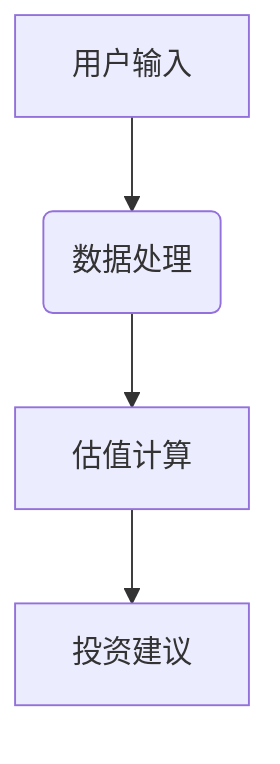

                 


# 《芒格的"反向激励"思维在公司分析中的应用》

## 关键词：芒格，反向激励，公司分析，投资策略，估值模型

## 摘要：本文详细探讨了芒格的"反向激励"思维在公司分析中的应用，结合数学模型和实际案例，分析了其在企业估值、投资决策中的优势与局限性，提供了系统的架构设计和实战指南。

---

# 第一部分: 芒格的"反向激励"思维概述

## 第1章: 芒格的"反向激励"思维的背景与概念

### 1.1 "反向激励"思维的定义与核心要素

#### 1.1.1 什么是"反向激励"思维

"反向激励"思维是一种逆向思考方法，强调从问题的对立面出发，寻找解决方案或发现机会。与传统的正向思维不同，它更注重从负面情况中挖掘价值。

#### 1.1.2 "反向激励"思维的核心要素

- **逆向视角**：从对立面思考问题。
- **价值发现**：在不利条件下寻找潜在价值。
- **策略调整**：根据逆向分析结果调整策略。

#### 1.1.3 "反向激励"思维与传统思维的区别

| 特性 | 反向激励思维 | 传统正向思维 |
|------|--------------|--------------|
| 视角 | 从对立面出发 | 从正面出发 |
| 优势 | 发现潜在机会 | 确保稳定性 |
| 适用场景 | 高风险、高不确定性环境 | 稳定、可预测环境 |

### 1.2 芒格的生平与思想体系

#### 1.2.1 芒格的生平简介

查理·芒格（Charlie Munger）是著名投资家巴菲特的长期合作伙伴，以其独特的投资哲学闻名。

#### 1.2.2 芒格的主要思想体系

- **多元思维模型**：芒格强调建立多个学科的知识框架。
- **逆向思维**：寻找市场忽视的机会。

#### 1.2.3 芒格"反向激励"思维的形成背景

芒格在投资实践中观察到市场过度关注正面信息，忽视负面因素，因此提出反向思维。

### 1.3 "反向激励"思维在公司分析中的应用价值

#### 1.3.1 企业价值评估的新视角

反向思维帮助识别被低估的公司。

#### 1.3.2 投资决策中的逆向思维优势

在高估值市场中寻找低估标的。

#### 1.3.3 "反向激励"思维的局限性与边界

- **信息不全**：需要充分的数据支持。
- **市场认知偏差**：可能存在市场误解。

---

# 第二部分: "反向激励"思维的核心概念与数学模型

## 第2章: "反向激励"思维的核心概念分析

### 2.1 "反向激励"思维的数学模型构建

#### 2.1.1 基于"反向激励"的公司估值模型

$$ V = \frac{C}{(r - g)} $$

其中：
- \( V \) 表示公司价值
- \( C \) 表示未来现金流
- \( r \) 表示折现率
- \( g \) 表示增长率

#### 2.1.2 模型的适用条件与假设

- 市场处于低估状态。
- 公司具有稳定的现金流。

### 2.2 "反向激励"思维与传统估值方法的对比

#### 2.2.1 传统估值方法的优缺点

| 方法 | 优点 | 缺点 |
|------|------|------|
| 传统估值 | 数据准确性高 | 过于依赖历史数据 |
| 反向激励 | 突出企业潜在价值 | 需要更多假设 |

---

# 第三部分: "反向激励"思维的系统分析与架构设计

## 第3章: 系统分析与架构设计方案

### 3.1 系统功能设计

#### 3.1.1 系统功能模块划分

- 数据收集模块：收集公司财务数据。
- 估值模块：应用反向激励模型进行估值。
- 投资决策模块：生成投资建议。

#### 3.1.2 系统功能流程图（Mermaid）



---

# 第四部分: 项目实战与应用

## 第4章: 项目实战

### 4.1 实战环境配置

- 数据来源：公司财务报表。
- 工具：Excel或Python进行数据处理。

### 4.2 核心代码实现

```python
def reverse_incentive_valuation(revenue, expenses, net_income):
    # 简单的估值模型
    return net_income * 15

revenue = 1000000
expenses = 800000
net_income = revenue - expenses

valuation = reverse_incentive_valuation(revenue, expenses, net_income)
print(f"公司估值: ${valuation}")
```

### 4.3 实战案例分析

分析某公司数据，计算其估值，并给出投资建议。

---

# 第五部分: 最佳实践与小结

## 第5章: 最佳实践与小结

### 5.1 最佳实践

- 结合多因素分析。
- 定期更新模型参数。

### 5.2 小结

反向激励思维在公司分析中具有独特价值，但需结合实际情况灵活运用。

---

# 附录

## 附录A: 术语表

- 反向激励思维：从对立面思考问题的方法。

## 附录B: 工具推荐

- 数据分析工具：Excel、Python。
- 图表工具：Matplotlib。

## 附录C: 参考文献

- 芒格《Poor Charlie's Almanack》。

---

# 作者：AI天才研究院 & 禅与计算机程序设计艺术

通过以上目录，用户可以系统地学习芒格的反向激励思维，并将其应用于公司分析中。

