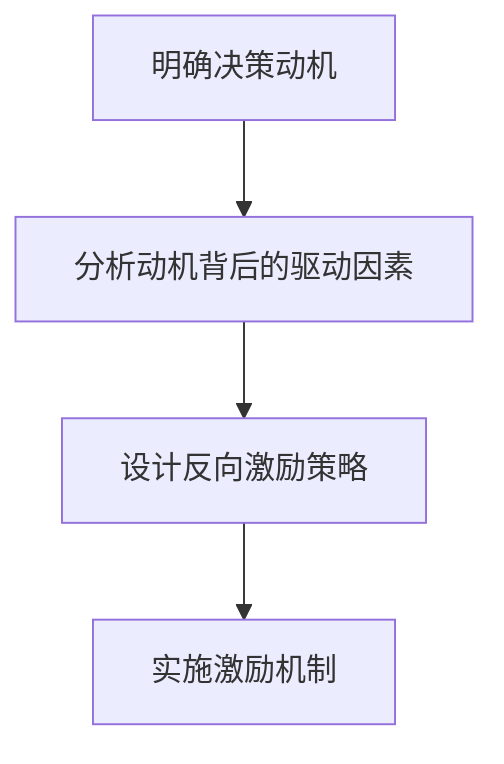
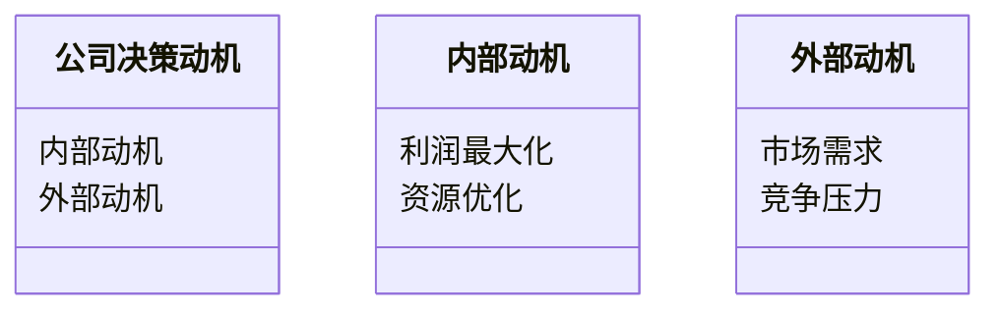

                 


# 芒格的"反向激励"思维：理解公司决策动机

> 关键词：反向激励思维, 公司决策动机, 芒格智慧, 投资决策模型, 激励理论

> 摘要：本文深入探讨芒格的“反向激励”思维，从理论基础、分析框架、实际案例等多个维度，系统阐述如何通过逆向思考理解公司决策动机。文章结合技术语言和实际案例，详细讲解反向激励思维的原理、应用方法和系统架构，帮助读者在复杂决策场景中运用这一思维模型。

---

## 第一部分：反向激励思维的理论基础

### 第1章：反向激励思维的核心概念

#### 1.1 什么是反向激励思维

反向激励思维是一种通过逆向思考，从结果推导动机的决策方法。它不同于传统的正向激励思维，强调从问题的反面出发，寻找解决方案。芒格的反向激励思维在投资和管理决策中尤为突出，其核心在于通过识别市场的非理性行为，发现被低估的机会。

**核心概念解释：**

- **反向激励思维**：通过分析问题的结果，推导出决策者的动机，从而预测未来的行为。
- **芒格智慧**：芒格通过长期的投资实践，总结出一套逆向思考的决策方法，强调寻找市场的“非理性”。

#### 1.2 芒格的决策思维

芒格的决策思维以“逆向思维”为核心，强调在市场疯狂时保持冷静，在市场恐慌时保持理性。他的决策模型基于对人性的深刻理解，尤其是对市场的非理性行为的洞察。

**关键点：**

- **市场情绪分析**：芒格认为，市场的情绪波动是决策的关键因素。
- **非理性行为识别**：通过识别市场的非理性行为，寻找被低估的机会。

### 第2章：反向激励思维的理论基础

#### 2.1 马斯洛需求层次理论与反向激励

马斯洛的需求层次理论将人类需求分为五个层次：生理需求、安全需求、社交需求、尊重需求和自我实现需求。反向激励思维通过从结果推导动机，可以更好地满足这些需求。

**对比分析：**

| 需求层次 | 正向激励 | 反向激励 |
|----------|----------|----------|
| 生理需求 | 满足基本需求 | 通过限制资源分析需求 |
| 安全需求 | 提供安全感 | 通过风险分析提升安全感 |
| 社交需求 | 建立社交关系 | 通过社交激励分析动机 |

#### 2.2 赫茨伯格的双因素理论与反向激励

赫茨伯格的双因素理论将激励分为保健因素和激励因素。反向激励思维通过分析保健因素和激励因素，设计更有效的激励机制。

**应用方法：**

1. **识别保健因素**：分析员工的基本需求，避免因这些需求未满足而导致的问题。
2. **设计激励因素**：通过反向激励，设计能够激发员工积极性的激励机制。

### 第3章：反向激励思维与传统激励理论的对比

#### 3.1 传统激励理论概述

传统激励理论主要包括马斯洛的需求层次理论和赫茨伯格的双因素理论，主要从正向激励的角度分析动机。

#### 3.2 反向激励思维与传统激励理论的区别

| 方面 | 传统激励理论 | 反向激励思维 |
|------|--------------|--------------|
| 目标 | 正向激励 | 逆向思考 |
| 方法 | 分析需求，提供激励 | 分析结果，推导动机 |
| 适用场景 | 日常激励 | 特殊决策场景 |

---

## 第二部分：反向激励思维的分析框架

### 第4章：反向激励思维的分析框架

#### 4.1 反向激励思维的分析步骤

1. **明确决策动机**：通过分析结果，识别决策背后的动机。
2. **分析动机背后的驱动因素**：识别动机的深层次原因。
3. **设计反向激励策略**：根据动机设计激励机制。

#### 4.2 反向激励思维的逻辑模型



### 第5章：反向激励思维的应用方法

#### 5.1 反向激励思维的实施步骤

1. **确定目标**：明确反向激励的目标和范围。
2. **分析市场情绪**：通过市场情绪分析，识别非理性行为。
3. **设计激励机制**：根据分析结果，设计激励机制。

#### 5.2 反向激励思维的数学模型

反向激励思维可以通过以下数学模型进行分析：

$$
\text{激励强度} = \frac{\text{市场情绪}}{\text{理性分析}}
$$

---

## 第三部分：公司决策动机的系统分析

### 第6章：公司决策动机的系统分析

#### 6.1 公司决策动机的背景介绍

公司决策动机是指企业在决策过程中，基于内部和外部因素产生的动机。反向激励思维通过分析动机，预测企业行为。

#### 6.2 公司决策动机的动机模型



---

## 第四部分：反向激励思维的项目实战

### 第7章：项目实战：环境配置与代码实现

#### 7.1 环境配置

```bash
pip install mermaid
```

#### 7.2 核心代码实现

```python
def reverse_incentive_analysis(market_emotion):
    return market_emotion / rational_analysis

# 示例
market_emotion = 0.8
rational_analysis = 2
result = reverse_incentive_analysis(market_emotion)
print(result)
```

#### 7.3 案例分析与总结

通过分析市场情绪和理性分析，设计反向激励机制，预测企业行为。

---

## 第五部分：总结与展望

### 第8章：总结与展望

#### 8.1 最佳实践 tips

- 通过反向激励思维，识别市场的非理性行为。
- 在决策中，结合市场情绪和理性分析，设计激励机制。

#### 8.2 项目小结

本文通过系统分析反向激励思维的理论基础、分析框架和实际案例，帮助读者理解如何通过逆向思考理解公司决策动机。

---

作者：AI天才研究院/AI Genius Institute & 禅与计算机程序设计艺术 /Zen And The Art of Computer Programming

