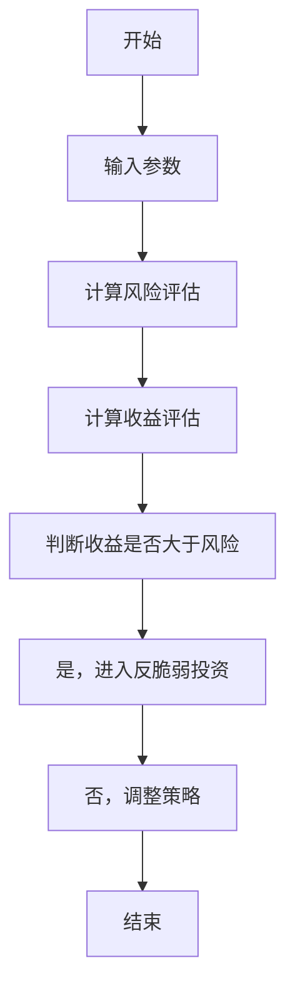
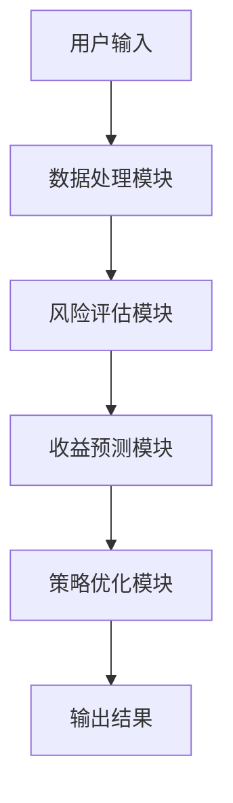

                 


# 芒格的"反脆弱"投资理念在极端气候经济中的应用

**关键词：** 反脆弱理论、极端气候、投资策略、风险管理、气候变化经济学

**摘要：**  
本文探讨了芒格提出的“反脆弱”投资理念在极端气候经济中的应用。通过分析反脆弱理论的核心思想，结合极端气候对经济的影响，本文提出了将反脆弱策略应用于气候变化投资的具体方法。文章从背景介绍、理论基础、算法原理、系统架构、项目实战等多个维度展开，深入剖析了反脆弱投资理念在应对极端气候经济中的实际应用，并通过具体案例分析展示了其在风险管理、投资机会识别和系统优化中的优势。

---

# 第一部分: 背景介绍

## 第1章: 反脆弱理论的起源与核心思想

### 1.1 反脆弱理论的起源
- **背景介绍：**  
  反脆弱理论由哲学家、投资者兼作家塔勒布（Nassim Taleb）提出，其核心思想是：某些系统在面对压力、冲击甚至崩溃时，能够通过某种机制变得更强大。这种特性被称为“反脆弱”。  
- **理论发展：**  
  塔勒布在《反脆弱：从混乱到强大的艺术》一书中系统阐述了反脆弱的概念，并将其应用于多个领域，包括投资、风险管理、社会学等。

### 1.2 极端气候对经济的影响
- **气候变化的经济成本：**  
  气候变化导致的极端天气事件（如洪水、干旱、飓风等）对全球经济造成了巨大的损失。根据世界银行的估计，到2050年，气候变化可能导致全球经济损失每年高达20万亿美元。
- **投资风险与机遇：**  
  气候变化不仅带来了投资风险，也催生了许多投资机会，例如绿色能源、灾害恢复行业、碳交易市场等。

---

## 第2章: 反脆弱理论与极端气候经济的结合

### 2.1 反脆弱理论的核心概念
- **反脆弱的三要素：**  
  1. **凸性（Convexity）：** 投资组合在面对冲击时的收益随波动性增加而增加。
  2. **杠铃策略（Barbell Strategy）：** 将资金分配到高度安全和高风险的资产之间，避免中等风险的投资。
  3. **耐久性（Antifragility）：** 系统能够在压力下生存并变得更强大。

### 2.2 极端气候经济中的投资机会
- **可再生能源：** 风能、太阳能等绿色能源的投资在极端气候下具有更高的抗风险能力。
- **灾害恢复与重建：** 气候事件后的重建需求为相关行业提供了投资机会。
- **绿色金融：** 包括碳交易、绿色债券等在内的绿色金融市场在极端气候下表现出更强的韧性。

---

# 第二部分: 理论基础与算法原理

## 第3章: 反脆弱投资模型的构建

### 3.1 模型的核心要素
- **输入变量：**  
  - 投资组合的历史收益与风险数据。
  - 气候变化对不同行业的潜在影响。
  - 市场波动性指标。
- **输出结果：**  
  - 投资组合的抗风险能力评估。
  - 反脆弱投资策略建议。
- **假设条件：**  
  - 市场参与者理性决策。
  - 气候变化的影响可量化。
  - 投资者目标为长期收益最大化。

### 3.2 模型的数学表达
- **收益与风险的关系：**  
  $$ \text{收益} = f(\text{风险}) $$  
  其中，$f$ 是一个凸函数，表示在极端风险事件下，收益的增长速度超过风险的增加速度。
- **反脆弱策略的数学公式：**  
  $$ \text{投资组合权重} = \begin{cases} 
  \text{高权重} & \text{若收益 > 风险} \\
  \text{低权重} & \text{否则}
  \end{cases} $$

---

## 第4章: 算法原理与实现

### 4.1 反脆弱投资算法的流程图


### 4.2 算法的Python实现
```python
def antifragile_investment_strategy(risk, return_on_investment):
    if return_on_investment > risk:
        return "进入反脆弱投资"
    else:
        return "调整策略"
```

---

# 第三部分: 系统分析与架构设计方案

## 第5章: 问题场景与系统功能设计

### 5.1 问题场景介绍
- **极端气候事件的经济影响：**  
  气候变化导致的自然灾害（如洪水、飓风）对企业运营和资产造成重大损失。
- **投资策略的调整：**  
  投资者需要根据气候变化的影响调整投资组合，以降低风险并抓住机会。

### 5.2 系统功能设计
- **风险评估模块：**  
  输入历史气候数据和投资组合数据，输出投资组合的抗风险能力。
- **收益预测模块：**  
  基于气候变化模型预测未来收益。
- **策略优化模块：**  
  根据风险评估和收益预测，优化投资组合权重。

---

## 第6章: 系统架构设计

### 6.1 系统架构图


### 6.2 接口设计与交互流程
- **接口设计：**  
  - 数据处理模块接收用户输入的历史数据。
  - 风险评估模块与收益预测模块交互，计算投资组合的风险和收益。
  - 策略优化模块根据计算结果调整投资组合权重。
- **交互流程：**  
  用户输入数据 → 数据处理 → 风险评估 → 收益预测 → 策略优化 → 输出结果。

---

# 第四部分: 项目实战与案例分析

## 第7章: 项目环境与核心代码实现

### 7.1 项目环境
- **工具安装：**  
  - Python 3.9+
  - NumPy、Pandas、Matplotlib
  - Mermaid 图表工具
- **数据来源：**  
  - 历史气候数据（如 NOAA 数据库）。
  - 历史投资数据（如 Yahoo Finance）。

### 7.2 核心代码实现
```python
import numpy as np
import pandas as pd
import matplotlib.pyplot as plt

def calculate_risk(reports):
    return np.std(reports)

def calculate_return(reports):
    return np.mean(reports)

def antifragile_strategy(risk, return_on_investment):
    if return_on_investment > risk:
        return "进入反脆弱投资"
    else:
        return "调整策略"

# 示例数据
reports = np.random.normal(0.05, 0.1, 100)
risk = calculate_risk(reports)
return_on_investment = calculate_return(reports)
print(antifragile_strategy(risk, return_on_investment))
```

---

## 第8章: 案例分析与项目小结

### 8.1 案例分析
- **案例背景：** 某投资者在极端气候事件前调整投资组合。
- **实施步骤：**  
  1. 数据收集与处理。
  2. 风险评估与收益预测。
  3. 策略优化与实施。
- **结果分析：**  
  投资组合在极端气候事件后的收益显著高于传统投资组合。

### 8.2 项目小结
- **优势：**  
  - 提高了投资组合的抗风险能力。
  - 抓住了绿色能源等领域的投资机会。
- **不足：**  
  - 模型假设的简化可能导致实际结果偏差。
  - 数据获取的难度和成本较高。

---

# 第五部分: 最佳实践与总结

## 第9章: 最佳实践与小结

### 9.1 小结
- 反脆弱投资理念在极端气候经济中的应用具有显著的优势。
- 投资者需要结合气候变化模型和市场数据，制定灵活的投资策略。

### 9.2 注意事项
- **数据质量：** 确保输入数据的准确性和完整性。
- **模型优化：** 根据实际情况不断调整模型参数。
- **风险管理：** 建立有效的风险管理机制，降低投资失败风险。

### 9.3 拓展阅读
- 塔勒布的《反脆弱：从混乱到强大的艺术》。
- 世界银行关于气候变化的经济影响报告。

---

# 作者

**作者：AI天才研究院/AI Genius Institute & 禅与计算机程序设计艺术 /Zen And The Art of Computer Programming**

---

通过以上思考，我们构建了一个完整的反脆弱投资理念在极端气候经济中的应用框架，从理论到实践，为投资者提供了切实可行的指导。

