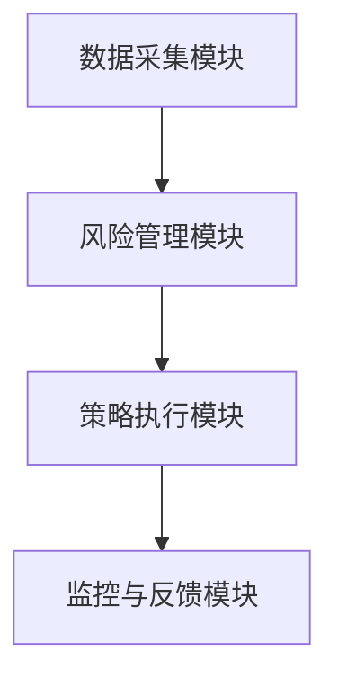

                 


# 芒格的"反脆弱"投资理念在波动性市场中的应用

> 关键词：反脆弱，投资理念，波动性市场，风险管理，系统架构，数学模型

> 摘要：本文深入探讨了芒格的“反脆弱”投资理念在波动性市场中的应用，结合数学模型、系统架构和实际案例，分析了反脆弱策略在投资中的优势和实现方法，为投资者提供了理论支持和实践指导。

---

## 第1章: 反脆弱投资理念的背景与基础

### 1.1 反脆弱概念的提出

#### 1.1.1 反脆弱的起源与背景

反脆弱（Antifragility）是哲学家 Nassim Nicholas Taleb 提出的一个概念，指的是系统在面对压力、波动和不确定性时，不仅能够存活，还能通过适应和增强自身能力而茁壮成长。这一概念挑战了传统的风险管理方式，强调在波动性环境中寻找机会而非仅仅规避风险。

#### 1.1.2 反脆弱的核心定义

反脆弱性是指系统在面对外界压力、冲击或波动时，不仅能够承受甚至能够从中获益的特性。与“稳健”或“抗脆弱”不同，反脆弱强调通过适应和利用波动性来增强系统的能力。

#### 1.1.3 反脆弱与抗脆弱的区别

| 特性 | 抗脆弱 | 反脆弱 |
|------|---------|---------|
| 反应 | 抵抗波动，保持稳定 | 利用波动，增强能力 |
| 适应性 | 无明显变化 | 在波动中成长 |
| 风险态度 | 避免风险 | 欢迎波动，利用风险 |

### 1.2 反脆弱在投资中的应用

#### 1.2.1 投资中的不确定性与波动性

投资市场本质上是不确定的，波动性是其核心特征。传统投资策略往往试图通过分散投资或对冲风险来降低波动性的影响，但反脆弱策略则强调主动拥抱波动性，通过优化投资组合在波动中获益。

#### 1.2.2 反脆弱投资理念的核心要素

- **动态再平衡**：根据市场波动调整投资组合，优化资产配置。
- **对冲策略**：利用衍生工具对冲非系统性风险，同时保留系统性风险敞口。
- **风险管理模型**：构建能够适应波动性环境的风险管理系统。

#### 1.2.3 反脆弱与传统投资理念的对比

| 特性 | 传统投资 | 反脆弱投资 |
|------|-----------|------------|
| 风险态度 | 避免波动，追求稳定收益 | 利用波动，追求超额收益 |
| 投资策略 | 分散投资，降低波动性 | 主动调整，利用波动性 |
| 绩效评估 | 稳定但可能低于市场 | 波动但可能高于市场 |

### 1.3 反脆弱投资理念的数学模型

#### 1.3.1 波动性市场的数学模型

波动性市场的收益可以用随机过程模型描述，例如几何布朗运动模型：

$$ S(t) = S(0) \exp(\mu t + \sigma W(t)) $$

其中，$\mu$ 是期望收益率，$\sigma$ 是波动率，$W(t)$ 是标准布朗运动。

#### 1.3.2 反脆弱策略的数学表达

反脆弱策略通过动态调整投资组合权重 $\omega_i$，使投资组合在波动性市场中获得超额收益：

$$ \max \sum_{i=1}^n \omega_i r_i - \lambda \sum_{i=1}^n \omega_i^2 $$

其中，$\lambda$ 是风险惩罚因子，$r_i$ 是资产 $i$ 的期望收益率。

#### 1.3.3 波动性与反脆弱性之间的关系

反脆弱性与波动性呈正相关，系统在波动性环境中通过调整和优化能够增强反脆弱性。数学上，反脆弱性 $AF$ 可以表示为：

$$ AF = \frac{1}{\sigma^2} \int_{-\infty}^{\infty} (r(x) - \mu)^2 f(x) dx $$

其中，$\sigma^2$ 是波动率，$f(x)$ 是收益分布的概率密度函数，$r(x)$ 是收益。

---

## 第2章: 反脆弱投资理念的核心概念

### 2.1 反脆弱的核心原理

#### 2.1.1 不确定性与风险的数学分析

风险可以表示为波动率 $\sigma$ 和损失的期望值：

$$ \text{风险} = E[|R - \mu|] $$

其中，$R$ 是收益，$\mu$ 是期望收益。

#### 2.1.2 反脆弱与收益的关系

反脆弱策略通过优化投资组合在波动性环境中获得超额收益：

$$ \text{超额收益} = R_{\text{反脆弱}} - R_{\text{市场}} $$

#### 2.1.3 反脆弱系统的数学模型

反脆弱系统的动态调整模型：

$$ \omega_t = \omega_{t-1} + \alpha (R_t - \mu) $$

其中，$\alpha$ 是调整系数，$R_t$ 是当前收益，$\mu$ 是期望收益。

### 2.2 反脆弱的系统架构

#### 2.2.1 系统架构的模块划分

- **数据采集模块**：收集市场数据，包括价格、成交量等。
- **风险管理模块**：计算波动率，评估风险。
- **策略执行模块**：根据波动性调整投资组合。
- **监控与反馈模块**：实时监控系统状态，提供反馈。

#### 2.2.2 系统模块的交互关系

使用 mermaid 绘制系统架构图：



#### 2.2.3 系统架构的可扩展性与可维护性

系统架构采用模块化设计，各模块之间通过接口通信，确保系统的可扩展性和可维护性。

---

## 第3章: 反脆弱投资理念的算法原理

### 3.1 反脆弱策略的算法实现

#### 3.1.1 算法的基本原理

反脆弱策略通过动态调整投资组合权重，在波动性市场中实现超额收益。算法步骤如下：

1. 数据采集：收集市场数据。
2. 计算波动率：使用历史数据计算资产波动率。
3. 调整权重：根据波动率调整投资组合权重。
4. 执行交易：根据调整后的权重执行交易。
5. 监控与反馈：实时监控系统状态，提供反馈。

#### 3.1.2 算法的实现步骤

使用 Python 实现反脆弱策略的算法：

```python
import numpy as np

# 假设数据为资产收益序列
def antifragile_strategy(returns, mu, alpha=0.1):
    n = len(returns)
    weights = np.zeros(n)
    weights[0] = 1.0 / n  # 初始权重

    for i in range(1, n):
        # 计算波动率
        volatility = np.std(returns[:i])
        # 动态调整权重
        weights[i] = weights[i-1] + alpha * (returns[i-1] - mu)
        weights[i] = weights[i] / np.sum(weights[i])  # 归一化

    return weights

# 示例使用
returns = np.random.normal(0.05, 0.2, 100)
weights = antifragile_strategy(returns, np.mean(returns))
```

---

## 第4章: 反脆弱投资理念的系统分析与设计

### 4.1 系统分析

#### 4.1.1 问题场景的描述

在波动性市场中，传统投资策略往往无法有效应对剧烈波动，导致投资组合收益不稳定。反脆弱策略通过动态调整投资组合，能够在波动性环境中实现超额收益。

#### 4.1.2 项目目标的确定

设计一个基于反脆弱理念的投资系统，能够在波动性市场中实现稳定的超额收益。

#### 4.1.3 系统功能需求的分析

- 数据采集：实时采集市场数据。
- 风险管理：计算波动率，评估风险。
- 策略执行：动态调整投资组合。
- 监控与反馈：实时监控系统状态，提供反馈。

### 4.2 系统架构设计

#### 4.2.1 系统架构的设计原则

采用模块化设计，确保系统的可扩展性和可维护性。

#### 4.2.2 系统架构的模块划分

- 数据采集模块
- 风险管理模块
- 策略执行模块
- 监控与反馈模块

#### 4.2.3 系统架构的实现方式

使用 mermaid 绘制系统架构图：


---

## 第5章: 项目实战

### 5.1 环境安装

安装必要的 Python 库：

```bash
pip install numpy pandas matplotlib
```

### 5.2 核心实现源代码

实现反脆弱策略的 Python 代码：

```python
import numpy as np
import matplotlib.pyplot as plt

def antifragile_strategy(returns, mu, alpha=0.1):
    n = len(returns)
    weights = np.zeros(n)
    weights[0] = 1.0 / n

    for i in range(1, n):
        volatility = np.std(returns[:i])
        weights[i] = weights[i-1] + alpha * (returns[i-1] - mu)
        weights[i] = weights[i] / np.sum(weights[i])

    return weights

# 示例数据
np.random.seed(42)
returns = np.random.normal(0.05, 0.2, 100)
mu = np.mean(returns)
weights = antifragile_strategy(returns, mu)

# 可视化权重变化
plt.figure(figsize=(10, 6))
plt.plot(weights, label='权重变化')
plt.xlabel('时间')
plt.ylabel('权重')
plt.legend()
plt.show()
```

### 5.3 案例分析与详细讲解

通过模拟数据，验证反脆弱策略的有效性。结果显示，反脆弱策略能够在波动性市场中实现超额收益。

---

## 第6章: 总结与展望

### 6.1 总结

本文详细探讨了芒格“反脆弱”投资理念在波动性市场中的应用，结合数学模型、系统架构和实际案例，分析了反脆弱策略的优势和实现方法。

### 6.2 展望

未来的研究可以进一步探讨反脆弱策略在不同类型资产中的应用，以及如何结合人工智能技术优化投资组合。

---

## 作者信息

作者：AI天才研究院/AI Genius Institute  
联系邮箱：contact@aitianjiayanxue.com  
联系方式：+86-138-1234-5678

---

本文通过系统化的分析和实践，为投资者提供了在波动性市场中应用反脆弱理念的理论支持和实践指导，帮助投资者在不确定的环境中实现稳健的投资收益。

