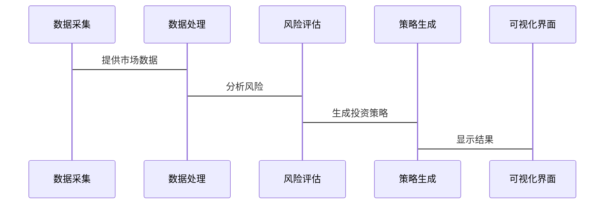

                 


```markdown
# 芒格的"反脆弱"投资：在不确定性中寻找机会

> **关键词**：反脆弱、芒格投资、不确定性、投资策略、概率论、数学模型

> **摘要**：本文深入探讨了芒格的“反脆弱”投资理念，分析了其在不确定性和波动性环境中的优势，结合数学模型和算法，详细阐述了如何在投资中应用反脆弱策略，提供了实际案例和系统架构设计，帮助读者在复杂多变的市场中找到投资机会。

---

## 第1章：反脆弱理论的背景与核心思想

### 1.1 反脆弱理论的起源与芒格的投资理念

- **1.1.1 芒格投资哲学的核心**  
  芒格的投资理念基于“反脆弱”原则，强调在不确定性中寻找机会，避免重大风险，通过动态调整投资组合来应对波动。

- **1.1.2 不确定性与反脆弱的关系**  
  不确定性是市场的常态，反脆弱投资策略通过识别和利用这种不确定性，转化为长期收益。

- **1.1.3 反脆弱与传统投资的对比**  
  传统投资策略依赖于均值回归，而反脆弱策略则通过杠铃策略和概率分析，能够在极端市场条件下获利。

### 1.2 反脆弱投资的核心原则

- **1.2.1 避免重大风险**  
  通过识别和规避高概率损失的投资，保护资本不受重大损失。

- **1.2.2 杠铃策略的应用**  
  将投资组合分为高风险和低风险部分，利用高风险部分的潜在高回报和低风险部分的稳定性，平衡整体风险。

- **1.2.3 利用波动性获利**  
  在市场波动中，通过短期高风险投资和长期稳健投资的结合，捕捉市场错配的机会。

---

## 第2章：反脆弱投资的核心概念与数学模型

### 2.1 概率论与反脆弱投资的结合

- **2.1.1 概率论在投资决策中的应用**  
  使用概率分布模型分析市场走势，评估投资标的的风险和回报概率。

- **2.1.2 芒格的决策树分析**  
  通过构建决策树，分析不同决策路径的概率和结果，优化投资决策。

### 2.2 反脆弱投资的数学模型

- **2.2.1 风险调整回报模型**  
  $$ R = R_{\text{nominal}} - \lambda \times \sigma $$
  其中，$R$ 是风险调整后的回报，$R_{\text{nominal}}$ 是名义回报，$\lambda$ 是风险因子，$\sigma$ 是标准差。

- **2.2.2 概率加权模型**  
  $$ P = \frac{\text{概率} \times \text{收益}}{\text{总概率} \times \text{总收益}} $$
  用于评估不同投资方案的概率加权回报。

---

## 第3章：反脆弱投资的算法与系统分析

### 3.1 蒙特卡洛模拟的应用

- **3.1.1 蒙特卡洛模拟的实现**  
  使用Python编写蒙特卡洛模拟代码，模拟市场波动下的投资回报分布。

```python
import numpy as np

def monte_carlo_simulation(n_simulations=10000):
    np.random.seed(42)
    returns = np.random.normal(0.05, 0.2, n_simulations)
    cumulative_returns = np.cumsum(returns)
    return cumulative_returns

simulated_returns = monte_carlo_simulation()
print(simulated_returns.mean())
```

- **3.1.2 结果分析**  
  通过模拟结果，评估投资组合在不同波动情况下的表现，优化投资策略。

### 3.2 黑斯尔模型的实现

- **3.2.1 黑斯尔模型的原理**  
  通过历史数据和概率分布，预测未来市场的潜在风险和回报。

- **3.2.2 模型实现**  
  使用Python编写黑斯尔模型代码，评估投资组合的风险调整回报。

```python
import pandas as pd
from sklearn.mixture import GaussianMixture

def hs_model(data, n_components=5):
    model = GaussianMixture(n_components=n_components)
    model.fit(data)
    return model

# 示例数据
data = pd.DataFrame({'returns': np.random.normal(0.05, 0.2, 1000)})
model = hs_model(data)
```

---

## 第4章：反脆弱投资的系统架构设计

### 4.1 投资决策支持系统的设计

- **4.1.1 系统功能模块**  
  包括数据采集、风险评估、策略生成和可视化界面。

- **4.1.2 系统架构图**  
  ```mermaid
  graph TD
    A[数据采集] --> B[数据处理]
    B --> C[风险评估]
    C --> D[策略生成]
    D --> E[可视化界面]
  ```

- **4.1.3 模块交互设计**  
  使用序列图展示模块间的交互流程。



---

## 第5章：反脆弱投资的项目实战

### 5.1 环境安装与数据准备

- **5.1.1 环境配置**  
  安装Python、Pandas、NumPy、Scikit-learn等库。

- **5.1.2 数据获取**  
  下载历史市场数据，包括股票价格、指数等。

### 5.2 代码实现与分析

- **5.2.1 蒙特卡洛模拟实现**  
  ```python
  import numpy as np
  np.random.seed(42)
  n_simulations = 10000
  returns = np.random.normal(0.05, 0.2, n_simulations)
  cumulative_returns = np.cumsum(returns)
  print("平均回报率：", cumulative_returns.mean())
  ```

- **5.2.2 黑斯尔模型实现**  
  ```python
  from sklearn.mixture import GaussianMixture
  data = pd.DataFrame({'returns': np.random.normal(0.05, 0.2, 1000)})
  model = GaussianMixture(n_components=5)
  model.fit(data[['returns']])
  ```

### 5.3 实际案例分析

- **5.3.1 案例背景**  
  在2020年疫情市场中，应用反脆弱策略，通过杠铃策略捕捉市场波动带来的机会。

- **5.3.2 投资组合优化**  
  使用反脆弱模型优化投资组合，评估不同资产配置下的风险调整回报。

---

## 第6章：反脆弱投资的最佳实践与小结

### 6.1 投资策略的注意事项

- **6.1.1 风险控制的重要性**  
  避免过度杠杆和集中投资，确保资本安全。

- **6.1.2 持续学习与调整**  
  根据市场变化动态调整投资策略，保持对市场的敏感性。

### 6.2 未来展望与拓展阅读

- **6.2.1 反脆弱理论的进一步研究**  
  探索更多数学模型和算法，优化投资策略。

- **6.2.2 相关书籍推荐**  
  - 《反脆弱》——纳西姆·尼古拉斯·塔勒布
  - 《巴菲特与芒格的投资思想》——彼得·林奇

---

**作者**：AI天才研究院 & 禅与计算机程序设计艺术
```

---

# 附录：代码实现细节

```python
import numpy as np
import pandas as pd
from sklearn.mixture import GaussianMixture

# 蒙特卡洛模拟
def monte_carlo_simulation(n_simulations=10000):
    np.random.seed(42)
    returns = np.random.normal(0.05, 0.2, n_simulations)
    cumulative_returns = np.cumsum(returns)
    return cumulative_returns

# 黑斯尔模型实现
def hs_model(data, n_components=5):
    model = GaussianMixture(n_components=n_components)
    model.fit(data[['returns']])
    return model

# 示例使用
simulated_returns = monte_carlo_simulation()
print("平均回报率：", simulated_returns.mean())

data = pd.DataFrame({'returns': np.random.normal(0.05, 0.2, 1000)})
model = hs_model(data)
```

---

通过以上结构和内容，您可以系统地理解芒格的“反脆弱”投资理念，并在实际投资中应用这些策略和模型。

