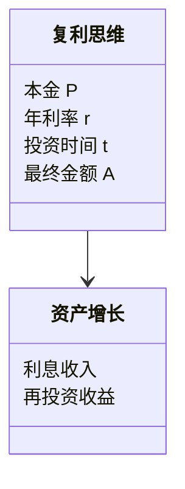

                 


# 芒格的"复利思维"在长期投资中的应用

---

## 关键词：
- 复利思维
- 长期投资
- 芒格
- 价值投资
- 风险管理

---

## 摘要：
本文深入探讨了芒格的复利思维在长期投资中的应用，从复利思维的核心概念、芒格的投资理念、长期投资策略、风险管理原则到实际操作中的策略和技巧，结合数学模型、案例分析和心理因素，全面解析如何在投资中实现复利效应的最大化。文章旨在帮助投资者理解复利思维的本质，并将其应用于实际投资中，以实现长期稳健的收益。

---

## 正文：

---

### 第一部分：复利思维的背景与核心概念

#### 第1章：复利思维的定义与背景

##### 1.1 复利思维的定义

- **复利思维**是指通过时间的积累和资源的不断增值，实现指数级增长的一种思维方式。它强调通过持续的努力和积累，使资源（如资本、知识、能力等）以几何级数增长。
- 在投资领域，复利思维的核心在于通过长期持有优质资产，让收益不断再投资，从而实现财富的指数级增长。
- 复利思维与传统投资思维的最大区别在于，前者注重时间的复利效应，而后者更关注短期收益。

##### 1.2 复利思维在投资中的重要性

- 复利效应的数学模型：
  - 复利公式：$$A = P(1 + r/n)^{nt}$$
    - \(A\)：最终金额
    - \(P\)：本金
    - \(r\)：年利率
    - \(n\)：每年的复利次数
    - \(t\)：投资时间（年）
  - 利滚利效应：复利的核心在于将收益再次投资，从而产生更多的收益。

- 复利效应对企业价值的影响：
  - 优质企业的复利效应：优秀企业通过持续创造价值，实现利润的复利增长。
  - 较差企业的线性增长：普通企业通过简单的线性增长，无法实现指数级增长。

- 复利思维与长期投资的关系：
  - 长期投资是复利效应的最佳实践场景。
  - 短期波动对复利的影响有限，但长期趋势决定最终收益。

##### 1.3 芝加哥学派与价值投资的结合

- 芝加哥学派的核心理念：
  - 强调基本面分析和长期投资。
  - 以企业内在价值为导向，而非市场短期波动。
- 价值投资的基本原则：
  - 买入低于内在价值的资产。
  - 长期持有优质资产。
  - 避免频繁交易和市场噪声的干扰。
- 芒格对价值投资的独特见解：
  - 将复利思维与价值投资结合，注重企业的竞争优势和可持续盈利能力。

---

#### 1.4 复利思维的数学模型与图表

##### 图表1：复利计算流程图

```mermaid
graph TD
    A[本金 P] --> B[年利率 r]
    B --> C[每年复利次数 n]
    C --> D[投资时间 t]
    D --> E[最终金额 A = P(1 + r/n)^{nt}]
```

##### 图表2：资产复利增长的类图



---

### 第二部分：芒格的复利思维体系

#### 第2章：芒格的复利思维体系

##### 2.1 芒格的投资理念

- 芒格的投资理念：
  - 长期投资，追求复利效应。
  - 买入优秀企业，长期持有。
  - 避免短期波动，注重长期价值。
- 芒格的选股标准：
  - 企业具有强大的竞争优势。
  - 企业具有稳定的财务状况。
  - 企业管理层具有良好的道德和能力。
- 芒格的风险管理原则：
  - 避免本金损失。
  - 通过分散投资降低风险。
  - 保持安全边际。

##### 2.2 芒格的复利思维与企业分析

- 企业基本面分析：
  - 财务状况：利润、现金流、资产负债表。
  - 竞争优势：护城河、市场地位。
  - 管理层能力：决策能力和道德水平。
- 企业竞争优势分析：
  - 技术优势：专利、研发能力。
  - 市场优势：品牌、客户忠诚度。
  - 成本优势：生产效率、供应链管理。
- 企业财务状况评估：
  - 利润增长：ROE、净利润率。
  - 现金流：自由现金流。
  - 偿债能力：负债率、流动比率。

##### 2.3 芒格的复利思维与投资决策

- 投资决策的逻辑框架：
  - 识别优质企业。
  - 评估企业价值。
  - 确定合理估值。
  - 买入并长期持有。
- 投资决策中的心理因素：
  - 避免贪婪：避免追涨杀跌。
  - 避免恐惧：面对市场下跌保持冷静。
  - 保持理性：基于基本面而非情绪做决策。
- 投资决策的长期视角：
  - 长期持有优质资产。
  - 避免频繁交易。
  - 通过复利效应实现财富增长。

---

#### 2.4 芒格的复利思维与风险管理

- 风险管理的核心原则：
  - 避免本金损失。
  - 通过分散投资降低风险。
  - 保持安全边际。
- 风险管理的具体措施：
  - 评估企业的风险因素。
  - 分散投资到不同行业和资产类别。
  - 定期审视投资组合的风险敞口。
- 风险管理的数学模型：
  - 风险调整后的收益（RAROC）：$$RAROC = \frac{净利润}{平均风险资本}$$
  - 风险价值（VaR）：在一定置信水平下，可能的最大损失。

---

### 第三部分：复利思维在长期投资中的应用

#### 第3章：复利思维与投资组合管理

##### 3.1 投资组合的构建

- 投资组合的分散化策略：
  - 跨行业分散：投资于不同行业的资产。
  - 跨资产分散：投资于股票、债券、房地产等多种资产。
- 投资组合的风险管理：
  - 定期审视投资组合的构成。
  - 调整资产配置以应对市场变化。
- 投资组合的长期收益目标：
  - 设定合理的收益目标。
  - 通过复利效应实现长期收益最大化。

##### 3.2 复利思维与资产配置

- 资产配置的基本原则：
  - 根据风险承受能力配置资产。
  - 根据市场环境调整资产配置。
- 不同资产类别的复利效应：
  - 股票：长期复利效应最佳。
  - 债券：相对稳定的收益。
  - 房地产：通过杠杆实现复利增长。
- 资产配置的动态调整：
  - 定期评估市场环境。
  - 根据市场变化调整资产配置。

##### 3.3 复利思维与市场波动

- 市场波动对复利的影响：
  - 短期波动不影响长期复利效应。
  - 市场下跌时，复利效应可能暂时停滞，但长期仍能恢复增长。
- 如何应对市场波动：
  - 保持长期视角。
  - 避免频繁交易。
  - 利用市场波动进行逆势投资。

---

#### 3.4 复利思维的实际操作策略

- 价值投资与成长投资的结合：
  - 买入低估的价值股。
  - 投资于具有成长性的企业。
- 定期审视投资组合：
  - 每年至少审视一次投资组合。
  - 根据企业基本面变化调整持仓。
- 选择优质企业进行长期投资：
  - 买入并持有优质企业的股票。
  - 通过股息再投资实现复利效应。

---

### 第四部分：复利思维的数学模型与实际应用

#### 第4章：复利思维的数学模型与实际应用

##### 4.1 复利思维的数学模型

- 复利公式：
  $$A = P(1 + r)^t$$
  - 举例：本金100元，年利率10%，投资10年，最终金额为$$100(1 + 0.1)^{10} = 259.37元$$
- 利滚利效应的计算：
  - 本金100元，年利率10%，10年后的复利收益为159.37元。

##### 4.2 复利思维的实际应用案例

- 案例1：长期持有优质股票
  - 买入苹果公司股票，长期持有。
  - 通过复利效应实现财富增长。
- 案例2：定期定额投资
  - 每月定投指数基金。
  - 通过复利效应实现资产增值。

##### 4.3 复利思维的注意事项

- 避免高风险投资：
  - 高风险投资可能导致本金损失。
  - 选择优质资产进行投资。
- 避免短期波动干扰：
  - 短期波动不影响长期复利效应。
  - 避免频繁交易。

---

### 第五部分：结论与展望

#### 5.1 结论

- 复利思维是实现长期投资收益的重要工具。
- 芒格的投资理念为复利思维提供了深刻的理论支持。
- 长期投资需要结合复利思维和风险管理，才能实现稳健的收益。

#### 5.2 展望

- 复利思维在投资中的应用前景广阔。
- 随着金融市场的不断发展，复利思维将发挥更大的作用。
- 投资者需要不断学习和实践，才能更好地应用复利思维实现财富增长。

---

## 附录

#### 附录A：进一步阅读的书籍推荐

- 《巴菲特的阴谋》
- 《投资最重要的事》
- 《价值投资实战策略》

#### 附录B：芒格的经典语录

- “时间是伟大企业的朋友，是平庸企业的敌人。”
- “投资的秘诀在于找到那些具有持续竞争优势的公司。”
- “避免愚蠢的错误，保持理性。”

#### 附录C：工具与资源

- 股票筛选工具：Morningstar、FactSet。
- 财务分析工具：Excel、Python（Pandas、NumPy）。
- 投资组合管理工具：Portfolio Visualizer、Morningstar。

---

## 作者

作者：AI天才研究院/AI Genius Institute & 禅与计算机程序设计艺术 /Zen And The Art of Computer Programming

