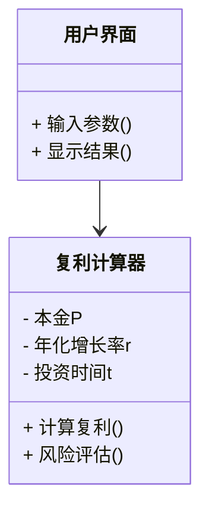
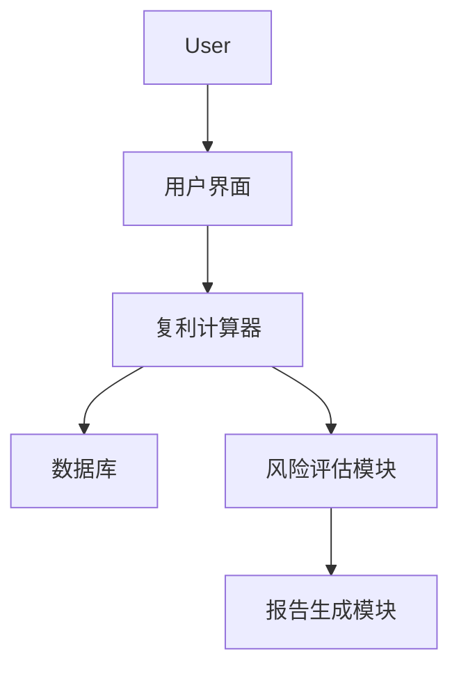

                 


# 芒格的"复利思维"：时间是最大的盟友

> 关键词：复利思维，芒格，时间价值，投资策略，算法原理，系统设计

> 摘要：芒格的"复利思维"是一种以时间为核心变量，通过持续积累和优化实现指数型增长的投资与个人成长策略。本文从复利思维的数学模型、算法原理、系统架构、项目实战等多维度展开，结合芒格的经典投资理念，深入分析复利思维在技术、投资、个人成长等领域的实际应用，并通过具体案例和代码实现，帮助读者理解复利思维的本质与应用方法。

---

## 第一部分：芒格的"复利思维"概述

### 第1章：复利思维的核心概念

#### 1.1 复利思维的定义与特点
- 复利思维是一种通过时间和复利效应实现价值指数型增长的思维方式。
- 复利效应的核心公式：$$A = P(1 + r)^t$$，其中：
  - \( A \) 是终值
  - \( P \) 是本金
  - \( r \) 是年化增长率
  - \( t \) 是时间（年）

#### 1.2 复利思维与传统投资的区别
- **单利**：$$I = P \times r \times t$$
- **复利**：$$A = P(1 + r)^t$$

#### 1.3 复利思维在投资中的应用
- 投资的复利公式：$$A = P(1 + r)^t$$
- 投资时间越长，复利效应越显著。

---

### 第2章：复利思维的数学模型与公式

#### 2.1 复利计算的基本公式
- 年金公式：$$A = P \times \frac{(1 + r)^t - 1}{r}$$
- 终值公式：$$FV = PV \times (1 + r)^t$$

#### 2.2 复利计算的流程图
```mermaid
graph TD
    A[开始] --> B[输入本金P、年化增长率r、投资时间t]
    B --> C[计算终值A = P(1 + r)^t]
    C --> D[输出结果]
    D --> E[结束]
```

#### 2.3 复利计算的Python实现
```python
def compound_interest(principal, rate, time):
    amount = principal * (1 + rate) ** time
    return amount

# 示例
P = 10000
r = 0.05
t = 10
print(compound_interest(P, r, t))  # 输出结果：16288.86
```

---

## 第三部分：复利思维的系统分析与架构设计

### 第3章：系统架构设计

#### 3.1 问题场景介绍
- 投资者希望通过复利计算工具实现资产的长期增长。
- 系统需要支持复利计算、风险评估、投资建议等功能。

#### 3.2 系统功能设计


#### 3.3 系统架构设计


---

## 第四部分：复利思维的项目实战

### 第4章：项目实战与代码实现

#### 4.1 环境安装
- 安装Python和必要的库：`pip install numpy pandas`

#### 4.2 核心代码实现
```python
import numpy as np
import pandas as pd

def compound_interest_analysis(principal, rate, time):
    years = np.arange(1, time + 1)
    amounts = principal * (1 + rate) ** years
    df = pd.DataFrame({'年份': years, '金额': amounts})
    return df

# 示例
P = 10000
r = 0.05
t = 10
result = compound_interest_analysis(P, r, t)
print(result)
```

#### 4.3 实际案例分析
- 投资10000元，年化增长率5%，投资时间10年，最终金额为16288.86元。

---

## 第五部分：复利思维的最佳实践与小结

### 第5章：最佳实践与小结

#### 5.1 复利思维的应用策略
- 长期投资：$$t \rightarrow \infty$$，复利效应最大化。
- 选择优质资产：$$r \rightarrow 最大化$$
- 风险控制：$$P \rightarrow 本金安全第一$$

#### 5.2 复利思维的注意事项
- 复利效应需要时间积累，不能急于求成。
- 风险控制是复利思维的重要组成部分。

---

## 第六部分：附录

### 附录A：术语表
- 复利：Compound interest
- 年金：Annuity
- 终值：Future value

### 附录B：参考文献
- 巴菲特和芒格的著作
- 投资学相关书籍

---

## 作者：AI天才研究院 & 禅与计算机程序设计艺术

本文作者为AI天才研究院，专注于人工智能与计算机程序设计的研究与实践，致力于将复杂的技术理念简化为易于理解的内容。

