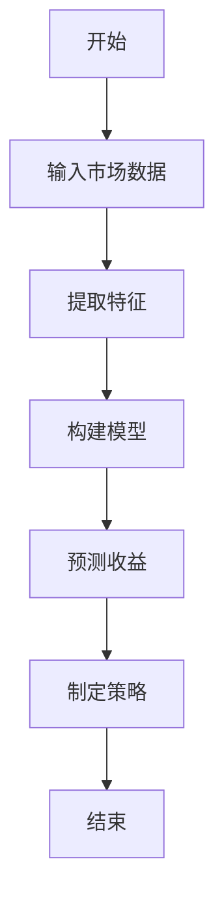
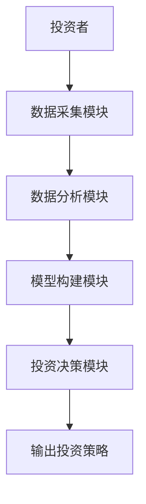

                 


# 芒格的多元思维方式在投资中的运用

> 关键词：芒格思维模型，投资分析，多元因素模型，决策流程，系统设计

> 摘要：芒格的多元思维模型是一种通过跨学科视角进行问题分析的方法，其核心在于将各个领域的知识结合起来，以避免单一思维的局限性。本文将详细探讨芒格的多元思维模型在投资中的具体应用，包括其核心概念、算法原理、系统架构设计，以及实际案例分析。通过本文，读者将能够理解如何将多元思维模型应用于投资决策，并通过具体的代码实现和系统设计来掌握其实际操作方法。

---

## 第一部分：芒格多元思维模型的背景与基础

### 第1章：芒格多元思维模型的概述

#### 1.1 芒格多元思维模型的起源与核心理念

- **1.1.1 芝加格学派与芒格的思维体系**
  - 芒格的多元思维模型起源于芝加哥学派的跨学科研究方法，强调通过多个学科的视角来分析问题。
  - 芝加格学派注重实证分析和数据驱动的决策，这为芒格的思维方式奠定了基础。

- **1.1.2 多元思维模型的核心概念**
  - 多元思维模型是指通过多个学科的知识框架来分析问题，避免单一视角的局限性。
  - 核心理念在于“通过多个角度观察问题，才能全面理解其本质”。

- **1.1.3 多元思维模型在投资中的应用价值**
  - 在投资领域，多元思维模型可以帮助投资者更好地理解市场的复杂性，避免盲点。
  - 通过结合经济学、心理学、统计学等多个学科的视角，投资者可以做出更全面的决策。

#### 1.2 多元思维模型与传统投资方法的对比

- **1.2.1 传统投资方法的局限性**
  - 传统投资方法往往依赖单一的分析框架，如技术分析或基本面分析。
  - 这种单一视角可能导致投资者忽略市场的复杂性和不确定性。

- **1.2.2 多元思维模型的优势**
  - 多元思维模型通过结合多个学科的视角，能够更全面地分析投资机会和风险。
  - 通过跨学科的综合分析，投资者可以更好地应对市场的变化。

- **1.2.3 两者的结合与互补**
  - 多元思维模型可以作为传统投资方法的补充，帮助投资者更全面地分析问题。
  - 通过结合多元思维模型，投资者可以在传统方法的基础上，增加更多的分析维度。

---

## 第二部分：芒格多元思维模型的核心概念与联系

### 第2章：多元思维模型的原理与构成

#### 2.1 多元思维模型的原理

- **2.1.1 跨学科视角的应用**
  - 多元思维模型的核心在于通过多个学科的视角来分析问题。
  - 例如，经济学可以帮助理解市场的供需关系，心理学可以帮助理解投资者的行为。

- **2.1.2 逆向思维与问题解决**
  - 逆向思维是指从问题的反面入手，寻找解决问题的方法。
  - 在投资中，逆向思维可以帮助投资者发现被市场忽视的机会。

- **2.1.3 复利效应与长期价值**
  - 复利效应是指通过长期的积累，使价值呈指数级增长。
  - 在投资中，复利效应可以帮助投资者实现财富的长期增长。

#### 2.2 多元思维模型的核心构成

- **2.2.1 经济学基础**
  - 经济学是多元思维模型的重要组成部分，帮助理解市场的运行机制。
  - 例如，通过经济学的视角，可以分析市场的供需关系、价格波动等。

- **2.2.2 心理学与行为经济学**
  - 心理学可以帮助理解投资者的行为和情绪，避免情绪化决策。
  - 行为经济学结合了心理学和经济学的视角，帮助理解市场中的非理性行为。

- **2.2.3 统计学与概率论**
  - 统计学和概率论是多元思维模型的重要工具，帮助分析数据和预测未来趋势。
  - 例如，通过统计学的方法，可以分析历史数据，预测未来的价格走势。

### 第3章：多元思维模型的核心概念对比

#### 3.1 核心概念对比表

| **学科视角**       | **核心概念**               | **在投资中的应用**                                      |
|--------------------|---------------------------|--------------------------------------------------------|
| 经济学             | 市场供需关系               | 分析市场的供需变化，预测价格走势                         |
| 心理学             | 投资者行为与情绪           | 理解投资者的心理，避免情绪化决策                           |
| 统计学             | 数据分析与概率预测         | 通过数据分析，预测市场趋势                               |

#### 3.2 ER实体关系图

```mermaid
erDiagram
    actor 投资者 {
        <属性> 资金需求
        <属性> 风险偏好
    }
    actor 市场环境 {
        <属性> 经济指标
        <属性> 行业趋势
    }
    entity 投资决策 {
        <键> 投资策略
        <属性> 投资组合
        <属性> 预期收益
    }
    investor --> 投资决策 : 制定
    市场环境 --> 投资决策 : 影响
```

---

## 第三部分：芒格多元思维模型的算法原理与数学模型

### 第4章：多元思维模型的算法原理

#### 4.1 多元因素分析模型

- **4.1.1 模型的构建与输入**
  - 多元因素分析模型是一个基于多个因素的分析框架，用于预测投资收益。
  - 输入包括市场数据、行业趋势、公司基本面等。

- **4.1.2 数据处理与特征提取**
  - 数据处理：对输入数据进行清洗和标准化。
  - 特征提取：从数据中提取关键特征，例如市盈率、市净率等。

- **4.1.3 结果输出与决策支持**
  - 模型输出：预测投资收益和风险。
  - 决策支持：基于模型输出，制定投资策略。

#### 4.2 投资决策流程图



### 第5章：数学模型与公式解析

#### 5.1 多元回归模型

- **多元回归模型公式**
  $$ y = \beta_0 + \beta_1x_1 + \beta_2x_2 + \cdots + \beta_nx_n + \epsilon $$
  - 其中，$y$ 是投资收益，$x_i$ 是各个影响因素，$\beta_i$ 是回归系数，$\epsilon$ 是误差项。

- **模型应用**
  - 通过多元回归模型，可以分析各个因素对投资收益的影响程度。
  - 例如，可以分析市盈率、市净率、行业趋势等因素对股票价格的影响。

---

## 第四部分：系统分析与架构设计

### 第6章：投资决策支持系统

#### 6.1 系统功能设计

- **功能模块**
  - 数据采集：收集市场数据、公司基本面等。
  - 数据分析：对数据进行处理和特征提取。
  - 模型构建：基于多元思维模型构建分析框架。
  - 投资决策：基于模型输出，制定投资策略。

#### 6.2 系统架构设计



#### 6.3 接口设计与交互流程

- **接口设计**
  - 数据采集模块与外部数据源对接。
  - 投资决策模块与投资者的交互界面对接。

- **交互流程**
  1. 投资者输入投资目标和约束条件。
  2. 系统采集相关数据并进行分析。
  3. 系统构建多元回归模型并预测收益。
  4. 投资者根据模型输出制定投资策略。

---

## 第五部分：项目实战与案例分析

### 第7章：苹果公司投资价值分析

#### 7.1 环境安装与数据准备

- **环境安装**
  - 安装Python、Pandas、Scikit-learn等工具。

- **数据准备**
  - 收集苹果公司的历史数据、行业趋势等。

#### 7.2 核心实现源代码

```python
import pandas as pd
from sklearn.linear_model import LinearRegression

# 数据准备
data = pd.read_csv('apple_data.csv')
X = data[['市盈率', '市净率', '行业趋势']]
y = data['收益']

# 模型构建
model = LinearRegression()
model.fit(X, y)

# 预测收益
predicted = model.predict(X)
print(predicted)
```

#### 7.3 案例分析与解读

- **案例分析**
  - 通过多元回归模型，分析苹果公司的投资价值。
  - 结果显示，市盈率和行业趋势对收益的影响较大。

- **代码解读**
  - 数据准备：读取数据并提取特征。
  - 模型构建：使用线性回归模型进行预测。
  - 预测结果：输出预测收益。

---

## 第六部分：最佳实践与总结

### 第8章：芒格思维模型的应用技巧

#### 8.1 小结

- 多元思维模型是一种强大的工具，可以帮助投资者更好地理解市场的复杂性。
- 通过结合多个学科的视角，投资者可以做出更全面的决策。

#### 8.2 注意事项

- 避免过于依赖单一模型，应结合实际情况灵活应用。
- 投资者需要持续学习，不断更新知识库。

#### 8.3 拓展阅读

- 建议阅读芒格的《穷查理宝典》，深入理解多元思维模型的核心思想。

---

## 作者信息

作者：AI天才研究院/AI Genius Institute & 禅与计算机程序设计艺术 /Zen And The Art of Computer Programming

---

**注：** 由于篇幅限制，上述大纲并未包含完整的内容，但展示了每个部分的主要结构和详细内容的编写思路。

