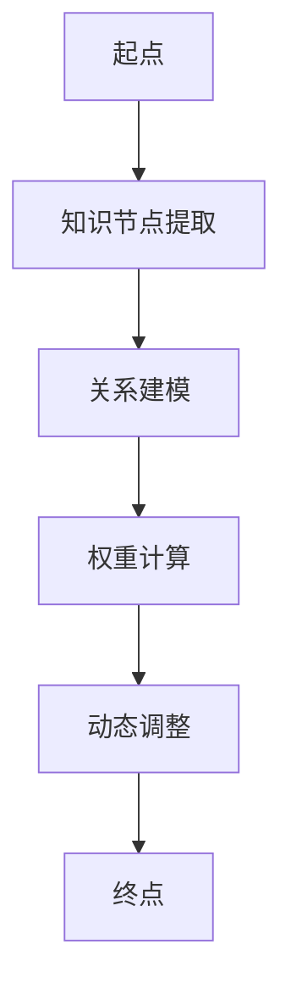

                 


# 芮格的"多元思维格栅"在跨学科创新项目评估中的应用

## 关键词：多元思维格栅、跨学科创新、项目评估、系统架构、算法原理、知识网络、动态优化

## 摘要：  
芒格的“多元思维格栅”是一种通过整合多学科知识来构建知识网络的思维方式，其核心在于通过跨学科的视角来解决问题。本文将从理论到实践，详细探讨多元思维格栅在跨学科创新项目评估中的应用，包括其数学模型、算法原理、系统架构设计以及实际案例分析。通过本文，读者可以掌握如何利用多元思维格栅来优化项目评估流程，提升跨学科创新项目的成功率。

---

## 第一部分：多元思维格栅的定义与核心概念

### 第1章：多元思维格栅的定义与核心概念

#### 1.1 多元思维格栅的定义
- **1.1.1 多元思维格栅的起源与背景**  
  多元思维格栅由查理·芒格提出，是一种通过整合多个学科的知识框架来辅助决策和问题解决的方法。其核心思想是通过构建一个由多个知识领域交叉形成的“格栅”，来帮助人们更全面地看待问题。

- **1.1.2 多元思维格栅的核心要素**  
  多元思维格栅由知识节点、关系节点和权重节点组成。知识节点代表具体的学科或概念，关系节点表示节点之间的联系，权重节点则表示节点之间的关联强度。

- **1.1.3 多元思维格栅与传统思维模型的对比**  
  传统思维模型通常局限于单一学科或领域，而多元思维格栅强调跨学科的整合，能够更好地应对复杂问题。

#### 1.2 多元思维格栅的核心特点
- **1.2.1 跨学科整合能力**  
  多元思维格栅通过整合多个学科的知识，形成一个完整的知识网络，从而能够从多个角度分析问题。

- **1.2.2 知识网络的构建方法**  
  通过构建知识网络，可以将分散的知识点有机地连接起来，形成一个动态调整的知识系统。

- **1.2.3 格栅的动态调整与优化**  
  多元思维格栅并非一成不变，而是可以根据实际问题的需求进行动态调整和优化。

---

## 第二部分：多元思维格栅的数学模型与算法原理

### 第2章：多元思维格栅的数学模型与算法原理

#### 2.1 多元思维格栅的数学模型
- **2.1.1 知识网络的构建与表示**  
  知识网络可以通过图论中的图来表示，其中节点代表知识，边代表节点之间的关系。

- **2.1.2 格栅节点之间的关系模型**  
  芮格节点之间的关系可以用权重来表示，权重反映了节点之间的关联强度。

- **2.1.3 格栅权重的计算公式**  
  权重可以通过以下公式计算：
  $$w_{ij} = \frac{1}{1 + |i - j|}$$
  其中，$i$ 和 $j$ 分别代表两个节点的位置。

#### 2.2 多元思维格栅的算法实现
- **2.2.1 知识节点的提取与分类**  
  首先需要从文本中提取知识节点，并进行分类。

- **2.2.2 格栅关系的动态调整**  
  根据实际问题的需求，动态调整格栅中的关系权重。

- **2.2.3 算法流程图（使用 mermaid）**



---

## 第三部分：多元思维格栅在跨学科创新项目评估中的应用

### 第3章：多元思维格栅在跨学科创新项目评估中的应用

#### 3.1 跨学科创新项目评估的背景与挑战
- **3.1.1 项目评估的复杂性**  
  跨学科项目通常涉及多个领域，评估难度较大。

- **3.1.2 跨学科整合的必要性**  
  通过整合多个学科的知识，可以更好地评估项目。

- **3.1.3 格栅模型的优势**  
  格栅模型能够帮助我们从多个角度分析项目，提高评估的全面性。

#### 3.2 多元思维格栅的应用方法
- **3.2.1 项目评估框架的设计**  
  根据项目特点设计评估框架，确保覆盖所有相关领域。

- **3.2.2 知识网络的构建与分析**  
  通过构建知识网络，分析项目中的关键节点。

- **3.2.3 格栅模型的动态优化**  
  根据评估结果动态调整格栅模型，优化评估流程。

#### 3.3 项目评估的系统分析与架构设计

- **3.3.1 系统功能模块划分**  
  系统功能模块包括知识节点提取、关系建模、权重计算和动态调整。

- **3.3.2 系统架构设计（使用 mermaid）**


---

## 第四部分：项目实战与最佳实践

### 第4章：跨学科创新项目评估的实战分析

#### 4.1 项目环境搭建
- **4.1.1 环境配置**  
  需要安装Python、依赖库和工具。

#### 4.2 核心代码实现
- **4.2.1 知识节点提取**  
  使用自然语言处理技术提取知识节点。

- **4.2.2 格栅关系的动态调整**  
  根据评估结果动态调整格栅关系。

- **4.2.3 代码实现（示例）**

```python
import networkx as nx

def calculate_weights(n):
    return [1 / (1 + abs(i - j)) for j in range(n)]

G = nx.Graph()
nodes = ["Physics", "Math", "Computer Science"]
weights = calculate_weights(len(nodes))
for i in range(len(nodes)):
    for j in range(i + 1, len(nodes)):
        G.add_edge(nodes[i], nodes[j], weight=weights[i][j])

print(nx.adjacency_matrix(G))
```

#### 4.3 案例分析与结果解读
- **4.3.1 案例分析**  
  通过具体案例分析，展示多元思维格栅在项目评估中的应用效果。

- **4.3.2 结果解读**  
  解读评估结果，提出改进建议。

#### 4.4 项目总结与经验教训
- **4.4.1 项目总结**  
  总结项目实施过程中的经验和教训。

- **4.4.2 注意事项**  
  提醒读者在实际应用中需要注意的问题。

---

## 第五部分：总结与展望

### 第5章：总结与展望

#### 5.1 总结
- 本文详细探讨了多元思维格栅在跨学科创新项目评估中的应用，包括其数学模型、算法原理和实际案例分析。

#### 5.2 未来展望
- 随着人工智能和大数据技术的发展，多元思维格栅的应用将更加广泛，未来可以在更多领域进行深入研究。

---

## 作者信息

作者：AI天才研究院/AI Genius Institute & 禅与计算机程序设计艺术 /Zen And The Art of Computer Programming

---

通过本文，读者可以全面了解多元思维格栅在跨学科创新项目评估中的应用，并能够将其应用到实际项目中，提升项目的评估效率和准确性。

