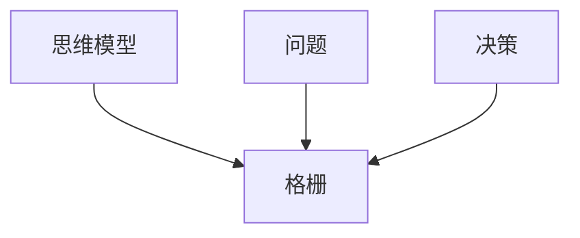
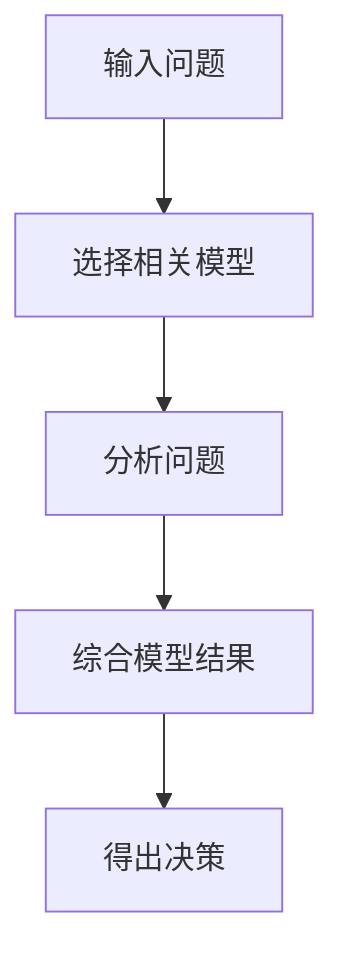
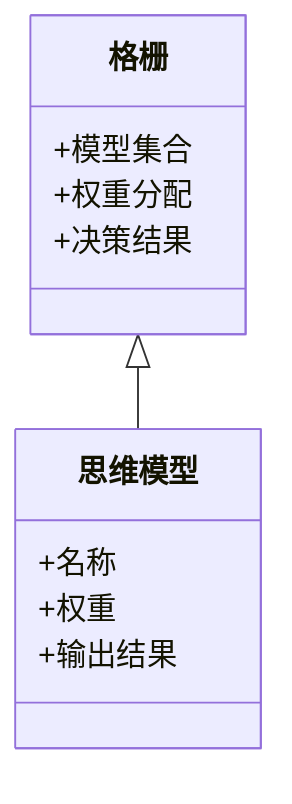

                 


---

# 芒格的"多元思维格栅"：提高决策质量的工具

> 关键词：芒格, 多元思维格栅, 决策质量, 思维模型, 问题解决

> 摘要：本文深入探讨了芒格提出的“多元思维格栅”这一决策工具，分析其核心概念、系统架构及实际应用。通过详细讲解多元思维模型的原理、结构与应用，本文旨在为读者提供一个系统化、结构化的决策框架，帮助他们在复杂问题中做出更明智的决策。

---

# 第一部分: 芒格的"多元思维格栅"概述

## 第1章: 引言

### 1.1 问题背景

#### 1.1.1 决策在个人与组织中的重要性

在现代生活中，无论是个人还是组织，决策无处不在。从日常的购物选择，到企业战略的制定，每一个决策都可能对结果产生重大影响。然而，决策往往面临信息不全、不确定性高、利益冲突等挑战，这些都使得决策过程复杂而困难。

#### 1.1.2 现有决策工具的局限性

传统的决策方法，如简单的成本收益分析、SWOT分析等，往往过于简化问题，难以捕捉决策中的复杂性和多维度因素。这些方法通常只考虑单一维度的信息，忽略了问题的复杂性和多变性，导致决策质量不高。

#### 1.1.3 多元思维格栅的提出与目标

为了克服传统决策工具的局限性，芒格提出了“多元思维格栅”这一概念。其目标是通过整合多个学科的思维模型，构建一个多层次、多维度的决策框架，从而提高决策的全面性和准确性。

### 1.2 问题描述

#### 1.2.1 决策过程中的常见误区

在实际决策过程中，人们常常陷入一些误区，例如过度依赖直觉、忽略相关模型、片面考虑问题等。这些误区可能导致决策偏差，甚至引发严重后果。

#### 1.2.2 复杂问题的简化与分解

复杂问题通常涉及多个变量和因素，如何将其分解为可管理的部分，并找到关键影响因素，是决策过程中的关键挑战。

#### 1.2.3 多元思维模型的必要性

为了应对复杂问题，需要一个能够整合多个视角、模型和工具的框架。多元思维格栅通过将多个学科的思维模型有机结合起来，提供了这样一个框架。

### 1.3 问题解决

#### 1.3.1 多元思维模型的定义

多元思维模型是指将多个学科的理论、模型和工具整合起来，用于分析和解决复杂问题的方法。

#### 1.3.2 格栅的概念与作用

格栅是一种结构化的框架，用于组织和整合多个思维模型，帮助决策者从多个维度分析问题，避免单一视角的局限性。

#### 1.3.3 提高决策质量的方法

通过构建多元思维格栅，整合多个学科的模型和工具，全面分析问题，从而提高决策的准确性和可靠性。

### 1.4 格栅的边界与外延

#### 1.4.1 格栅的适用范围

多元思维格栅适用于各种复杂决策场景，包括商业战略、个人决策、政策制定等领域。

#### 1.4.2 格栅与其他决策工具的区别

与传统决策工具相比，格栅的优势在于其多维度、多层次的分析框架，能够更好地捕捉问题的复杂性。

#### 1.4.3 格栅的局限性与改进方向

格栅的局限性在于需要大量知识储备和经验积累，否则可能导致模型选择不当或分析深度不足。

### 1.5 格栅的核心要素

#### 1.5.1 格栅的结构与组成

格栅由多个思维模型组成，每个模型代表一个学科或领域的分析视角。

#### 1.5.2 格栅的层级与深度

格栅的层级可以分为基础层、中间层和顶层，分别对应具体模型、模型组合和综合决策。

#### 1.5.3 格栅的动态调整机制

根据实际情况和反馈，不断调整和优化格栅中的模型和权重，以适应新的问题和环境变化。

---

## 第2章: 多元思维格栅的核心概念与联系

### 2.1 多元思维模型的原理

#### 2.1.1 多元思维模型的数学模型

多元思维模型可以看作是一个多变量的分析框架，每个模型代表一个变量，整体决策结果是这些变量的综合函数。

#### 2.1.2 多元思维模型的公式推导

假设我们有n个思维模型，每个模型的输出为f_i，权重为w_i。则最终决策结果D可以表示为：

$$ D = \sum_{i=1}^{n} w_i \cdot f_i $$

其中，权重w_i表示模型i的重要性，f_i是模型i的输出结果。

#### 2.1.3 多元思维模型的属性特征对比表格

| 属性      | 单一模型         | 多元模型         |
|-----------|------------------|------------------|
| 分析维度   | 单一维度         | 多维度           |
| 知识基础   | 单一学科         | 多学科           |
| 决策质量   | 低               | 高               |

### 2.2 多元思维模型的ER实体关系图



### 2.3 多元思维模型的算法原理



### 2.4 多元思维模型的数学公式

$$ \text{决策质量} = \sum_{i=1}^{n} \text{模型权重}_i \times \text{模型输出}_i $$

---

## 第3章: 多元思维格栅的系统分析与架构设计

### 3.1 问题场景介绍

#### 3.1.1 复杂决策场景的描述

以商业战略决策为例，企业需要考虑市场、竞争、财务、技术等多个因素，传统的单一模型难以全面分析。

#### 3.1.2 格栅在决策中的作用

通过整合多个模型，格栅能够从多个角度分析问题，提供全面的视角。

#### 3.1.3 系统的目标与范围

构建一个能够整合多个模型的框架，支持复杂决策。

### 3.2 项目介绍

#### 3.2.1 项目目标

构建一个多元思维格栅框架，支持复杂问题的决策。

#### 3.2.2 项目范围

包括模型选择、权重分配、结果综合等模块。

#### 3.2.3 项目关键成功因素

知识的深度和广度，模型的适用性和准确性。

### 3.3 系统功能设计

#### 3.3.1 领域模型Mermaid类图



#### 3.3.2 系统架构设计Mermaid架构图

```mermaid
graph TD
用户 -> 格栅处理
格栅处理 --> 模型分析
模型分析 --> 决策输出
```

#### 3.3.3 系统接口设计

用户输入问题，系统选择相关模型进行分析，最终输出决策结果。

#### 3.3.4 系统交互Mermaid序列图

```mermaid
sequenceDiagram
用户 -> 格栅: 提交问题
格栅 -> 思维模型1: 分析问题
思维模型1 -> 格栅: 返回结果
格栅 -> 思维模型2: 分析问题
思维模型2 -> 格栅

...

格栅 -> 思维模型N: 分析问题
思维模型N -> 格栅
格栅 -> 用户: 返回决策
```

---

## 第4章: 项目实战

### 4.1 环境安装

需要安装Python、相关库（如numpy、pandas）和Mermaid工具。

### 4.2 系统核心实现源代码

以下是一个简单的多元思维格栅实现示例：

```python
import numpy as np

class 思维模型:
    def __init__(self, name):
        self.name = name
        self.weight = 0.1  # 默认权重

    def analyze(self, problem):
        # 简单的模型分析方法
        return np.random.random()

class 多元思维格栅:
    def __init__(self):
        self.模型集合 = []

    def 添加模型(self, 模型):
        self.模型集合.append(模型)

    def 分析问题(self, problem):
        总和 = 0
        for 模型 in self.模型集合:
            结果 = 模型.analyze(problem)
            总和 += 模型.weight * 结果
        return 总和

    def 决策(self, problem):
        return self.分析问题(problem)
```

### 4.3 代码应用解读与分析

上述代码定义了一个多元思维格栅类，包含添加模型和分析问题的方法。每个模型都有自己的权重和分析方法，格栅将所有模型的结果综合起来，得出最终决策。

### 4.4 实际案例分析

以商业战略决策为例，假设我们有市场模型、竞争模型、财务模型等多个模型。格栅将综合这些模型的结果，得出最终的商业决策。

### 4.5 详细讲解剖析

通过实际案例，分析每个模型的输出如何影响最终决策，展示多元思维格栅的优势。

---

## 第5章: 最佳实践 tips、小结、注意事项、拓展阅读

### 5.1 最佳实践 tips

- 定期更新模型和权重，保持格栅的适用性。
- 选择合适的模型，避免过多或过少。
- 结合实际问题，灵活调整格栅结构。

### 5.2 小结

本文详细介绍了芒格的多元思维格栅，从核心概念到系统架构，再到实际应用，为读者提供了一个全面的框架。

### 5.3 注意事项

- 确保模型的准确性和适用性。
- 避免模型过多导致的复杂性。
- 定期回顾和优化格栅。

### 5.4 拓展阅读

推荐阅读芒格的《穷查理宝典》以及相关思维模型的书籍。

---

# 作者：AI天才研究院/AI Genius Institute & 禅与计算机程序设计艺术 /Zen And The Art of Computer Programming

