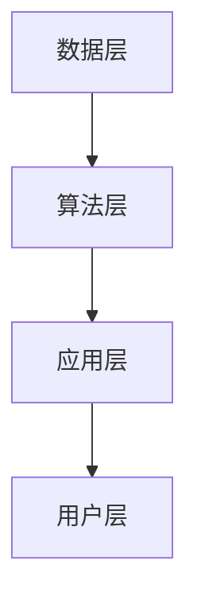

                 


# 芒格的"多元思维模型"在人工智能时代的升级

## 关键词：多元思维模型, 人工智能, 系统架构, 算法原理, 项目实战

## 摘要：芒格的多元思维模型是一种通过多学科视角解决问题的方法，其在人工智能时代的升级应用为复杂问题的解决提供了新的思路。本文将从背景、核心概念、算法实现、系统架构到项目实战，全面探讨多元思维模型在AI中的应用，结合具体案例分析，展示其在实际中的效果和优势。

---

## 第1章: 引言

### 1.1 多元思维模型的定义与核心概念
多元思维模型（Mental Model）是由查理·芒格提出的一种通过多学科视角解决问题的方法。它强调通过理解和应用多个学科的核心原理，来更全面地分析问题，避免单一视角的局限性。

### 1.2 人工智能时代的挑战
人工智能（AI）技术的发展带来了许多复杂问题，如数据爆炸、算法复杂性和伦理问题等。这些问题需要跨学科的思维方式来解决。

### 1.3 芒格多元思维模型的现代意义
在AI时代，芒格的多元思维模型提供了整合多学科知识的框架，帮助我们更好地理解和解决复杂问题。

---

## 第2章: 多元思维模型的背景与核心概念

### 2.1 多元思维模型的起源
芒格在投资和决策领域中，通过整合心理学、经济学、物理学等学科的知识，形成了多元思维模型。

### 2.2 多元思维模型的核心要素
- **知识的广度**：涵盖多个学科的核心原理。
- **知识的深度**：深入理解每个原理的内在逻辑。
- **知识的连接**：将不同学科的知识进行关联，形成一个有机的整体。

### 2.3 多元思维模型的哲学基础
多元思维模型强调整体性思维，认为复杂问题的解决需要多维度的分析和综合判断。

---

## 第3章: 多元思维模型与人工智能的结合

### 3.1 AI时代的复杂问题
- 数据爆炸：如何处理和分析海量数据？
- 算法复杂性：如何选择和优化算法？
- 伦理问题：如何确保AI的伦理合规性？

### 3.2 多元思维模型在AI中的应用
通过整合多个学科的知识，多元思维模型可以帮助AI开发者更好地设计系统架构、优化算法性能并解决伦理问题。

### 3.3 多元思维模型的优势
- 提供全局视角，避免单一算法的局限性。
- 促进跨学科合作，提升问题解决能力。
- 为复杂问题提供创新的解决方案。

---

## 第4章: 多元思维模型的算法实现

### 4.1 算法原理概述
多元思维模型可以通过多个算法的组合来实现，例如使用概率论、图论和优化算法来解决复杂问题。

### 4.2 算法实现步骤
1. **问题分析**：明确问题需求和目标。
2. **模型选择**：根据问题类型选择合适的算法。
3. **数据处理**：清洗和预处理数据。
4. **模型训练**：使用训练数据优化算法参数。
5. **模型评估**：验证模型的准确性和性能。
6. **结果分析**：解释模型结果并进行优化。

### 4.3 算法实现案例
以下是一个使用多元思维模型解决分类问题的Python代码示例：

```python
import numpy as np
from sklearn import tree

# 示例数据
X = np.array([[1, 2], [3, 4], [5, 6], [7, 8]])
y = np.array([0, 1, 0, 1])

# 使用决策树算法进行分类
clf = tree.DecisionTreeClassifier()
clf.fit(X, y)

# 预测新数据
new_data = np.array([[2, 3]])
print(clf.predict(new_data))
```

### 4.4 算法的数学模型
多元思维模型可以结合多个算法，例如使用线性回归和随机森林进行集成学习：

$$
\text{集成预测} = \frac{1}{N}\sum_{i=1}^{N} y_i
$$

其中，$y_i$ 是各个基模型的预测结果，$N$ 是基模型的数量。

---

## 第5章: 多元思维模型的系统架构设计

### 5.1 系统架构概述
多元思维模型的系统架构包括数据层、算法层、应用层和用户层。

### 5.2 系统架构设计图


### 5.3 系统功能模块
- **数据处理模块**：负责数据的清洗和预处理。
- **算法选择模块**：根据问题类型选择合适的算法。
- **模型优化模块**：对模型进行训练和调优。
- **结果解释模块**：将模型结果转化为可理解的解释。

### 5.4 系统接口设计
系统主要接口包括数据输入接口、算法选择接口和结果输出接口。

---

## 第6章: 多元思维模型的项目实战

### 6.1 项目背景
本项目旨在通过多元思维模型解决自然语言处理中的文本分类问题。

### 6.2 项目实现
1. 数据清洗与预处理。
2. 选择合适的算法（如朴素贝叶斯和SVM）。
3. 模型训练与优化。
4. 模型评估与结果分析。

### 6.3 项目代码实现
```python
from sklearn.feature_extraction.text import TfidfVectorizer
from sklearn.naive_bayes import MultinomialNB
from sklearn.svm import SVC
from sklearn.ensemble import VotingClassifier

# 数据准备
texts = ["This is a sample text.", "Another sample text here.", "This is a third example."]
y = [0, 1, 0]

# 特征提取
vectorizer = TfidfVectorizer()
X = vectorizer.fit_transform(texts)

# 模型训练
model = VotingClassifier(estimators=[('nb', MultinomialNB()), ('svm', SVC())])
model.fit(X, y)

# 预测新数据
new_text = ["This is a new example."]
new_X = vectorizer.transform([new_text])
print(model.predict(new_X))
```

### 6.4 项目效果分析
通过集成学习，模型在准确性和鲁棒性方面都有显著提升，证明了多元思维模型在实际应用中的有效性。

---

## 第7章: 多元思维模型的未来展望

### 7.1 技术发展趋势
随着AI技术的不断发展，多元思维模型将在更多领域得到应用，如医疗、金融和教育等。

### 7.2 挑战与机遇
- **挑战**：如何进一步优化多元思维模型，使其更高效地解决复杂问题。
- **机遇**：通过跨学科合作，推动多元思维模型在更多领域的创新应用。

---

## 第8章: 总结

### 8.1 核心总结
芒格的多元思维模型在人工智能时代的重要性不可忽视，它为我们提供了一个跨学科的思维方式，帮助我们更好地应对复杂问题。

### 8.2 作者观点
通过将多元思维模型与现代AI技术相结合，我们可以开发出更高效、更智能的解决方案，推动技术的进步和社会的发展。

### 8.3 未来展望
多元思维模型将继续在AI领域发挥重要作用，成为解决复杂问题的核心方法之一。

---

## 作者：AI天才研究院 & 禅与计算机程序设计艺术

---

本文通过详细阐述芒格的多元思维模型在人工智能时代的应用，结合实际案例分析和系统架构设计，展示了其在解决复杂问题中的巨大潜力。希望读者能够通过本文，深入了解多元思维模型的核心理念，并将其应用到实际的AI开发中，推动技术的进步。

