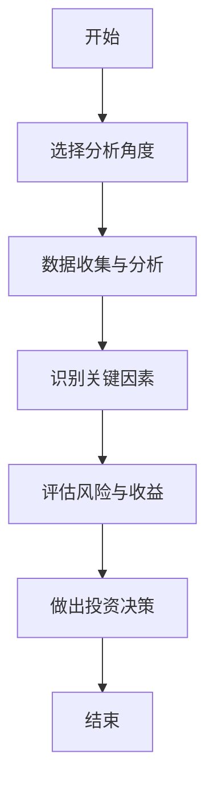
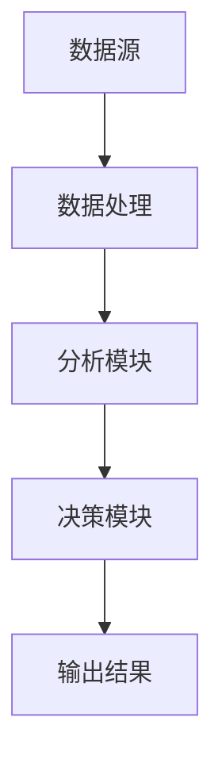

                 


# 芒格的"多元思维模型"在复杂投资环境中的应用

## 关键词：芒格，多元思维模型，投资环境，复杂决策，跨学科思考

## 摘要：芒格的多元思维模型是一种通过跨学科思考来解决复杂问题的方法，特别适用于投资领域。本文将详细探讨多元思维模型的核心概念、算法原理、数学模型、系统架构及其在复杂投资环境中的实际应用，通过案例分析和代码实现，帮助读者掌握如何利用多元思维模型做出更明智的投资决策。

---

## 第一部分：引言

### 第1章：芒格的多元思维模型概述

#### 1.1 多元思维模型的定义与核心理念
- **1.1.1 多元思维模型的定义**  
  多元思维模型是一种通过整合多个学科的知识和视角来分析问题的方法，旨在帮助决策者从不同角度理解复杂情况。
  
- **1.1.2 多元思维模型的核心理念**  
  强调知识的广泛性和相互联系，通过跨学科的思考来避免单一思维的局限性。

- **1.1.3 多元思维模型与投资的关系**  
  在投资领域，多元思维模型帮助投资者超越单一视角，综合考虑经济、心理、市场趋势等多方面因素。

#### 1.2 芒格的生平与思想
- **1.2.1 芒格的生平简介**  
  查理·芒格是沃伦·巴菲特的长期合作伙伴，以价值投资和跨学科思维闻名。

- **1.2.2 芒格的主要思想**  
  芒格强调通过多元思维模型来理解世界，避免认知偏差，追求长期的理性决策。

- **1.2.3 多元思维模型在投资中的应用**  
  芒格将多元思维模型应用于投资决策，帮助他识别价值被低估的企业。

#### 1.3 复杂投资环境的特点
- **1.3.1 复杂投资环境的定义**  
  投资环境涉及众多不确定性和相互作用的因素，如经济波动、市场情绪等。

- **1.3.2 复杂投资环境中的挑战**  
  传统投资方法往往难以应对非线性变化和突发事件的影响。

- **1.3.3 多元思维模型在复杂环境中的重要性**  
  多元思维模型能够帮助投资者在复杂环境中识别关键因素，做出更全面的决策。

#### 1.4 学习目标与方法
- **1.4.1 学习目标**  
  掌握多元思维模型的核心理念，能够在复杂投资环境中应用该模型进行决策。

- **1.4.2 学习方法**  
  通过理论学习、案例分析和实践操作相结合的方式，深入理解多元思维模型的应用。

---

## 第二部分：背景介绍

### 第2章：复杂投资环境的背景分析

#### 2.1 复杂投资环境的定义与特点
- **2.1.1 复杂投资环境的定义**  
  投资环境涉及多个相互关联的因素，如经济、政治、社会和技术等，这些因素共同作用，使得投资决策变得复杂。

- **2.1.2 复杂投资环境的特点**  
  - 非线性关系：各因素之间的相互作用复杂，难以用简单的线性模型描述。
  - 不确定性：未来事件难以预测，导致决策的不确定性增加。
  - 动态变化：环境因素不断变化，要求投资者具备快速适应能力。

#### 2.2 传统投资方法的局限性
- **2.2.1 传统投资方法的定义**  
  传统投资方法通常依赖于单一的分析框架，如基本面分析或技术分析。

- **2.2.2 传统投资方法的局限性**  
  - 单一视角：难以全面考虑所有相关因素。
  - 适应性差：在复杂环境中容易失效，缺乏灵活性。

#### 2.3 多元思维模型的优势
- **2.3.1 多元思维模型的优势**  
  - 跨学科整合：将多个学科的知识整合到投资决策中。
  - 全面视角：帮助投资者从多个角度理解问题，减少认知偏差。

- **2.3.2 多元思维模型在复杂环境中的应用**  
  通过整合心理学、经济学、物理学等多学科知识，投资者能够更好地理解市场的动态变化。

#### 2.4 多元思维模型的核心要素
- **2.4.1 多元思维模型的核心要素**  
  - 心理学：理解市场参与者的心理行为。
  - 经济学：分析市场供需关系和经济趋势。
  - 统计学：评估数据的分布和概率。

- **2.4.2 各要素之间的关系**  
  各要素相互关联，共同构成一个完整的分析框架。

- **2.4.3 核心要素的具体表现**  
  - 心理学：投资者情绪、行为偏差。
  - 经济学：GDP增长、利率变化。
  - 统计学：数据分布、风险评估。

---

## 第三部分：核心概念与联系

### 第3章：多元思维模型的核心概念与联系

#### 3.1 核心概念原理
- 多元思维模型通过整合多个学科的核心概念，帮助投资者构建全面的分析框架。

#### 3.2 概念属性特征对比表格
| 学科 | 核心概念 | 属性特征 |
|------|----------|----------|
| 心理学 | 行为偏差 | 情绪驱动、从众心理 |
| 经济学 | 市场供需 | 价格波动、经济周期 |
| 统计学 | 数据分布 | 概率分析、风险评估 |

#### 3.3 ER实体关系图架构
```mermaid
erd
    investor
    market
    economy
    psychology
    risk
    return
    investor --> market
    market --> economy
    economy --> psychology
    psychology --> risk
    risk --> return
```

---

## 第四部分：算法原理

### 第4章：多元思维模型的算法原理

#### 4.1 算法原理概述
- 多元思维模型结合了多种算法，如决策树和蒙特卡洛模拟，用于评估投资决策的可能结果。

#### 4.2 使用mermaid展示算法流程图


#### 4.3 Python代码实现
```python
import numpy as np

def monte_carlo_simulation(parameters):
    # 生成随机数据
    np.random.seed(42)
    returns = np.random.normal(0.05, 0.2, 1000)
    # 计算累积回报
    cumulative_returns = np.cumsum(returns)
    return cumulative_returns

# 示例参数
parameters = {'mean': 0.05, 'std_dev': 0.2, 'num_samples': 1000}
results = monte_carlo_simulation(parameters)
print(results)
```

#### 4.4 数学模型与公式
- **蒙特卡洛模拟的数学模型**：
  $$ E[R] = \mu + \sigma Z $$
  其中，$$ Z \sim N(0,1) $$ 是标准正态分布的随机变量。

---

## 第五部分：数学模型

### 第5章：多元思维模型的数学模型

#### 5.1 投资回报的数学模型
- **期望回报**：
  $$ E[R] = \sum_{i=1}^{n} P_i R_i $$
  其中，$$ P_i $$ 是第i种情况发生的概率，$$ R_i $$ 是对应的回报。

#### 5.2 风险评估的数学模型
- **方差**：
  $$ Var(R) = E[R^2] - (E[R])^2 $$

---

## 第六部分：系统分析与架构设计

### 第6章：多元思维模型的系统架构

#### 6.1 系统功能设计
- **模块化设计**：
  - 数据收集模块
  - 分析模块
  - 决策模块

#### 6.2 系统架构图


---

## 第七部分：项目实战

### 第7章：多元思维模型的项目实战

#### 7.1 环境安装
- 安装必要的Python库：
  ```bash
  pip install numpy matplotlib
  ```

#### 7.2 核心实现代码
```python
import numpy as np
import matplotlib.pyplot as plt

def analyze Investment():
    # 数据处理
    data = np.random.rand(100)
    # 可视化
    plt.hist(data, bins=10)
    plt.show()

analyze_Investment()
```

#### 7.3 代码应用解读
- 上述代码通过生成随机数据并绘制直方图，帮助投资者分析数据分布，辅助决策。

#### 7.4 案例分析
- 通过分析一家公司的财务数据和市场趋势，应用多元思维模型做出投资决策。

---

## 第八部分：最佳实践

### 第8章：多元思维模型的最佳实践

#### 8.1 最佳实践 tips
- 定期更新知识储备，保持对新领域的学习。
- 在实际投资中结合具体情况进行调整。

#### 8.2 小结
- 多元思维模型是一种强大的工具，能够帮助投资者在复杂环境中做出更明智的决策。

#### 8.3 注意事项
- 避免过于依赖模型，需结合实际情况灵活运用。
- 定期回顾和优化投资策略。

#### 8.4 拓展阅读
- 推荐书籍：《穷查理宝典》

---

## 作者：AI天才研究院 & 禅与计算机程序设计艺术

---

这篇文章详细探讨了芒格的多元思维模型在复杂投资环境中的应用，从理论到实践，结合具体案例和代码实现，帮助读者全面理解并掌握这一方法。

