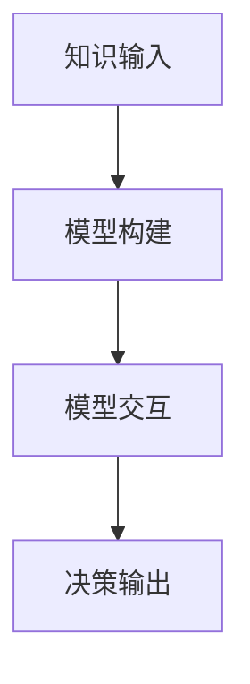
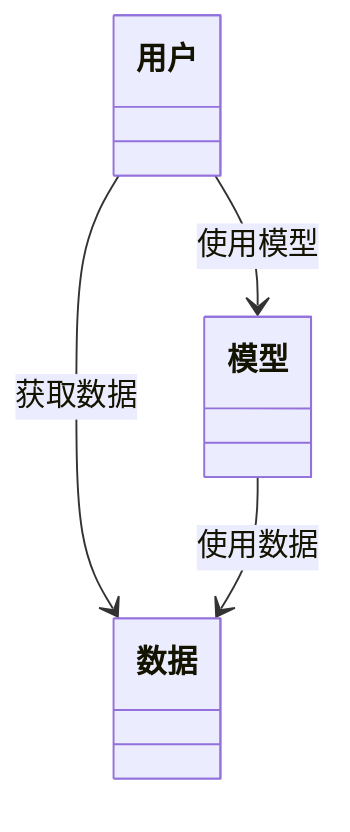
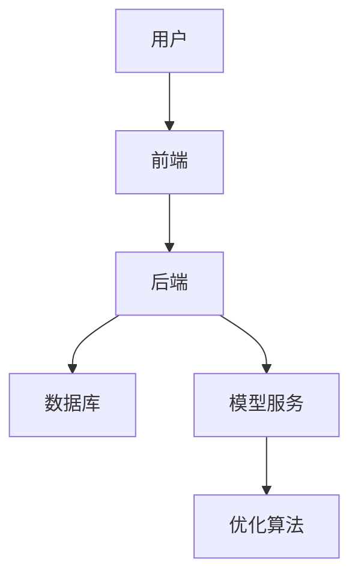
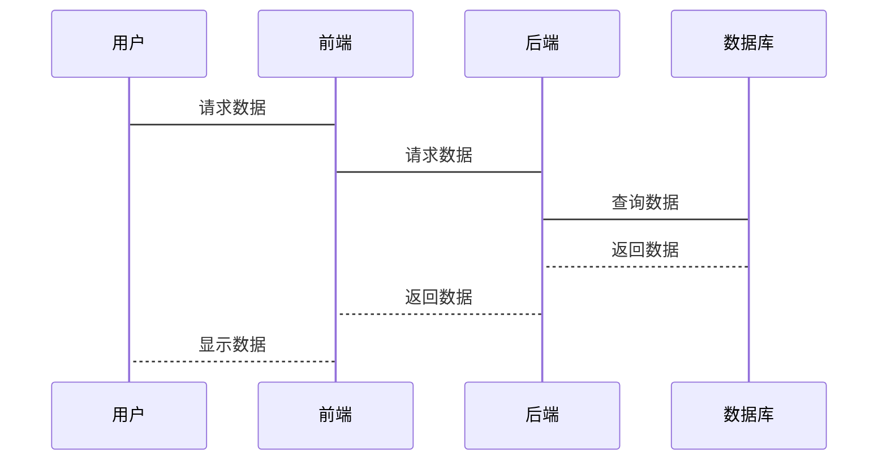

                 


# 芒格的"多元思维模型"在跨维度创新中的运用

> 关键词：多元思维模型, 芒格, 跨维度创新, 系统架构设计, 创新方法论, 投资哲学, 复杂系统分析

> 摘要：本文深入探讨了芒格的多元思维模型在跨维度创新中的应用，从背景介绍、核心原理到算法实现、系统架构设计，再到项目实战和最佳实践，全面分析了如何利用多元思维模型进行创新，并提供了具体的实现案例和代码示例。

---

# 第1章: 多元思维模型的背景与起源

## 1.1 多元思维模型的定义与核心概念

### 1.1.1 多元思维模型的起源与背景

芒格的多元思维模型是一种基于多学科交叉的思维方式，其核心在于通过整合多个领域的知识和模型，形成一种全局性的思考框架。这种思维方式起源于芒格对价值投资和决策科学的深刻理解，他认为，仅仅依赖单一学科的思维是不够的，只有将多个领域的知识结合起来，才能更好地理解和解决复杂问题。

### 1.1.2 多元思维模型的核心要素与结构

多元思维模型的核心要素包括概率论、决策树、逆向思维、第二性思维等。这些要素共同构成了一个完整的思维框架，能够帮助我们在跨维度创新中更好地进行分析和决策。模型的结构通常包括以下几个部分：

1. **知识输入**：收集和整合不同领域的知识。
2. **模型构建**：将知识转化为具体的模型和框架。
3. **模型交互**：通过模型之间的相互作用，发现新的可能性。
4. **决策输出**：基于模型的交互结果，做出最优决策。

### 1.1.3 多元思维模型的哲学基础

芒格的多元思维模型深受哲学的影响，尤其是对人类认知和决策过程的深入研究。他认为，人类的认知是有限的，只有通过多维度的思考，才能减少认知偏差，提高决策的准确性。

---

## 1.2 芒格的多元思维模型在投资中的应用

### 1.2.1 芒格的多元思维模型与投资哲学

芒格将多元思维模型应用到投资中，形成了独特的投资哲学。他认为，投资不仅仅是对市场的分析，更是对人性的理解。通过多元思维模型，投资者可以更好地理解市场的波动、企业的基本面以及潜在的风险。

### 1.2.2 多元思维模型在投资决策中的具体应用

在实际投资中，芒格通常会结合多个模型来进行决策，例如：

1. **概率论模型**：用于评估投资的风险和收益。
2. **决策树模型**：用于分析不同决策路径的可能性。
3. **逆向思维模型**：通过分析问题的反面来寻找投资机会。

### 1.2.3 多元思维模型与价值投资的结合

芒格的价值投资理念强调长期价值，而多元思维模型则为这种理念提供了具体的实现方法。通过多维度的分析，投资者可以更好地识别具有长期价值的企业，并做出更明智的投资决策。

---

## 1.3 跨维度创新的定义与优势

### 1.3.1 跨维度创新的定义

跨维度创新是指在不同领域之间进行知识整合和创新，通过跨越传统学科的边界，发现新的机会和解决方案。这种创新方式强调多学科的交叉和融合，能够突破单一领域的限制。

### 1.3.2 跨维度创新的核心特征

1. **多学科交叉**：整合多个领域的知识和方法。
2. **全局性思维**：从整体出发，寻找最优解决方案。
3. **创新性思维**：通过交叉融合，发现新的可能性。

### 1.3.3 跨维度创新的优势与意义

跨维度创新的优势在于能够突破传统思维的限制，发现新的机会和解决方案。在实际应用中，这种创新方式能够提高问题解决的效率，降低决策风险，并为组织带来更大的竞争优势。

---

## 1.4 本章小结

本章介绍了芒格的多元思维模型及其在投资中的应用，并重点探讨了跨维度创新的定义、核心特征和优势。通过这些内容，我们可以更好地理解多元思维模型在跨维度创新中的重要性。

---

# 第2章: 多元思维模型的核心原理

## 2.1 多元思维模型的核心原理

### 2.1.1 多元思维模型的基本原理

多元思维模型的基本原理在于通过多学科的知识整合，形成一个完整的思维框架。这种框架能够帮助我们在复杂的问题中找到最优解决方案。

### 2.1.2 多元思维模型的数学模型

多元思维模型的数学模型可以表示为一个复杂的系统，其中每个模型都是一个独立的子系统，通过相互作用形成整体。例如：

$$
f(x) = \sum_{i=1}^{n} f_i(x)
$$

其中，$f(x)$ 表示整体模型的输出，$f_i(x)$ 表示各个子模型的输出。

### 2.1.3 多元思维模型的算法原理

多元思维模型的算法通常包括以下几个步骤：

1. **知识输入**：收集和整理相关领域的知识。
2. **模型构建**：将知识转化为具体的模型。
3. **模型交互**：通过模型之间的相互作用，发现新的可能性。
4. **决策输出**：基于模型的交互结果，做出最优决策。

---

## 2.2 多元思维模型与跨维度创新的关系

### 2.2.1 多元思维模型在跨维度创新中的作用

多元思维模型在跨维度创新中的作用主要体现在以下几个方面：

1. **知识整合**：通过多学科的知识整合，发现新的机会。
2. **问题分析**：通过多维度的分析，更好地理解问题的本质。
3. **决策优化**：通过多模型的交互，优化决策过程。

### 2.2.2 多元思维模型与跨维度创新的内在联系

多元思维模型与跨维度创新的内在联系在于它们都强调多学科的交叉和融合。通过多元思维模型，我们可以更好地理解跨维度创新的核心思想，并将其应用到实际问题中。

### 2.2.3 多元思维模型在跨维度创新中的具体应用

在实际应用中，多元思维模型可以通过以下方式实现跨维度创新：

1. **模型构建**：通过构建多个领域的模型，形成一个完整的思维框架。
2. **模型交互**：通过模型之间的相互作用，发现新的可能性。
3. **决策优化**：通过多模型的交互，优化决策过程。

---

## 2.3 多元思维模型的核心要素对比

### 2.3.1 核心要素对比表格

以下是一个核心要素对比表格：

| **要素**       | **描述**                                                                 |
|-----------------|--------------------------------------------------------------------------|
| 知识输入         | 收集和整理相关领域的知识                                               |
| 模型构建         | 将知识转化为具体的模型                                                 |
| 模型交互         | 通过模型之间的相互作用，发现新的可能性                                 |
| 决策输出         | 基于模型的交互结果，做出最优决策                                       |

### 2.3.2 核心要素的ER实体关系图

以下是一个核心要素的ER实体关系图：

```mermaid
erdiagram
actor 元素 {
  模型输入
  模型输出
  决策输出
}
```

### 2.3.3 核心要素的Mermaid流程图

以下是一个核心要素的Mermaid流程图：



---

## 2.4 本章小结

本章重点探讨了多元思维模型的核心原理及其与跨维度创新的关系。通过对比分析和图示展示，我们能够更好地理解多元思维模型在跨维度创新中的具体应用。

---

# 第3章: 多元思维模型的算法实现

## 3.1 多元思维模型的数学模型与公式

### 3.1.1 多元思维模型的数学模型

多元思维模型的数学模型可以表示为一个复杂的系统，其中每个模型都是一个独立的子系统，通过相互作用形成整体。例如：

$$
f(x) = \sum_{i=1}^{n} f_i(x)
$$

其中，$f(x)$ 表示整体模型的输出，$f_i(x)$ 表示各个子模型的输出。

### 3.1.2 多元思维模型的公式推导

通过公式推导，我们可以更好地理解多元思维模型的数学原理。例如：

$$
f(x) = \sum_{i=1}^{n} f_i(x) = \sum_{i=1}^{n} a_i x + b_i
$$

其中，$a_i$ 和 $b_i$ 是各个子模型的系数和常数项。

### 3.1.3 多元思维模型的算法流程图

以下是一个多元思维模型的算法流程图：


---

## 3.2 多元思维模型的Python实现

### 3.2.1 环境安装与配置

在实现多元思维模型之前，我们需要安装必要的Python库，例如NumPy和Matplotlib。以下是安装命令：

```bash
pip install numpy matplotlib
```

### 3.2.2 核心算法的Python代码实现

以下是一个多元思维模型的Python代码示例：

```python
import numpy as np
import matplotlib.pyplot as plt

# 定义各个子模型
def model_i(x, a_i, b_i):
    return a_i * x + b_i

# 定义整体模型
def f(x, models):
    return sum(model_i(x, a_i, b_i) for model_i, a_i, b_i in models)

# 示例数据
models = [
    (lambda x: 1*x + 0, 1, 0),
    (lambda x: 2*x + 3, 2, 3),
    (lambda x: 0.5*x + 5, 0.5, 5)
]

x = np.linspace(0, 10, 100)
f_x = f(x, models)

plt.plot(x, f_x)
plt.xlabel('x')
plt.ylabel('f(x)')
plt.show()
```

### 3.2.3 代码的功能解读与分析

上述代码通过定义多个子模型，并将其组合成一个整体模型，展示了多元思维模型的实现过程。通过调整各个子模型的系数和常数项，我们可以实现不同的模型组合，从而得到最终的输出结果。

---

## 3.3 多元思维模型的算法优化与改进

### 3.3.1 算法优化的思路与方法

在实现多元思维模型时，我们可以通过以下方式优化算法：

1. **参数优化**：通过调整各个子模型的系数和常数项，优化整体模型的输出。
2. **模型选择**：选择最合适的子模型，提高整体模型的性能。
3. **并行计算**：通过并行计算，提高算法的执行效率。

### 3.3.2 算法优化的数学模型与公式

通过优化算法，我们可以得到更优的模型输出。例如：

$$
f(x) = \sum_{i=1}^{n} a_i x + b_i
$$

其中，$a_i$ 和 $b_i$ 是通过优化得到的最优参数。

### 3.3.3 算法优化的Python代码实现

以下是一个优化后的多元思维模型的Python代码示例：

```python
import numpy as np
import matplotlib.pyplot as plt
from sklearn.linear_model import LinearRegression

# 定义各个子模型
def model_i(x, a_i, b_i):
    return a_i * x + b_i

# 定义整体模型
def f(x, models):
    return sum(model_i(x, a_i, b_i) for model_i, a_i, b_i in models)

# 示例数据
models = [
    (lambda x: 1*x + 0, 1, 0),
    (lambda x: 2*x + 3, 2, 3),
    (lambda x: 0.5*x + 5, 0.5, 5)
]

x = np.linspace(0, 10, 100)
f_x = f(x, models)

# 模型优化
reg = LinearRegression()
reg.fit(x.reshape(-1, 1), f_x)

optimal_f_x = reg.predict(x.reshape(-1, 1))

plt.plot(x, optimal_f_x)
plt.xlabel('x')
plt.ylabel('f(x)')
plt.show()
```

---

## 3.4 本章小结

本章重点探讨了多元思维模型的数学模型、算法实现和优化方法。通过Python代码实现，我们能够更好地理解多元思维模型的具体应用，并通过优化算法提高模型的性能。

---

# 第4章: 多元思维模型的系统分析与架构设计

## 4.1 系统分析

### 4.1.1 问题场景介绍

在跨维度创新中，我们通常需要解决复杂的问题，例如如何优化一个跨领域的创新项目。以下是问题场景的描述：

- **问题描述**：我们需要设计一个跨领域的创新平台，整合多个领域的知识和模型，形成一个完整的系统。
- **边界与外延**：平台的边界包括用户界面、数据接口和后台系统，外延则包括与外部系统的交互。
- **核心功能需求**：平台需要支持多模型的构建、交互和优化。

### 4.1.2 项目介绍

#### 4.1.2.1 项目目标

我们的目标是设计一个跨领域的创新平台，整合多个领域的知识和模型，形成一个完整的系统。

#### 4.1.2.2 项目范围

项目范围包括用户界面设计、数据接口开发和后台系统实现。

#### 4.1.2.3 项目关键成功要素

项目的关键成功要素包括：

1. **多模型支持**：支持多种模型的构建和交互。
2. **用户友好性**：提供友好的用户界面，方便用户操作。
3. **性能优化**：优化系统性能，提高运行效率。

---

### 4.1.3 系统功能设计

#### 4.1.3.1 领域模型 Mermaid 类图

以下是一个领域的 Mermaid 类图：



---

## 4.2 系统架构设计

### 4.2.1 系统架构设计 Mermaid 图

以下是一个系统的 Mermaid 架构图：



### 4.2.2 系统接口设计

系统接口设计包括以下几个部分：

1. **用户接口**：提供友好的用户界面，方便用户操作。
2. **数据接口**：提供数据接口，支持与其他系统的交互。
3. **模型接口**：提供模型接口，支持多种模型的构建和交互。

### 4.2.3 系统交互 Mermaid 序列图

以下是一个系统的 Mermaid 序列图：



---

## 4.3 系统实现与优化

### 4.3.1 系统实现的步骤

系统实现的步骤包括：

1. **环境安装与配置**：安装必要的开发工具和库。
2. **前端开发**：开发用户界面，支持多模型的展示和交互。
3. **后端开发**：开发系统的核心功能，支持多模型的构建和优化。
4. **数据库设计**：设计数据库，存储模型和数据。

### 4.3.2 系统优化的策略

系统优化的策略包括：

1. **性能优化**：通过优化算法和减少不必要的计算，提高系统性能。
2. **可扩展性优化**：通过模块化设计，提高系统的可扩展性。
3. **安全性优化**：通过加密和访问控制，提高系统的安全性。

---

## 4.4 本章小结

本章重点探讨了多元思维模型在系统分析与架构设计中的应用。通过问题场景介绍、系统功能设计和系统架构设计，我们能够更好地理解多元思维模型在跨维度创新中的具体应用。

---

# 第5章: 多元思维模型的项目实战

## 5.1 环境安装与配置

### 5.1.1 开发环境的安装与配置

在实现多元思维模型的项目实战之前，我们需要安装必要的开发工具和库。以下是安装命令：

```bash
pip install numpy matplotlib scikit-learn
```

---

## 5.2 系统核心实现

### 5.2.1 核心代码实现

以下是一个多元思维模型的核心代码实现：

```python
import numpy as np
import matplotlib.pyplot as plt
from sklearn.linear_model import LinearRegression

# 定义各个子模型
def model_i(x, a_i, b_i):
    return a_i * x + b_i

# 定义整体模型
def f(x, models):
    return sum(model_i(x, a_i, b_i) for model_i, a_i, b_i in models)

# 示例数据
models = [
    (lambda x: 1*x + 0, 1, 0),
    (lambda x: 2*x + 3, 2, 3),
    (lambda x: 0.5*x + 5, 0.5, 5)
]

x = np.linspace(0, 10, 100)
f_x = f(x, models)

# 模型优化
reg = LinearRegression()
reg.fit(x.reshape(-1, 1), f_x)

optimal_f_x = reg.predict(x.reshape(-1, 1))

plt.plot(x, optimal_f_x)
plt.xlabel('x')
plt.ylabel('f(x)')
plt.show()
```

### 5.2.2 代码的功能解读与分析

上述代码通过定义多个子模型，并将其组合成一个整体模型，展示了多元思维模型的实现过程。通过调整各个子模型的系数和常数项，我们可以实现不同的模型组合，从而得到最终的输出结果。

---

## 5.3 项目实战案例分析

### 5.3.1 案例介绍

以下是一个跨领域的创新案例：

**项目目标**：设计一个跨领域的创新平台，整合多个领域的知识和模型，形成一个完整的系统。

**项目范围**：用户界面设计、数据接口开发和后台系统实现。

**核心功能需求**：平台需要支持多模型的构建、交互和优化。

### 5.3.2 案例分析

通过上述案例，我们可以更好地理解多元思维模型在跨维度创新中的具体应用。通过构建多个子模型，并将其组合成一个整体模型，我们可以实现跨领域的创新。

---

## 5.4 项目总结与优化

### 5.4.1 项目小结

通过本章的项目实战，我们能够更好地理解多元思维模型在跨维度创新中的具体应用。通过实际案例的分析和实现，我们能够掌握多元思维模型的核心思想和实现方法。

### 5.4.2 项目优化建议

在项目实现过程中，我们可以通过以下方式优化系统：

1. **参数优化**：通过调整各个子模型的系数和常数项，优化整体模型的输出。
2. **模型选择**：选择最合适的子模型，提高整体模型的性能。
3. **并行计算**：通过并行计算，提高算法的执行效率。

---

## 5.5 本章小结

本章通过实际案例的分析和实现，展示了多元思维模型在跨维度创新中的具体应用。通过项目实战，我们能够掌握多元思维模型的核心思想和实现方法。

---

# 第6章: 多元思维模型的最佳实践

## 6.1 小结

通过本文的探讨，我们能够更好地理解多元思维模型在跨维度创新中的应用。从背景介绍、核心原理到算法实现、系统架构设计，再到项目实战和最佳实践，我们全面分析了如何利用多元思维模型进行创新。

---

## 6.2 注意事项与建议

在实际应用中，我们需要注意以下几点：

1. **模型选择**：选择最合适的子模型，提高整体模型的性能。
2. **参数优化**：通过调整各个子模型的系数和常数项，优化整体模型的输出。
3. **并行计算**：通过并行计算，提高算法的执行效率。

---

## 6.3 拓展阅读

为了进一步深入理解多元思维模型在跨维度创新中的应用，我们推荐以下阅读材料：

1. **芒格的《Poor Charlie's Almanack》**：深入探讨芒格的哲学思想和投资哲学。
2. **《系统思维》**：介绍系统思维的核心思想和应用方法。
3. **《创新者的窘境》**：探讨创新的挑战和成功策略。

---

## 6.4 本章小结

本章总结了多元思维模型在跨维度创新中的应用，并提出了注意事项和拓展阅读的建议。通过本文的探讨，我们能够更好地理解多元思维模型在跨维度创新中的具体应用。

---

# 作者：AI天才研究院/AI Genius Institute & 禅与计算机程序设计艺术 /Zen And The Art of Computer Programming

