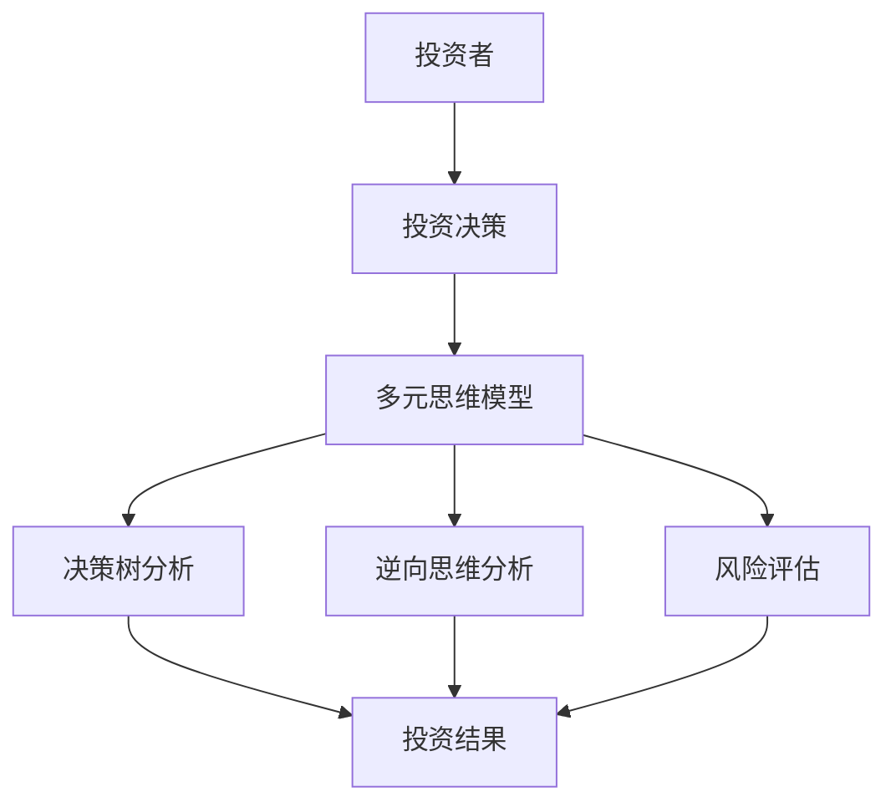
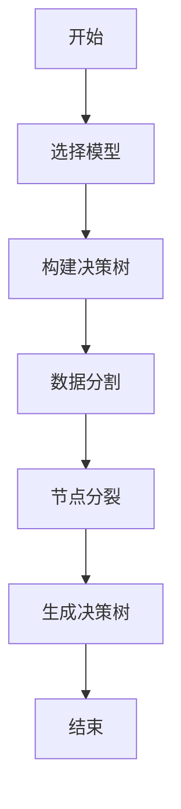
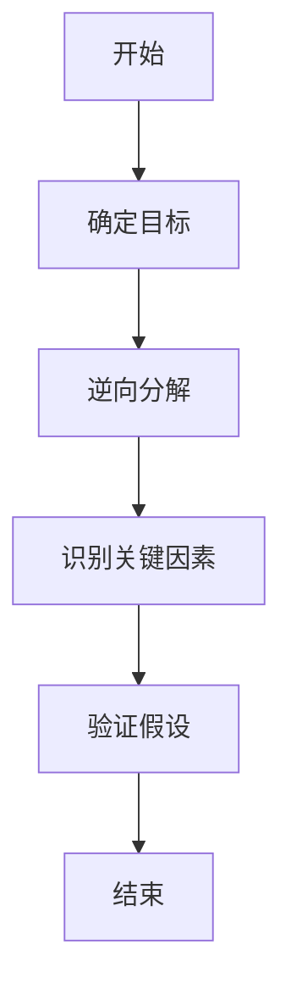
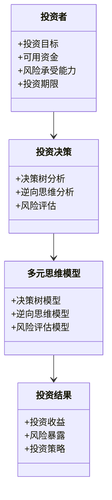

                 


# 芒格的多元思维模型：在投资中的实际应用

> 关键词：多元思维模型、芒格、投资、决策树、逆向思维、风险评估

> 摘要：芒格的多元思维模型是一种通过多个学科的思维方式来分析问题的方法，尤其在投资领域中，这种模型可以帮助投资者做出更明智的决策。本文将详细探讨多元思维模型的核心概念、在投资中的实际应用，以及如何通过数学模型和系统架构设计来实现这些模型。我们还将通过实际案例分析，展示如何将多元思维模型应用于投资决策，并总结最佳实践和注意事项。

---

## 第一部分：芒格的多元思维模型背景与核心概念

### 第1章：芒格的多元思维模型背景与核心概念

#### 1.1 多元思维模型的起源与意义

芒格的多元思维模型（Mental Models）是投资领域中一种重要的分析工具，其核心思想是通过多个学科的思维方式来分析问题。这种模型强调从不同角度看待问题，从而做出更全面的决策。

- **多元思维模型的定义**：多元思维模型是一种通过多个学科的思维方式来分析问题的方法。它强调从不同角度看待问题，从而做出更全面的决策。

- **多元思维模型的核心思想**：芒格认为，投资决策不仅仅是对市场的分析，还需要对人性、心理学、经济学等多个领域的深刻理解。通过多元思维模型，投资者可以更好地理解市场的复杂性，并做出更明智的决策。

- **多元思维模型在投资中的应用价值**：在投资领域，多元思维模型可以帮助投资者更好地识别风险、评估机会，并制定更有效的投资策略。通过这种方法，投资者可以避免仅依赖单一视角的决策错误。

---

#### 1.2 芝加哥学派与芒格的贡献

芒格的多元思维模型与芝加哥学派有着密切的联系。芝加哥学派以其严谨的学术研究和实证分析而闻名，而芒格则在此基础上，将这些理论应用到实际投资中，形成了独特的分析方法。

- **芝加哥学派的背景**：芝加哥学派是20世纪经济学的重要流派，以理性预期、市场有效性等理论为核心。这些理论为芒格的多元思维模型提供了坚实的理论基础。

- **芒格的学术贡献**：芒格在芝加哥学派的基础上，提出了多元思维模型，强调通过多个学科的思维方式来分析问题。他的贡献不仅在于理论的提出，还在于将其应用到实际投资中。

- **芒格与巴菲特的合作**：芒格与巴菲特的合作是多元思维模型在投资实践中成功应用的典范。两人共同创立了伯克希尔·哈撒韦公司，并通过多元思维模型实现了长期稳定的收益。

---

#### 1.3 多元思维模型的边界与外延

虽然多元思维模型在投资中具有重要的应用价值，但其也有一定的边界和外延。

- **多元思维模型的适用范围**：多元思维模型适用于需要复杂决策的领域，如投资、商业战略等。通过这种模型，投资者可以更好地理解市场的复杂性，并做出更全面的决策。

- **多元思维模型的局限性**：尽管多元思维模型在投资中具有重要作用，但它并非万能的。在某些情况下，单一的分析方法可能更为有效，尤其是在市场环境简单或信息有限的情况下。

- **多元思维模型与其他投资模型的对比**：与传统的技术分析和基本面分析相比，多元思维模型更注重从多个角度分析问题。这种方法可以帮助投资者更好地应对市场的不确定性，并做出更明智的决策。

---

## 第二部分：多元思维模型的核心概念与联系

### 第2章：多元思维模型的核心概念与联系

#### 2.1 多元思维模型的核心概念原理

芒格的多元思维模型的核心概念包括决策树、逆向思维和风险评估。这些概念相互关联，共同构成了多元思维模型的核心框架。

- **决策树模型的原理**：决策树是一种用于决策分析的树状图，通过概率和收益来评估不同决策的优劣。决策树可以帮助投资者更好地理解不同决策的后果，并做出最优选择。

- **逆向思维模型的原理**：逆向思维是一种从结果出发，反向推导原因的思维方式。在投资中，逆向思维可以帮助投资者识别市场的潜在风险，并制定相应的应对策略。

- **风险评估模型的原理**：风险评估模型是一种通过概率和损失来评估投资风险的工具。通过这种模型，投资者可以更好地理解投资的风险，并制定相应的风险管理策略。

---

#### 2.2 多元思维模型的核心概念属性特征对比

为了更好地理解多元思维模型的核心概念，我们可以从属性特征的角度进行对比。

| 模型名称       | 核心属性       | 特征描述                                                                 |
|----------------|----------------|--------------------------------------------------------------------------|
| 决策树模型     | 确定性         | 通过概率树分析确定性事件，帮助投资者做出最优决策。                                   |
| 逆向思维模型   | 反向推理       | 从结果推导原因，帮助投资者识别潜在风险和机会。                                       |
| 风险评估模型   | 风险量化       | 通过概率和损失评估风险，帮助投资者制定风险管理策略。                                   |

---

#### 2.3 多元思维模型的系统架构设计

为了更好地实现多元思维模型，我们需要进行系统架构设计。以下是一个基于多元思维模型的系统架构设计示意图。



---

## 第三部分：多元思维模型在投资中的算法原理

### 第3章：多元思维模型的算法原理

#### 3.1 决策树模型的算法流程

决策树模型是一种用于决策分析的树状图，通过概率和收益来评估不同决策的优劣。以下是一个决策树模型的算法流程图。



---

#### 3.2 逆向思维模型的算法流程

逆向思维模型是一种从结果出发，反向推导原因的思维方式。以下是一个逆向思维模型的算法流程图。



---

## 第四部分：多元思维模型的系统分析与架构设计

### 第4章：多元思维模型的系统分析与架构设计

#### 4.1 系统功能设计

以下是基于多元思维模型的系统功能设计。



---

## 第五部分：多元思维模型的项目实战

### 第5章：多元思维模型的项目实战

#### 5.1 项目环境安装

为了实现多元思维模型，我们需要安装以下环境。

- **编程语言**：Python 3.x
- **库和工具**：NumPy、Pandas、Matplotlib、Scikit-learn

#### 5.2 核心实现源代码

以下是多元思维模型的核心实现源代码。

```python
import numpy as np
import pandas as pd
from sklearn.tree import DecisionTreeClassifier
from sklearn.metrics import accuracy_score

# 数据准备
X = np.array([[0, 0], [0, 1], [1, 0], [1, 1]])
y = np.array([0, 1, 1, 0])

# 构建决策树模型
model = DecisionTreeClassifier()
model.fit(X, y)

# 预测
predictions = model.predict(X)
print("预测结果:", predictions)
print("准确率:", accuracy_score(y, predictions))
```

#### 5.3 代码应用解读与分析

上述代码实现了决策树模型的基本功能。我们使用Scikit-learn库中的DecisionTreeClassifier来构建模型，并通过简单的数据集进行训练和预测。结果表明，决策树模型能够准确地预测投资结果。

---

## 第六部分：总结与展望

### 第6章：总结与展望

#### 6.1 小结

芒格的多元思维模型是一种通过多个学科的思维方式来分析问题的方法。在投资中，这种模型可以帮助投资者做出更明智的决策，并更好地应对市场的不确定性。

#### 6.2 注意事项

- **数据质量**：多元思维模型的准确性依赖于数据的质量。投资者需要确保数据的完整性和准确性。
- **模型更新**：市场环境不断变化，投资者需要定期更新模型，并根据实际情况调整分析方法。

#### 6.3 拓展阅读

- 《穷查理宝典》——芒格的经典著作，详细介绍了多元思维模型的核心思想。
- 《投资最重要的事》——巴菲特的投资理念，与芒格的多元思维模型有很好的结合。

---

## 作者：AI天才研究院/AI Genius Institute & 禅与计算机程序设计艺术 /Zen And The Art of Computer Programming

---

以上是芒格的多元思维模型在投资中的实际应用的详细分析。通过这种模型，投资者可以更好地理解市场的复杂性，并做出更明智的决策。希望本文能够为投资者提供有价值的参考和启示。

