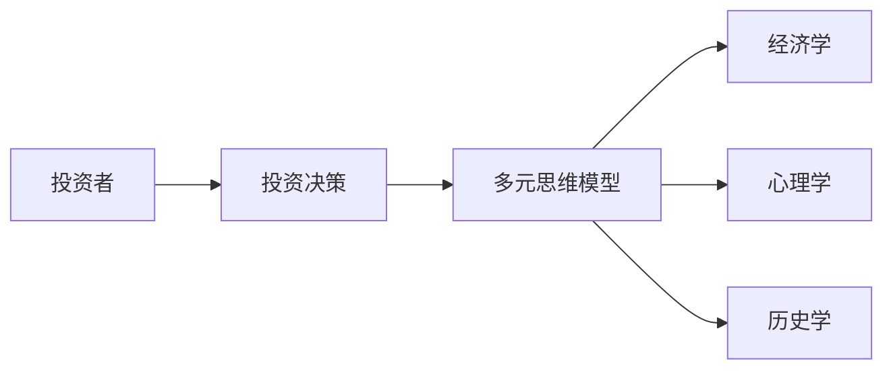
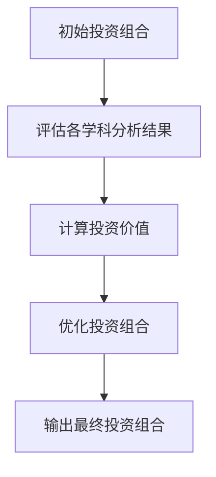
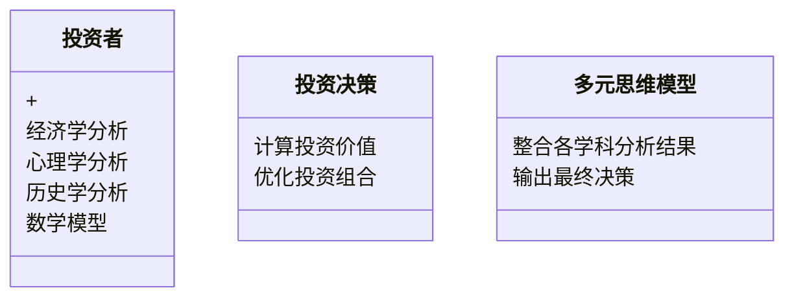
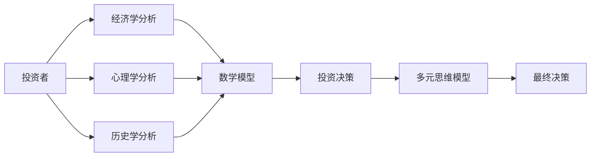

                 


# 芒格的多学科知识应用：拓宽投资视野

> 关键词：芒格，多元思维模型，投资决策，系统分析，算法设计，数学模型

> 摘要：本文深入探讨了芒格的多元思维模型在投资分析中的应用，结合技术视角，从系统分析、数学建模、算法设计等多维度进行详细阐述，帮助读者拓宽投资视野。

---

## 第一部分：芒格的多元思维模型概述

### 第1章：芒格的背景与投资理念

#### 1.1 芒格的生平简介
查理·芒格（Charlie Munger）是美国著名的投资者和作家，作为沃伦·巴菲特（Warren Buffett）的合作伙伴，他以独特的投资理念和多元思维模型闻名。芒格出生于1924年，毕业于哈佛法学院，后来成为加州理工学院的 trustee，同时也是Daily Journal的总编辑。

#### 1.2 芒格的投资哲学
芒格的投资哲学强调“多元思维模型”，即通过多个学科的知识来理解投资行为。他认为，投资者需要从微观到宏观，从个体到系统，从历史到现状等多个维度去分析问题。

#### 1.3 多元思维模型的核心思想
多元思维模型的核心思想是：通过跨学科的知识整合，形成一个完整的知识框架，从而帮助投资者更好地理解和预测市场行为。芒格认为，单一学科的视角往往不足以应对复杂的市场变化。

---

### 第2章：多元思维模型的核心概念与联系

#### 2.1 多元思维模型的构成要素
多元思维模型的构成要素包括：
1. **经济学**：研究市场的供需关系和价格波动。
2. **心理学**：理解投资者的行为偏差和情绪影响。
3. **历史学**：分析历史事件对市场周期的影响。
4. **数学**：通过概率和统计方法量化投资风险。
5. **逻辑学**：构建合理的投资决策框架。

#### 2.2 多元思维模型的核心特点
- **综合性**：整合多个学科的知识，形成全局视角。
- **动态性**：能够根据市场变化进行调整。
- **实用性**：能够在实际投资中提供指导。

#### 2.3 各学科知识的相互联系
通过对比表格和ER图，可以更清晰地理解各学科之间的关系：

| 概念 | 属性 | 特征 |
|------|------|------|
| 经济学 | 微观 | 个体行为 |
| 心理学 | 行为 | 心理偏差 |
| 历史学 | 时间 | 历史周期 |



---

### 第3章：多元思维模型的数学模型与算法原理

#### 3.1 投资决策的数学模型
芒格的多元思维模型可以通过数学公式进行描述：

$$
\text{投资价值} = \sum_{i=1}^{n} w_i \cdot x_i
$$

其中，$w_i$ 是第 $i$ 个学科的权重，$x_i$ 是第 $i$ 个学科的分析结果。

#### 3.2 投资组合优化算法
通过算法流程图，可以更清晰地理解多元思维模型的应用过程：



---

### 第4章：系统分析与架构设计方案

#### 4.1 问题场景介绍
在实际投资中，投资者需要面对复杂的市场环境和多变的经济条件。多元思维模型可以帮助投资者从多个维度进行分析，从而做出更明智的决策。

#### 4.2 系统功能设计
通过类图可以清晰地展示系统的功能模块：



#### 4.3 系统架构设计
通过架构图可以更清晰地展示系统的整体结构：



---

### 第5章：项目实战：多元思维模型的应用

#### 5.1 环境安装
为了实现多元思维模型的数学计算，需要安装以下工具：
- Python编程语言
- NumPy和Pandas库
- Matplotlib或Seaborn用于可视化

#### 5.2 核心实现代码
以下是多元思维模型的核心实现代码：

```python
import numpy as np
import pandas as pd

def calculate_investment_value(economics_score, psychology_score, history_score):
    weights = [0.4, 0.3, 0.3]
    return np.dot(weights, [economics_score, psychology_score, history_score])

# 示例数据
economics_score = 0.8
psychology_score = 0.7
history_score = 0.6

investment_value = calculate_investment_value(economics_score, psychology_score, history_score)
print(f"投资价值：{investment_value}")
```

#### 5.3 案例分析与解读
通过上述代码可以计算出投资价值，帮助投资者做出更明智的决策。

---

### 第6章：总结与展望

芒格的多元思维模型为投资者提供了一个全新的视角，帮助他们更好地理解和预测市场行为。通过技术视角的分析，我们可以更清晰地看到多元思维模型的数学基础和算法实现。

---

作者：AI天才研究院/AI Genius Institute & 禅与计算机程序设计艺术 /Zen And The Art of Computer Programming

