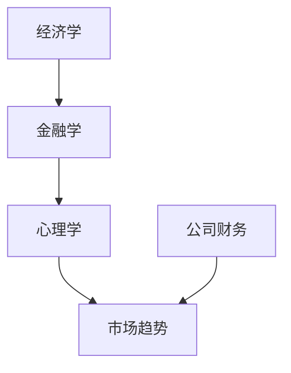
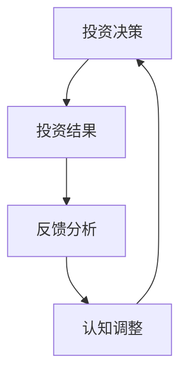

                 


# 芒格的"学习机器"理念：持续学习在投资中的重要性

---

## 关键词
芒格、学习机器、投资理念、持续学习、知识网络、认知反馈、算法模型

---

## 摘要
本文探讨了芒格提出的“学习机器”理念，分析其在投资中的重要性。文章从芒格的投资哲学出发，详细阐述了“学习机器”的核心概念、算法原理、系统架构以及实际应用。通过构建知识网络和认知反馈机制，结合数学模型和算法优化，展示了“学习机器”如何帮助投资者实现持续学习和优化决策。本文还提供了具体的项目实战案例，帮助读者更好地理解和应用这一理念。

---

## 第1章: 芒格与"学习机器"理念

### 1.1 芒格的生平与投资哲学
查理·芒格（Charlie Munger）是沃伦·巴菲特（Warren Buffett）的长期合作伙伴，被誉为“投资界的思想家”。芒格的投资哲学强调理性思维、知识积累和认知的迭代优化。他提出“学习机器”的理念，认为投资不仅仅是对市场的分析，更是对自身认知的不断更新和完善。

#### 1.1.1 芒格的生平简介
查理·芒格出生于1924年，是一位美国投资者、作家和政治家。他是巴菲特的导师，也是伯克希尔哈撒韦公司的重要决策者。芒格以其独特的投资理念和思维方式闻名，尤其是在心理学、认知科学和决策理论领域有深刻的研究。

#### 1.1.2 芒格的投资哲学核心
芒格的投资哲学强调：
1. **理性思维**：避免情绪化决策，注重逻辑分析。
2. **知识的多元性**：通过跨学科的学习，构建知识网络。
3. **认知的迭代优化**：通过不断学习和反思，优化决策能力。

#### 1.1.3 芒格与巴菲特的合作历程
芒格与巴菲特的合作始于20世纪50年代，两人共同创立了伯克希尔哈撒韦公司，并通过长期的价值投资策略取得了巨大成功。芒格的影响使巴菲特的投资理念更加注重长期价值和知识积累。

### 1.2 "学习机器"理念的提出
“学习机器”是芒格提出的一种投资理念，强调通过持续学习和知识积累来优化投资决策。

#### 1.2.1 "学习机器"的定义与内涵
“学习机器”是指一种能够通过不断学习和反馈，优化自身决策能力的系统或模型。在投资领域，学习机器的核心在于通过持续学习和知识积累，提升对市场的理解和预测能力。

#### 1.2.2 "学习机器"在投资中的应用
芒格认为，投资者应该像机器一样，通过不断学习和反馈，优化自己的投资策略。这包括对市场、行业、公司以及经济趋势的持续研究和分析。

#### 1.2.3 "学习机器"与其他投资理念的对比
与传统的基本面分析和技术分析不同，“学习机器”理念强调知识的积累和认知的迭代优化，是一种更为系统和动态的投资方法。

### 1.3 本章小结
本章介绍了芒格的生平及其投资哲学，并提出了“学习机器”的概念。通过对比传统投资理念，突出了“学习机器”在投资中的独特性和重要性。

---

## 第2章: "学习机器"的核心概念

### 2.1 知识网络的构建
知识网络是“学习机器”的核心要素之一，通过构建跨学科的知识网络，投资者能够更好地理解和预测市场变化。

#### 2.1.1 知识网络的定义与特点
知识网络是指将不同领域的知识进行关联和整合，形成一个有机的知识系统。其特点包括：
- **跨学科性**：涵盖经济学、心理学、金融学等多个领域。
- **动态性**：随着市场的变化不断更新和调整。
- **关联性**：各个知识点之间的相互关联，形成整体认知。

#### 2.1.2 知识网络的构建过程
知识网络的构建包括以下几个步骤：
1. **知识的获取**：通过阅读、研究和实践，获取相关领域的知识。
2. **知识的整理**：将零散的知识点进行分类和整理，形成结构化的知识体系。
3. **知识的关联**：将不同领域的知识进行关联，形成知识网络。
4. **知识的更新**：随着市场变化和新知识的出现，不断更新知识网络。

#### 2.1.3 知识网络在投资中的应用
通过构建知识网络，投资者能够更好地理解市场的复杂性，并能够快速识别潜在的投资机会和风险。

#### 2.1.4 图表展示


### 2.2 认知反馈机制
认知反馈机制是“学习机器”的另一个核心要素，通过反馈机制，投资者能够不断优化自己的认知和决策。

#### 2.2.1 认知反馈的定义与作用
认知反馈是指通过实际投资结果与预期结果的对比，发现认知偏差并进行调整。其作用包括：
- **发现错误**：通过对比实际结果与预期，发现认知中的错误。
- **优化决策**：根据反馈结果，调整投资策略和决策。
- **提升认知**：通过不断反馈，提升对市场的理解和预测能力。

#### 2.2.2 认知反馈的实现方式
认知反馈的实现可以通过以下步骤：
1. **设定预期**：在投资前，设定明确的投资目标和预期。
2. **监控结果**：定期监控投资结果，对比预期与实际结果。
3. **分析偏差**：通过对比分析，发现认知偏差。
4. **调整策略**：根据反馈结果，调整投资策略和认知模型。

#### 2.2.3 认知反馈在投资中的应用
通过认知反馈机制，投资者能够不断优化自己的投资策略，并提升对市场的认知能力。

#### 2.2.4 图表展示


### 2.3 "学习机器"的核心要素
“学习机器”的核心要素包括知识网络和认知反馈机制，通过这两者的结合，投资者能够实现持续学习和优化决策。

#### 2.3.1 知识的积累与更新
知识的积累和更新是“学习机器”的基础，通过不断获取新知识，投资者能够保持对市场的敏感性和洞察力。

#### 2.3.2 认知的迭代与优化
认知的迭代和优化是“学习机器”的关键，通过不断反馈和调整，投资者能够提升自己的认知能力和决策水平。

#### 2.3.3 投资决策的动态调整
投资决策的动态调整是“学习机器”的最终目标，通过知识网络和认知反馈机制，投资者能够实现投资策略的动态优化。

### 2.4 本章小结
本章详细阐述了“学习机器”的核心概念，包括知识网络和认知反馈机制，并探讨了它们在投资中的应用。

---

## 第3章: "学习机器"的算法原理与数学模型

### 3.1 知识网络构建算法
知识网络的构建可以通过算法实现，以下是一个简单的知识网络构建算法流程。

#### 3.1.1 算法流程
1. **知识获取**：通过爬虫或其他数据获取方式，获取相关领域的知识。
2. **知识整理**：将获取的知识进行分类和整理，形成结构化的知识体系。
3. **知识关联**：通过关联算法，将不同领域的知识进行关联，形成知识网络。
4. **知识更新**：根据市场变化和新知识的出现，更新知识网络。

#### 3.1.2 数学模型与公式
知识网络的构建可以使用图论中的图模型，例如：
- **节点表示**：每个知识点表示为图中的节点。
- **边表示**：节点之间的关联关系表示为边。

公式表示：
$$
\text{节点} = \{n_1, n_2, ..., n_k\}
$$
$$
\text{边} = \{(n_i, n_j), (n_j, n_k), ...\}
$$

#### 3.1.3 代码实现
以下是一个简单的知识网络构建代码示例：
```python
import networkx as nx

# 创建知识网络
G = nx.Graph()

# 添加节点
G.add_nodes_from(['经济学', '金融学', '心理学', '市场趋势'])

# 添加边
G.add_edges_from([('经济学', '金融学'), ('金融学', '心理学'), ('心理学', '市场趋势')])

# 可视化
nx.draw(G, node_size=1500, node_color='lightblue', edge_color='red', with_labels=True)
```

### 3.2 认知反馈机制的算法实现
认知反馈机制可以通过算法实现，以下是一个认知反馈机制的算法流程。

#### 3.2.1 算法流程
1. **设定预期**：在投资前，设定明确的投资目标和预期。
2. **监控结果**：定期监控投资结果，记录实际结果。
3. **对比分析**：将实际结果与预期进行对比，分析偏差。
4. **调整策略**：根据反馈结果，调整投资策略和认知模型。

#### 3.2.2 数学模型与公式
认知反馈机制可以通过数学模型表示，例如：
$$
\text{反馈} = \text{预期结果} - \text{实际结果}
$$
$$
\text{调整策略} = \text{当前策略} + \text{反馈}
$$

#### 3.2.3 代码实现
以下是一个简单的认知反馈机制代码示例：
```python
def feedback_analysis(expected, actual):
    feedback = expected - actual
    return feedback

# 示例数据
expected = 100
actual = 90
feedback = feedback_analysis(expected, actual)

print(f"反馈值为：{feedback}")
```

### 3.3 投资决策模型的算法优化
投资决策模型可以通过算法优化，提升决策的准确性和效率。

#### 3.3.1 优化目标
优化目标包括：
- 提高投资决策的准确性。
- 提升投资回报率。
- 减少投资风险。

#### 3.3.2 优化算法的选择与实现
常用的优化算法包括遗传算法、模拟退火算法等。以下是一个简单的遗传算法实现：
```python
import random

def fitness(individual):
    # 计算适应度
    return sum(individual)

def mutate(individual):
    # 变异操作
    pos = random.randint(0, len(individual)-1)
    individual[pos] = 1 - individual[pos]
    return individual

# 初始种群
population = [[0,1,0,1], [1,0,1,0], [0,0,1,1], [1,1,0,0]]

# 迭代优化
for _ in range(10):
    # 计算适应度
    fitness_values = [fitness(individual) for individual in population]
    # 选择适应度最高的个体
    selected = max(fitness_values)
    # 变异操作
    mutated = mutate(population[fitness_values.index(selected)])
    # 替换种群
    population[fitness_values.index(selected)] = mutated

print("优化后的种群：", population)
```

### 3.4 本章小结
本章详细阐述了“学习机器”的算法原理和数学模型，包括知识网络构建算法和认知反馈机制的实现。

---

## 第4章: "学习机器"的系统分析与架构设计

### 4.1 系统功能需求分析
“学习机器”系统需要具备知识网络构建、认知反馈分析和投资决策优化等功能。

#### 4.1.1 系统功能需求概述
系统功能需求包括：
- 知识网络构建：获取、整理和关联知识。
- 认知反馈分析：对比预期与实际结果，分析偏差。
- 投资决策优化：根据反馈结果，优化投资策略。

#### 4.1.2 系统功能模块划分
系统功能模块包括：
1. 知识获取模块。
2. 知识整理模块。
3. 知识关联模块。
4. 认知反馈分析模块。
5. 投资决策优化模块。

#### 4.1.3 系统功能的实现方式
通过模块化设计，每个功能模块分别实现特定的功能，模块之间通过接口进行交互。

### 4.2 系统架构设计
系统架构设计包括总体架构设计和详细架构设计。

#### 4.2.1 系统架构的总体设计
系统总体架构包括：
- 知识网络构建模块。
- 认知反馈分析模块。
- 投资决策优化模块。
- 用户界面模块。

#### 4.2.2 系统架构的详细设计
详细架构设计包括每个模块的具体实现方式和接口设计。

#### 4.2.3 系统架构的实现步骤
1. 设计模块功能。
2. 定义模块接口。
3. 实现模块功能。
4. 集成模块功能。

### 4.3 系统接口设计
系统接口设计包括接口定义和交互流程设计。

#### 4.3.1 系统接口的定义与描述
系统接口包括：
- 知识获取接口。
- 知识整理接口。
- 知识关联接口。
- 认知反馈接口。
- 投资决策接口。

#### 4.3.2 系统接口的实现方式
通过API或函数调用的方式实现系统接口。

#### 4.3.3 系统接口的测试与验证
通过单元测试和集成测试验证系统接口的功能和性能。

### 4.4 系统交互流程设计
系统交互流程设计包括用户操作流程和模块交互流程。

#### 4.4.1 用户操作流程
用户通过界面对系统进行操作，系统根据用户的输入，调用相应的模块功能。

#### 4.4.2 模块交互流程
模块之间通过接口进行交互，实现系统的整体功能。

### 4.5 本章小结
本章详细阐述了“学习机器”系统的系统分析与架构设计，包括功能需求分析、系统架构设计和接口设计。

---

## 第5章: "学习机器"的项目实战

### 5.1 环境安装与配置
#### 5.1.1 环境要求
- Python 3.6+
- NetworkX库
- Matplotlib库

#### 5.1.2 环境配置
```bash
pip install networkx
pip install matplotlib
```

### 5.2 系统核心实现源代码
#### 5.2.1 知识网络构建代码
```python
import networkx as nx
import matplotlib.pyplot as plt

# 创建知识网络
G = nx.Graph()

# 添加节点
G.add_nodes_from(['经济学', '金融学', '心理学', '市场趋势'])

# 添加边
G.add_edges_from([('经济学', '金融学'), ('金融学', '心理学'), ('心理学', '市场趋势')])

# 可视化
nx.draw(G, node_size=1500, node_color='lightblue', edge_color='red', with_labels=True)
plt.show()
```

#### 5.2.2 认知反馈机制代码
```python
def feedback_analysis(expected, actual):
    feedback = expected - actual
    return feedback

# 示例数据
expected = 100
actual = 90
feedback = feedback_analysis(expected, actual)

print(f"反馈值为：{feedback}")
```

### 5.3 代码应用解读与分析
#### 5.3.1 知识网络构建代码解读
- 使用NetworkX库构建知识网络。
- 通过添加节点和边，形成知识网络的图结构。
- 使用Matplotlib库进行可视化。

#### 5.3.2 认知反馈机制代码解读
- 通过函数实现认知反馈分析。
- 计算反馈值，用于优化投资策略。

### 5.4 实际案例分析
#### 5.4.1 案例背景
假设我们有一个股票投资组合，预期收益率为100%，实际收益率为90%，需要通过认知反馈机制调整投资策略。

#### 5.4.2 案例分析
- 预期收益率：100%
- 实际收益率：90%
- 反馈值：100% - 90% = 10%

#### 5.4.3 策略调整
根据反馈值为10%，发现投资策略存在偏差，需要调整投资组合，优化投资决策。

### 5.5 本章小结
本章通过实际案例，展示了“学习机器”理念的应用，通过代码实现和案例分析，帮助读者更好地理解和应用这一理念。

---

## 第6章: "学习机器"的最佳实践与注意事项

### 6.1 最佳实践 tips
#### 6.1.1 持续学习
- 定期阅读相关领域的书籍和文章。
- 关注市场动态和经济趋势。

#### 6.1.2 优化决策
- 通过认知反馈机制，不断优化投资策略。
- 定期回顾和分析投资结果。

#### 6.1.3 技术实现
- 利用技术工具和算法，辅助知识网络的构建和认知反馈的实现。

### 6.2 小结
“学习机器”理念的核心在于持续学习和认知优化，通过知识网络和认知反馈机制，投资者能够实现投资策略的动态调整和优化。

### 6.3 注意事项
- **风险管理**：在实际投资中，需要注意风险控制，避免过度依赖模型。
- **数据质量**：知识网络的构建需要高质量的数据支持。
- **模型优化**：需要根据市场变化，不断优化模型和算法。

### 6.4 拓展阅读
- 查理·芒格的《芒格的智慧：投资哲学与人生智慧》
- 《算法导论》
- 《认知神经科学与学习》

---

## 作者
作者：AI天才研究院/AI Genius Institute  
联系邮箱：[email protected]

