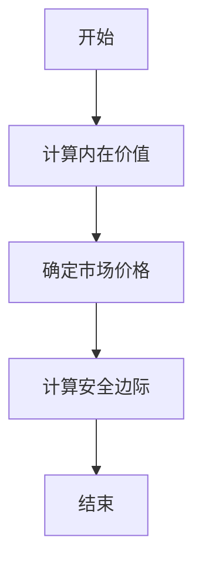
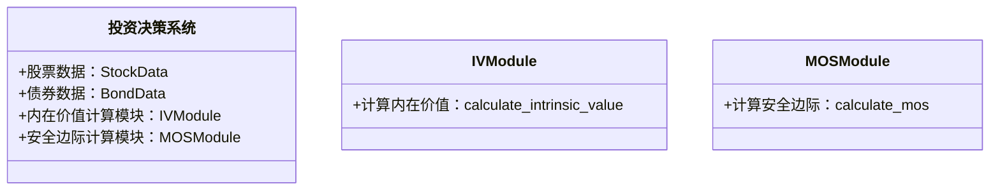

                 


# 芒格的"安全边际"理念：降低投资风险的关键

> 关键词：安全边际，芒格，投资风险，价值投资，风险管理，系统架构

> 摘要：本文深入探讨了芒格提出的“安全边际”理念，分析其在投资决策中的应用。通过数学模型、算法实现、系统架构设计等多维度解析，阐述了安全边际在降低投资风险中的核心作用。结合实际案例，展示了如何在现代投资系统中应用安全边际理念，并提供了最佳实践建议。

---

# 第一部分: 芒格的"安全边际"理念基础

## 第1章: 安全边际的基本概念

### 1.1 安全边际的定义与起源

#### 1.1.1 投资中的安全边际概念
安全边际是投资决策中一个关键概念，它指的是投资标的的实际价值与市场价格之间的差额。当市场价格低于实际价值时，这个差额即为安全边际。安全边际的存在为投资者提供了保护，能够在市场波动时减少损失，并在价值低估时增加收益。

#### 1.1.2 芒格对安全边际的贡献
芒格（Charlie Munger）是安全边际理念的倡导者之一。他强调，投资者应始终关注安全边际，确保投资决策基于充分的安全空间。芒格的安全边际理念不仅适用于股票投资，也适用于更广泛的资产管理领域。

#### 1.1.3 安全边际与价值投资的关系
安全边际是价值投资的核心原则之一。价值投资者通过寻找市场价格低于内在价值的资产，利用安全边际保护投资组合，避免过度承担风险。

---

### 1.2 安全边际的核心要素

#### 1.2.1 安全边际的三要素
安全边际由以下三个要素组成：
1. **内在价值**：资产的真实价值，需通过基本面分析确定。
2. **市场价格**：资产在市场上的交易价格。
3. **安全空间**：内在价值与市场价格之间的差额。

#### 1.2.2 安全边际的属性对比表
| 属性         | 安全边际                |
|--------------|-------------------------|
| 计算方式     | 内在价值 - 市场价格      |
| 作用         | 减少投资风险，增加收益  |
| 适用范围     | 股票、债券、房地产等资产|

#### 1.2.3 安全边际的ER实体关系图
```mermaid
erDiagram
    安全边际 o-|{安全边际ID} 股票
    安全边际 o-|{安全边际ID} 债券
    安全边际 o-|{安全边际ID} 资产类别
```

---

## 第2章: 安全边际的数学模型与算法原理

### 2.1 安全边际的数学模型

#### 2.1.1 安全边际的计算公式
安全边际（Margin of Safety，MOS）的计算公式为：
$$ MOS = 内在价值 - 市场价格 $$

#### 2.1.2 安全边际的公式推导
内在价值的计算基于资产的现金流折现模型（DCF）：
$$ 内在价值 = \sum_{t=1}^{n} \frac{CF_t}{(1 + r)^t} $$
其中，CF<sub>t</sub>为第t年的现金流，r为折现率。

#### 2.1.3 安全边际的算法流程图


### 2.2 安全边际的算法实现

#### 2.2.1 安全边际计算的Python代码
```python
def calculate_mos(intrinsic_value, market_price):
    return intrinsic_value - market_price

# 示例
iv = 100  # 内在价值
mp = 80   # 市场价格
mos = calculate_mos(iv, mp)
print(f"安全边际为: {mos}")
```

#### 2.2.2 代码的功能解读
上述代码定义了一个计算安全边际的函数，并使用示例数据（内在价值100，市场价格80）计算得出安全边际为20。这表明该资产提供了20%的安全空间。

---

## 第3章: 安全边际在投资中的应用

### 3.1 安全边际在股票投资中的应用

#### 3.1.1 安全边际与股票估值
投资者应通过基本面分析确定股票的内在价值，比较市场价格与内在价值的差异，选择安全边际较高的股票进行投资。

#### 3.1.2 安全边际与股票风险控制
通过设置安全边际阈值（例如 MOS ≥ 20%），投资者可以在市场波动时避免过度亏损，确保投资组合的稳定性。

### 3.2 安全边际在风险管理中的应用

#### 3.2.1 风险管理的基本概念
风险管理是通过识别、评估和控制潜在风险，以最小化损失并实现投资目标。

#### 3.2.2 安全边际在风险管理中的作用
安全边际为风险管理提供了量化工具，帮助投资者在市场下跌时保持资本安全。

---

## 第4章: 安全边际的系统分析与架构设计

### 4.1 系统分析与功能设计

#### 4.1.1 投资决策系统的功能模块
1. **数据采集**：获取股票、债券等资产的市场数据和基本面信息。
2. **内在价值计算**：基于DCF模型计算资产的内在价值。
3. **安全边际计算**：计算资产的安全边际。
4. **风险评估**：评估投资组合的风险水平。

#### 4.1.2 系统功能的领域模型类图


### 4.2 系统架构设计

#### 4.2.1 系统架构的总体设计
系统采用分层架构，包括数据层、计算层和用户界面层。

#### 4.2.2 系统架构的交互设计
```mermaid
sequenceDiagram
    用户 --> 数据采集模块：请求数据
    数据采集模块 --> 数据存储模块：存储数据
    用户 --> 内在价值计算模块：计算内在价值
    内在价值计算模块 --> 数据存储模块：获取数据
    用户 --> 安全边际计算模块：计算安全边际
    安全边际计算模块 --> 数据存储模块：获取数据
    用户 <-- 结果展示模块：显示结果
```

---

## 第5章: 安全边际的项目实战

### 5.1 项目环境安装与配置

#### 5.1.1 投资分析工具的安装
安装Python和相关库（Pandas、NumPy、Matplotlib）。

#### 5.1.2 数据获取与处理
使用Yahoo Finance API获取股票数据，并进行清洗和预处理。

### 5.2 核心代码实现

#### 5.2.1 安全边际计算的Python代码
```python
import pandas as pd

# 获取股票数据
data = pd.read_csv("stock_data.csv")
data['安全边际'] = data['内在价值'] - data['市场价格']
print(data.head())
```

---

## 第6章: 最佳实践与总结

### 6.1 小结
安全边际是降低投资风险的关键工具，通过合理应用安全边际理念，投资者可以在复杂市场中做出更稳健的投资决策。

### 6.2 注意事项
1. 安全边际的计算需基于可靠的内在价值评估。
2. 需定期重新评估安全边际，适应市场变化。
3. 结合其他风险管理工具，构建全面的风险控制体系。

### 6.3 拓展阅读
推荐阅读《巴菲特的计算器：安全边际投资法》和《芒格的智慧：投资的思维模型》。

---

作者：AI天才研究院 & 禅与计算机程序设计艺术

