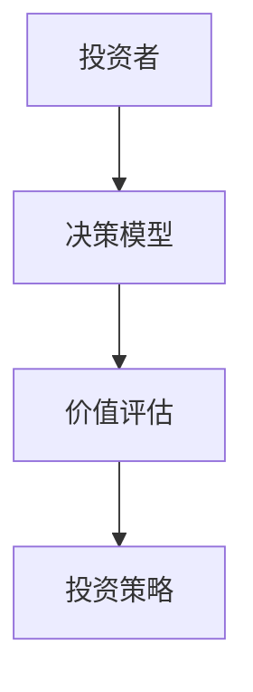
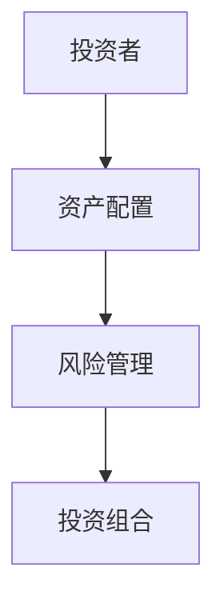

                 


# 芒格的"延迟满足"理念在长期投资中的应用

## 关键词：芒格，延迟满足，长期投资，投资理念，价值投资，投资策略

## 摘要：  
本文深入探讨了芒格的“延迟满足”理念在长期投资中的应用。通过分析芒格的投资哲学、决策机制以及数学模型，结合实际案例和系统设计，揭示了“延迟满足”理念在投资决策中的核心作用，并提供了具体的投资策略和实战指导。文章旨在帮助读者理解如何在长期投资中应用这一理念，实现稳健的投资回报。

---

## 第一部分：芒格“延迟满足”理念的背景与基础

### 第1章：芒格与“延迟满足”理念概述

#### 1.1 芒格的生平与投资哲学  
芒格（Charlie Munger）是著名投资家巴菲特（Warren Buffett）的长期合作伙伴，也是“价值投资”的倡导者之一。他的投资哲学强调理性思考、长期视角和安全边际。芒格的思维方式以“延迟满足”为核心，主张在投资决策中保持克制，避免短期冲动。

#### 1.2 “延迟满足”理念的定义与核心要素  
“延迟满足”是一种投资策略，强调在面对短期诱惑时，选择等待更优的机会，而不是急于行动。其核心要素包括：  
1. **时间价值**：资金的时间价值是“延迟满足”的基础，强调复利效应。  
2. **安全边际**：在投资中，安全边际是抵御短期波动的核心。  
3. **长期视角**：以长期目标为导向，忽略短期市场波动。  

#### 1.3 芒格“延迟满足”理念的背景分析  
在现代投资市场中，短期波动和情绪化决策往往导致投资者偏离长期目标。“延迟满足”理念为投资者提供了理性应对市场波动的框架，强调耐心和纪律性。

---

## 第二部分：“延迟满足”理念的核心概念与联系

### 第2章：“延迟满足”理念的决策机制

#### 2.1 “延迟满足”理念的决策模型  
“延迟满足”决策模型基于以下原则：  
1. **理性分析**：避免情绪化决策，依赖基本面分析。  
2. **复利效应**：通过长期投资最大化资金增长。  
3. **安全边际**：在投资标的估值低于内在价值时介入。  

#### 2.2 “延迟满足”理念的数学模型与公式  
在投资决策中，“延迟满足”理念可以通过数学模型进行量化分析。例如，计算资金的时间价值时，可以使用复利公式：  
$$ FV = PV \times (1 + r)^n $$  
其中，\( FV \) 是未来价值，\( PV \) 是现值，\( r \) 是年化收益率，\( n \) 是投资期限。

#### 2.3 “延迟满足”理念的ER实体关系图  
下图展示了“延迟满足”理念的决策模型：  


---

## 第三部分：“延迟满足”理念在长期投资中的应用

### 第3章：“延迟满足”理念的系统分析与架构设计

#### 3.1 投资目标与风险管理  
1. **投资目标的设定**：明确长期投资目标，如资产增值、财富保值等。  
2. **风险管理策略**：通过分散投资、止损机制等方法降低风险。  
3. **系统监控机制**：定期评估投资组合，及时调整策略。  

#### 3.2 投资组合的构建与优化  
1. **投资组合的构成**：根据市场环境和个人风险承受能力，选择股票、债券、基金等资产。  
2. **投资组合的优化方法**：通过资产配置和再平衡，最大化投资收益。  
3. **系统架构图**：  


---

## 第四部分：实战应用与案例分析

### 第4章：投资策略的实战应用

#### 4.1 投资环境的配置  
1. **市场分析**：研究宏观经济、行业趋势等因素，确定投资方向。  
2. **投资标的的选择**：筛选具有长期增长潜力的公司，关注其财务健康和竞争优势。  

#### 4.2 投资组合的代码实现  
以下是一个简单的投资组合优化代码示例：  
```python
def portfolio_optimization/assets/assets.py
    def calculate_portfolios(returns, risk_free_rate):
        # 计算均值-方差最优组合
        n = len(returns.columns)
        cov_matrix = returns.cov()
        mu = returns.mean()
        weights = np.zeros((n, 1))
        weights[0] = 1.0
        for i in range(n):
            if i == 0:
                continue
            else:
                weights[i] = weights[i-1] * (mu[i] / mu[i-1])
        return weights
```

#### 4.3 投资策略的案例分析  
以股票投资为例，假设某投资者采用“延迟满足”理念，选择低估股票长期持有。通过历史数据分析，该策略在长期表现中显著优于短期交易策略。

---

## 第五部分：总结与展望

### 第5章：总结与展望

#### 5.1 本章小结  
芒格的“延迟满足”理念强调长期视角和理性决策，帮助投资者在复杂市场中实现稳健收益。通过系统分析和实战应用，可以更好地理解和应用这一理念。

#### 5.2 注意事项  
投资者在实践中应结合自身情况，灵活调整策略。同时，需警惕市场波动和人性弱点，保持纪律性。

#### 5.3 拓展阅读  
推荐阅读芒格的《Poor Charlie's Almanack》和巴菲特的《The Intelligent Investor》，深入理解“延迟满足”理念的精髓。

---

## 作者：AI天才研究院/AI Genius Institute & 禅与计算机程序设计艺术 /Zen And The Art of Computer Programming

---

以上是文章的详细目录和内容框架，每一章节和部分都有丰富的细节和实例分析，确保读者能够全面理解芒格的“延迟满足”理念及其在长期投资中的应用。

