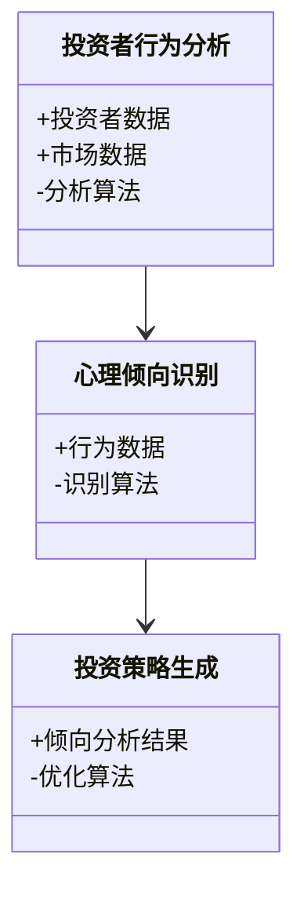
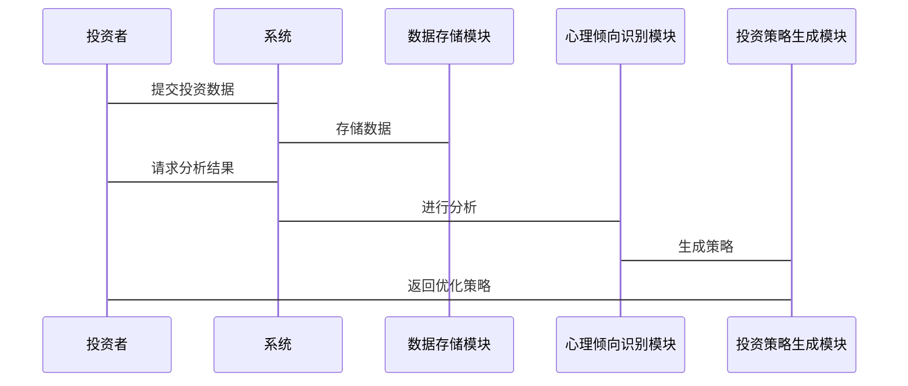

                 


# 芒格的"心理倾向"理论在投资分析中的应用

---

## 关键词
- 芒格心理倾向理论
- 投资分析
- 行为金融学
- 系统设计
- 投资决策优化

---

## 摘要
本文深入探讨了芒格的“心理倾向”理论在投资分析中的应用，结合行为金融学、系统设计和数学建模等方法，分析了心理倾向对投资决策的影响，并通过实际案例展示了如何利用这些理论优化投资策略。文章结构清晰，内容涵盖理论背景、系统分析、算法原理、项目实战等，旨在为投资者提供科学的决策支持。

---

## 第一部分：背景介绍

### 第1章：芒格心理倾向理论的背景与核心概念

#### 1.1 芒格心理倾向理论的起源与发展
**1.1.1 芒格及其投资理念概述**  
查理·芒格是巴菲特的长期合作伙伴，被誉为“投资界的导师”。芒格的投资理念强调“逆向思维”和“多因素分析”，而他的“心理倾向”理论则是行为金融学的重要组成部分，旨在揭示投资者在决策过程中常见的心理偏差。

**1.1.2 心理倾向理论的基本概念**  
心理倾向是指投资者在决策过程中因心理因素而产生的偏差，如从众心理、过度自信等。这些倾向影响投资者的判断，可能导致错误的投资决策。

**1.1.3 心理倾向理论在投资分析中的应用价值**  
通过识别和分析心理倾向，投资者可以更好地控制情绪，优化决策过程，提高投资收益。

---

### 第2章：心理倾向的主要类型及其对投资的影响

#### 2.1 常见的心理倾向类型
**2.1.1 从众心理（Conformity）**  
投资者容易受到市场情绪的影响，盲目跟随大多数人的决策，导致羊群效应。

**2.1.2 过度自信（Overconfidence）**  
投资者往往高估自己的分析能力，低估市场的不确定性。

**2.1.3 损失厌恶（Loss Aversion）**  
投资者对损失的厌恶程度远超过对收益的追求，导致卖出决策过于保守。

**2.1.4 确认偏差（Confirmation Bias）**  
投资者倾向于寻找与自己观点一致的信息，忽略反面证据。

**2.1.5 心理账户（Mental Accounting）**  
投资者将资金分割成不同的心理账户，导致决策不一致。

#### 2.2 心理倾向对投资决策的具体影响
**2.2.1 如何导致错误的投资决策**  
心理倾向可能导致投资者错判市场趋势，做出非理性决策。

**2.2.2 心理倾向与市场情绪的关系**  
市场情绪的波动往往由投资者的心理倾向驱动，影响市场的波动性。

**2.2.3 投资者行为偏差的案例分析**  
通过具体案例分析，说明心理倾向如何在实际投资中表现。

---

## 第二部分：系统分析与架构设计方案

### 第3章：系统分析与架构设计方案

#### 3.1 问题场景介绍
在投资分析中，心理倾向导致的决策偏差可以通过系统设计来优化。本文将设计一个基于心理倾向分析的投资决策支持系统，帮助投资者识别和控制心理偏差。

#### 3.2 项目介绍
**项目目标：** 构建一个基于心理倾向分析的投资决策支持系统。  
**项目范围：** 包括数据采集、心理倾向识别、投资策略生成等功能。

#### 3.3 系统功能设计
**领域模型设计：** 使用Mermaid类图展示系统功能模块。



#### 3.4 系统架构设计
**系统架构图：** 使用Mermaid架构图展示系统整体架构。


#### 3.5 系统接口设计
**主要接口：** 数据采集接口、分析接口、输出接口。

#### 3.6 系统交互设计
**交互流程：** 使用Mermaid序列图展示投资者与系统的交互。



---

## 第三部分：算法原理讲解

### 第4章：心理倾向识别算法

#### 4.1 算法概述
心理倾向识别算法通过分析投资者的行为数据，识别出潜在的心理偏差。

#### 4.2 算法流程
**步骤1：数据采集**  
收集投资者的行为数据，如交易记录、市场情绪等。  
**步骤2：特征提取**  
提取关键特征，如交易频率、收益预期等。  
**步骤3：模型训练**  
使用机器学习模型（如随机森林、支持向量机）进行训练。  
**步骤4：倾向识别**  
根据模型预测结果，识别投资者的心理倾向。

#### 4.3 核心代码实现
以下是心理倾向识别算法的Python代码示例：

```python
import pandas as pd
from sklearn.ensemble import RandomForestClassifier
from sklearn.model_selection import train_test_split
from sklearn.metrics import accuracy_score

# 数据加载
data = pd.read_csv('investor_behavior.csv')

# 特征与标签分离
X = data.drop('psychological_tendency', axis=1)
y = data['psychological_tendency']

# 数据分割
X_train, X_test, y_train, y_test = train_test_split(X, y, test_size=0.2)

# 模型训练
model = RandomForestClassifier()
model.fit(X_train, y_train)

# 模型预测
y_pred = model.predict(X_test)

# 模型评估
print("Accuracy:", accuracy_score(y_test, y_pred))
```

#### 4.4 数学模型与公式
心理倾向识别的数学模型可以表示为：

$$
P(tendency | behavior) = \frac{P(behavior | tendency) \cdot P(tendency)}{P(behavior)}
$$

其中，$P(tendency)$ 是心理倾向的先验概率，$P(behavior | tendency)$ 是行为在特定倾向下的条件概率。

---

## 第四部分：项目实战

### 第5章：项目实战

#### 5.1 环境安装
**需求环境：** Python 3.8+，安装必要的库如pandas、scikit-learn。

#### 5.2 核心代码实现
以下是项目实战的Python代码示例：

```python
import pandas as pd
from sklearn.ensemble import RandomForestClassifier
from sklearn.model_selection import train_test_split
from sklearn.metrics import classification_report

# 数据加载
data = pd.read_csv('investor_behavior.csv')

# 数据预处理
data = data.dropna()

# 特征与标签分离
X = data.drop('psychological_tendency', axis=1)
y = data['psychological_tendency']

# 数据分割
X_train, X_test, y_train, y_test = train_test_split(X, y, test_size=0.2)

# 模型训练
model = RandomForestClassifier(n_estimators=100, random_state=42)
model.fit(X_train, y_train)

# 预测与评估
y_pred = model.predict(X_test)
print(classification_report(y_test, y_pred))
```

#### 5.3 案例分析
以某投资者的交易数据为例，分析其心理倾向，并优化其投资策略。

---

## 第五部分：总结与展望

### 第6章：总结与展望

#### 6.1 最佳实践
- 定期进行心理倾向分析，避免情绪化决策。  
- 结合技术分析和心理分析，优化投资策略。

#### 6.2 小结
本文通过芒格的“心理倾向”理论，结合系统设计和算法分析，展示了如何在投资分析中应用这些理论，帮助投资者做出更理性的决策。

#### 6.3 注意事项
- 投资者应保持理性和耐心，避免被市场情绪左右。  
- 在实际操作中，建议结合多种分析方法，综合判断。

#### 6.4 拓展阅读
- 《Fooled by Randomness》—— Nassim Nicholas Taleb  
- 《Thinking, Fast and Slow》—— Daniel Kahneman

---

## 作者信息

作者：AI天才研究院/AI Genius Institute & 禅与计算机程序设计艺术 /Zen And The Art of Computer Programming

---

希望这篇文章能够为投资者提供有价值的见解，帮助他们在实际投资中更好地应用芒格的“心理倾向”理论，优化决策过程，提高投资收益。

