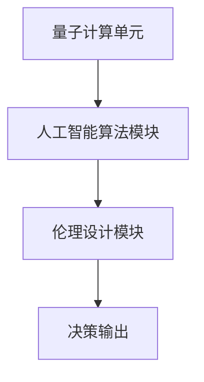

                 

# 芒格的"心理倾向"理论在量子人工智能伦理设计中的应用

> 关键词：芒格心理倾向，量子人工智能，伦理设计，心理偏差，量子计算

> 摘要：本文探讨了芒格的"心理倾向"理论在量子人工智能伦理设计中的应用。首先介绍了芒格心理倾向理论的核心概念和量子人工智能的基本原理，然后分析了心理倾向对伦理设计的影响，并结合实际案例展示了如何在量子人工智能系统中应用这些理论。最后，展望了未来的发展趋势和挑战。

---

## 第一章: 芒格的"心理倾向"理论概述

### 1.1 心理倾向的核心概念

心理倾向是指个体在决策过程中表现出的各种内在倾向和偏好，包括认知偏差、情感因素和社会影响等。这些倾向影响着人们在复杂情境下的决策行为。

#### 1.1.1 心理倾向的分类

心理倾向可以分为认知偏差、情感倾向和社会倾向三大类：

1. **认知偏差**：如确认偏差、忽略可能性偏差等，影响个体的信息处理和决策判断。
2. **情感倾向**：如风险厌恶、损失厌恶等，影响个体在面对风险和损失时的选择。
3. **社会倾向**：如从众心理、权威效应等，影响个体在社会群体中的决策行为。

#### 1.1.2 心理倾向在决策中的作用

心理倾向通过影响个体的信息处理、认知评估和行为选择，决定了决策的质量和效果。例如，确认偏差可能导致决策者过度依赖已有的信息，忽略新的证据。

### 1.2 量子人工智能的基本概念

量子人工智能结合了量子计算和人工智能技术，利用量子并行性和叠加性来提升计算效率和处理复杂问题的能力。

#### 1.2.1 量子计算的优势

量子计算通过量子位（qubit）的叠加和纠缠特性，可以在某些情况下比经典计算快得多，特别是在处理大规模数据和复杂算法时。

#### 1.2.2 量子人工智能的应用领域

量子人工智能在药物发现、金融建模、优化问题和模式识别等领域具有潜在应用价值。

### 1.3 伦理设计的核心原则

伦理设计在人工智能系统中确保系统行为符合道德规范，避免对人类社会造成负面影响。

#### 1.3.1 人工智能伦理的基本框架

包括隐私保护、公平性、透明性和 accountability 等核心原则。

#### 1.3.2 量子人工智能的特殊性

量子人工智能的高计算能力和复杂性可能带来新的伦理挑战，如算法的不可解释性和潜在的滥用风险。

---

## 第二章: 心理倾向理论的数学模型与算法原理

### 2.1 心理倾向的数学建模

通过数学模型描述心理倾向的影响因素和作用机制。

#### 2.1.1 心理倾向的变量表示

使用概率分布和权重系数来表示不同心理倾向的影响程度。

#### 2.1.2 心理倾向的权重计算

通过统计分析和回归模型确定各心理倾向的权重。

### 2.2 量子人工智能的算法原理

量子算法利用量子叠加和纠缠特性，实现高效的并行计算。

#### 2.2.1 量子计算的基本原理

量子位的叠加性和纠缠性是量子计算的核心特征。

#### 2.2.2 量子算法的核心优势

相比经典算法，量子算法在某些问题上具有指数级的加速能力。

### 2.3 心理倾向与量子算法的结合

将心理倾向的数学模型与量子算法相结合，优化决策过程。

#### 2.3.1 心理倾向对量子算法的影响

心理倾向通过影响算法输入和参数设置，间接影响计算结果。

#### 2.3.2 量子算法在心理倾向分析中的应用

利用量子算法快速处理大量心理数据，提高分析效率。

---

## 第三章: 量子人工智能的系统架构与设计

### 3.1 量子人工智能系统的组成

系统主要包括量子计算单元、人工智能算法模块和伦理设计模块。

#### 3.1.1 量子计算单元

负责处理复杂的量子计算任务。

#### 3.1.2 人工智能算法模块

实现机器学习和深度学习功能。

#### 3.1.3 伦理设计模块

确保系统行为符合伦理规范。

### 3.2 量子人工智能的系统架构图

通过Mermaid流程图展示系统各模块的关系和数据流向。

### 3.3 伦理设计的系统实现

将心理倾向理论整合到伦理设计模块中，确保决策的伦理合规性。

#### 3.3.1 伦理框架的构建

基于心理倾向理论，构建系统的伦理框架。

#### 3.3.2 伦理设计的算法实现

通过算法实现伦理框架的具体应用。

---

## 第四章: 心理倾向理论在量子人工智能伦理设计中的应用

### 4.1 心理倾向对伦理设计的影响

心理倾向通过影响决策过程，影响系统的伦理设计。

#### 4.1.1 心理倾向与伦理决策的关系

心理倾向是伦理决策的重要影响因素。

#### 4.1.2 心理倾向对伦理设计的挑战

心理倾向可能导致决策偏差，增加伦理风险。

### 4.2 量子人工智能中的伦理设计框架

构建适应量子人工智能特点的伦理设计框架。

#### 4.2.1 伦理设计的核心要素

包括隐私保护、公平性和透明性等。

#### 4.2.2 伦理设计的实现方法

通过算法优化和系统设计实现伦理目标。

### 4.3 心理倾向与伦理设计的协同优化

通过协同优化提高系统的伦理合规性和决策效率。

#### 4.3.1 心理倾向的动态调整

根据系统反馈动态调整心理倾向的影响权重。

#### 4.3.2 伦理设计的动态优化

根据实际应用情况不断优化伦理框架。

---

## 第五章: 实际案例分析与应用

### 5.1 案例背景介绍

选择一个具体的量子人工智能应用领域，分析心理倾向的影响。

### 5.2 心理倾向在案例中的具体应用

展示心理倾向如何影响系统的伦理设计和决策过程。

### 5.3 案例分析与小结

总结案例分析的结果，提出改进建议。

---

## 第六章: 未来发展趋势与挑战

### 6.1 未来发展趋势

量子人工智能与心理倾向理论的结合将更加紧密。

### 6.2 当前面临的挑战

包括技术难题、伦理规范的制定和实际应用的复杂性。

### 6.3 未来研究方向

建议未来的研究方向和重点。

---

## 结语

芒格的"心理倾向"理论为量子人工智能的伦理设计提供了重要的理论依据和实践指导。通过将心理倾向与量子计算相结合，可以更好地理解和优化人工智能系统的伦理行为，推动量子人工智能的健康发展。

---

## 作者

作者：AI天才研究院/AI Genius Institute  
禅与计算机程序设计艺术 /Zen And The Art of Computer Programming

