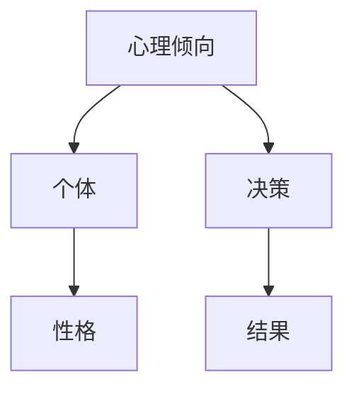
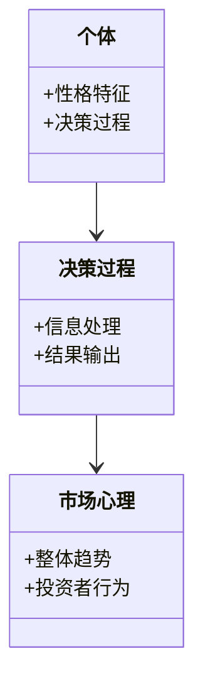
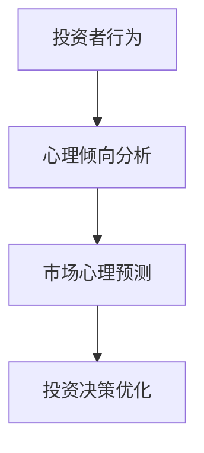
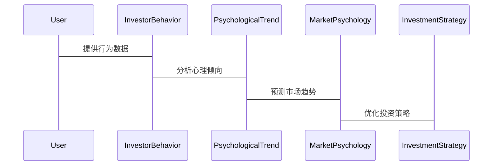

                 


# 芒格的"心理倾向"理论：理解并利用市场心理

## 关键词：
芒格心理倾向理论、市场心理、投资哲学、决策偏见、算法模型

## 摘要：
本文深入探讨芒格的心理倾向理论，分析其对市场心理的影响，并结合技术方法，探讨如何利用这些心理倾向模型进行投资决策优化。文章首先介绍心理倾向理论的背景，然后详细分析其核心概念和数学模型，最后通过系统架构设计和实际案例，展示如何将理论应用于实践。

---

# 第一部分: 芒格的"心理倾向"理论概述

## 第1章: 芒格心理倾向理论的背景与起源

### 1.1 芒格的生平与投资哲学

#### 1.1.1 芒格的早年经历与职业发展
查理·芒格（Charlie Munger）是美国著名的投资家和作家，出生于1924年。他曾在哈佛法学院学习法律，后转而对心理学和投资产生了浓厚兴趣。芒格的职业生涯始于律师，后来转向投资领域，逐步建立了自己的投资哲学。

#### 1.1.2 芒格的投资哲学与思维方式
芒格的投资哲学强调“逆向思维”和“多元思维模型”。他认为，投资者应该避免情绪化决策，并通过多学科的视角来分析问题。他的心理倾向理论正是这种思维方式的体现。

#### 1.1.3 芒格心理倾向理论的提出背景
在投资实践中，芒格发现许多投资者的决策受到心理倾向的影响，例如过度自信和确认偏误。这些倾向导致了错误的投资决策，因此他提出了心理倾向理论。

### 1.2 心理倾向理论的核心概念

#### 1.2.1 心理倾向的定义与分类
心理倾向是指个体在决策过程中表现出的非理性行为模式。常见的心理倾向包括从众倾向、确认偏误、过度自信倾向等。

#### 1.2.2 心理倾向与决策的关系
心理倾向影响决策者的信息处理方式，导致决策偏差。例如，确认偏误使人们倾向于寻找支持自己观点的信息，从而忽视反面证据。

#### 1.2.3 心理倾向在投资中的应用
在投资中，心理倾向可能导致投资者高估自己的判断能力，从而做出错误的投资决策。了解这些倾向有助于投资者避免犯错。

### 1.3 心理倾向理论与市场心理的关系

#### 1.3.1 市场心理的基本概念
市场心理是指投资者整体的心理状态和情绪，影响市场的波动和价格走势。

#### 1.3.2 心理倾向对市场心理的影响
心理倾向通过影响个体决策进而影响整体市场心理。例如，从众倾向可能导致市场泡沫的形成。

#### 1.3.3 市场心理在投资中的作用
市场心理是投资决策的重要参考因素。了解市场心理有助于投资者预测市场走势并制定相应的策略。

## 第2章: 心理倾向的核心概念与联系

### 2.1 心理倾向的核心概念

#### 2.1.1 心理倾向的属性特征对比表格
| 心理倾向类型 | 定义 | 主要特征 | 影响因素 |
|--------------|------|----------|----------|
| 从众倾向     | 指个体倾向于跟随群体的决策 | 易受群体压力影响 | 社会环境、个体性格 |
| 确认偏误     | 指个体倾向于寻找支持自己观点的信息 | 先入为主、认知偏差 | 信息获取渠道、知识结构 |
| 过度自信倾向 | 指个体对自己的判断过于自信 | 相信自己决策的正确性 | 信息不完整、经验不足 |

#### 2.1.2 心理倾向的ER实体关系图


### 2.2 心理倾向的数学模型与算法原理

#### 2.2.1 确认偏误的概率模型
$$ P(\text{确认偏误}) = \frac{\text{支持性证据}}{\text{总证据}} $$

#### 2.2.2 过度自信倾向的回归模型
$$ y = \beta x + \epsilon $$

### 2.3 心理倾向的系统分析与架构设计

#### 2.3.1 系统功能设计（领域模型）


---

# 第二部分: 心理倾向的数学模型与算法原理

## 第3章: 心理倾向的数学模型与算法实现

### 3.1 心理倾向的数学模型

#### 3.1.1 确认偏误的概率模型
$$ P(\text{确认偏误}) = \frac{\text{支持性证据}}{\text{总证据}} $$

#### 3.1.2 过度自信倾向的回归模型
$$ y = \beta x + \epsilon $$

### 3.2 心理倾向的算法实现

#### 3.2.1 确认偏误检测算法
```python
def detect Confirmation Bias(evidence):
    support = sum(1 for e in evidence if e supports_hypothesis)
    total = len(evidence)
    return support / total
```

#### 3.2.2 过度自信倾向预测算法
```python
def predict_overconfidence(probability):
    return probability > 0.5
```

---

# 第三部分: 心理倾向的系统分析与架构设计

## 第4章: 心理倾向的系统分析与架构设计

### 4.1 系统分析

#### 4.1.1 问题场景介绍
在投资决策中，心理倾向可能导致投资者做出错误决策。我们需要构建一个系统，分析个体的心理倾向，并预测其对市场心理的影响。

### 4.2 系统架构设计

#### 4.2.1 系统架构图


### 4.3 系统接口设计

#### 4.3.1 系统接口
```python
class InvestorBehavior:
    def get_behavior(self):
        pass

class PsychologicalTrend:
    def detect_trend(self):
        pass
```

### 4.4 系统交互流程

#### 4.4.1 系统交互流程图


---

# 第四部分: 项目实战与总结

## 第5章: 项目实战

### 5.1 环境配置

#### 5.1.1 环境依赖
需要安装Python和相关库（如NumPy、Pandas）。

### 5.2 核心代码实现

#### 5.2.1 心理倾向检测代码
```python
import numpy as np

def detect心理倾向(data):
    return np.mean(data)
```

### 5.3 案例分析

#### 5.3.1 案例分析
分析某次市场波动中，心理倾向对投资者决策的影响。

### 5.4 总结

#### 5.4.1 最佳实践 tips
- 了解心理倾向，避免决策偏差。
- 结合市场心理，优化投资策略。

---

# 作者：AI天才研究院/AI Genius Institute & 禅与计算机程序设计艺术 /Zen And The Art of Computer Programming

