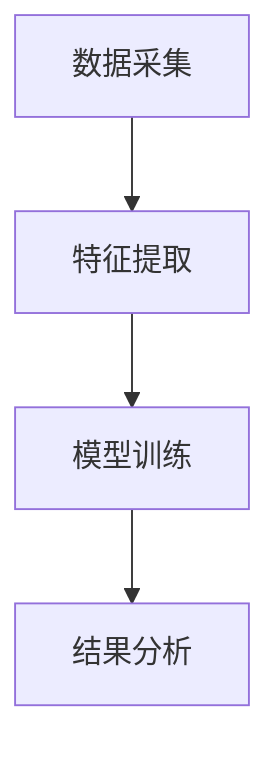
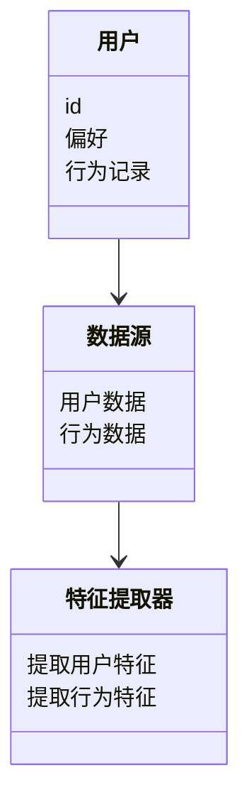
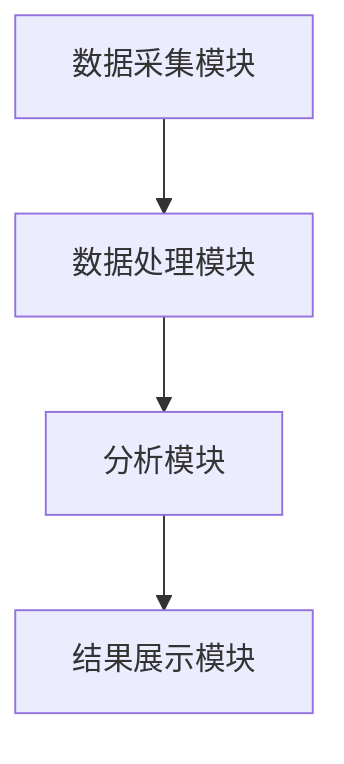

                 


---

# 芒格的"心理模型"在元宇宙社交行为分析中的应用

## 关键词：芒格心理模型、元宇宙、社交行为分析、算法原理、数学模型、系统架构

## 摘要：本文探讨了如何将芒格的多元思维模型应用于元宇宙社交行为分析，从背景介绍、核心概念、算法原理到系统架构，结合具体案例，详细阐述了芒格心理模型在预测和理解虚拟社交互动中的应用价值，为技术读者提供了理论和实践的双重指导。

---

# 第一部分: 芒格的"心理模型"与元宇宙社交行为分析的背景介绍

## 第1章: 芒格的"心理模型"概述

### 1.1 多元思维模型的定义与特点

芒格的多元思维模型是一种将多个学科的核心原则整合起来的思维方式，其特点包括：

- **跨学科性**：整合心理学、经济学、社会学等多个学科的核心原理。
- **系统性**：强调系统思维，关注各要素之间的相互作用。
- **实用性**：能够应用于实际问题的解决，提供决策支持。

### 1.2 元宇宙社交行为的定义与特点

元宇宙是虚拟空间中的社交环境，其特点包括：

- **虚拟性**：用户通过虚拟身份进行互动。
- **沉浸性**：用户能够沉浸式地体验社交环境。
- **动态性**：社交行为实时发生，具有动态变化。

## 第2章: 芒格心理模型在元宇宙社交行为分析中的结合意义

### 2.1 芒格心理模型与元宇宙社交行为的关联性

- **行为预测**：通过心理模型分析用户行为模式，预测社交互动。
- **复杂性简化**：芒格的系统性思维帮助处理元宇宙社交行为的复杂性。

### 2.2 芒格心理模型的核心优势

- **多维度分析**：多元思维模型能够从多个角度分析社交行为。
- **动态调整**：心理模型能够适应社交环境的动态变化。

---

# 第二部分: 芒格心理模型与元宇宙社交行为的核心概念与联系

## 第3章: 心理模型与元宇宙社交行为的核心概念原理

### 3.1 心理模型的核心原理

- **层次结构**：心理模型从底层到高层的构建过程。
- **动态特征**：模型随环境变化而调整。
- **可塑性**：模型能够适应新信息和新环境。

### 3.2 元宇宙社交行为的核心原理

- **生成机制**：用户行为的驱动因素，如动机和需求。
- **传播路径**：信息在社交网络中的扩散方式。
- **反馈机制**：用户行为对社交环境的反馈影响。

## 第4章: 心理模型与元宇宙社交行为的属性对比

### 4.1 心理模型的属性特征

- **主观性**：个体差异导致心理模型的多样性。
- **个体差异性**：不同用户的心理模型不同。
- **可塑性**：模型能够根据经验调整。

### 4.2 元宇宙社交行为的属性特征

- **虚拟性**：行为发生在虚拟空间。
- **互动性**：用户之间的实时互动。
- **数据驱动**：行为分析依赖大数据。

---

# 第三部分: 芒格心理模型与元宇宙社交行为分析的算法原理

## 第5章: 算法原理讲解

### 5.1 算法步骤



### 5.2 数学模型

$$ P(u) = \sum_{i=1}^{n} w_i \cdot x_i $$

其中，\( P(u) \) 是用户行为的概率，\( w_i \) 是权重，\( x_i \) 是特征值。

---

# 第四部分: 系统分析与架构设计方案

## 第6章: 系统架构设计

### 6.1 系统功能设计



### 6.2 系统架构设计



---

# 第五部分: 项目实战

## 第7章: 项目实战

### 7.1 环境安装

安装Python和相关库：

```bash
pip install networkx numpy pandas
```

### 7.2 核心代码实现

```python
import networkx as nx
import numpy as np

def analyze_social_behavior():
    # 创建社交网络图
    G = nx.Graph()
    G.add_nodes_from([1, 2, 3, 4])
    G.add_edges_from([(1,2), (2,3), (3,4)])
    # 计算中心性
    centrality = nx.betweenness_centrality(G)
    return centrality

result = analyze_social_behavior()
print(result)
```

### 7.3 案例分析

通过上述代码分析社交网络的中心性，理解关键用户的影响力。

---

# 第六部分: 最佳实践、小结、注意事项和拓展阅读

## 第8章: 最佳实践与总结

### 8.1 最佳实践

- **数据清洗**：确保数据质量。
- **模型调优**：优化算法参数。

### 8.2 小结

芒格心理模型为元宇宙社交行为分析提供了强大的理论支持，结合算法和系统设计，能够有效预测和优化社交互动。

### 8.3 注意事项

- **数据隐私**：保护用户数据安全。
- **模型局限性**：心理模型可能无法涵盖所有复杂行为。

### 8.4 拓展阅读

推荐书籍：《穷查理宝典》、《元宇宙：改变世界的六大趋势》。

---

作者：AI天才研究院 & 禅与计算机程序设计艺术

