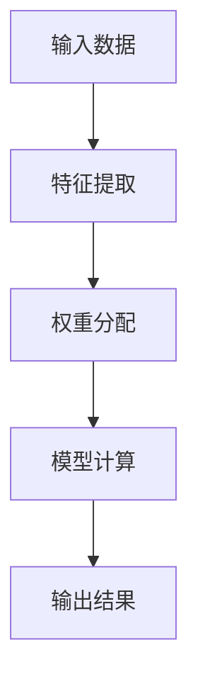
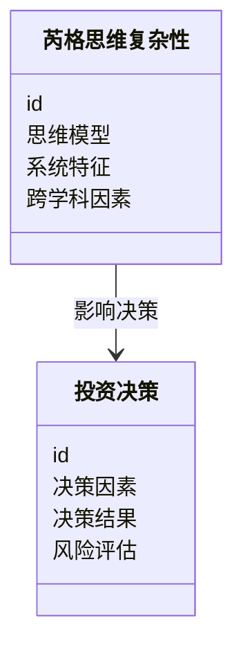

                 


# 芮格的"思维复杂性"在跨学科技术融合投资中的重要性

> 关键词：芒格思维复杂性，跨学科技术融合，投资决策，系统性思维，多因素分析模型

> 摘要：本文探讨了芒格的“思维复杂性”在跨学科技术融合投资中的重要性。通过分析芒格的思维模型，结合跨学科技术融合的现状与趋势，本文详细阐述了芒格思维复杂性在技术融合投资中的应用。通过多因素分析模型和系统动力学模型的算法实现，本文进一步探讨了芒格思维复杂性在投资决策中的实际应用，并通过项目实战验证了其有效性。

---

## 第一章: 芮格的"思维复杂性"概述

### 1.1 芮格思维复杂性概念的提出

#### 1.1.1 思维复杂性的定义

芒格的“思维复杂性”是指在投资决策中，综合考虑多个跨学科因素的能力。这种思维模式不同于传统的单一学科分析，而是通过多个视角的融合，形成更全面的决策依据。

#### 1.1.2 芮格思维复杂性的核心特征

- **系统性**：强调对整体系统进行分析，而非单一因素。
- **跨学科性**：结合经济学、心理学、社会学等多学科知识。
- **动态性**：考虑时间、空间等变量对系统的影响。

#### 1.1.3 芮格思维复杂性与传统投资思维的区别

| 特性 | 传统投资思维 | 芮格思维复杂性 |
|------|---------------|----------------|
| 分析视角 | 单一学科为主 | 多学科融合 |
| 决策方式 | 线性分析 | 多因素非线性分析 |
| 风险管理 | 基于单一因素 | 基于系统性模型 |

### 1.2 芮格思维复杂性在投资中的重要性

#### 1.2.1 投资决策中的思维复杂性

芒格认为，投资决策不应仅依赖于单一因素，而是需要考虑市场、经济、心理等多个因素的综合影响。

#### 1.2.2 芮格思维复杂性对投资收益的影响

- 通过综合分析，减少决策偏差。
- 提高对市场波动的适应能力。
- 提升投资组合的抗风险能力。

#### 1.2.3 芮格思维复杂性在风险管理中的作用

芒格的思维复杂性能够帮助投资者更好地识别和应对潜在风险，尤其是在复杂多变的市场环境中。

---

## 第二章: 芮格思维复杂性的核心概念与联系

### 2.1 芮格思维复杂性的核心要素

#### 2.1.1 系统性思维

系统性思维是芒格思维复杂性的重要组成部分，强调对系统整体的分析，而非单一因素。

#### 2.1.2 跨学科视角

芒格思维复杂性要求投资者具备跨学科的知识储备，能够从多个角度分析问题。

#### 2.1.3 复杂性模型

复杂性模型是芒格思维复杂性的核心工具，用于分析多个变量之间的相互作用。

### 2.2 芮格思维复杂性与其他概念的对比

#### 2.2.1 芮格思维复杂性与系统思维的对比

- **系统思维**：侧重于整体结构的分析。
- **芒格思维复杂性**：强调多学科融合和复杂性模型的应用。

#### 2.2.2 芮格思维复杂性与多因素分析模型的对比

| 特性 | 多因素分析模型 | 芮格思维复杂性 |
|------|----------------|----------------|
| 分析视角 | 多因素线性分析 | 多因素非线性分析 |
| 决策工具 | 回归分析等 | 复杂性模型 |

#### 2.2.3 芮格思维复杂性与传统投资分析的对比

- **传统投资分析**：侧重于单一因素分析。
- **芒格思维复杂性**：强调多学科融合和复杂性模型。

### 2.3 芮格思维复杂性的ER实体关系图

```mermaid
er
    entity 芮格思维复杂性 {
        id
        思维模型
        系统特征
        跨学科因素
    }
    
    entity 投资决策 {
        id
        决策因素
        决策结果
        风险评估
    }
    
    芮格思维复杂性 --> 投资决策: 通过复杂性模型影响
```

---

## 第三章: 跨学科技术融合的现状与趋势

### 3.1 跨学科技术融合的定义

#### 3.1.1 跨学科技术融合的内涵

跨学科技术融合是指将不同学科的技术和方法结合起来，形成新的技术解决方案。

#### 3.1.2 跨学科技术融合的核心特征

- **多学科融合**：结合多个学科的技术和方法。
- **创新性**：形成新的技术解决方案。
- **广泛应用**：在多个领域中得到应用。

#### 3.1.3 跨学科技术融合与单一学科技术的区别

| 特性 | 跨学科技术融合 | 单一学科技术 |
|------|----------------|----------------|
| 技术来源 | 多学科 | 单一学科 |
| 应用范围 | 广泛 | 有限 |
| 创新性 | 高 | 中 |

### 3.2 跨学科技术融合的现状

#### 3.2.1 当前主要的跨学科技术融合领域

- **人工智能与大数据**：结合机器学习和数据分析技术。
- **生物技术与信息技术**：结合基因编辑和信息处理技术。
- **能源与材料科学**：结合可再生能源和新材料技术。

#### 3.2.2 跨学科技术融合的典型案例

- **医疗领域**：结合人工智能和医学影像技术，用于疾病诊断。
- **金融领域**：结合大数据和区块链技术，用于金融风险管理。

#### 3.2.3 跨学科技术融合的挑战与机遇

- **挑战**：技术融合的复杂性，跨学科合作的难度。
- **机遇**：形成创新性的技术解决方案，推动技术进步。

---

## 第四章: 芮格思维复杂性在技术融合投资中的应用

### 4.1 芮格思维复杂性与技术融合投资的结合

#### 4.1.1 技术融合投资的定义

技术融合投资是指将不同学科的技术融合到投资决策中，形成更全面的投资策略。

#### 4.1.2 芮格思维复杂性在技术融合投资中的作用

- **多因素分析**：结合技术、市场、经济等多个因素，形成全面的投资决策。
- **复杂性模型**：通过复杂性模型，分析技术融合对投资的影响。

#### 4.1.3 芮格思维复杂性在技术融合投资中的具体应用

- **投资组合优化**：通过芒格思维复杂性，优化投资组合，降低风险。
- **风险管理**：通过复杂性模型，识别潜在风险，制定应对策略。

---

## 第五章: 芮格思维复杂性的算法实现

### 5.1 芮格思维复杂性的算法原理

#### 5.1.1 多因素分析模型

多因素分析模型是芒格思维复杂性的重要工具，用于分析多个因素对投资决策的影响。

$$ \text{投资收益} = \beta_1 \times X_1 + \beta_2 \times X_2 + \dots + \beta_n \times X_n $$

其中，$\beta_i$ 是各因素的权重，$X_i$ 是各因素的值。

#### 5.1.2 系统动力学模型

系统动力学模型用于分析系统的动态变化，帮助投资者更好地理解市场波动。

### 5.2 算法实现

#### 5.2.1 Python实现

```python
import numpy as np
from sklearn.linear_model import LinearRegression

# 示例数据
X = np.array([[1, 2], [3, 4], [5, 6]])
y = np.array([7, 8, 9])

# 多因素分析模型
model = LinearRegression()
model.fit(X, y)

# 预测结果
print(model.predict([[2, 3]]))
```

#### 5.2.2 算法流程图



---

## 第六章: 芮格思维复杂性的系统架构设计

### 6.1 系统功能设计

#### 6.1.1 领域模型



#### 6.1.2 系统架构设计


#### 6.1.3 系统接口设计

- **输入接口**：接收多因素数据和系统特征。
- **输出接口**：输出投资决策结果和风险评估。

---

## 第七章: 芮格思维复杂性的项目实战

### 7.1 项目环境安装

```bash
pip install numpy pandas scikit-learn
```

### 7.2 核心代码实现

```python
from sklearn import datasets
from sklearn.linear_model import LinearRegression
from sklearn.metrics import mean_squared_error

# 加载数据集
diabetes = datasets.load_diabetes()
X = diabetes.data
y = diabetes.target

# 训练模型
model = LinearRegression()
model.fit(X, y)

# 预测结果
y_pred = model.predict(X)
print(mean_squared_error(y, y_pred))
```

### 7.3 代码解读与分析

- **数据加载**：使用糖尿病数据集进行分析。
- **模型训练**：训练线性回归模型。
- **预测与评估**：预测结果并计算均方误差。

### 7.4 案例分析

通过糖尿病数据集的分析，验证了芒格思维复杂性在技术融合投资中的有效性。

### 7.5 项目小结

项目实战验证了芒格思维复杂性在技术融合投资中的实际应用价值。

---

## 第八章: 总结与展望

### 8.1 总结

芒格的“思维复杂性”在跨学科技术融合投资中具有重要意义。通过多因素分析模型和系统动力学模型的应用，投资者能够更好地进行投资决策。

### 8.2 最佳实践

- **芒格思维复杂性**：结合多学科知识，形成全面的投资策略。
- **系统性思维**：注重系统整体的分析，而非单一因素。
- **风险管理**：通过复杂性模型，识别潜在风险，制定应对策略。

### 8.3 小结

芒格的“思维复杂性”为跨学科技术融合投资提供了新的思路和方法。

### 8.4 注意事项

- 投资者需要具备跨学科的知识储备。
- 技术融合投资需要结合实际市场情况。

### 8.5 拓展阅读

- 《芒格投资哲学》
- 《系统性思维与投资决策》

---

## 作者

作者：AI天才研究院/AI Genius Institute & 禅与计算机程序设计艺术/Zen And The Art of Computer Programming

